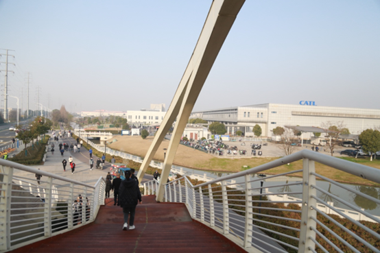
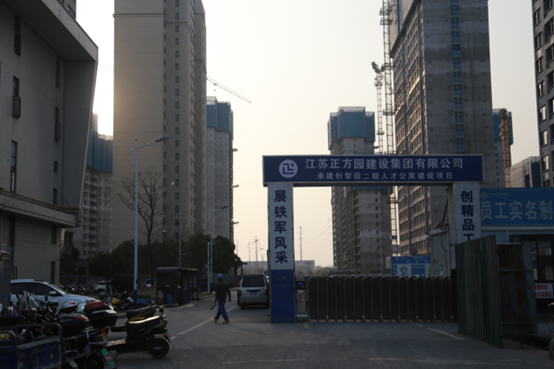

# 动力电池产能过剩？宁德时代工人：厂里不让加班，收入三四千减半

_来源：视觉中国_

作者 ｜ 程潇熠

编辑 ｜ 康晓

出品｜深网·小满工作室

“现在有个稳定的厂上班就不错了。”常州市江苏时代（宁德时代子公司）的基层工人小李长期过着两点一线的生活：几乎有12个小时在厂里工作（8小时正常工时+4小时加班工时），下了班回宿舍倒头就睡，醒了再重复第二天的工作。

95后小李偶尔会在短视频刷到别人丰富多彩的生活，虽然也会心生羡慕，但他仍然知足于自己现下的生活：在全球动力电池头部大厂工作、能免费住在带空调的双人宿舍里、基本不用买衣服——发的工装冬装夏装都有、吃饭贵一点但好在没啥应酬。

“在厂里还能学到技术，偶尔能存点钱，这个已经相当了不起了。”小李认真想过，自己如果不在厂里打工还能做什么。

一年多前，小李坐着招工中介从河南发往常州溧阳的大巴，来到了江苏时代。国内工厂招聘已有一套成熟的流程体系，工厂直接对接专业中介平台，每当工厂需要招工时，中介平台的大巴就会将全国各地需要找相关工作的人运来工厂面试应聘。

**作为汇集了比亚迪、理想汽车制造工厂、宁德时代、中创新航、蜂巢能源等新能源重要企业制造基地的城市，常州吸引了无数像小李一样的年轻人前来寻找机会。**

2020年至2021年，常州常住人口快速增长，人口净流入超60万达535万人。

新能源汽车行业给常州带来了一场新的链式反应。据《2022胡润中国新能源产业集聚度城市榜》，常州新能源投资热度排全国第一（前三为常州、合肥、武汉），产业聚集度全国第五，是唯一一座进入前五的非一线城市（前五为深圳、上海、北京、武汉、常州）。

**常州成为了继合肥之后“杀”入新能源汽车产业的又一匹黑马。从中国汽车产业发展趋势来看，未来发展成熟的新能源汽车产业代表城市，或将取代传统燃油车时代汽车大市的地位。**

但欣欣向荣的背后，新能源市场的逐渐饱和以及车企自建电池生产线，也对常州电池业务带来周期困境。

**“现在有的人上4天休3天，有的只让每天上8小时，不让加班。”江苏时代的小李及中创新航、蜂巢能源等工厂工人告诉《深网》，最近几个月为了降低产量，工厂普遍都在控制加班，但如果只上够正常的工作工时，大家到手的薪资可能直接被打对折，有的人一个月只能拿到3000元-4000元基础工资。**

**“挣不着钱，还不如回家干。”不少工人已有类似想法。**

_早上7点半的江苏时代
《深网》/摄_

**常州“赌”赢新能源**

全球已有的汽车产业集群几乎都是先以车企为锚点，再带动相关产业链供应商落户，而后慢慢形成集群。

比如传统燃油车时代，中国有六大汽车产业集群：以上汽为核心的长三角地区、以一汽为核心的东三省地区、以广汽为主的珠三角地区、以北汽为代表的京津冀地区、以长安为代表的西南地区、以东风为核心的中部地区。

**常州则是在特斯拉还深陷产能“地狱”，电动汽车未来发展尚不明朗时，选择了押注动力电池产业。**

2010年，波士顿电池为了在特斯拉电池之前抢占中国市场，在中国寻求规模化生产。常州溧阳政府看中了这一机会，多方努力撮合后波士顿电池制造中心落户常州溧阳，也让溧阳有了亚洲最大的电芯工厂。

虽然波士顿电池（江苏）因技术发展与商业变现的矛盾走向衰落，但也给溧阳留下了动力电池的产业基础。此前溧阳以“电梯安装之乡”著名，时至今日，溧阳电梯安装公司仍占全国80%的份额。

**《深网》在实地探访和资料梳理后发现，2015年对于常州来说是个重要的发展转折年。**

**2015年，常州进行了一次集中行政区划调整，以解决中心城区发展空间有限、县区规模差异过大等问题。例如，常州金坛撤市设区，融入常州市发展。**

**“金坛才50万人，变成常州的一个区有好处，方便招商引资。”一位金坛汽车从业者对《深网》说。**

2015年8月，号称总投资125亿元的中航锂电（即中创新航）项目落户金坛，为当时金坛区投资体量最大的工业项目。

多位金坛居民向《深网》感慨，金坛市成为常州金坛区后发展飞速，“再过个几年的话，我估计（金坛发展）也跟溧阳差不多了。”

2016年，常州签下新能源整车的第一个项目——引入北汽新能源生产基地落户；

同年，常州又在理想汽车（彼时名为车和家）还是PPT阶段时果断出手，以武进产业基金名义参投7.8亿元，支持理想汽车在常州武进区建成了第一座整车工厂；

2016年6月，引入宁德时代在溧阳注册成立江苏时代，仅三个月后，宁德时代产能50GWh的长三角动力电池基地项目（江苏时代）就已在溧阳开工建设；

2019年，常州与比亚迪签约建厂落户。时至今日，比亚迪在常州的投资总额近300亿元人民币。

“建设‘新能源之都’，我们赢得了起跑卡位的第一棒，更要跑好下一程、领跑全赛程。”常州市领导曾公开表示，“新能源赛道坡长雪厚，全球超级蓝海市场不可估量，行业竞争愈加激烈，产业风口稍纵即逝，容不得一丝懈怠。”

**动力电池即将迎来周期困境**

动力电池是强周期行业，如何在行业周期性产能过剩时对冲风险，或是企业与城市接下来该思考的问题。

宁德时代一季度财报显示，截至3月31日，宁德时代的存货期末余额640亿元，相比年初余额减少了约127亿元。这意味着宁德时代一季度消耗了去年的存货，产量较为少见的低于销量。

**生产减速的情况不仅仅发生在宁德时代，位于常州的几大动力电池厂如中创新航、蜂巢能源都在维持原有扩产计划的同时，通过控制加班、关停部分产线来调整生产节奏。**

动力电池进入产能过剩周期，相似的情况曾在2017年发生过，中国电动汽车百人会数据显示，2017年中国动力电池的产能超200GWh，但总体产能利用率只有40%，两极分化明显。彼时约三分之一的企业没能扛住，被淘汰出局。

过去三年，新能源汽车发展多次提速，国内新能源汽车新车渗透率从2020年的5.8%飙升至2022年的27.6%，动力电池供远小于求，因而扩产成了全球动力电池厂商的主要任务，据上证报统计，2020年，全球有超20家锂电池企业宣布投资扩产，总金额超2000亿元，涉及动力电池产能约500GWh。

根据高工锂电测算，2022-2024年动力电池出货量将分别为490GWh、850GWh和1010GWh，而这三年动力电池建成产能为1000GWh、1550GWh和2200GWh，有效产能为800GWh、1200GWh和1600GWh。整个行业将长期面临产能利用率降低及竞争白热化的状态。

高工锂电董事长张小飞在媒体采访中称，未来三年预计市场前十名的供应商仅能保持产能平衡，一线企业产能利用率或维持在50%-60%，十一名开外的动力电池供应商产能利用率将长期低于30%，“这意味着一定会亏损。”

**不过从国内动力电池装车量数据来看，动力电池第一梯队格局相对稳定。**
根据中国汽车动力电池产业创新联盟最新数据，今年一季度宁德时代与比亚迪两家市占率总和高达75%，其余动力电池企业仅占25%市场份额，竞争激烈。

第一梯队中，宁德时代市场份额受到挤压，今年一季度市占率同比下降了5.3%，而比亚迪因其销量飙升，市占率同比大增10.7%。

在搭载比亚迪刀片电池的特斯拉量产下线后，比亚迪或将进一步对宁德时代形成压力。毕竟现如今特斯拉和比亚迪是全球范围内新能源汽车卖的最好的两家车企。

根据JATO在全球53个市场以及其他关键市场的信息和估计数据， **特斯拉Model Y已超越老牌畅销燃油车型成为2023年第一季度全球销量最多的汽车**
， **特斯拉已确认这一信息。** 特斯拉Model Y也是比亚迪刀片电池的供应车型。

5月30日下午，特斯拉CEO埃隆·马斯克专机落地北京不久后，便传出了一张与宁德时代董事长曾毓群会面相谈的照片。

第二梯队竞争更为惨烈，由于长城新能源汽车销量有所下滑，蜂巢能源装车量同比下降39.1%，排名由去年同期下降第五下降至第九名。

中创新航目前虽稳坐国内第三，但市占率仍同比下降了0.2%。

中创新航最大的客户广汽集团（占中创新航营收约四成）从去年8月开始，投资109亿元设立自主电池公司，建设电池生产基地项目，根据规划，该工厂将在2025年建成26.8GWh量产线。

中创新航副总裁王小强接受采访时曾称，车企做电池只能以自用做技术迭代，不会完全取代动力电池厂商。

“车企适当做一些电池试制线，是一件好事，如果车企不懂电池，就识别不了好的电池是什么样子。”王小强说。

**不过需求此消彼长，当车企的自建电池厂开始正常运转后，势必会影响到动力电池厂的订单量。**

**据界面5月27日报道，中创新航近期正集中解约临近毕业的应届生，按照所签订三方协议的标准，中创新航将给予解约应届生每人3000元的赔偿。**

无数来自五湖四海的年轻人因新能源产业来到常州，但很少有人能定居常州。

《深网》在位于常州溧阳的江苏时代、上汽时代，以及位于常州金坛的中创新航、蜂巢能源等动力电池工厂附近，对话数十名工厂工人。在回答未来是否会选择定居常州这一问题时，得到了清一色的否定答案。

原因是在常州买不起房子。“如果能力条件允许，肯定还是想留在这的”。一位上汽时代工人向《深网》感慨。

有数据统计，在放开限售的情况下，4月常州全市（含金坛、溧阳）商品住宅成交均价约1.65万元/平米左右，环比基本持平，同比下跌6%。常州居民告诉《深网》，常州教育资源较好的小区房价在前两年高达6万元/平米，如今仍在3万元/平米以上。基本与西安、成都等中西部省会城市房价相当。

_建设中的江苏时代等企业员工宿舍
《深网》/摄_

**头部玩家的城市争夺战**

新能源变革给了城市重新洗牌的好机会。

常州已经提出向“新能源之都”迈进的规划：到2025年，常州市新能源领域将实现“两个万亿元”目标，分别为产业规模超万亿元，资本市场新能源常州板块市值超万亿元。

据常州市官方数据，
2022年，常州市新能源领域产值已突破5000亿元。新能源整车产量超34万辆，相当于为江苏省贡献了近一半产量（江苏省产量为68.7万辆）。动力电池产量达108.5GWh，占全国总产能的三分之一。

同样提出类似打造“新能源之都”目标的还有安徽省、上海市、西安市等。

安徽省提出打造“世界新能源汽车之都”，建设万亿级汽车产业集群。上海市提出要打造“世界级汽车产业集群”，到2025年，新能源汽车年产量超120万辆，新能源汽车产值突破3500亿元。西安提出到2025年，打造全国一流的新能源汽车产业基地，产销规模稳居全国前列。

各个城市顺利完成规划的关键，在于能否加深与新能源汽车行业头部玩家的绑定关系。

以西安为例，2022年，西安新能源汽车产量达101.55万辆，超越上海、柳州、深圳等一众城市，登顶全国第一。

西安此次的弯道超车主要归功于比亚迪。据三秦都市报信息，西安的101.55万辆新能源汽车中，99.5万辆为比亚迪生产基地所产，占97.9%。

比亚迪在2003年落户西安高新区，经过多年发展，西安基本已成为除比亚迪深圳总部外，产业布局最全最深的北方基地。

“未来，比亚迪所有新能源汽车所需的高级零部件都会在这里出现，比亚迪在西安地区的年产量，也将从30万辆提升到60万辆。”比亚迪西安地区总经理刘振宇在去年《西安日报》采访中称，比亚迪西安基地将打造将打造供应全国的“超级工厂”，即“运进来的是原材料，运出去的是整车。”

目前西安是比亚迪主力车型秦＋宋的生产基地（纯电＋DM-i），预计有望成为比亚迪第一个年产能破100万辆的超级工厂。比亚迪常州工厂主要是元Plus、海豹、海鸥等海洋生物系列产品的生产基地。

大汽车产业集群必有头部汽车集团，随着新能源车企间竞争加剧、淘汰加速、格局渐显，或许五年内我们就能看到，哪些城市将成为新能源汽车这场“豪赌”的最终赢家。

