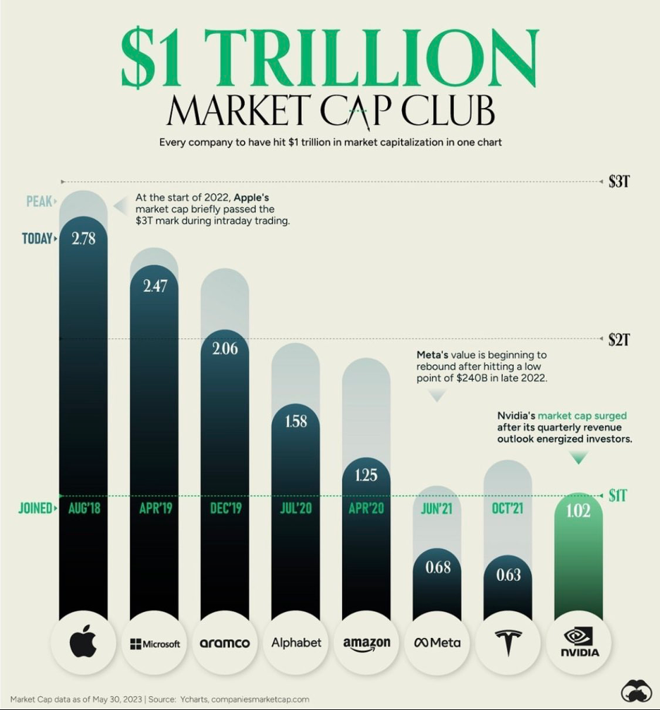
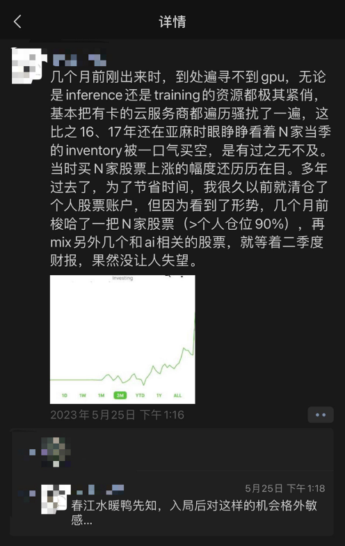
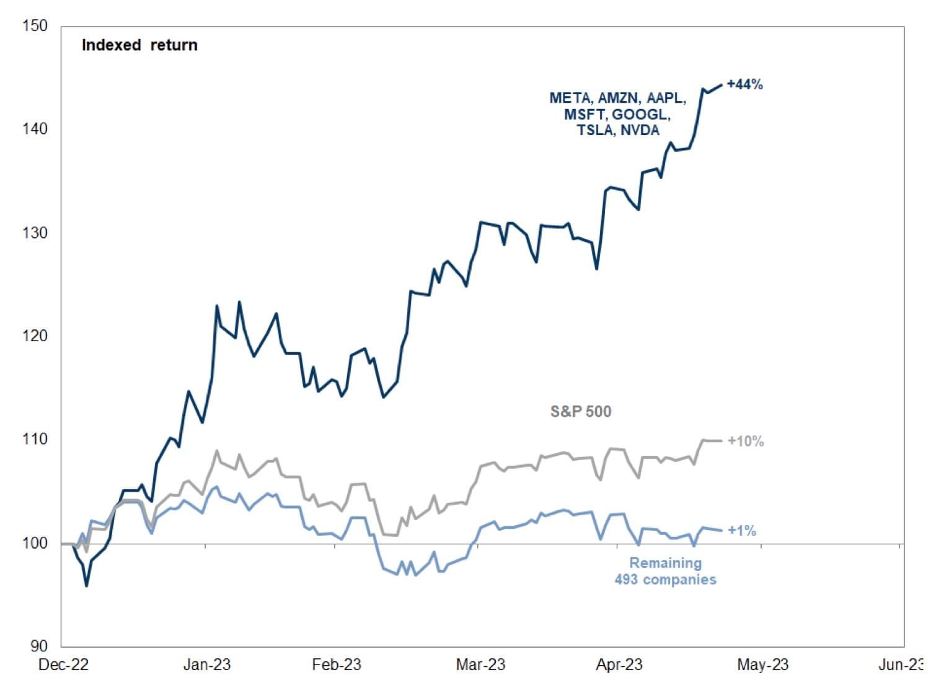
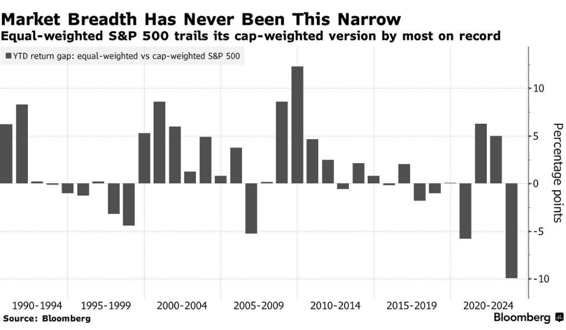

# 疯狂的美国股市：科技股暴涨，有人一天狂赚60倍，手都在颤抖

腾讯新闻《潜望》 纪振宇 6月1日 发自硅谷

“激动的心，颤抖的手！”在回想起这一轮英伟达暴涨时，Andy这样向腾讯新闻《潜望》描述当时的情形。他手中所持有的5月26日到期的、行权价为350美元的看涨期权，当时在一天之内，就获得了超过60倍的账面收益。

5月23日，芯片巨头英伟达发布第一季度财报，由于当季财报业绩利好，再加上英伟达对于第二季度业绩展望及其乐观态度，叠加从去年底以来对于新一轮生成式人工智能热潮的集体兴奋和GPU将供不应求的共识，当天盘后英伟达股价直接跳涨近30%。

接下来几天，英伟达的高歌猛进还在持续。5月30日，英伟达股价站上419美元的高位，市值一度登顶1万亿美元，与苹果、微软、谷歌等一并跻身万亿美元俱乐部行列。

_英伟达跻身万亿美元市值俱乐部_

英伟达的股价短期暴涨，最直接的原因是新一轮人工智能领域的突破，对于GPU资源的需求急剧攀升，而英伟达由于在这一细分领域无人能敌的市场地位，毫无疑问成为了资金疯狂追捧的对象。

再扩展到更广泛的科技行业领域，今年以来，以科技股为主的纳斯达克综合指数已累计上涨近25%。

伴随着这一轮以英伟达为代表的科技股的暴涨，另一种声音也逐渐升温。有人将这一轮科技股上涨与上一轮互联网泡沫时期相比较，认为新一轮的泡沫正在形成。他们判断的依据是以科技股为主的纳斯达克指数，与以中小企业为主的罗素2000指数之间的分化，已经达到2000年互联网泡沫时期的高点；同时，市场整体上扬，实际上也是由小部分大型科技巨头拉动，而大部分中小上市公司今年以来的股价表现并不理想，这也掩盖了美股市场真实的情况。

也有分析人士认为，与上一轮互联网泡沫相比，本轮AI热潮能够更为清晰地看到未来发展路径和相应的商业模式，市场走势是真正构筑在未来潜在价值之上，因此仅从市场指标的变化来判断泡沫形成，这样的结论并不成立。

**一夜造就60倍收益神话**

Andy是硅谷某科技公司的普通程序员，由于身处科技行业，他对于业内发生的动态保持着高度关注。

今年以来，生成式人工智能的爆发，让他感到“兴奋无比”。他对腾讯新闻《潜望》表示，有时候觉得睡觉都是浪费时间，每天都有学不完的新东西，从一些理论性研究的论文，到行业里层出不穷的新的应用，这些既让他感到兴奋，又倍感焦虑。

在工作之余，Andy还会用部分资金做一些美股交易，他一直看好科技大公司的股价表现，主要投资都分布在苹果、谷歌、微软等大公司里。

“我还有很小一部分资金在做短期的期权交易，”Andy对腾讯新闻《潜望》表示，“因为风险比较大，不会押太多，赚了就是意外收获，赔了也不心疼。”

5月23日是英伟达发布第一季度财报的日子，Andy在这之前早已做好了“埋伏”。

“财报之后，股价通常波动比较大，”Andy对腾讯新闻《潜望》说，“英伟达我是坚定看好的，因为这一波AI大家都必须要用他家的GPU，业绩不可能不好。”

5月16日，提前一周，Andy就买了好几手英伟达5月26日到期的深度虚值看涨期权，行权价在350、360、370和380美元不等。所谓虚值看涨期权，是指目前股价远低于行权价的期权，因此期权费极为便宜，并且越接近到期日，如果股价依然没能超过行权价，则会加速折损，迅速归零；但如果在到期日前，股价能够上涨甚至超过行权价，期权费将出现暴涨。

因此许多人将临近到期一周的期权称为具有赌博性质的“末日期权”，可能输光全部本金但也有可能获得短期惊人收益，这完全取决于在到期日之前底层股票或资产的走势表现。

5月23日盘后，英伟达如约发布第一季度财报，不出Andy预料，英伟达第一季度业绩利好，收入、利润均超过市场预期。更为重要的是，英伟达强调了由于生成式AI浪潮，使得公司提高了第二季度的业绩展望，这一乐观预期，直接将英伟达股价在盘后推高了近30%。

“不敢想象，不敢想象。”Andy连声描述当时的情景，他的深度虚值期权有一些已经变成了实值期权，账面上直接就是十几甚至几十倍的收益。

以Andy之前购入的行权价350美元的英伟达看涨期权为例，他购入时的价格为一手0.5美元，在英伟达股价出现30%的暴涨后，期权价格涨至30多美元，账面投资收益为60倍。

Andy没有向腾讯新闻《潜望》透露自己具体账户资金的规模。

像Andy这样坚定看好英伟达的个人投资者不在少数，一位在AI领域创业的行业人士在其个人朋友圈上分享了他的体会：

“几个月前刚出来（创业）时，到处遍寻不到gpu，无论是inference还是training
的资源都极其紧俏，基本把有卡的云服务商都遍历骚扰了一遍，这比之16、17年还在亚麻时眼睁睁看着N家当季的inventory被一口气买空，有过之无不及。当时买N家股票上涨的幅度还历历在目。多年过去了，为了节省时间，我很久以前就清仓了个人股票账户，但因为看到了形势，几个月前梭哈了一把N家股票(>个人仓位90%），再mix另外几个和ai相关的股票，就等着二季度财报，果然没让人失望。”

他在朋友圈上还评论说：“春江水暖鸭先知，入局后对这样的机会格外敏感…”

**科技泡沫卷土重来？**

伴随着以英伟达等为代表的这一轮美股科技股上涨，越来越多的投资者开始重拾对美股科技板块的信心，散户投资者今年以来净买入美股的21天平均线也在逐步抬高。

_散户投资者涌入美股市场_

今年以来，以科技股为代表的纳斯达克指数累计上涨近25%，这令很多人感到意外。因为在美联储紧缩货币政策环境下，美国总体资金面依然不乐观，再加上潜在的经济衰退和通胀影响，宏观环境对于美股并不利好。

覆盖行业更广的标普500指数今年以来累计上涨近10%，涨幅不及纳斯达克指数，但也远好于去年同期表现。

但一些敏锐的投资者发现，指数的总体上扬，实际上掩盖了美股真实的情况。以下图表显示，按照市值加权，Meta、亚马逊、苹果、微软、谷歌、特斯拉和英伟达这7支股票形成的指数，今年累计上涨44%，而除去上述7支股票的剩余标普500指数中的493家公司形成的指数，今年以来累计上涨仅为1%。

_美股今年以来总体上涨由大型科技巨头拉动_

换句话来说，标普500指数今年累计上涨的10%中，大部分都是由头部大科技公司的上涨所带动的，大部分中小上市公司的股价表现今年并不好。

与历史情况相比，今年由头部大市值公司拉动整体市场走高的情况，也是历年来最极端的情况。

_美股分化为历年来最严重_

以上图表显示，按照等权重编制的标普500指数今年以来的表现要落后以市值为权重的标普500指数10%，这是历年来差距最大的一次，。

另一个显示市场明显分化的指标，是纳斯达克100指数与代表中小企业的罗素2000指数的比例，这一比例目前已经攀升到了8.16，已经到达了2000年互联网泡沫破裂前夕的高点。

_部分指标显示已经到达上一轮互联网泡沫时期高位_

面对这样的分化严重的市场估值情况，有人开始惊呼，科技泡沫再次成型。

有着十多年投资经验的某美股二级市场私募基金经理对腾讯新闻《潜望》表示，尽管单纯从一些市场指标来看，科技行业走势与其他版块形成较大的分化，容易形成科技泡沫成型的判断，但还需要结合其他一些因素进行综合分析。

“例如上一轮科技泡沫，有许多是还没有成型的盈利模式、商业模式就匆忙上市，并没有真正的价值，因此市场最终回归理性，造成了泡沫的破灭。”这位人士对腾讯新闻《潜望》表示，“但这一轮科技行业上涨，大部分是由对目前人工智能领域的最新突破所带来的，这些相关公司未来的一些发展路径和潜在的落地的商业模式较为清晰，所以直接将其等同于过去的互联网泡沫并不恰当。”

