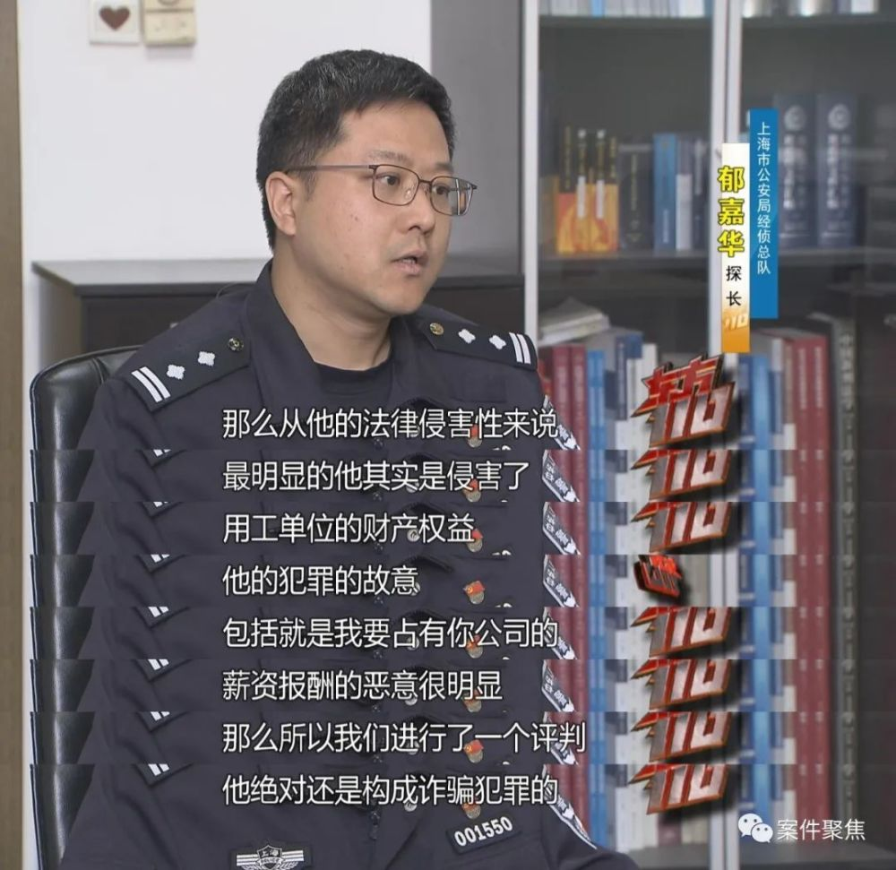
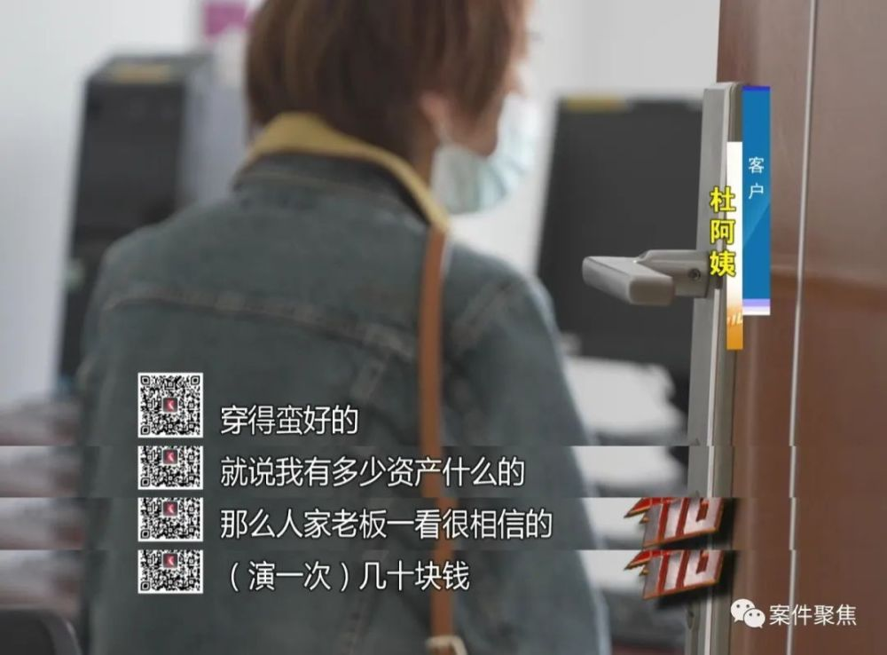

# 职业骗薪！上海一对夫妻两年入职300家公司骗工资，月收入超60万

有那么一群上班族，他们开着豪车，每天在不同的办公楼里穿梭，却只为领取基本工资，他们图的是什么呢？

**工资发了20多万**

**承诺的业绩却迟迟没有兑现**

沈总是一家金融公司的老板，今年，公司投资一个新项目，需要招聘一批销售。

第二天，一个名叫洪凯的男子来面试， **戴着劳力士手表拿着LV公文包、豪车钥匙的他，凭借着“优秀的简历”和一流的口才给人事留下了深刻的印象。**

除了和沈总是同乡，洪凯所表现出的业务能力也十分出众。

他手上上市公司的董监高资源，更是让沈总将2000万的项目承包给了洪凯。

就这样，洪凯以3万元底薪，20%提成被高薪录用，他带着另外8个销售一起加入了沈总的公司。顺利入职后，人事却发现，他们9人的社保迟迟无法缴纳。

对此，洪凯借口称自己当月的社保由上家公司缴纳完成，下个月再由目前所在公司缴纳。

沈总并没有把这件事放在心上，他更关心的是洪凯的业绩。自打入职后，洪凯他们除了参加例会，从不打卡上班，但工作日志显示，他们每天都在跑客户。可即便如此，却迟迟没有客户签约。

两个多月过去，工资发了20多万，但他们承诺的业绩却迟迟没有兑现。

**一张离职证明牵出**

**涉及数百人的“职业骗薪”团伙**

随后，其中一个销售提供的一张离职证明，彻底暴露了这伙人的真面目。出具证明的，的确是他上一家入职的企业，但入职的时间段，却和在沈总公司的时间几乎完全重合。

自知被骗的沈总向浦东警方报案，一个涉及到数百人的“职业骗薪”团伙浮出水面。

实际上，这个洪凯仅是初中学历，当过中介和还卖过保险。

但就这两年，平均每月有10家左右的企业给他发工资，金额从几千到3万元不等，时长短的一个月，最长的半年。

经过了一段时间的调查取证和证据固定，警方认定这伙人和企业之间，绝不是普通的劳务纠纷，而是构成了诈骗犯罪！

**探长 郁嘉华**
：从他的法律侵害性来说，最明显的，他其实是侵害了用工单位的财产权益。他的犯罪的故意，包括占有公司的薪资报酬的恶意很明显，那么我们进行了一个评判，绝对构成诈骗犯罪。

侦查员发现，因为大型企业都有较严格的背调制度，骗子们选择的受害公司，90%都是中小型金融公司，这些企业往往没有人力、物力对求职者进行背调。

在走访中，侦查员发现，直到人员离职，很多企业都没有意识自己被骗。

这家公司的老板向警方提供了一份在金融行业流传的黑名单，这份名单上，有260多个疑似骗薪者。

经过几个月的调查取证，今年3月8日，浦东警方会同经侦总队对已经查证的犯罪嫌疑人实施了抓捕，当晚，共有51人落网。

**夫妻俩两年**

**入职公司超300家月工资超60万**

在这伙人里，比洪凯作案更疯狂的是徐玲玲夫妇俩，作为“时间管理大师”，两人在两年多的时间里，入职的公司超过了300家。

毫不夸张地说，徐玲玲每天的生活，不是在面试，就是在去面试的路上。

导航记录清楚地还原了她的极限工作状态：

早上6点起床化妆，7点出门，8点到达A公司打卡签到，9点多她来到隔壁商务楼参加B和C公司的面试。下午1点，她横跨半个上海，参加D公司的例会，再去E公司办理离职手续。随后，她又去了F、G公司面试。晚上，她去各种酒会交际应酬，挖掘新的公司资源，到家已经是凌晨3点。

徐玲玲曾创下单月入职28家企业的行业记录，可以说，她几乎每天都在不同的公司领工资，夫妇俩仅月工资收入就超过了60万元。

由于徐玲玲选择的都是小规模金融公司，因此，当她拿出那份满是高净值客户的名单，大多数老板都舍不得放手。

一般情况下，头一个月还能蒙混过关，当老板开始催促，他们就会召集群众演员。

**群众演员 杜阿姨：** 穿得蛮好的，就说我有多少资产什么的，那么人家老板一看很相信，你是有钱的。演一次几十块钱。

为了最大化薅取企业“羊毛”，这些头部骗子就开始发展下线，招募不同的层次相对较低的犯罪嫌疑人一同入职公司。

而这些犯罪嫌疑人则需要将工资的20%甚至更高的50%、70%返给徐玲玲夫妇。

因此，徐玲玲夫妇俩除了工资收入，提成也相当可观。正因如此，本来一个小范围的犯罪行为，被肆意扩张到上百人。

骗子们自以为有《劳动法》对于试用期员工的保护，拿捏住了部分企业的软肋。

正因如此，这起案件才能够潜伏两年之久。截止目前，警方已经核查的涉案金额超过了5000万元。这群骗子就像是癌细胞一样，吞噬着正常求职者的就职渠道，也导致企业的经营陷入恶性循环。

本文综合自：案件聚焦

作者：徐征荧

微信编辑：皮小姐

校对：泰妮

