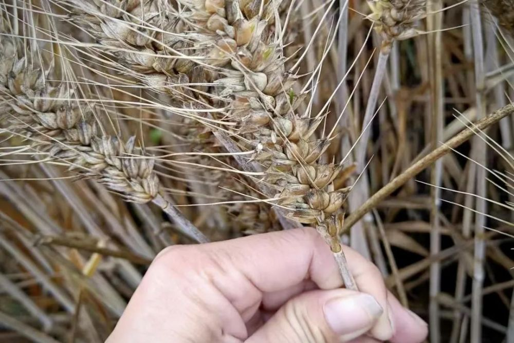
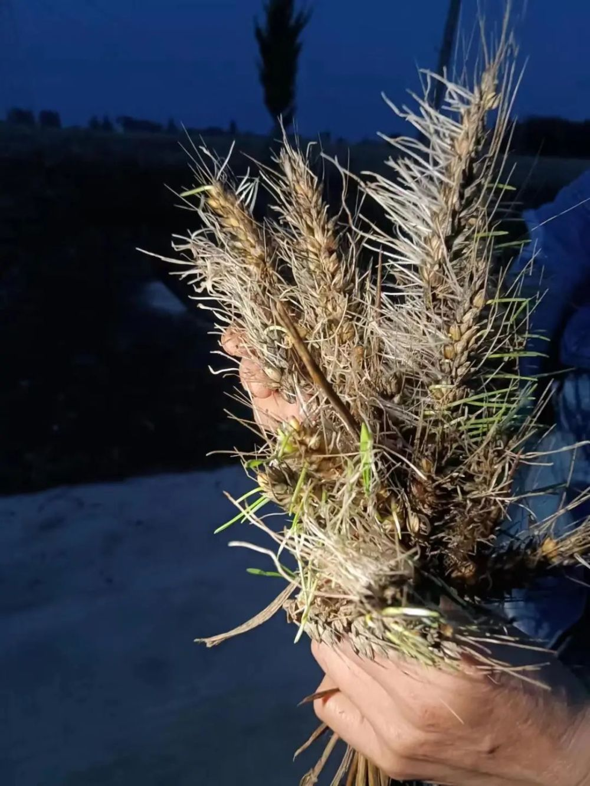
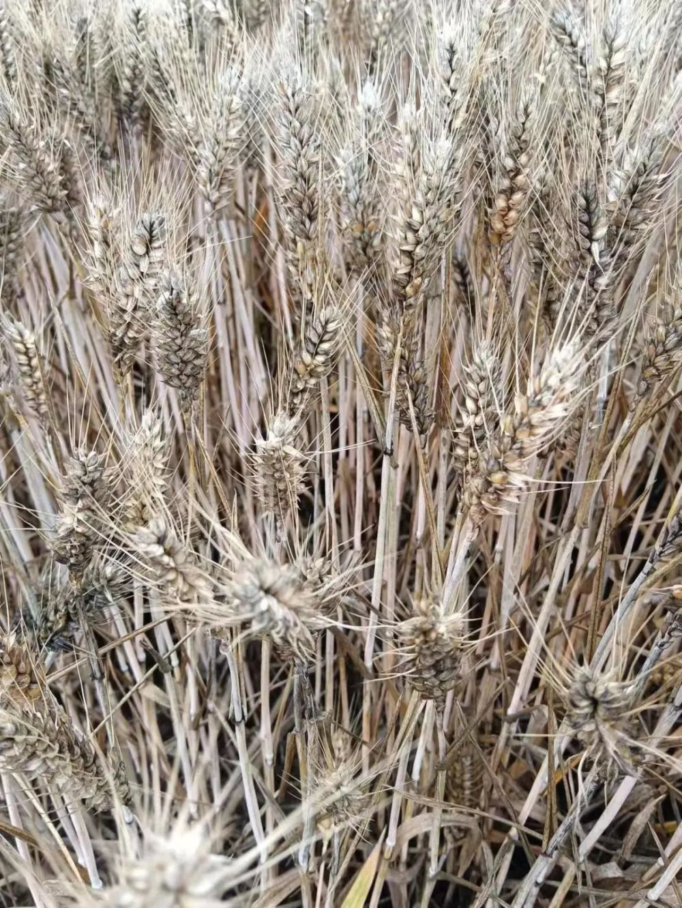

# 豫南小麦，困在收麦时

_5月30日，河南驻马店，一位农民拍摄的麦穗，已出芽。（受访者供图）_

**作者 |李强**

**编辑 | 从玉华**

种粮大户乔振群家的小麦烘干塔已经连续运转了10天，昼夜不停。

除了他自家租种的2000余亩地里的小麦要烘，还有周边农民源源不断送来。在这个豫南小县唐河，他收回来的小麦水分已达35%左右，若不及时晾晒或烘干，很容易发生霉变。

在豫南，麦收时节碰上了罕见的“烂场雨”天气，来不及收割的麦子在地里冒了芽。如今，连日阴雨过后，在一些麦田里，原本该是金黄色的麦穗变为黑灰色，发霉，烂壳；有老农望着地里快要烂掉的麦穗，流下了眼泪，也无能为力；一些农民收割后晾晒在路边的麦子也发芽了。

_5月30日，河南驻马店，一位农民从地里捡回的发芽的麦穗。（受访者供图）_

**雨一直下，收割机苦等**

乔振群记得，他所在的地方雨从5月22日开始下的，断断续续，一直下到29日。

他早在5月17日前后，就从当地气象部门发布的气象预报上得知，接下来会有连续的阴雨天气。那时，麦子尚未完全成熟，而等待真正麦熟时，会恰巧碰上即将到来的雨期。这正是农民们麦收前后最担心的事情。

这个52岁的农民赶紧着手准备大雨来临前的抢收。他调试好自家的3台收割机，整修好厂房里的烘干机，收拾出堆放小麦的仓库，又给省内省外的老朋友们——收割机手——打去电话，告知他们速来抢收。

那时，在唐河县的南部乡镇，已有早熟的麦子开始收割，北部乡镇的麦子尚未到时日。不少收割机正在赶往唐河的路上。豫南，通常是河南小麦最先成熟的地方，也是很多收割机手的麦收首站。

“我们今年比往年收得早，因为天气预报有雨。”乔振群告诉记者，5月19日晚上，他联系的30余台收割机都到了。从5月20日上午10点半就开始收割，一直割到当天晚上七八点。

5月20日，河南商丘的收割机手孟春峪也从家里出发了，他的目的地也是唐河县，那也是他今年小麦收割的第一站。在那里，他有一个2000余亩的收割订单要完成，原计划21日开始收割，12辆收割机两天割完，再转战下一地。

孟春峪告诉中青报·中青网记者，由于收割机不能在高速公路行驶，他的收割机是雇来的板车运输至此的。到收费站后，他们向收费站出示了收割机跨区作业证、板车司机的超限运输车辆通行证等。

“所有的东西都有，让他看了以后，他用手机录了系统以后，他说还要量你的车宽、高。”孟春峪说，测量完后被告知需要到指定地点下高速，若从此处下，则需缴费数百元。

当晚，他们在附近的高速服务区睡了一夜。21日早晨8点多，当他们抵达指定出口——南阳市镇平县（唐河县邻县）晁陂收费站下高速时，工作人员拿着尺子测量过长宽高未超限后，免费通行，“差了十来公分没有超”。

今年4月，国务院物流保通保畅工作领导小组办公室印发的《关于切实做好联合收割机（插秧机）跨区作业通行服务保障工作的通知》中提到，要按照相关规定要求，对持有有效《联合收割机（插秧机）跨区作业证》，且车货总重和外廓尺寸均未超过国家规定的最大限值（含已依法办理《超限运输车辆通行证》且车货相符）的联合收割机（插秧机）运输车辆，免收车辆通行费。

孟春峪说，那天下高速时，他们遇到一辆大板车，“他怕这个车超高，把（收割机）轮胎的气放了。”路上，他们还看到收割机堵在高速收费站的情况，“有人不愿意走，他就说每年都没要钱，今年要钱？”

当时，有网络消息称，在河南唐河，有上百台收割机因超限无法下高速，堵了5天，并因此耽误当地小麦收割，麦子发霉出芽。此事引发舆论关注。

5月30日晚，在南阳市召开的“三夏”生产专题新闻发布会上，南阳市交通局相关负责人再次回应唐河高速出口“收割机运输车辆滞留”情况。

上述负责人表示，5月17日，高速唐河东收费站出现了7辆运送收割机车辆滞留现象，于5月18日上午9时实现了有序放行。自5月22日晚10时起，南阳市境内各高速出口通行有序，无车辆滞留现象。

在此之前，河南交通投资集团南阳分公司在5月30日发布通报称：5月22日当天从唐河收费站下站的收割机运输车共计159辆，……有24辆收割机运输车集中下站并出现缓慢通行情况，原因是部分收割机运输车未办理《超限运输车辆通行证》，导致查验效率不高。“不存在数百辆车拥堵5天情况。”

孟春峪抵达之后的几日，南阳的雨一直断断续续地下着，收割麦子的活计也只能隔三差五地干，“一天干一点儿”。由于持续的阴雨天气，同行的跨区作业车队已经在南阳待了10天，平均每台收割机只割了100余亩地，大雨到来后的多数时间，他们只能待着，苦等雨停。

5月21日晚上，乔振群请来的收割机一直割到夜里12点多。那些收割回的麦，仍有些潮湿，便拉回烘干。从22日开始，雨又下起来，收割机就很难下地了，远道而来的收割机手只好在当地停驻，有的住在附近集市的小旅馆，有的把车当家，有的扎下帐篷。

雨一直下个不停，地里的麦子一天比一天熟，但无法收割，乔振群一天比一天焦虑。他估计，雨期到来前，附近麦地里的麦子只抢收了五分之二。

从播种到成熟，他的两千余亩土地里的麦子历经了七个多月。“眼看着丰收在望了，出现个这情况。”乔振群说，那几天他总往地里跑，担心刮风造成麦子倒伏，又担心雨水下多了麦子出芽，“度日如年，只想着赶快住雨吧，出太阳”。

根据南阳市气象局披露的气象信息显示，从5月20日进入“三夏”以来，平均降水量较常年同期偏多8成，当地先后出现两轮明显降水天气过程。第一轮是5月21日凌晨开始，到夜里结束。第二轮是5月26日凌晨到29日夜里，全市出现连续阴雨天气，本轮降雨的主要特点是持续时间长，影响范围广，与当地小麦成熟收获期高度重合。

当地媒体报道称，这次阴雨天气过程，导致一些地方麦田积水，小麦点片倒伏、发霉，河南部分地区出现籽粒萌动和穗发芽现象，是10多年来最为严重的“烂场雨”天气。

_5月30日，河南驻马店，一位农民拍摄的已有些发黑的麦穗。（受访者供图）_

**收割无法入地，收回无处晾晒**

老家下雨时，收割机主陈明霞还在湖北收割油菜与小麦，湖北也在下雨，但那时湖北的夏收任务已接近尾声。她告诉记者，“（那时）基本上收割机主要是在湖北那边，没有赶回来。”

但当她带着自己的收割机，赶回老家驻马店的村子时，发现自己10余亩麦子，收与不收都成了问题。

“收了（几分地的麦子）一看，全部发芽，我们院子也比较小，没地方放，也没法风干，也没太阳。”陈明霞说，“最后就说不能收，收回来的话，你堆在那里，它也是发烧（因种子潮湿而出现的粮堆内升温现象，记者注），也是要坏。”

“如果说，我们这里收粮食的有烘干机的话，我们肯定老早就收了。”陈明霞告诉记者，她前往南方很多地区收割时，不少粮食收购商都有烘干机，“有雨的话就不怕，（湿的）直接收掉了。”

一位销售烘干机的河南老板巩豫林告诉中青报·中青网记者，最近来自南阳、驻马店的订单多了，也有一些外省政府部门打算批量采购来找他洽谈，“真正到了要收的时候遇到雨天，那会儿才开始着急想去采购烘干设备，等那个时候我们是没有货了”。

在巩豫林看来，烘干机在北方的利用率比南方要低一些。往常，来找他订购烘干机的多是南方地区的客户，每年从二三月份就开始了。“他们会未雨绸缪，提前去准备。”巩豫林说，“北方大部分看天，侥幸心理比较大。”

巩豫林还注意到另外一个现象，“今年好多人去单独加购履带去改装（收割机），相当于装一个防滑链”。他告诉记者，现在的大部分收割机是轮式收割机，即使下了高速，到了田间地头，地已经被连日阴雨泡透了，无法进入收割，而履带式收割机进田会更容易一些。

陈明霞家的收割机正是履带式收割机，最近她接到很多农民的电话，从山东、陕西、湖北、安徽等地打来，其中来自河南老乡的电话最多。“一打电话就问，你们在哪儿，是履带机吗，到我这里来收吧，天晴了，就这两天。”

陈明霞常无奈地回答，“这两天我也去不了，我自己家的都发芽啦。”

在她看来，即便是有履带式收割机，但附近的粮食收购商没有烘干机，普通的农民买不起烘干机，而村子里阴雨天又无处晾晒，农民只能等待天晴。

直到5月30日上午，她所在的村子仍在下雨，多数麦田仍未收割。5月30日傍晚，雨停了，天边映出红色的晚霞，她走在村子附近的麦田旁，看到不少麦穗已经发黑，有些心疼。一些麦芽已顶破麦壳长了出来，最糟糕的情况是，有的麦穗上已冒出白乎乎的麦子根茎，“用来制作饲料都不成了”。

据《河南日报》5月29日消息，为保障夏粮抢收，河南省推出十项应急抢收、烘干晾晒措施，其中包括发挥河南全省现有3万台履带式收割机和4660台烘干设备的作用；粮食、供销社系统全面摸清本系统烘干能力底数，最大程度投入使用。

而后，河南省财政紧急下拨资金2亿元，专项用于小麦烘干，确保小麦质量、确保颗粒归仓、确保农民收益。

在乔振群的烘干厂房里，烘干塔从21日开始就没停止过工作，每天的烘干量在130吨左右，库房里至今堆放着1000余吨已烘干后的麦子，但他这里的烘干设备仍然无法满足附近农民的需要。

“靠（我的）烘干塔远远跟不上。”乔振群说，附近收割的麦子，这里只能烘干50%左右，另外50%得自己找晾晒的地方。近两日，县里、乡里、村里都在组织党员干部带头，寻找晾晒麦子的地方，厂房、仓库、水泥路都用上了。

乔振群告诉记者，现在干麦的收购价在1.25元至1.28元之间，以质论价，“芽麦水分大的六毛多钱一斤”。

南阳市桐柏县一位农民告诉记者，他家4亩麦子仍未收割，“（现在用）机器割回来也没啥用了”，麦粒上已经长出了麦苗和根茎。他记得，有一年麦子出芽后有农户粉碎后拿来喂猪，“猪都不吃”。最近，村干部正在统计农户麦子受损情况。收割机手孟春峪也说，一位承包户打电话告诉他，他的麦子不用收了，已经发芽发得很厉害，“他不要了”。

5月30日，南阳市农业农村局局长周清玉在新闻发布会上介绍，截至当日17时，南阳市已收获小麦298.1万亩，占全市小麦面积的27.25%。据调查，6月1日后所有麦田将进入成熟收获期，预计6月4日前麦收工作可以基本结束。

天晴后，种粮大户乔振群也渐渐从焦虑中走出来。太阳出来了，收割机手们也终于开始下地抢收小麦，有时夜里要收到凌晨1点多，麦田里潮气重起来才结束。

5月30日夜里11点半，麦田里的潮气就渐渐起来了，乔振群才从地里回到家中准备休息。而在他的麦地里，6台收割机将在半个小时后才会停止作业。在烘干厂房里，仍有值班工人连夜投送燃料，烘着潮湿的麦粒。

到5月31日，陈明霞家的履带式收割机才再次下地，准备收割已经发芽的麦子。“没办法，也得收回来，收回来到时候再看（怎么处理）。”陈明霞说，“现在我们要和时间赛跑了，两天晴天，后面两天雨，希望我们的麦子都能颗粒归仓。”

（文中孟春峪、陈明霞、巩豫林为化名）

**中国青年报·中国青年网出品**

