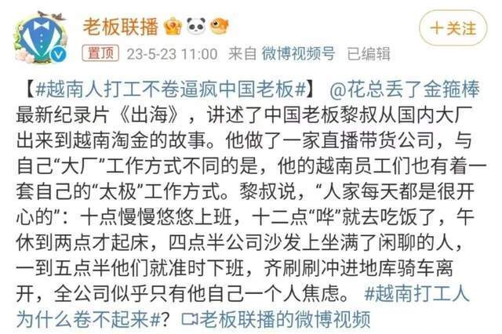
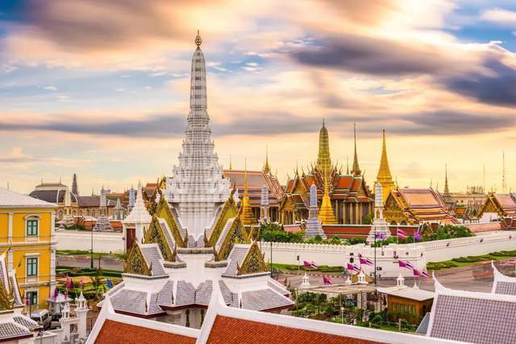
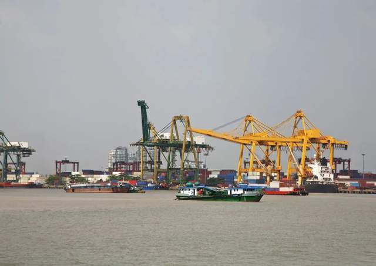

# 长三角制造业迁移东南亚：越南人不卷，但照样能做下一个“世界工厂”

**目前，越南的科技工业水平层次还很低，倘若，未来有一天，越南也造出个中国江浙沪式的产业集群，那真是不容小觑。**

**冰川思想库特约撰稿丨柳展雄**

最近两三年，产业链迁移东南亚的讨论，热热闹闹。

大家都在问，长三角的制造业衰退后，能不能迁到我国中西部？转移到东南亚，越南会不会成为新的“世界工厂”？

看好东南亚的观察者认为，那边地价、人工各种成本低，营商大环境好，企业家对政府有信心；另一波人则说，东南亚基建拉胯，物流慢吞吞，中高端技术人才匮乏，工人效率低，毛病一大堆。

前些天，有个中国老板自述，在越南淘金，结果本地工人慢悠悠，还上了微博热搜。

_图/网络_

关于，产业链迁移东南亚，我的看法：不是东南亚需要工业体系，而是工业体系需要东南亚。

01

先来解释下前半句。

东南亚老百姓完全可以吃第三产业的饭碗，日子小富即安，对工业化的需求并不急迫。

**最典型的是泰国，这个国家工业能力较弱，以旅游观光业为支柱产业。**
泰国遍地都是旅行社，每年有至少3000家旅游社企业获得认证，5年内，旅游业总收入达到9万亿泰铢。旅游业的蓬勃又带动了酒店业、免税店等服务业，整个经济体系的就业引擎靠旅游来驱动。

旅游观光业上下游，养活了成千上万的从业者，在高峰期，以旅游为核心的第三产业收入占该国国内生产总值的五分之一以上，今年1月3日，泰国政府发布了新的五年国家旅游发展计划，该计划着眼于疫后旅游业的振兴和发展，再接再厉，更创辉煌。

_▲泰国曼谷（图/图虫创意）_

一些工业化爱好者，说旅游业雕虫小技，兴办制造业才是正道。

我也承认，工业化的好处很多，但问题是，流水线打工那种模式，太苦逼。

上世纪的中国人，尤其是农民太穷了，吃不饱饭，否则谁肯去富士康那种工厂。那时的中国，人均收入太低了，制造业一丁点利润就能让农民工满足，中国成为世界工厂，离不开这个时代背景。

**日子稍微好一点，底层老百姓就不会往工厂里进。**
今天新一代90后00后农民工，很少有人愿意长时间呆在厂里，今天深圳的制造业，人员流动性很大。最夸张的情况，月初一家电子厂进来一批普工，月末可能已经换了三拨人。

工业对东南亚，并不是必需品，他们专心做第三产业，虽然达不到富国水平，但温饱是绰绰有余。搞搞旅游业，做做餐饮，对欧美外国人跳跳风情舞，表演下东方风情，就能赚到钱，这不比打螺丝要轻松。

在网上一说，工业化好不好？肯定一堆人说，好，列出一堆理由，但是如果问，你自己愿不愿意去工厂打工，网上的工业化爱好者就沉默了。

02

现在东南亚，大力搞工业化，主要的推力不是本国政府，而是欧美企业。

正如上文所说，东南亚国家自己躺着吃第三产业的饭，就够活了，没必要建厂建制造业，着急的是欧美人。

以苹果为例，2010年以来，苹果的代工生产集中在中国大陆，对中国供应链的依赖非常高。本来是中国和外资双赢的事情，然而近些年，民间不乏一些狭隘民族主义和民粹主义之声，此起彼伏。

**从经营策略再到国际大格局，苹果总部必然要作出调整** ，把生产链逐渐搬到全球其他地方。

欧美企业布局东南亚，狡兔三窟。韩国人布局更早，原本三星、现代、SK、乐天、大宇等韩企在华发展势头很好，后来中韩关系僵化，朴槿惠政府对外合作的方向转向东南亚。

韩国产业的龙头老大三星，在越南北部的北宁省的稻田地里，建了个手机组装厂。越韩深度合作，2018年在河内机场，铺天盖地全是韩国明星面孔的韩国广告，越南有的社区变成韩国城，里面住了一批韩国援建的工程师和技术工人，商店，餐厅门口都不打越南文招牌，而是打韩语招牌。

_▲越南太原市的三星工厂（图/视频截图）_

单纯从经济效益上来讲，韩国援越建设，前期投入过大，并不划算。

**这里涉及到一个经济学效应——产业聚集效应。**
产业链转移，不是搬走一家两家厂，而是一整套体系，比如汽车业涉及到电池、电机、电控、汽车芯片、变速器多个零部件，假设通用宝马这样的欧美汽车巨头，总部决定在东南亚开个新厂，不是简单盖一个汽车厂就行，还要供应链配合。

为啥特斯拉选择在上海建工厂，因为零部件很多能从江浙沪就近采购。长三角有非常发达的产业集群，上下游的企业紧凑在一起，最大化节省成本。

制造业有个工艺，齿轮加工，各种机床加工环节最复杂精密的工艺之一。

中国的轴承之乡在绍兴新昌县，浙江陀曼等机床厂，跟轴承车床合作久了，本事见长，于是把经验拓展到齿轮加工的滚齿机床上。常年以来，国内的滚齿机市场由日本三菱重工霸占，而浙江本地厂商，硬是杀出一片天地，成功打造出品牌。

接下来附近温岭的民营企业，跟工具磨床有合作形成了产业集群，像滚雪球一样，规模体系越滚越大。中国的浙江温岭、台州以北地区，是产业聚集效应的教科书典范。

**而东南亚就缺乏这样的产业集群**
，韩国三星刚开始从中国搬到越南的时候，有91种零部件向越南本土厂商采购，结果产品质量无一合格，越南的工业家底实在太差了。

后来，三星派大批专家出国，来当地指导，手把手教东南亚怎么工业化，帮忙把上下游产业链补齐了。最终，有35家越南本土企业合格，成为三星的一级供应商，190家越南企业参与了三星的供应链。预计到2035年，越南北宁省的三星开发区，成为世界最大的手机工厂，制造出1.2亿台手机。

可以说，越南的经济体系，从0到1，是韩国一手拉扯大的。

在这个过程中，韩国付出了不少真金白银，十年岁月里，三星在越南的投资超过173亿美元。为了满足越南底层老百姓的权益，韩企保证一天八小时工作，按时发放薪水，加班给高额奖金，住房给补贴等等。

为了吸引第三世界的年轻人，进工厂流水线干活，全球资本主义体系用上了各种优惠，所以我说，不是东南亚需要工业体系，而是工业体系需要东南亚。

03

目前，越南的科技工业水平层次还很低，倘若，未来有一天，越南也造出个中国江浙沪式的产业集群，那真是不容小觑。

早在90年代，日本就存在产业链转移的计划，有意培养东南亚为制造业重镇，东京政府一把豪赌，掷出1700亿美元。印度尼西亚、泰国、马来西亚、菲律宾四国拿到投资后，喧嚣一时，号称“亚洲四小虎”，曼谷布满了丰田、日产和凌志的日企汽车生产线，准备打造“东方的底特律”。

但是这些国家内部有严重的痼疾（高层的裙带关系，官僚腐败，族群撕裂，各国的排华民粹主义），到了1997年金融危机，矛盾总爆发。泰国和菲律宾陷入了长达多年喋喋不休的街头政治，印尼的地方分离运动和伊斯兰原教旨主义抬头，各方撕逼，
**民生经济晾在一边。**

_▲越南胡志明港（图/图虫创意）_

**跟四小虎相比，越南优势拉满。**
政局高层稳定，没有频繁的内阁倒戈，没有族群撕裂和地方分离运动，上世纪90年代以来越南抛弃苏联的计划经济模式，启动市场化改革，提供良好的营商环境，目前越南共有
15 个沿海经济区，28 个边境经济区。

而且越南还有得天独厚的地理条件，海岸线非常长，天然适合海洋贸易。2021年，越南进出口贸易额达到6700亿美元左右。

当然越南的问题也客观存在，基建老旧，劳动力素质低，全国近77%的劳动者、4300万人缺乏专业技术水准。如果越南克服了这些问题，吸取当年亚洲四小虎失败的教训，那么对全球产业链转移来说，是极大的地缘政治变动。

