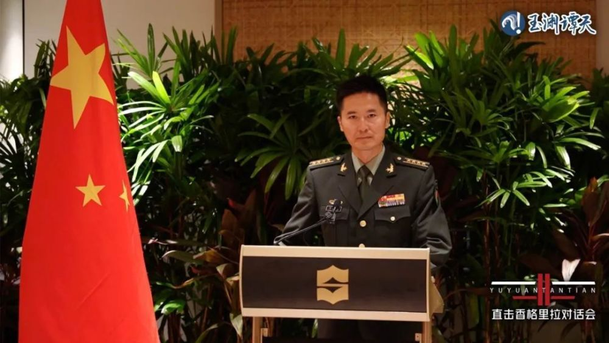
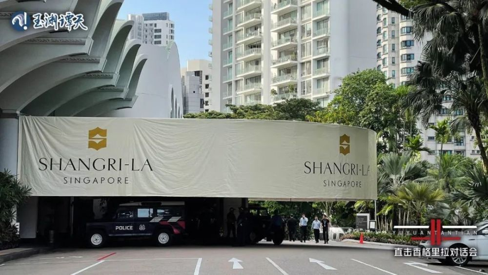
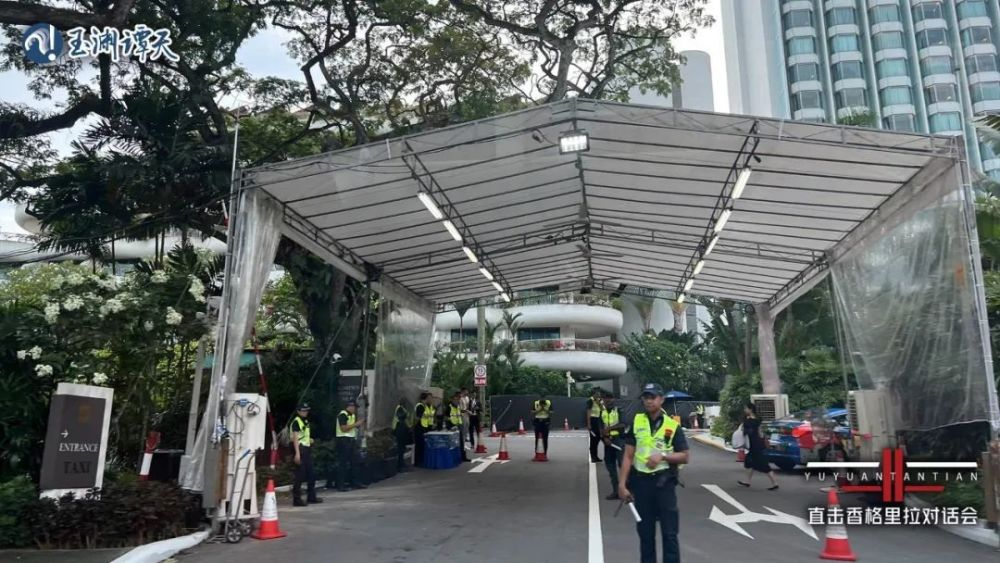

# 中国防长在香格里拉对话会上和谁见，体现了中国的和平观

最近几天，来自40多个国家和地区的国防及安全机构代表陆续抵达新加坡，参加于6月2日开始的香格里拉对话会。

_｜｜谭主抵达香格里拉对话会现场_

6月1日上午，中国国务委员兼国防部长李尚福与新加坡国防部长黄永宏举行会谈。

这也是中国代表团本次出访新加坡的第一项行程。

这次会谈后的吹风会上，国防部新闻发言人的一句话值得关注：

关于中国与东盟关系，李部长指出，亚太是我们的共同家园，繁荣稳定是各国人民的共同心愿。

_｜｜吹风会现场_

香格里拉对话会，正是亚洲国家讨论安全问题的主场。

但总有一些人想要喧宾夺主：

此次香格里拉对话会，美方的发言主题是“美国在印太地区的领导力”。会前，美方又开始炒作和中方会面的事情，号称中国此举“极不负责任”，会引发其他亚洲国家的“恐慌”，是在“破坏和平”。

接近军方高层的消息人士向谭主证实， **中国确实明确回绝了美国的邀请。**

为何不见？可以先从中国见了谁谈起。

中新防长会谈，中方的吹风中提到这样一句话——落实两国领导人重要共识。

2个多月前，新加坡总理李显龙访华。这次访华期间，中新两国领导人将中新关系提升为全方位高质量的前瞻性伙伴关系。

前瞻性伙伴关系，这样的表述并不多见。

中国社科院亚太与全球战略研究院研究员许利平表示， **“前瞻性”说的是中新两国着眼未来，把握世界格局变化，体现了中新两国的引领力。**

世界格局在如何变化？谭主注意到当时新闻稿中的一个词——和平红利。

新方曾表示，二战后全球的和平红利已经结束。

如何捍卫和平？谭主想起中方在提出全球安全倡议时说的一句话：

地区和平稳定不是天上掉下来的，也不是哪个国家的施舍，而是地区国家共同努力的成果。

这一点，新加坡一直感同身受。

_｜｜谭主抵达香格里拉对话会现场_

看国土面积、人口等数据，新加坡的体量并不大。这时，再考虑到新加坡地处国际战略要塞，其要想维护自身安全，就更不是一件易事。

在面对美西方国家抛出的“橄榄枝”时，新加坡却并没有将安全自主权完全交由他人，而是保持了战略定力——新加坡巧妙地与美国保持了距离，并没有和美国订立同盟条约。

相反，对于所有域外大国，新加坡都保持了开放交流的态度。

最近几年，新加坡总理李显龙不止一次表示，新加坡不希望在中美之间选边站，也不会倒向任何一方。新加坡和中美两国都有非常紧密和广泛的合作。

中新两国在安全问题上有共识，这样的背景下，中新两军之间的合作，不断深入。

去年11月，中新两国同意于2023年举行中新“合作”系列陆、海军联合演训。短短5个多月后，“中新合作-2023”海上联合演习就正式开始。

中新两国传递的信号也很明显，命运，要牢牢掌握在自己手中。

也正是这样的认知，使得新加坡在东盟国家中的地位比较特殊。

这次香格里拉对话会的参会专家、军事科学院战争研究院大校研究员曹延中就表示，
**新加坡一直保持着独立自主的外交政策，拥有广阔的国际视野，能够从东西方文化交融的角度来看待其在地区关系、在国际关系中的地位，以及东盟在整个亚太地区安全中的角色。**

和平，要靠自己争取，靠合作去维护，而非哪个国家施舍，中新双方的共识，正在逐渐成为大多数亚洲国家的共识。

这样的共识，让主场设在亚洲的香格里拉对话会在20余年间，成为了世界最为重要的安全峰会和多边论坛之一。

_｜｜谭主抵达香格里拉对话会现场_

但有些高调参会的域外国家，总会带来一些杂音。

为何不见美方？可以看看香格里拉对话会前，美方都做了些什么——最近，一架美军侦察机在南海所谓“国际空域”对我进行抵近侦察。

搅乱南海局势，美国早就是惯犯。

中国南海研究院给谭主提供了一份独家报告，报告显示，2022年，南海领土主权和海洋管辖权争端、渔业争端持续紧张。而这背后，都有美国的军售和联盟倡议在背书。

同时，美国2022年在南海的军事动作明显增加，成为威胁南海局势的重要因素。过去一年，美军在南海的各类训练和演习数量超过了100次，美国把南海当成跨兵种和跨国演练场的目的，比以往任何时候都来得更明显。

除了像这样消耗南海的安全，美国还试图介入南海区域规则的制定。

去年5月，在美国的领导下，美日印澳“四方安全对话”机制推出了一项的新计划，印太海域态势感知伙伴关系。根据这项计划，美国与盟友将进行海洋与军事安全情报的共享，来提升太平洋、东南亚和印度洋地区各国的海域监控能力。

作为一个域外国家，美国要争夺自己本不应拥有的话事权，使用的一个典型手段，是分化东盟。

最近，美国在东盟国家中把菲律宾单拎出来，撺掇“美日菲”和“美菲澳”安全联盟。

许利平表示，
**这样的小多边会冲击以东盟为中心的地区安全架构，松动东盟的外交原则和基石。美国在亚太地区想谋求领导地位，和东盟在本地区的中心地位是产生冲突的。**

而此次会谈中，中方明确表示，支持东盟战略自主。

美方的意图，东盟国家看得清楚。最近，多个东盟国家都公开表态，呼吁各方尽快推进“南海行为准则”。

域内国家，早就受够了某些国家操弄议题，破坏和平。

对于美方这几天渲染的“威胁论”“恐慌论”，国防部新闻发言人回应表示：

中方重视发展中美两军关系和开展各层级沟通，事实上两军接触交流并未中断。

清华大学战略与安全研究中心研究员周波表示，
**去年反制佩洛西窜台，军事上中方采取了3项措施。但这并不代表真正出现紧急情况时，两军是彻底断联的，中方会视情况接听美方打来的热线电话。一线，军舰、战机相遇时，两军海对海、空对空的喊话，对方也能听见。除此之外，美国的驻华武官通过大使馆这个渠道，也能尝试联系到中方。**

事实上，就在上周，包括美国在内的外国驻华武官还应邀参访了北京卫戍区某师。组织驻华武官实地参访，直接接触中国军队，足以证明中方开放交流的态度。

追根溯源，一些可能的风险本身就来自美方的次次冒险。

就拿刚刚提到的军机事件来说，美方宣称中方战机操作不当，对美战机进行了“不专业拦截”。

事实呢？

美军这架侦察机，是蓄意闯入我训练区域实施侦察干扰，而中国人民解放军南部战区组织空中兵力全程跟踪监视，处置依法依规，操作专业规范。

战略层面，美国不改变遏华、阻华的心态，中美两军有再多的磋商机制，也很难提供什么保障。

就拿此前取消的中美海上安全磋商机制来说。

周波表示，
**中美海上安全磋商机制虽然已经成立了25年，但实际效果并不好。原因，就出在美国的南海战略上。他曾带队去五角大楼谈判美国舰机侦察的法律地位问题，美方不减少侦察的同时，还要求中方保证其安全，中国的国家利益是清晰的，所以双方很难形成有效共识。**

谭主也从消息人士处了解到，此前，美方使用热线，经常是在军舰擅闯南海时打来，以此来宣称自己是“无害通过”。

热线，原本是管控分歧的手段，被美国用成了制造摩擦的手段。

此次美方炒作的中美防长会晤，也是如此。美方一方面口口声声要加强沟通，另一方面又不顾中方关切人为制造障碍，严重破坏两军互信。

军机事件，就是明证。

美方希望用制造摩擦的方式“促成”与中方的沟通，如果中国拒绝，就是“不管控风险”，就是在“制造不确定性”，就是在“破坏和平”，这是哪来的强盗逻辑？‍

在错误的基础上再怎么做文章粉饰，也无法改变错误的本质。

谭主了解到，此次香格里拉对话会期间，中国防长将就“中国的新安全倡议”议题进行大会发言，除此之外，他还将会见有关国家代表团团长，同其他国家一同探讨安全之道，共同维护世界和平。

_｜｜谭主抵达香格里拉对话会现场_

香格里拉对话会上，中国很忙。

为的是和平。

