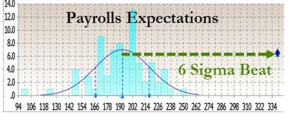
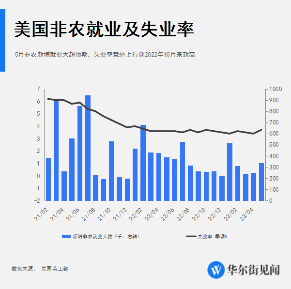
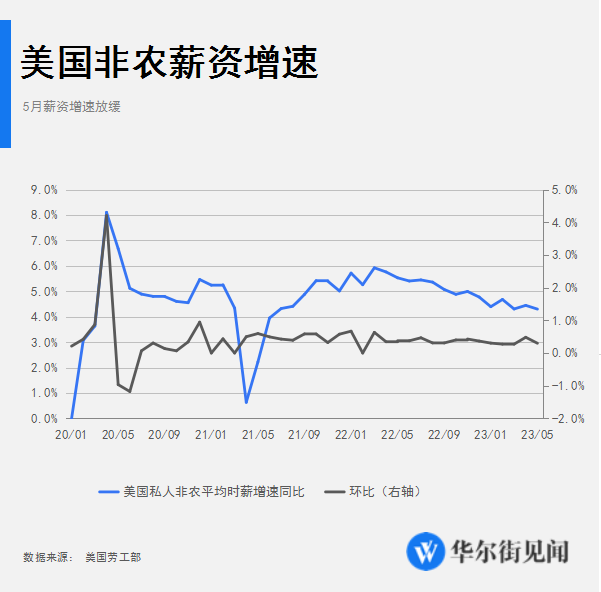
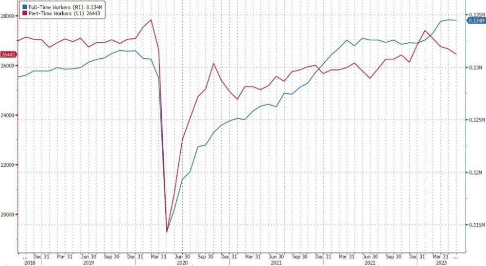
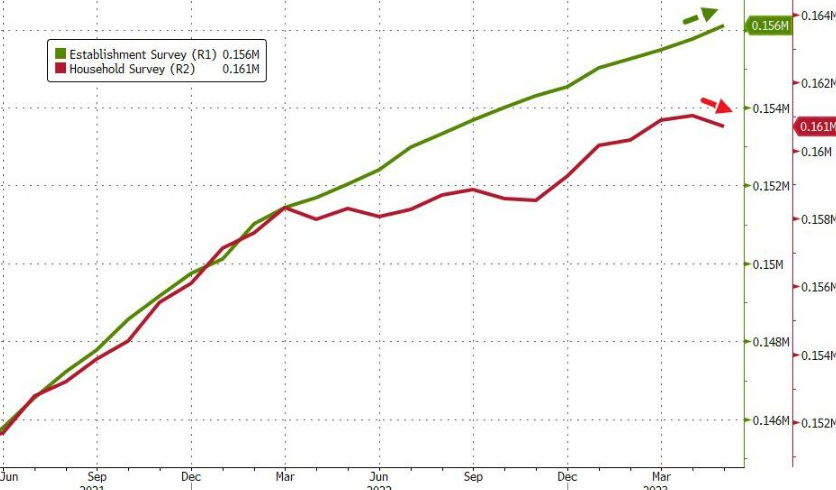
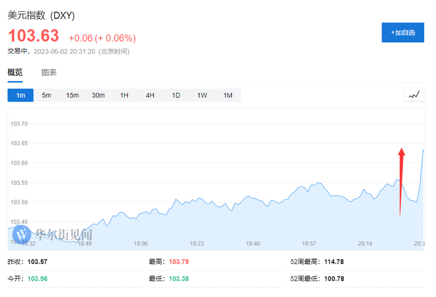
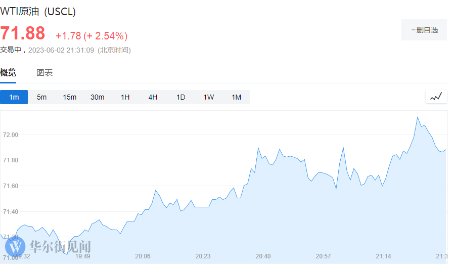
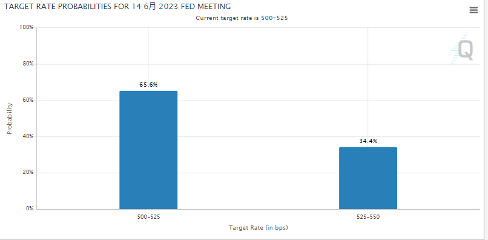

# 喜忧参半！美国5月新增就业33.9万人远超预期 但失业率创8个月来新高

美国5月非农喜忧参半，新增就业远超预期，失业率意外上行。

两者相抵消，市场押注6月利率维持不变，7月加息预期有所上升。

5月非农就业再次超预期上行，失业率意外上行，前两月数据被上修

6月2日，美国劳工部数据显示， **美国5月非农新增就业33.9万人，几乎是估计中值19.5万的两倍，为2023年1月以来最大增幅**

这一数据又再次打了分析师的脸，实际数据超出预期6 个标准差。

过去13个月中，有12个月超出预期。

3、4月非农就业数据上修，3月份非农新增就业人数从16.5万人上修至21.7万人；4月份非农新增就业人数从25.3万人上修至29.4万人。修正后，3月和4月新增就业人数合计较修正前高9.3万人。

**5月失业率为3.7%，高于前值3.4%和预期3.5%，创下2022年10月以来新高。**

5月份工资增长放缓，环比增长0.3%，符合预期，同比增长4.3%，低于预期值4.4%。

值得一提的是，尽管就业人数井喷，但5月份全职工人和兼职工人分别减少了22万人和2.3万人。

企业调查数据和住户调查之间差距加大，住户调查数据出人意料地出现了自4月22日以来的最大跌幅，减少了31万个就业岗位，导致失业率从3.4%上升到3.7%。
**两份调查之间的差值扩大至接近历史最大水平。**

美元指数短线拉升，美债跌幅扩大

非农就业报告公布后，美股期货短线波动不大，纳斯达克100指数期货维持0.4%左右的涨幅。

美元指数短线拉升逾10点，现报103.63。现货黄金短线走低约4美元，现报1975.78美元/盎司。美债2年收益率直线拉升8基点。

经济衰退担忧有所缓解，WTI原油一度突破72美元/桶，日内涨2.54%。

石油市场的注意力似乎仍完全集中在本周末开始的欧佩克+会议上，投资者对该组织是否会再次减产或暂时保持产量稳定持观望态度。但油价在过去两天的反弹表明，市场倾向于某种形式的小幅减产，或者可能是重新承诺全面实施4月份宣布的减产。

非农喜忧参半 市场押注6月利率维持不变

机构分析称，就业人数再次超出了普遍预期，增加了33.9万人，甚至远高于预期。加上前两月向上修正的9.3万人，总体数据无疑是强劲的。

一个缓和因素是失业率上升到3.7%，远高于预期的3.5%。与此同时，月度工资增长与预期相符，但由于此前数据略有下调，按年率计算的增幅略低于预期。

**总的来说，这些数据可能会使美联储最终继续加息，但失业率的上升可能足以使本月的利率维持不变。**

**就业数据公布后，交易员仍然押注美联储6月将维持利率不变。美联储掉期交易增加了市场对美联储到7月加息的预期，加息定价达到22个基点。**

据CME“美联储观察”，美联储6月维持利率不变的概率为65.6%，加息25个基点的概率为34.4%；到7月维持利率在当前水平的概率为33.1%，累计加息25个基点的概率为49.9%，累计加息50个基点的概率为17.1%。

值得一提的是，该数据是6月14日发布通胀数据和举行的FOMC会议之前的最后一个关键指标。下次会议前，美联储还将看到5月份的CPI报告，虽然通胀报告对美联储政策较为重要，但报告发布晚可能会让委员会不愿因一个他们没有详细研究过的数据而改变计划。

服务业就业继续复苏

5月份，美国服务业就业人数持续上升，医疗、金融、政府和建筑业的就业人数也有增长，制造业、采矿业等变化不明显。

失业人数和临时工合计增加31.8万，达到300万人，抵消了上月的降幅。

专业和商业服务增加了6.4万人，与4月增幅类似。专业、科学和技术服务业的就业继续增长，增加了 4.3万人。

政府部门就业人数在5月份增加了5.6万，而前12个月的月平均增幅为4.2万人。政府部门的就业人数比2020年2月疫情前的水平低20.9万，即0.9%。

医疗保健行业增加了5.2万个工作岗位，与前12个月平均每月增加5万相近。5月，门诊医疗保健服务增加了2.4万、医院增加2万以及护理和住宅护理机构9000的就业增长。

休闲和酒店业的就业人数在5月份继续呈上升趋势（+4.8万），主要集中在餐饮服务和饮酒场所（+3.3万）。在过去的12个月中，休闲和酒店业平均每月增加7.7万个工作岗位。该行业的就业人数仍比
2020年2月的水平低34.9万，即 2.1%。

建筑业新增2.5万个工作岗位，其中重型和土木工程建设领域新增1.1万个工作岗位。在过去的12 个月中，建筑业平均每月增加1.7万个工作岗位。

运输和仓储业的就业人数增加了2.4万。过境和地面客运增加了1.2万人，抵消了上月的减少。5 月份，快递员和信使 (+0.8万) 以及航空运输 (+0.3万)
的就业人数也有所增加。近几个月来，运输和仓储业的就业没有明显的趋势。

社会救助就业人数增加了2.2万人，与前12个月平均每月增加2.3万的情况一致。本月，个人和家庭服务业增加了1.7个工作岗位。

其他主要行业的就业人数在一个月内几乎没有变化，包括采矿、采石以及石油和天然气开采、制造业、批发贸易、零售业、信息、财务活动和其他服务。

