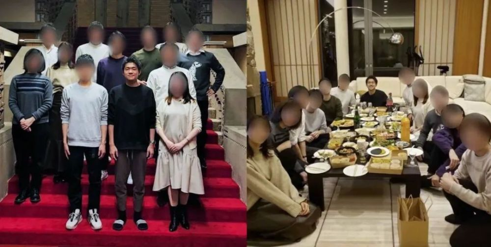

# 日本首相，“炒”了儿子

**岸田文雄认为，任命翔太郎是“人尽其才”。**

作者： 刘潇

日本首相岸田文雄的长子翔太郎正式离开了首相秘书的职位。

对6月1日发生的这件事，日本舆论的评价相当一致。有网友评论：“家教太差劲！”某新闻网站总编辑新田哲史称翔太郎“道乐息子”（浪荡儿子）。

真把公邸当私宅

1991年出生的翔太郎，早早就被父亲拉入政界。岸田文雄当了首相，安排儿子做秘书，也是苦心栽培这个“接班人”。

然而，去年12月30日，才刚当了两个月首相秘书的翔太郎，就请了10多个亲友到首相公邸搞“忘年会”，还把搞怪合影发到网上。亲友们逛了公邸各处，模仿内阁大臣站在演讲台前，比划剪刀手摆造型拍照，还有人躺在公邸台阶上。最引起争议的则是其“亲友团”站在公邸台阶前的合影。

_·岸田翔太郎与亲友们在首相公邸聚会。_

这个台阶可是日本内阁拍“合家欢”的标准场景，日本首相宣布大事时，往往就带着大臣们在这台阶处排排站。

_·岸田文雄（前三）率内阁成员“亮相”。_

翔太郎的“忘年会”照片在网上疯传，一夜间岸田文雄遭朝野批评。在野党立宪民主党高官说：“首相公邸不是一个给家人制造回忆的地方，而是一个危机管理的场所，不能公私不分。”

媒体更是铺天盖地“杀到”，瞄准“首相宠溺儿子”的行为狠批。迫于压力，岸田忍痛将亲儿子辞退。

然而，日本媒体继续猛追，发现岸田给儿子发了夏季奖金252万日元(约合12.8万元人民币）。围绕翔太郎该不该拿这笔奖金，网民和媒体又讨论开了。

根据日本国家公务员法，公务员奖金法定发放日为6月30日的夏季奖和12月10日的冬季奖。6月1日被炒的翔太郎，按法律说是没资格领夏季奖的。

“零业绩，还拿奖金”，这让外界对进一步质疑岸田文雄的用人。日本共同社早前报道称，岸田对外宣称自己在决策中善于倾听各种意见，但他坚持任用政治资历尚浅的儿子，即使在内阁中也有人对他的用人水平产生怀疑。

岸田文雄就此辩称，他任命翔太郎是“人尽其才”。

还有日本媒体称：“泄露忘年会照片的，一定是岸田家族的亲友，说明家族内部并不团结。”自称善于用人的岸田文雄，似乎连“治家”都没做好。

篓子捅了一大堆

这并非翔太郎第一次给父亲捅娄子。

今年1月，翔太郎遭日媒曝料，在陪同父亲出访期间，他乘坐日本大使馆的公务车去逛了巴黎和伦敦的旅游景点。“把公务车当旅游车”，这招致民众强烈不满。

_·在海外坐公务车买土特产后，岸田翔太郎被追问。_

管不住腿的翔太郎，还管不住嘴。去年10月24日，日本时任经济再生大臣山际大志郎因与邪教组织有牵连，被迫辞职，成为岸田内阁首名辞职阁僚。

就在他的丑闻闹得沸沸扬扬之际，富士电视台独家捅出了他将辞职的消息。据说，这一当时还保密的信息，是翔太郎透露给富士电视台专跑首相府的女记者的。

翔太郎还曾在新闻发布会上，对一名女记者是否能一口气喝掉若干龙舌兰酒“很感兴趣”。

翔太郎这些事，被人当笑话讲，但岸田文雄并没严加管教。

到“忘年会”照片事件严重影响了支持率，岸田才说，会要求儿子“严格注意”自身言行，又让官房长官出来灭火，称“忘年会”占用的是公邸中“迎宾、职务功能的公共空间”，首相“今后会严肃对待”。

_·岸田翔太郎被首相要求“严重注意”自身言行。_

曾经也是“别人家的孩子”

翔太郎并非天生会捅娄子。在当首相秘书前，他看起来也是“别人家的孩子”。

32岁的翔太郎，出生在岸田家族的“根据地”广岛县。

少年时期，他就读于县里顶尖私立学校——修道学校。这所学校能初高中连读，培养了众多政经名流。能进修道就读，相当于今后能“保送”名牌大学。

翔太郎的中学老师说他“对学业相当有热情”。毕业后，他考入东京的庆应义塾大学法学部政治系。该校是日本历史最悠久的大学，也是世界名校。

翔太郎中学时就喜欢打羽毛球，上了大学，加入水平比肩职业队的庆大羽毛球俱乐部，单打、双打都斩获奖项，人称“文武双全”。

大学毕业，翔太郎更是平步青云，进入号称日本“十大财团”之一的三井物产。这家公司成立于1876年，是横跨化工、原材料、银行、建筑、采矿、房地产的行业巨头。

2017年，翔太郎代表三井物产，参加了东京千代田区羽毛球大赛。

见儿子积累了一定社会经验，岸田文雄觉得时机成熟。2020年3月，身为议员的他安排儿子进入岸田事务所当公设秘书，工资由国家承担，吃上了“皇粮”。

翔太郎和弟弟晃史郎搬进了国会议员宿舍，和父亲同住。晃史郎在家做饭，翔太郎负责接待客人，打理杂务。这段时间，翔太郎口碑不错，政府内部有人夸他：“会待人接物，人也非常好。”

_·翔太郎（右边）与父亲、弟弟在家中边吃边聊。_

2022年10月4日，岸田文雄当了首相，翔太郎也升为首相秘书官。

和议员秘书相比，这个位置的平台更高，接触面更广，不仅要辅助首相处理日常事务，还要在首相下达临时指令时，辅助内阁官房长官以及其他大员的工作。如果翔太郎在这个位置上踏踏实实干几年，不仅能了解政府运作，还能建立广泛的人脉，将来当议员甚至当首相，都并非不可能。

_·担任首相秘书官的岸田翔太郎与父亲形影不离。_

然而，如今这条道儿，已经被他自己堵上了。

他“应该懂得自律”

翔太郎出了事，岸田的政治对手很高兴。

女议员莲舫素来和岸田文雄不睦，她当仁不让地站出来，批评岸田家教不严，也教训翔太郎“应该懂得自律”。

然而，莲舫的批评却招来网友嘲讽，丢出了一个“回旋镖”，反伤了自己。原来，2010年，莲舫为一本时尚杂志拍了一组大片，取景地就在国会大厅。

_·日本网友讽刺莲舫，“丢出回旋镖”反伤自己。_

当时，莲舫以“议员活动”为由，向参议院事务局宣传科提出申请。照片刊出后，宣传科负责人发现莲舫穿的时装“品牌显眼”，附有图说和高额的价格标识，广告色彩太重，“早知道我就不批准她了”。事后，参议院议长向莲舫发出“注意警告”。

_·2010年，莲舫议员在国会大厅拍摄时尚大片。_

还有人表示，相比翔太郎在首相公邸办“忘年会”，前首相安倍晋三的夫人安倍昭惠的“过家家”更严重。在安倍晋三任首相期间，安倍昭惠高调追星，请歌星到首相公邸参加活动，还与对方在“著名台阶”前合影。

_·前首相夫人安倍昭惠与歌星在首相公邸合影。_

而这次翔太郎“忘年会”事件一出，民众情绪爆发，说到底还是岸田执政带来的民生问题。

岸田上台以来，为了提高政府收入无所不用其极。岸田政府扩大了税目，维持高昂的消费税，积极追讨消费税，打击旅客将免税商品在境内转售带来的逃税问题。

岸田政府还提高了电费、降低企业年金、取消留学生免税资格，甚至不顾日本民众反对，在大阪设立赌场，以吸引资本。

_·图中被踩在脚下的日本民众说：“连房租都交不出来了啊！”_

岸田政府大力收税，给民众增加了负担。日本民众称之为“血税”。一幅讽刺“血税”的漫画在网上流传，画中岸田一边挥舞着日元，一边说道：“看吧，一兆日元来了！”而他的脚下，踩着的是口吐鲜血的日本民众，“连房租都交不出来了啊！”

日本朝日新闻社21日、22日进行的民调显示，岸田内阁的支持率为35%，73%的受访者认为岸田的经济政策“不值得期待”。

_·一名日本网友对首相的评价“公私混同、私利私欲、身内（亲属）优先”。_

被辞退的翔太郎该如何再就业，是日本媒体关注的热点，而日本舆论对他的态度，其实也反映了人们对岸田文雄的态度。

总监制： 吕 鸿

监 制： 张建魁

主 编： 许陈静

编 审： 凌 云

