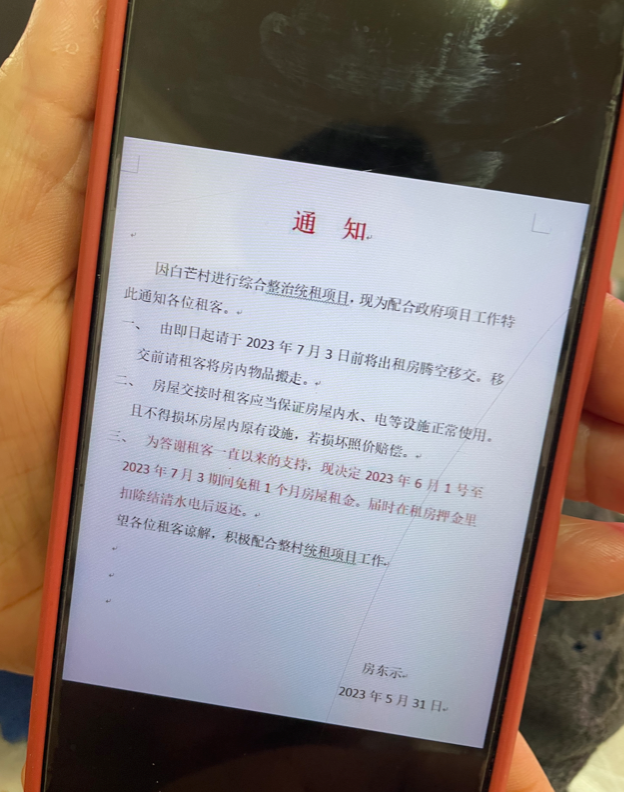
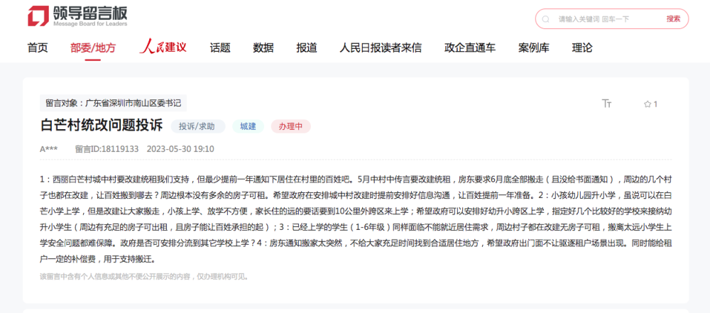
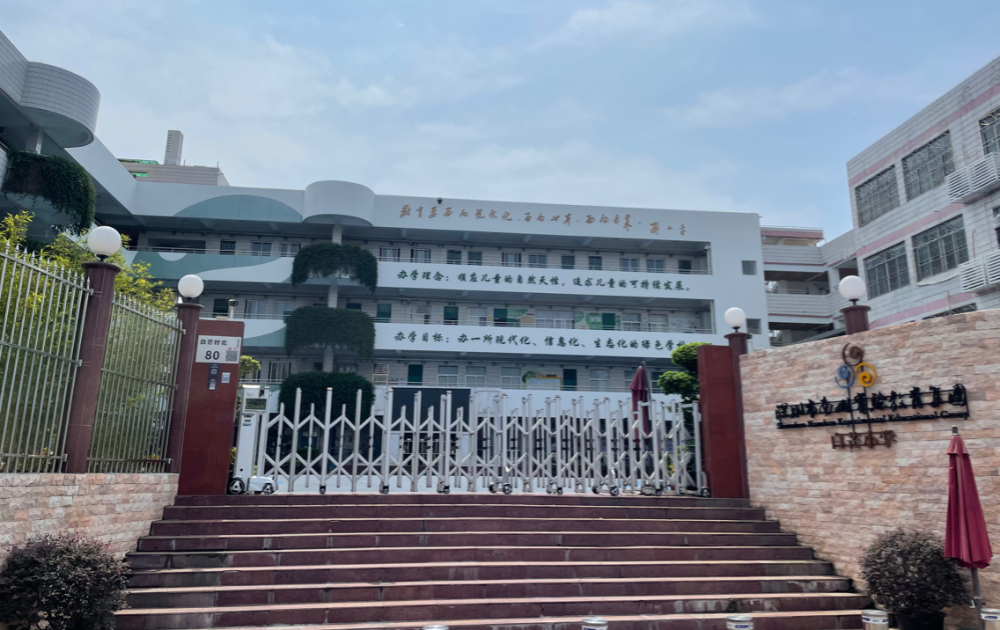
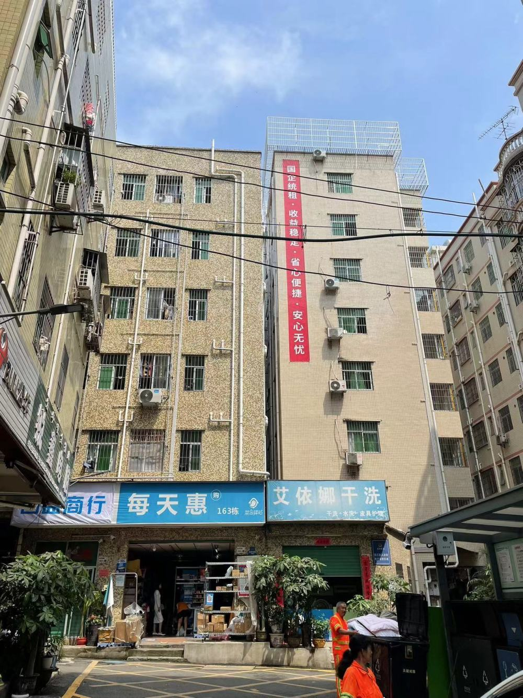

# 深圳一城中村统租改造：租客担心小孩上学难，称正式合同与宣传差别大

界面新闻记者|戈振伟

界面新闻编辑|林腾

“几万人说搬就搬，让我们搬到哪去？小孩上学怎么办？”面对突如其来的清退通知，6月1日，多位白芒村租客向界面新闻大湾区频道记者表示不满。

白芒村是位于深圳南山区西丽街道的一个城中村，有583栋房屋（含临建），与深圳一千多个城中村一样，白芒村的房租和生活成本相对低廉，它给了2万多人在一线城市站稳脚跟的机会，但在刚刚过去的5月，一则“白芒村统租”的消息把他们的阵脚彻底打乱。

统租，顾名思义是由政府统一收储城中村房源进行改造，以及周边配套升级，再进行出租。

这是深圳正在进行中的重大住房保障计划。《深圳市城中村（旧村）综合整治总体规划
（2019-2025）》提出，鼓励综合整治分区内的用地开展城中村综合整治类更新。规范引导各区在综合整治分区内有序推进城中村住房规模化统租改造，满足条件的可纳入政策性住房保障体系。

官方资料显示，为加快解决新市民、青年人等群体住房问题，官方提高了“十四五
”规划的任务目标，将建设筹集保障性住房原目标54万套（间）提高到不少于74万套（间），其中保障性租赁住房增加了20万套。具体到2023年，深圳提出要新开工建设60个项⽬，建设筹集16万套（间）。

在此背景下，统租目标指向了深圳城中村。

租客陆续收到清退通知，家长担心小孩无法上学

4月25日，深圳市南山区西丽街道办事处，在白芒村村口张贴了一则关于白芒村综合整治项目清统租补偿方案概要的通告，很多租客才知道他们所住的城中村也要实行统租。

统租意味着房屋改造之前，房东要先清退原有的租客。于是，在接下来的5月，白芒村的租客们陆续收到了房东发来的清退通知，陈萍（化名）便是其中一位，她在白芒村住了5年，经营着一家蔬菜水果店铺，整个5月她都处于焦虑之中。

5月31日，陈萍“终于”收到了通知，房东要求她7月3日之前将出租房腾空移交，作为补偿，房东给她免了一个月租金。

_图源：受访者供图_

但在陈萍看来，免租一个月对她来说是杯水车薪。她2019年接手目前经营的这家店铺花了十几万，生意刚刚开始就遇到三年疫情，一路过来基本是亏损经营，今年刚有些好转，现在又被要求搬离，一下子断了收入来源。

“所以就这样叫我走，我肯定会反对！”陈萍对记者说，“还有一个很重要的问题是小孩上学怎么办？目前他们也没给出一个明确的解决方案。这是很多家长非常关心的事情。”根据政策，深圳租房入学的都需要提前办理证明材料，而且大部分都要求提前一年。

记者了解到，白芒村租客的小孩很多就在村里的白芒小学就读，该小学隶属南山实验教育集团，2022年10月份公布的在校生是1510名。

5月30日，有网友在人民网“领导留言板”上就白芒村统租造成小孩上学不便的问题进行投诉。

6月2日，记者就上述问题致电白芒小学，校方工作人员回复称：“可能少部分学生会受到影响。”

记者也就上述问题致电白芒村综合治理项目现场指挥部办公室，其工作人员对记者表示：“对于那些搬走的租客，他们的小孩仍然可以在白芒小学就读，搬到就近的，到时会安排微型巴士接送；搬到远地方就读不便的，我们会把相关诉求反馈给南山区教育局，由上面统筹安排，尽最大程度去保障小孩上学不受影响。”

_白芒小学
拍摄：戈振伟_

项目主导公司是深汇通，多数房东还在观望

在记者采访的租客中，有的刚搬来白芒村两个月，有的已经在白芒村住了二十多年。白芒村由于距离地铁远，房租在南山区几乎最低，八九百块就能租到一个十多平米的单间，50平的两房一厅，租金大约在两三千。白芒村要统租的消息传开后，周边空置房源的租金立即上涨，单间租金平均上涨500-1000元。

“但实际上，即使你愿意花更多的钱也很难在周边租到房子，因为市场饱和了，除非搬到更远的地方。”华叔告诉记者。

华叔在白芒村住了二十多年，跟房东关系好，房东把三栋楼交给他招租运营，据他所了解到的情况，村里的房东对这次统租的积极性目前并不高，绝大多数还处于观望状态，带头配合的只是村里股份合作公司的工作人员。

“第三方公司给到的租金只是比现在的租金略高一点，并没有网上传的那么高，只是还有其他一些补偿奖励。”华叔说。

华叔所称的第三方公司，经记者求证，并非网传的深圳安居微棠住房租赁投资控股有限公司（市属国企人才安居集团旗下的城中村租赁公司），而是深圳市深汇通投资控股有限公司（下称深汇通）。白芒村村口的综合治理项目现场指挥部办公室就是由深汇通建的。

公开资料显示，南山区平山村的人才小镇清统租项目的投资建设方便是深汇通。

据南山区国资局，深汇通成立于2009年6月，是南山区国资局所属全资国有企业，注册资本金32.43亿元，公司的业务之一是参与辖区城市的更新改造。截至2022年12月31日，深汇通下属企业有37家。

5月31日，深汇通开始正式与白芒村房东签约。华叔表示，房东见到正式合同后感到很意外，因为合同里的一些条款跟之前意向协议书的内容出入很大，与之前宣传的不一样。

_拍摄：戈振伟_

根据合同，统租房屋的统租期限为15+5年，统租期限届满15年，再根据到时情况是否续租。对此，房东普遍还存在三点顾虑：合同是跟第三方公司签约，而不是跟政府签约，万一中途断供怎么办？合同期内如果政府要征收怎么办（白芒村片区处于西丽湖国际科教城区域）？合同期内万一自己去世怎么办（很多房东本身已经六七十岁）？

事实上，早在2018年，南山区就曾立下KPI，要在2020年完成32个城中村的综合治理，并且引入第三方统租运营城中村。

深圳经历了四十多年的快速发展，从人口不过几万人的一条小渔村，发展成为超千万人口的特大城市。伴随发展，城市开始包围自然村庄，农民转身成为房东，城中村由此诞生。

公开信息显示，深圳拥有约360平方公里城中村建筑，约占约20%土地⾯积，居住着超过1000万人口。⼀个最基本的共识是，城中村租住了大量深圳相对低收入的群体。

由于深圳外来人口中的低收入群体非常庞大，构成复杂，需求多样，其中包括在城市中寻求稳定、低成本创业等城市化所指向的发展需求，城中村无疑成为这类群体最佳的选择区域。根据深圳链家研究院的长期监测，实际租住城中村的比例可能达租赁总人口的60%—70%，居住约有1200万人。

广东省住房政策研究中心首席研究员李宇嘉认为，城中村统租本来是一项民生工程和民生实事，完全可以做得更好。首先应该做好统租片区供需评价和影响评估，即要统租一个项目时，要评估现有租客在周边是否有适宜的同类房源选择，以降低搬家的成本，尽量不影响其职住平衡的诉求。

当下，城中村是片区租金的稳定器，适应深圳外来人口的租赁需求，其“低租金、小户型、区位优”的原生特征，是对庞大低收入外来人口需求的自然匹配。即有什么需求就有什么供给，这是最好的安排。政府不应该用洁癖的眼光来看待所谓的低端和脏乱差。

“如果周边房源供应紧张，最好保持租赁供需现状，不要去安排统租了，以避免对现有的租赁生态造成冲击，导致短期内供需失衡和租金上涨。”李宇嘉说。

