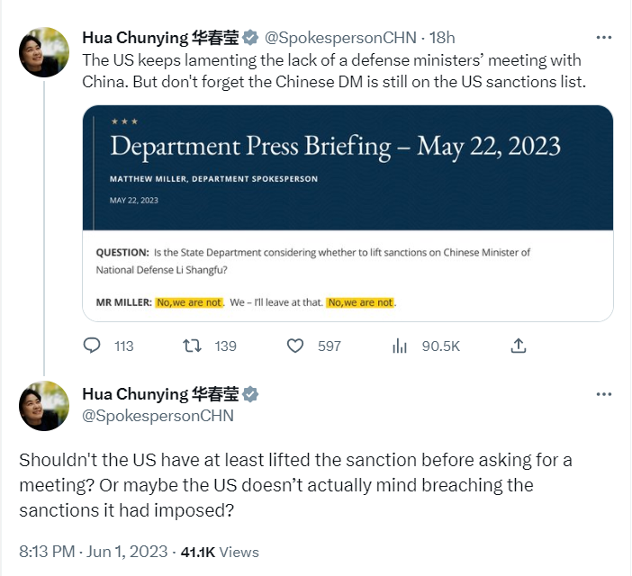

# 美一边实施制裁一边炒中国防长“拒见”美防长，华春莹驳斥

【环球网报道】中国外交部部长助理、发言人华春莹6月1日在推特上发帖，揭批美方一边对中国国务委员兼国防部长李尚福实施制裁，一边又炒作中方“拒绝”两国防长会晤的做法。

_华春莹6月1日在推特上所发帖子的截图_

华春莹当天先是转发了一张美国国务院5月22日记者会实录相关内容的截图。图片显示，有记者当时提问称，“美国国务院是否正在考虑解除对中国国防部长李尚福的制裁？”对此，美国务院发言人米勒称，“不，我们不（考虑）。这是我的回答。不，我们不（考虑）”。

对此，华春莹在配文中批驳说，“美国一直抱怨不能与中国举行国防部长会晤。但别忘了中国国防部长还在美国的制裁名单上”。她接着反问道：“美方在提出会晤之前不应该至少先解除制裁吗？或者也许美国实际上并不介意违反自己实施的制裁？”

近来美国一边表达与中国国防部长会晤意愿，一边缺乏沟通诚意、为沟通制造障碍。5月31日，对于美方炒作中方“拒绝”两国防长会晤提议相关问题，中国国防部新闻发言人谭克非表示，中方重视发展中美两军关系和开展各层级沟通，事实上两军接触交流并未中断。我想强调的是，对话不能没有原则，沟通不能没有底线。当前两军交流面临的困难，责任完全在美方。美方一方面口口声声要加强沟通，另一方面又不顾中方关切人为制造障碍，严重破坏两军互信，这不是致力于沟通的应有态度。当前，美方要以实际行动展示诚意、纠正错误，为双方沟通交流创造必要条件和应有氛围。

此前一天（5月30日），在中国外交部举行的例行记者会上，有记者提到，美国防部称，中方“拒绝”美方有关在新加坡举行两国防长会晤的提议。分析人士称，其原因或许是美方对中国防长的制裁。对此，中国外交部发言人毛宁表示，当前，中美两军对话面临困难的原因美方是清楚的。美方应当切实尊重中国的主权、安全和利益关切，立即纠正错误做法，展现诚意，为中美两军对话沟通创造必要的氛围和条件。

