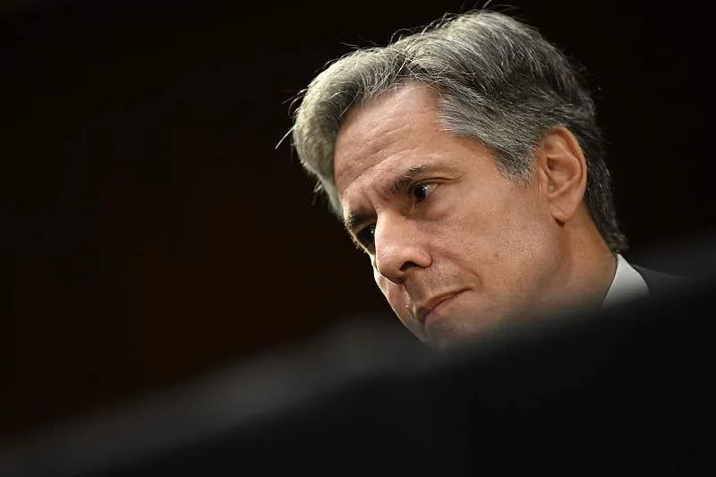
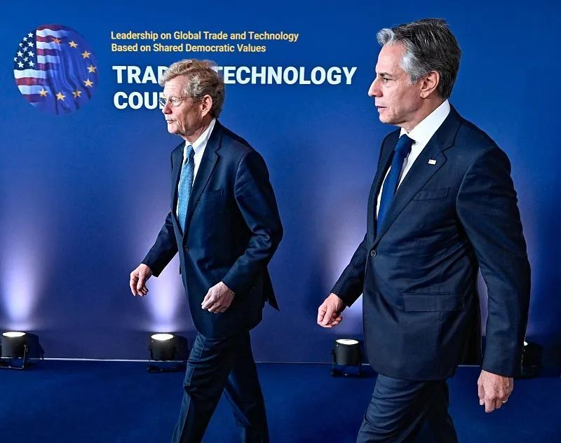
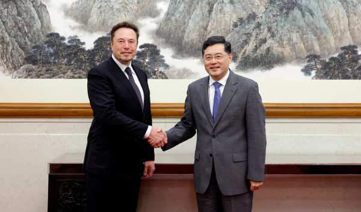
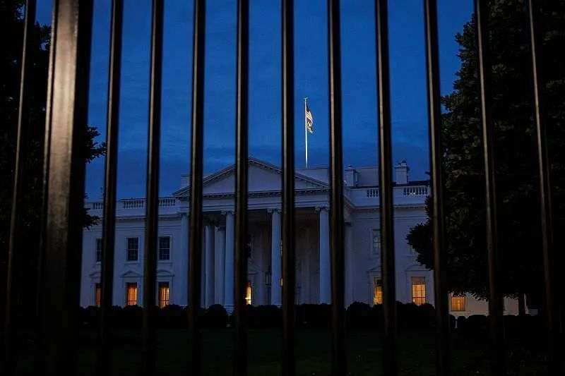

# 美国对华用新词：“脱钩”改成“去风险”，三个细节不容忽视

最近一段时间，“去风险”取代“脱钩”，成为西方政客谈论对华政策的新热词。

“去风险”（De-risking）为何突然火了？这一表述率先由欧盟委员会主席冯德莱恩使用，她在今年3月底阐述对华政策时，首次抛出了对华“去风险”的概念。

长安街知事（微信ID：Capitalnews）注意到，美国政府也频繁使用“去风险”的论调。七国集团（G7）峰会公报称，致力于对华“去风险化，而不是脱钩”。

5月31日，美国国务卿布林肯再次鼓吹“去风险”。他在出席“美国一欧盟贸易和技术理事会”部长级会议后对记者称，美欧对华不寻求对抗、冷战或“脱钩”，而是聚焦“去风险”。

_布林肯资料图。图源：视觉中国_

从之前的“脱钩”到现在的“去风险”，美国对华政策措辞变化背后，有三个细节不容忽视——

1、“脱钩”太硬、“去风险”稍软，美国换个话术目的仍是纠集盟友对付中国。

从首次提出，到广泛使用，“去风险”这词出现仅仅不到两个月的时间。

什么是“去风险”？具体是指哪些“风险”？上海社科院国际问题研究所副研究员吴其胜指出，美西方并没有详细界定“风险”具体指的是什么，但结合欧盟过去几个月里发布的一些文件来看，欧洲领导人当时提出“去风险”主要指两个方面：一个是经贸领域降低对中国的依赖，寻求所谓“多元化”；一个是希望限制部分领域的对华经贸往来，削弱中国在高技术领域和安全方面的能力。

吴其胜认为，美国使用“去风险”一词，只是姿态上的软化。过去几年，美国一直积极推动部分领域对华“脱钩”，但“脱钩”很大程度上依赖与盟友特别是欧盟的合作。欧盟不愿对华“脱钩”，不想完全追随美国，所以当欧洲领导人提出“去风险”时，美国积极接过这一表述，以此作为统一盟友立场的手段。

_5月31日，“美国一欧盟贸易和技术理事会”部长级会议在瑞典举行。图源：视觉中国_

德国《明镜》周刊日前评论称，“去风险”是西方粉饰其分歧的一个“魔法词汇”，与中国打交道，“去风险”会适得其反。

无论是“脱钩”，还是换一个“去风险”的马甲，本质上都是服务美国的私利。

中国人民大学重阳金融研究院院务委员兼合作研究部主任、研究员刘英告诉长安街知事（微信ID：Capitalnews），美国推动对华“脱钩断链”失败，就换个词来用，但换汤不换药，还寄希望于用所谓“去风险”来团结盟友一起对华，掩饰其“去中国化”的本质。所谓“去风险”，就是企图把供给冲击以及产业链供应链冲击作为“风险”戴在中国头上，以此来纠集盟友对付中国。

美国搭建各种“小圈子”，博得他国支持，搞“友岸外包”“近岸外包”，试图假借“印太新经济框架”等去中国化并试图构建与中国平行的产业链供应链，说白了还是以美国利益为核心，要求其他国家服从美国利益，这是美国霸权的具体体现，希望联合其他国家一起对付中国，但实际上是完全无法实现的。

当前，美胁迫盟友对华脱钩已招致多国不满。奥地利一份智库研究报告估算，如果对华脱钩，德国一年GDP将下降2%，相当于损失600亿欧元。法国总统马克龙表示，欧中双方应共同努力，不掉入“脱钩断链”陷阱。

2、“去风险”只是部分政客话术，美欧企业家已用脚投票。

一面是美国政府声嘶力竭地鼓动企业与中国“脱钩”“去风险化”，一面是美企高管们纷至沓来。

今年以来，在中美关系经历复杂困难的时刻，苹果、摩根大通、通用汽车等美国大企业高管纷纷访华，特斯拉公司首席执行官马斯克更是强调“美中利益交融，如同连体婴儿彼此密不可分”。

就在马斯克访华首日，特斯拉股价应声上涨，时隔半年，马斯克重新获得了世界首富的头衔。他们用实际行动“打脸”了美国政府大肆宣扬的所谓“去风险”。

_5月30日，国务委员兼外长秦刚在北京会见特斯拉首席执行官马斯克。图源：外交部网站_

“中国风险何在？风险绝非来自中国。”刘英举例指出——

中国是全球经济增长的稳定器、发动机和增长源，这是毫无疑问的。10年来，中国经济对全球增长的贡献率达到了38.6%，中国的制造业在全球的占比和贡献超过了后面美德日等六国的总和。
**中国风险何在？**

中国有14亿多的人口，是全球第二大市场，马上就要赶超美国成为全球最大市场，中国也是世界货物和服务贸易第一大国，是140多个国家和地区最主要的贸易伙伴。
**中国风险何在？**

中国没有向全球输出通胀，也没有向外输出所谓加息带来负面溢出效应，或者是向外输出危机。 **中国风险何在？**

中国倡导全球发展倡议、全球安全倡议和全球文明倡议，共建“一带一路”倡议提出10年来，同150多个国家和30多个国际组织签署合作文件，拉动上万亿美元投资规模。
**中国风险何在？**

这样的中国，是机遇而非风险，是未来而非过往，是增长源而非危险源。正如国务委员兼外长秦刚近日所说，如果以“去风险”之名行去中国化之实，那就是在去机遇、去合作、去稳定、去发展。

3、“风险”还是“机遇”世人自有公论，试图包围长江黄河的最终只会让自己干涸。

6月1日，中国外交部发言人毛宁在例行记者会上指出，世界面临的真正风险是搞阵营对抗、“新冷战”；是肆意干涉别国内政，制造地区动荡混乱；是将经贸科技问题政治化，破坏全球产供链稳定；是对外转嫁经济金融风险，周期性收割世界财富。国际社会应该警惕和共同抵御的是这些风险。

_5月28日，黎明时分的美国白宫。图源：视觉中国_

“风险恰恰来自美国。”刘英说，“从搞阵营对抗、‘新冷战’，到对冲突地区输出武器、火上浇油，再到对其他国家无端制裁、长臂管辖，美国将‘风险’的矛头对准中国，是以小人之心度君子之腹，风险就是它自己。”

刘英指出，美国在没有任何事实依据的情况下，将1200多中国企业和个人列入实体清单，实施各种限制与制裁。美国对俄罗斯、伊朗、古巴等国随意制裁，带来地缘政治风险。美国乱发货币带来通胀外溢后，又激进加息10次，抑制世界经济增长，导致土耳其股债汇“三杀”，不少国家债务风险高企。从大水漫灌对全球输出通胀到输出通缩，带来债务和金融风险。

谁是“风险”，谁是“机遇”，世人自有公论。无论是“脱钩”还是“去风险”，还是之后可能出现的新话术，贴近中国市场是大势所趋，始终不可逆转。

外交部部长助理、发言人华春莹近日在推特上发文指出，“去风险”实际上就是“脱钩”，这就像其他河流试图包围和孤立长江黄河，“最终只会让自己干涸”。

