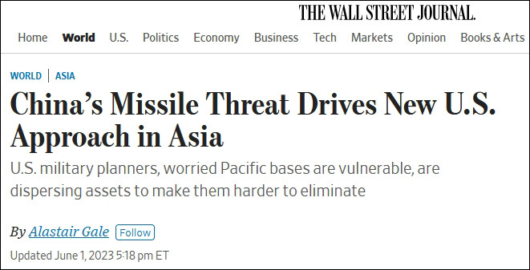

# 美媒：美军正将武器装备分散到亚太小基地，避免遭中国“决定性打击”

（观察者网讯）

“中国导弹威胁推动美国在亚洲的新方针”，《华尔街日报》6月1日以此为题再度炒作所谓中国军事挑战，声称随着中国导弹库规模扩大、技术变得先进，美国正通过将武器装备、部队和指挥所分散到在亚太国家各个较小的美军前哨基地，让北京更难通过削弱任何单一的军事设施进行“决定性的打击”。

报道称，在过去几十年间，美国在亚洲的关键存在一直以大型军事基地为主，但随着中国军力日益增强，这些基地越发“岌岌可危”。美智库新美国安全中心（CANS）高级研究员托马斯·舒加特声称：“鉴于中国人民解放军火箭军在过去几年里能力突飞猛进，其对固定基地的威胁显而易见。”

报道进一步渲染道，美国安全分析人士最近针对台海地区等进行的战棋模拟，普遍假定中方将试图在冲突早期摧毁美国的主要设施，其中就可能包括嘉手纳空军基地。这是美国在亚太地区最大的空军基地，位于日本冲绳岛，拥有超过40亿美元的军事资产，包括喷气式战斗机和其他设备。

_《华尔街日报》报道截图_

《华尔街日报》称，出于对这种可能性的担忧，“反华急先锋”、佛罗里达州共和党参议员卢比奥今年5月向美国国会提交了一项议案，呼吁美军方为其在亚洲的飞机建造更坚固的掩体。不过，美空军高层表示，仅靠新掩体并不能解决问题。他们正在优先考虑一种“轴辐模式”，这种模式可以将许多飞机从大型基地转移到一系列较小的设施，尤其是当冲突迫在眉睫的时候。

报道称，美国空军正在为此组建小分队，以便在需要时迅速将偏远岛屿上的简易机场等地点转变为军用飞机的临时基地，届时将有“空中机动队”将被空降到这些地点，负责快速准备跑道和建立加油点等基础设施。美国空军远征中心就正在参与这种小分队的创建，该中心指挥官约翰·克莱因称，这是为了让解放军的决策“变得复杂”。

为了避免“把鸡蛋放在同一个篮子里”，美军也在着手建立更广泛的军事基地网络。今年4月，菲律宾便对美国新开放了4个军事基地，其中有三处位于北部吕宋岛，最近的一个距离台湾岛仅约400公里，另一处则位于该国西部，面朝南海。报道称，在亚太建立更多小型基地还可以使美军在可能需要的地方就近部署军事资产，缩短反应时间，这种战略被称为预先部署。

报道指出，美国也正朝在澳大利亚部署更多军事资产的方向迈进，包括联合开发澳大利亚北部的机场以支持美国飞机增加轮流部署。在位于关岛附近的美国管辖的提尼安岛上，一个机场正进行升级，以容纳军用飞机。此外，美国最近与南太岛国巴布亚新几内亚签署的一项国防合作协议也或能让美方获准使用该国设施。

不过，也有一些军事战略家警告称，
如果个别地点的防御能力较弱，可能被少量导弹摧毁，那么分散部署可能使美军更脆弱。如果军队分散，后勤和行动方面的挑战可能也会增加，包括与控制中心的沟通。报道还提到，从更多的国家开展行动可能带来其他复杂的问题，例如与东道国政府的协调。值得一提的是，菲律宾总统马科斯已明确表示，菲律宾美军基地不能用于进攻性军事行动。

针对西方国家炒作所谓中国军事威胁，中方此前在多个场合表示，中国奉行防御性的国防政策，坚持走和平发展道路。国务院2019年发布的《新时代的中国国防》白皮书中写明，中国的国防建设和发展，始终着眼于满足自身安全的正当需要，始终是世界和平力量的增长。历史已经并将继续证明，中国决不走追逐霸权、“国强必霸”的老路。无论将来发展到哪一步，中国都不会威胁谁，都不会谋求建立势力范围。

**本文系观察者网独家稿件，未经授权，不得转载。**

