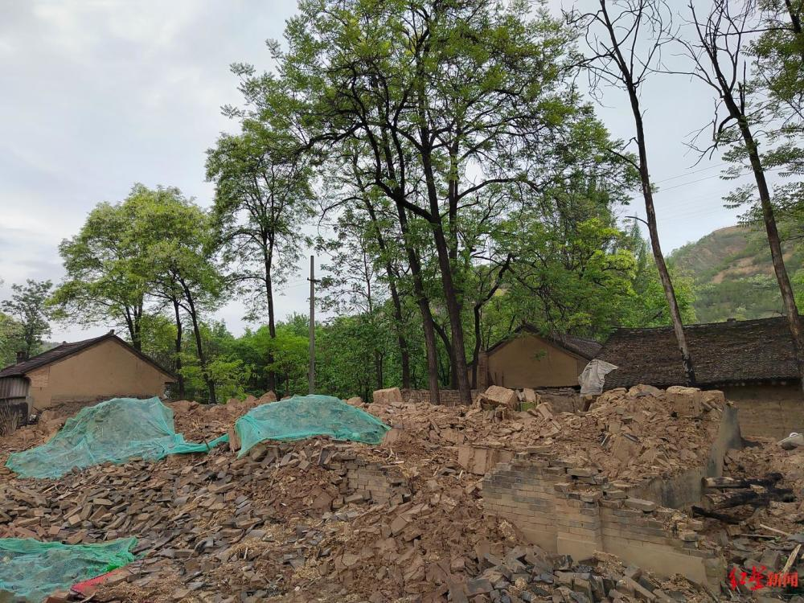
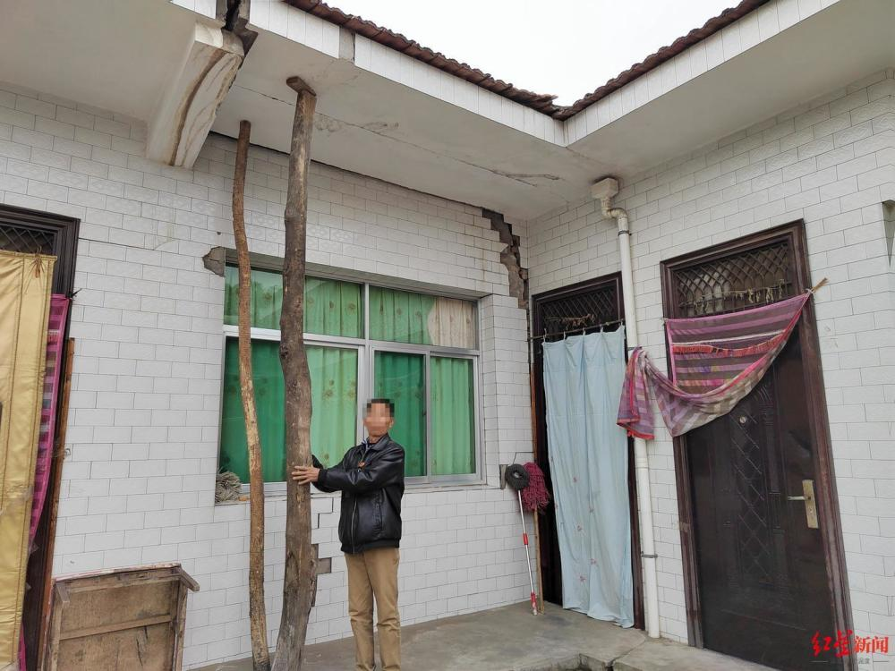

# 陕西彬州煤矿开采致村民房屋开裂 当地回应：7年前部分村民嫌补偿少不肯搬迁，非征地拆迁

近期，陕西彬州市有村民在网上发布视频称，自家房屋墙面由于当地煤矿开采出现裂缝，白灰大面积脱落，甚至有些地砖都鼓了起来。

视频反映的情况位于彬州市义门镇，记者日前在当地探访时注意到，除了部分已经拆除的房屋，当地仍有居民住在出现裂缝的房子里。义门镇高渠村有村民表示，不是不想搬迁，而是当地提供的补偿太少。

_↑村民发视频称彬州某地房屋因采煤开裂_

据了解，根据当地最新政策，一家五口人，按居住面积200平米来算，大概可以拿到26万元补偿款。但村民认为，目前彬州市房价在6000元左右，老家上百平米的房子拿到的补偿款也只能买到市里四五十平米的房子。

对于补偿标准偏低的问题，义门镇副镇长刘明称，按照2016年搬迁启动时的标准，如果村民当时签署搬迁协议，在彬州市能够买得起房。“当时彬州市房价每平米只有2000元，现在已经变成6000元了。”彬州市委宣传部也表示，7年前的标准在当时看并不算低，只是放到现在有些低了，所以新政策中每平米又加了200元，并为每个人多争取了2万元。

**“老家的房子不能住了，裂缝严重得很”**

近日，陕西彬州有村民发布视频称，由于当地地下煤炭开采，自家房屋出现裂缝，尤其是下雨的时候，房子会出现漏水，非常危险。

在彬州市义门镇高渠村的探访中，红星新闻记者看到，高渠村马路两边有些房子由于年久失修已经出现垮塌，公路路面有塌陷的地方。一些村民告诉记者，房屋开裂是近些年出现的情况，他们认为是由于当地煤矿开采所致。2016年，当地出台了搬迁方案，并对涉及的房屋价值进行了评估。

_↑高渠村公路旁拆除的老房子_

高渠村二组组长、村民徐治中告诉红星新闻记者，他们组上有80多户，2016年，第一批搬迁并获得补偿的有40多户，其中有5户房子的裂痕比较严重，“这些拆掉的房子有些是上世纪八九十年代的，有些是2010年左右盖的，拆掉的房子大部分是闲置房。”

部分家中房子开裂的村民目前仍住在村里，其中也包括徐治中家。他告诉记者，他家房子至今还没有拆除，开裂的地方用两根木棍支撑着，“现在就是愿意拆就拆，不愿意拆也没有强拆。”

_↑高渠村有村民的房屋开裂后用木棍支撑_

引发关注的多条视频是高渠村池先生（化名）发布的，他对记者表示，发视频是想呼吁政府赶快处置搬迁问题。“现在盖房子也没地方，村里有些人在县城租房住，老家的房子开裂了根本没法住进去，有些房子支了个木棍撑着。”

徐治中则称：“都说下面是采空区，但应该做个详细调查，看哪些房子能拆哪些不能拆。”他说，老一辈在这儿住了几百年，如果周边有安置的地方，他很愿意留下来。

另一位村民徐孝义则称，自己这几年就在彬州市打工，“老家的房子也不能住了，裂缝严重得很。”徐孝义说，自己在彬州租了个十多平米的房子，每月支付租金300多元。

**村民称搬迁补偿款太低，在城里买不起房**

对于难以搬迁的原因，有村民表示不是不想搬迁，而是政府补偿金额太少。

据徐治中介绍，按照去年底当地搬迁补偿的新政策，评估价格在2016年的基础上每平米增加了200元，即楼板房每平米补偿900元、砖木房每平米800元、土木房每平米700元，防水隔热的地方每平米额外补偿200元。此外，“原来没有人头费，去年底拆的时候按照每人补助2万元执行。”

但在徐治中看来，有些裂缝的房子解决不了，是因为“拆了之后就买不起房子了”。

池先生则称，现在义门镇房价每平米2000多元，彬州市每平米6000多元，“让人家到哪儿去买房？”他认为这个补偿标准太低。

_↑高渠村有村民房屋出现明显裂缝_

据了解，池先生家在高渠村有两套房子，一套在父母名下，一套是自己的，2016年村里启动拆迁时，池先生父亲签订了搬迁协议，获得了60%的补偿款，大概十万元左右，此后由于房子没有拆掉，剩下的40%尚未到账。池先生自己则没有签署搬迁协议。

池先生还认为，按照我国《土地管理法》第48条，“征收土地应当给予公平、合理的补偿，保障被征地农民原有生活水平不降低、长远生计有保障。”他表示，不要求政府把村民安置到城里，只要在镇上就行。

村民徐孝义也告诉红星新闻，他当年拿到了六成补偿款，但最后没有同意拆房。他表示，当时房子坍塌很严重，2016年左右拿了十来万补偿款，打算在彬州买房子，但只能买五六十平米，最后他决定在彬州租房居住。

**当地回应：此前标准不算低，后为每人多争取了2万元**

对于村民反映的问题，记者联系上了当地有关部门。义门镇镇长房鹏程告诉记者，在2016年的搬迁方案中，“按照当时市场情况，每平米补偿（土木房）500、（砖木房）600、（楼板房）700元，另外一户补偿5.5万元，这里面有3万元是用于宅基地退出，交回村集体。”

据介绍，2021年，镇上再次启动搬迁遗留问题，以奖代补，每户每平米在原有基础上增加200元，此外每人又增加了2万元的人头费。“这个人头费只有他们村上有，镇上其他地方都没有，是后来政府向煤矿争取的。”房鹏程说。

义门镇副镇长刘明认为，按照2016年的标准，如果村民当时把搬迁协议签了，在彬州市能够买得起房，“当时彬州市房子每平米只有2000元，现在已经变成6000元了。”

彬州市委宣传部也告诉记者，2016年的补偿标准在当时并不算低，只是放到现在有些低了，所以政府向煤矿上争取资金，每平米又加了200元，每个人争取了2万元的人头费。

对于为何不在高渠村附近开辟新的宅基地，房鹏程解释说，由于地下是采空区，所以不会再开辟新的宅基地，“二次搬迁问题更大。”彬州市委宣传部则表示，高渠村的房子没有强拆，但拿到60%补偿款后要求7个工作日拆完，“不拆的话也不行，因为采空区不能住人。”

至于村民池先生所说的“征收土地应当给予公平、合理的补偿”，分管当地采空搬迁工作的义门镇武装部部长马光辉指出，采空搬迁与征地搬迁是两个概念，如果是征地搬迁，农民失去土地，肯定会提供安置房；而采空搬迁，房子拆除之后，相关土地仍然由农民承包使用，与征地搬迁有本质不同。

刘明补充说，如果是征地拆迁，会有征地公告、拆迁公告，但采空区是房屋拆除之后进行复垦，把土地再交给农民，所以没有发布征地公告，“近些年政府一直在做工作，跟煤矿协调，已经为村民又争取来了一些利益。”

而对于池先生家的情况，房鹏程向记者证实，池先生父亲当年签订了搬迁协议，拿到了60%的补偿款10万余元，等拆迁完毕时再划拨剩余40%的款项。2017年元月，其父亲在彬州市买了一处105平米的商品房，当年3月份房屋交付。但是池先生父亲的房子到现在还没有拆除。

至于池先生提到的自己的房产，刘明给记者展示的搬迁记录显示，有村民证实，2012年，池先生在自家自留地盖了一处房屋，目的是为了拿到附近道路扩路的赔偿，但盖房未获批复，扩路也没有影响到该处房屋。还有村民证实，池先生后来盖的房屋属于违建，自始至终没有住过人。

池先生在回应此处房屋是否属于违建时称，当地村民没有宅基地证的有很多，“我父母的房子从我爷爷就开始住，宅基地证也是前几年才发的。”池先生表示，这些是历史原因造成的。

目前，彬州市下属乡镇搬迁补偿问题仍在处理中。

红星新闻记者 卢燕飞 发自陕西彬州

编辑 张寻 责编 冯玲玲

