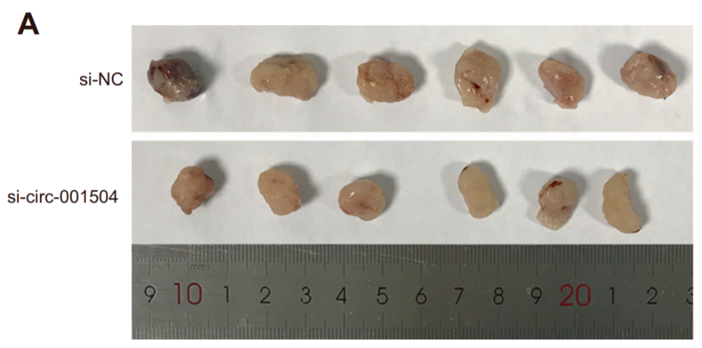
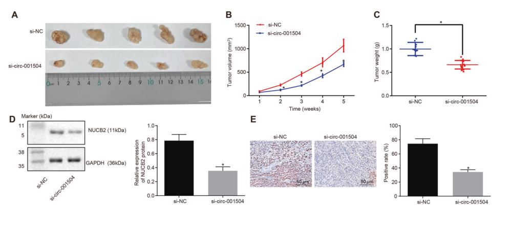
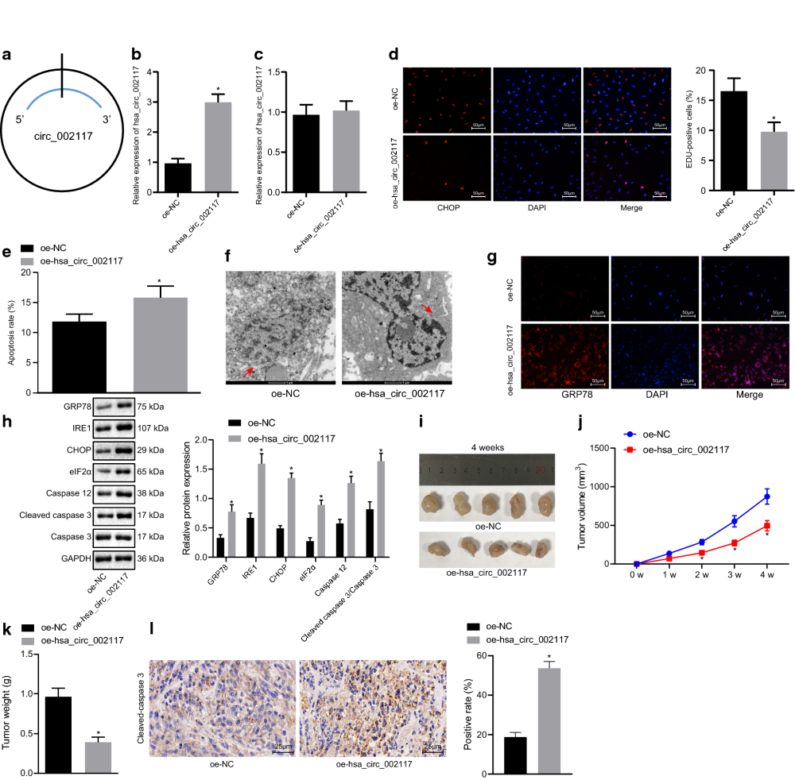
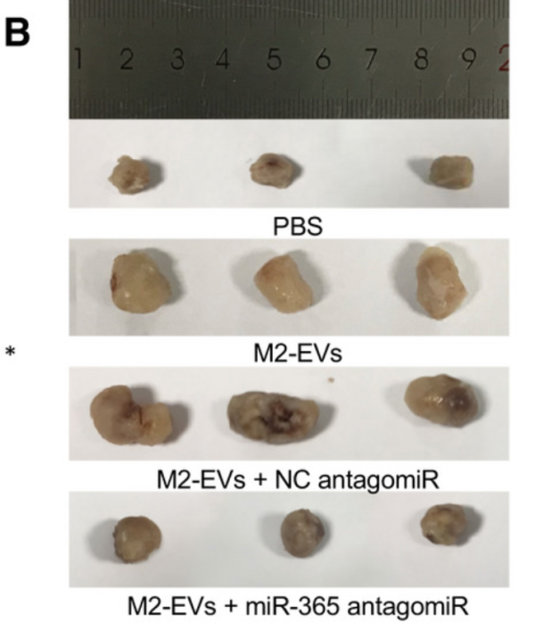

# 4篇论文现同一划痕钢尺3篇遭撤稿，涉吉林大学、兰州大学、青岛大学

一把带划痕的可疑钢尺，或成为识别4篇不同署名、不同期刊的论文中研究数据疑似同一来源——由一家“隐身”外部实验室或第三方机构“出品”——的关键证据。

该钢尺引发的质疑和调查，已导致4篇论文中的3篇被撤回，分别涉及吉林大学、兰州大学第一医院和青岛大学附属医院。

剩余一篇暂未被撤回的论文涉及兰州大学第一医院。

**吉林大学一研究论文因钢尺图像被质疑，更正一年半后撤稿**

5月29日，国际学术期刊《肿瘤的基因治疗》（Cancer Gene
Therapy）发布撤稿说明称，因论文图片中一把可疑的带有划痕的钢尺图像，该期刊3年前发表的1篇论文中的研究数据遭到质疑。这把钢尺还先后出现在另外3篇不同署名作者、不同期刊的论文中。

《肿瘤的基因治疗》期刊目前已撤回涉事论文。该论文的通讯作者是吉林大学公共卫生学院放射医学系辐射防护学教研室教授陈大伟。

_这把带有划痕的钢尺还先后出现在另外3篇不同署名作者、不同期刊的论文中。目前4篇论文已被撤回3篇。_

涉事论文的标题是《环状RNA (circRNA) circ_001504通过吸附microRNA-149来增加NUCB2
从而促进肾细胞癌的发展》（circ_001504 promotes the development of renal cell carcinoma by
sponging microRNA-149 to increase NUCB2），于2020年10月27日在线发表。

相关可疑钢尺的图片出现在该论文的 **图6A** 中。

《肿瘤的基因治疗》期刊的撤稿说明称，主编撤回了前述论文。涉事论文发表后被发现文中图6的尺子图像，似乎与其他不相关作者的其他论文，比如论文
**“1”“2”“3”**
里相关图片中的尺子图像相同。因此，人们对涉事研究数据的完整性产生了担忧。涉事论文的作者们没有应期刊要求进行回应以便澄清。他们也没有提供相关基础研究数据或伦理批准的证据。因此，期刊主编对该论文中的研究发现的完整性不再抱有信心。涉事论文的作者们没有回复编辑关于这次撤稿的任何信件。

吉林大学公共卫生学院官网显示，陈大伟系吉林大学公共卫生学院辐射防护学教研室成员、教授，但更详细信息已被删除。

中华预防医学会放射卫生专业委员会官网2022年2月发布的消息显示，陈大伟系中华预防医学会放射卫生专业委员会第五届常务委员。

吉林大学白求恩第一医院官网2023年4月发布的信息显示，陈大伟系吉林省核学会理事长。

_2021年12月30日，涉事论文对图3进行更正，图3A中的钢尺被替换。但一年半后，涉事论文仍然被撤回。_

涉事论文于2020年10月27日在线发表。一年后，2021年12月30日，涉事论文更正称，论文发表后，作者对原始实验结果进行了复核，发现由于原始结果没有经过适当的分析，裸鼠肿瘤移植实验的记录和统计结果存在错误。
**因此，图6被更正修改。** 虽然之前的实验记录与统计结果存在误差，但不影响整体结论，整体结果描述是一致的。

前述更正声明发表一年半后，涉事论文仍然因为图6引发并加重的质疑被撤回。

涉事论文研究了circ_001504/miR-149/NUCB2反馈回路在肾细胞癌治疗中的作用。尽管多年来治疗肾细胞癌方法稳步改进，但预后结果仍然很差。该论文的研究数据提示circ_001504可能作为miR-149的竞争性内源性RNA；通过吸附miR-149降低NUCB2的表达，从而降低circ_001504的表达，能够衰减肾细胞癌(RCC)的进展。

但因其研究数据的完整性遭到质疑，该论文目前已被撤回。

**4篇“钢尺”论文已撤回3篇，分别涉兰州大学第一医院、青岛大学附属医院**

值得注意的是，前述撤稿声明中提及的另外3篇论文中两篇也已被撤回。这些所有被提及及被撤回的论文中都出现了似乎是同一把的钢尺，因为这些图片中的钢尺带有的划痕似乎完全相同。

因此，在论文发表后评议网站PubPeer上，有用户评论称，上述论文的部分数据可能由承接外包业务的第三方或外部实验室提供，但相关论文的“作者贡献”声明却未提及任何外部来源。而这样的匿名是不负责任的，因为它们可能编造数据。

另一篇被撤回的论文“ **1** ”的通讯作者是 **兰州大学第一医院**
肿瘤外科主任医师、教授关泉林。涉事论文标题是《Circ_002117结合microRNA-370，促进内质网应激诱导的胃癌细胞凋亡》（Circ_002117
binds to microRNA-370 and promotes endoplasmic reticulum stress-induced
apoptosis in gastric cancer），于2020年9月25日在线发表在国际学术期刊《国际癌细胞》（Cancer Cell
International）上，于2022年12月13日被撤回。

_撤稿说明称，图3I中存在违规行为。_

相关可疑钢尺的图片出现在该论文的 **图3i** 中。

相关撤稿说明称，主编们撤回了这篇文章。图3I和图5H中存在违规行为，导致人们对本文结果的完整性失去信心。关泉林（Quanlin
Guan）不同意此次撤稿。其他作者没有回应出版商关于这次撤稿的信件。

兰州大学第一医院官网显示，关泉林主要从事消化道肿瘤的临床及基础研究，尤其对胃癌的诊治有独到之处；现为兰州大学第一医院肿瘤外科主任；甘肃省卫生健康委甲级重点专科负责人，兼任中华医学会肿瘤分会委员。

第3篇被撤回的论文“ **2** ”的通讯作者是 **青岛大学附属医院**
泌尿外科病区副主任、副教授、副主任医师杨学成。涉事论文标题是《间充质干细胞来源的外泌体 microRNA-139-5p 通过靶向 PRC1
抑制膀胱癌的肿瘤发生》（Mesenchymal stem cells-derived exosomal microRNA-139-5p restrains
tumorigenesis in bladder cancer by targeting
PRC1），于2020年10月29日在线发表在国际学术期刊《致癌基因》（Oncogen）上，于2023年5月30日被撤回。

_撤稿说明称，图7中出现的钢尺图像与不相关作者在其他文章中使用的钢尺图像相同。_

相关可疑钢尺的图片出现在该论文的图 **7C** 中。

相关撤稿说明称，涉事论文图7中出现的钢尺图像与不相关作者在其他文章中使用的钢尺图像相同，这导致人们对涉事论文数据的完整性产生担忧。作者没有回应澄清的请求，也没有提供基础数据或伦理批准的证据，没有回复期刊编辑关于本次撤回的任何信件。

青岛大学附属医院官网显示，杨学成擅长泌尿生殖系统肿瘤的微创治疗，对肾脏肿瘤、膀胱肿瘤、肾上腺肿瘤、前列腺增生、泌尿系结石等疾病的微创手术具有丰富经验，参与多项国自然基金项目，省级课题2项，发表SCI论文多篇。其学术兼职包括中华医学会泌尿外科学分会青年委员会微创学组委员等。

被前述《肿瘤的基因治疗》期刊撤稿说明提及，但尚未撤回的论文“ **3** ”的署名通讯作者是“兰州大学第一医院普外科”、“兰州大学第一临床医学院”周文策。

公开资料显示，周文策现任 **兰州大学第二医院**
（第二临床医学院）副书记、院长，兼任中华医学会消化内镜学分会大数据协作组委员等职，任《中华消化内镜杂志》、《World Journal of
Gastrointestinal Endoscopy》、《癌症杂志》、《肿瘤防治研究杂志》、《临床肝胆病杂志》、《肝胆胰外科杂志》等期刊编委或审稿人。

_该图片的钢尺被质疑也出现在另外3篇不同的论文中。_

涉事论文的标题是《M2巨噬细胞来源的细胞外囊泡分泌的miR-365通过BTG2/FAK/AKT轴促进胰腺导管腺癌进展》（miR-365 secreted
from M2 Macrophage-derived extracellular vesicles promotes pancreatic ductal
adenocarcinoma progression through the BTG2/FAK/AKT
axis），于2021年4月3日在线发表在国际学术期刊《细胞与分子医学杂志》（Journal Of Cellular And Molecular
Medicine）上。相关可疑钢尺的图片出现在该论文的 **图6B** 中。

**附涉事论文的链接或相关撤稿说明的链接：**

吉林大学涉事论文的链接：https://www.nature.com/articles/s41417-020-00247-8

撤稿说明的链接：https://www.nature.com/articles/s41417-023-00630-1

论文“1”的链接：https://cancerci.biomedcentral.com/articles/10.1186/s12935-020-01493-4

论文“1”撤稿说明的链接：https://cancerci.biomedcentral.com/articles/10.1186/s12935-022-02826-1

论文“2”的链接：https://www.nature.com/articles/s41388-020-01486-7

论文“2”撤稿说明的链接：https://www.nature.com/articles/s41388-023-02726-2

论文“3”的链接：https://onlinelibrary.wiley.com/doi/10.1111/jcmm.16405

