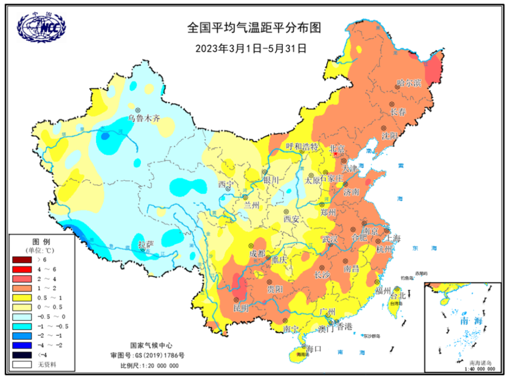
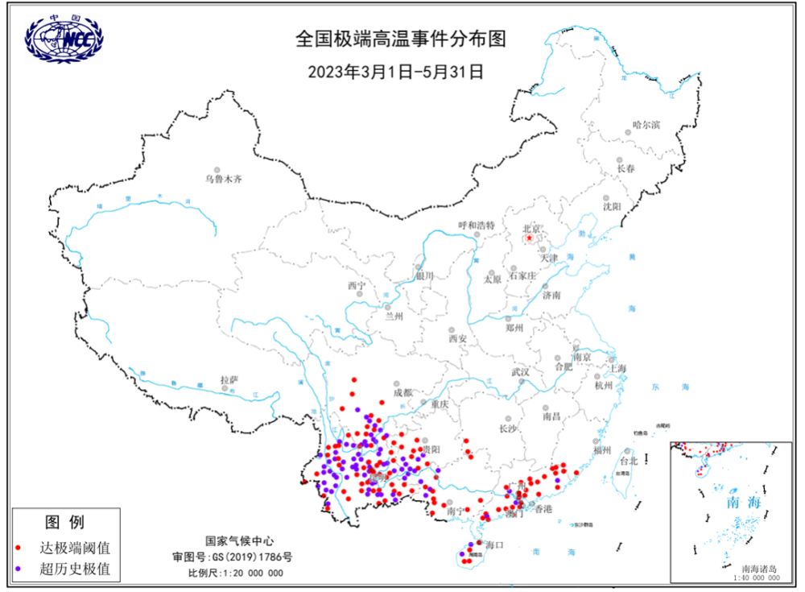
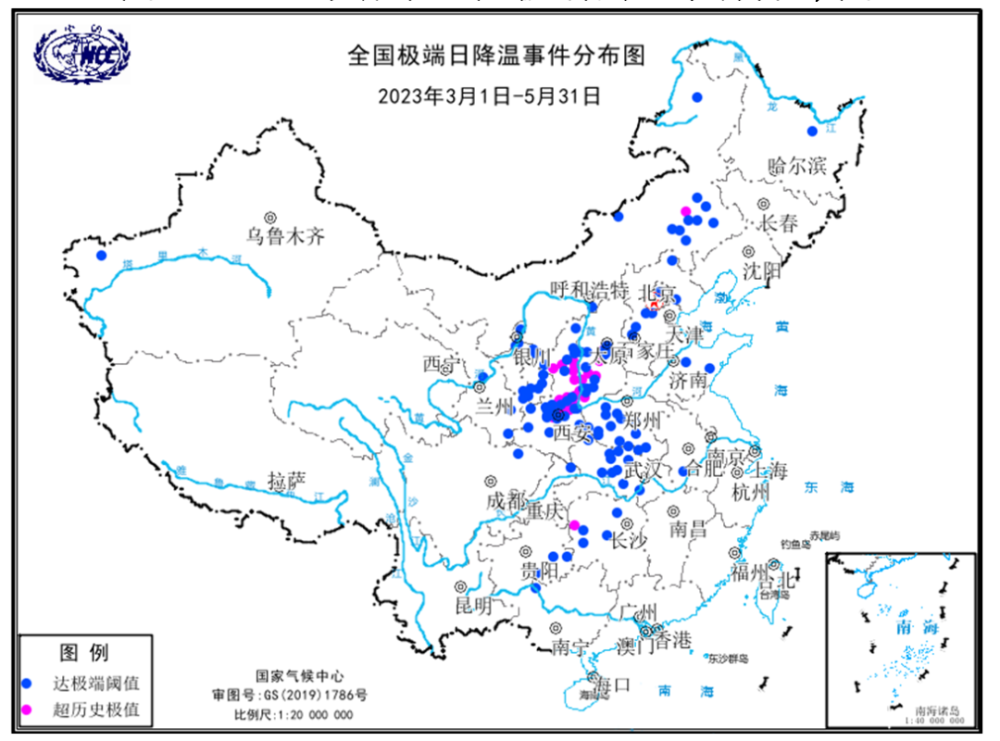
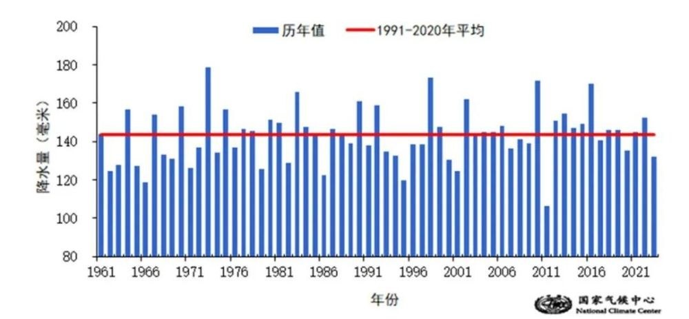
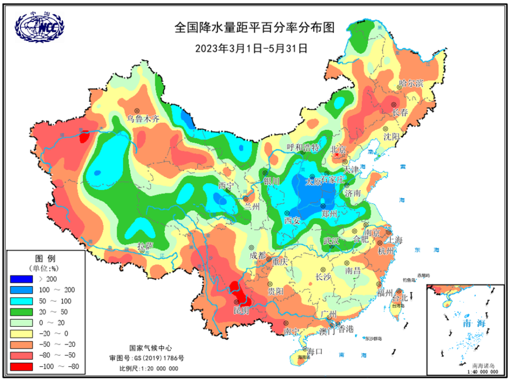
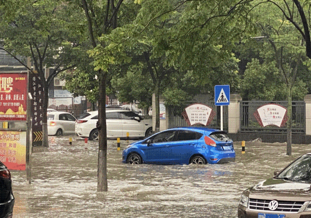
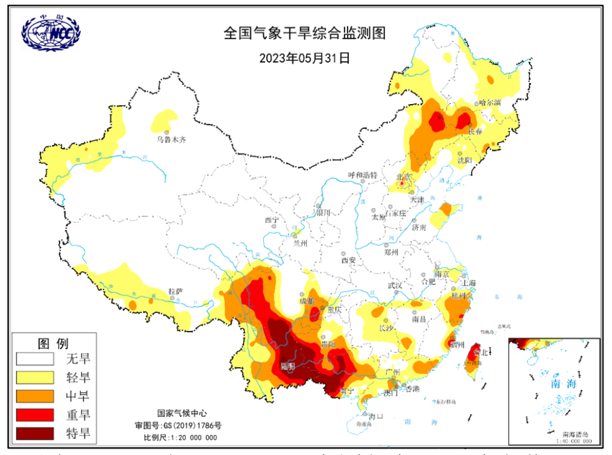

# 今春全国平均气温为历史同期第七高，今夏长江中游降水预计偏少2-5成

国家气候中心6月3日发文表示，2023年春季，全国平均气温总体偏高，为历史同期第七高，但季内气温起伏波动明显；全国降水量总体偏少，为2012年以来同期最少，空间差异大，华北和西北地区东部降水偏多，西南、华南、东北降水偏少。全国共有184个国家气象站日最高气温达到极端事件标准，其中77站达到或超过历史极值；有31站的日降水量突破春季历史极大值，福建邵武等3站突破历史极值。华南入汛和南海夏季风爆发时间均偏早；春季，我国共发生10次暴雨过程，其中3次强暴雨过程；今年以来云南发生严重冬春连旱，对春播作物生长不利；春季共发生12次强对流天气，局地极端性强；有13次沙尘天气过程影响我国，较2000-2022年同期偏多。

**1、春季全国天气气候特征**

**全国平均气温偏高，季内气温起伏波动明显。**
2023年春季（3-5月），全国平均气温11.5℃，较常年同期（10.9℃）偏高0.6℃，为1961年以来历史同期第七高（图1）。但季内气温起伏波动明显，
3月上旬、中旬和4月中旬气温异常偏高，偏高幅度超过1.5℃，其中3月上旬和4月中旬平均气温均为历史同期最高；4月下旬和5月上旬气温偏低1℃以上，其中4月下旬平均气温为历史同期第5低。

春季，我国气温总体呈中东部偏高、西部偏低的分布特征，其中东北及内蒙古东部、华北东部、华东大部、华中东部和南部、西南地区东部等地气温偏高1～2℃（图2）。江苏和云南平均气温为1961年以来历史同期最高，辽宁、山东、上海和贵州为次高，黑龙江、北京、河北、安徽、浙江、江西和湖南为第三高。

季内，西南、华南等地共有184个国家气象站（占全国总站数的7.6%）的日最高气温达到极端事件标准，其中云南巧家（44.4℃，5月31日）、元谋（43℃，5月31日）等77站达到或超过历史极值（图3）。内蒙古、华北、西北地区东部、华中等地共有135站的日降温幅度达到极端事件标准，其中内蒙古富河（16.5℃，4月11日）、陕西临潼（15.5℃，4月21日）等26站的日降温幅度突破历史极值（图4）。

_图1
1961-2023年春季全国平均气温历年变化（单位：℃）_

_图2 2023年春季全国平均气温距平分布图（单位：℃）_

_图3
2023年春季全国极端高温事件分布图_

_图4 2023年春季全国极端日降温事件分布图_

**全国降水量总体偏少，空间差异大，华北和西北地区东部降水偏多。**
春季，全国平均降水量为132.2毫米，较常年同期偏少8.1%,为2012年以来同期最少（图5）。华北大部、华东西北部、华中北部、西北地区东部和青海中南部、西藏北部和新疆南部等地降水量偏多2成至2倍；全国其余大部地区降水以偏少为主，其中内蒙古东南部、吉林中部、四川西南部、云南东部、贵州西南部、广西西部、甘肃西部、西藏西部和新疆西部等地偏少5～8成，局地偏少8成以上（图6）。云南降水量为1961年以来历史同期第2少，浙江为历史同期第3少；山西降水量为历史同期最多。

春季，全国共有118个国家气象站的日降水量突破当月历史极大值，其中31站的日降水量突破春季历史极大值，福建邵武（275.1毫米，5月6日）、江西宜黄（258.1毫米，5月6日）、贵州修文（228.3毫米，5月26日）日降水量突破历史极值。

_图5
1961-2023年春季全国平均降水量历年变化（单位：毫米）_

_图6
2023年春季全国降水量距平百分率分布图（单位：%）_

**2、春季主要天气气候事件**

**华南入汛和南海夏季风爆发时间均偏早。**
2023年华南前汛期于3月26日首先在广东开始，较常年（4月9日）偏早14天。入汛以来（3月26日至5月31日），华南地区平均降水量为311.7毫米，较常年同期偏少22.9%，为历史同期第8少。南海夏季风于5月第3候（具体为5月14日）爆发，爆发日期较常年（5月4候）偏早1候。

**10次暴雨过程影响我国，其中3次强暴雨过程。**
春季，我国共发生10次暴雨过程，部分地区遭受暴雨洪涝灾害。其中3月20-25日、4月1-5日和5月2-7日3次暴雨过程强度强，5月2-7日、5月20-22日、5月25-28日暴雨过程影响较大。5月2-7日，江淮大部、江汉西部和东部及江西大部、福建大部、湖南西部等地累计降水量有50～100毫米，局部超过100毫米；有20个国家气象观测站日雨量突破5月历史极值。江西抚州、吉安、宜春等局地特大暴雨，宜春丰城市丽村镇清丰河堤下江段河堤溃口，导致下游多个村庄被淹。5月20-22日，南方地区暴雨过程强度较强。22日5时至8时，桂林市秀峰甲山琴潭气象观测站三小时降水量达到300.1毫米，小时雨强达到160.6毫米，打破桂林市区小时雨强历史纪录。5月25-28日，西南地区至江淮、黄淮发生较强等级暴雨过程。由于持续降雨，黄淮等地小麦夏收、部分路段铁路运输受到影响。

_5月26日，湖北省潜江市出现大暴雨天气，局地12小时累计降水量达242毫米。_

**云南遭受冬春连旱。**
3月上中旬，华东、华中南部、华南等地气温快速回升，降水较常年同期偏少8成以上，气象干旱露头并快速发展，3月16日中等及以上气象干旱影响面积达到最大，之后，受降水影响，3月底上述大部地区干旱得到缓解，仅云南、山东等地存在中等及以上气象干旱。4月，受温高少雨的影响，云南、四川西南部、贵州南部等地气象干旱持续或发展。5月9日，云南省中旱及以上和特旱面积均达最大，分别为35.4万平方公里和17.6万平方公里；13-16日，西南地区西部出现明显降水过程，云南西部、四川西部等地气象干旱得到缓和；下旬，西南大部降水明显偏少、气温偏高，云南东部、四川西部和东南部、贵州西部和南部、广西中西部等地气象干旱又有发展，存在中至重度气象干旱，部分地区有特旱（图7）。今年以来，云南发生严重冬春连旱，其中春季平均降水量为86.8毫米，较常年同期偏少51.1%，为1961年以来历史同期最少，平均气象干旱日数为64.9天，为1961年以来历史同期第2多。

_图7
2023年5月31日全国气象干旱综合监测_

**12次强对流天气影响我国，局地极端性强。**
春季，我国共发生12次强对流天气；其中3月1次，4月6次，5月5次。4月15日，山东、江苏等地出现强飑线大风，江苏北部东部多地瞬时最大风力达12～13级（最大41.9米/秒），山东德州、临沂先后出现两个龙卷风，打破本省龙卷风出现的最早记录。5月12日午后，京津冀地区发生区域性强雷暴大风过程，河北东北部和中东部风力最强，局地可达12级，保定局地发生冰雹天气。16日，吉林中东部、辽宁中西部、河北西部和东北部等地出现区域性雷暴大风；河北东北部、辽宁西北部、吉林东部等地风力最强，局地11～12级，对粮食夏收产生不利影响。5月20-23日，大范围强对流过程自北向南影响我国大部分地区，广西、广东等地强降水强度超过100毫米/小时，部分城市出现内涝。

_5月4日，江苏省江阴市出现强对流天气并伴随闪电。_

**13次沙尘过程影响我国, 较2000-2022年同期偏多。**
春季，共有13次沙尘天气过程影响我国，较2000-2022年同期偏多2.5次，较近十年（2013-2022年）同期偏多4.5次。其中，4月9-13日、27-29日和5月19-22日为沙尘暴级别，3月19-24日和4月18-21日为强沙尘暴级别，对空气质量、交通运输及人体健康均造成较大影响。

**近日，国家气候中心组织有关单位对今夏气候预测趋势进行了滚动会商，形成意见如下：**

预计今年夏季（6月至8月）我国降水呈南北两条多雨带，黑龙江东部、浙江南部、福建、江西南部、广东、广西东部、海南、云南中西部等地降水偏多2～5成，局地发生极端性强降水的可能性较大；长江中游降水偏少2～5成。西南地区东部及华中中部可能出现区域性气象干旱；西南地区南部等地山洪地质灾害偏重；夏季全国大部地区气温接近常年同期到偏高，华东、华中、新疆等地高温（日最高气温≥35℃）日数较常年同期偏多，可能出现阶段性高温热浪。夏季在西北太平洋、南海生成的热带气旋个数接近常年，登陆我国的热带气旋个数接近常年，热带气旋活动路径以西行和西北行为主，主要影响我国华南和华东沿海。

