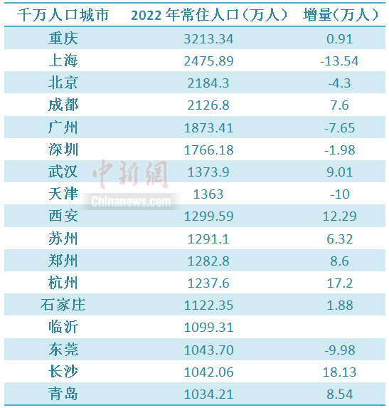
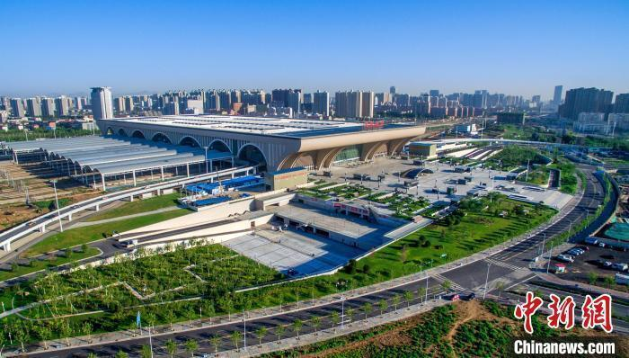

# 千万人口城市变局：长沙常住人口增量第一，石家庄人口增长由负转正

中新网6月3日电(记者
李金磊)随着各地公布2022年人口数据，17个千万人口城市的常住人口情况也出炉了。在千万人口城市中，重庆常住人口继续稳居第一。长沙常住人口增量最多，排位提升。杭州、西安人口增量靠前。石家庄人口增长由负转正。

_中新财经
李金磊 制图_

**千万人口之城重庆居首**

根据2022年常住人口数据排行，人口超过千万的17个城市分别是：重庆、上海、北京、成都、广州、深圳、武汉、天津、西安、苏州、郑州、杭州、石家庄、临沂、东莞、长沙、青岛。

其中，重庆常住人口超过3200万，位居千万人口之城榜首。

重庆统计局公布的数据显示，据2022年人口变动情况抽样调查数据推算，全市常住人口为3213.34万人，与2021年相比，常住人口增加
0.91万人，增长0.03%，增速快于全国水平0.09个百分点，实现18年持续增长态势。

在四大直辖市中，北京、上海、天津常住人口均为负增长，重庆保持了正增长。

_长沙街头资料图。中新网记者
李金磊 摄_

**长沙成人口增量第一城**

从人口增量来看，长沙常住人口增量最多，成为人口增量第一城。

长沙统计局的数据显示，2022年末全市常住总人口1042.06万人，比上年末增长1.8%。2021年末全市常住总人口1023.93万人，据此计算，长沙常住人口增加了18.13万人。

为何长沙能够成为人口增量第一城？

国务院发展研究中心公共管理与人力资源研究所研究室主任冯文猛对中新财经记者表示，从大背景来看，产业结构向中西部转移带来新的就业机会，跨省人口流动相对减少，省内人口流向更加集中在中心城市。从长沙城市特色来看，长沙这些年经济发展较快，大力打造“强省会”，不断培育产业新的增长极，创造较好的人居环境，一系列新的消费场景广受欢迎，同时，长沙房价控制得比较低。充满烟火气的网红长沙，对人口形成了较强的吸引力。

数据显示，长沙2022年经济增长4.5%，增速在24 座万亿 GDP
城市中排名第一。根据湖南发布的《关于实施强省会战略支持长沙市高质量发展的若干意见》，到2026年，长沙市常住人口突破1200万人，经济首位度超过30%。

_浙江杭州。王刚 摄_

**杭州、西安人口增量靠前**

除了长沙，杭州、西安2022年人口增量也超过10万。

其中，杭州以17.2万的人口增量居第二位。根据2022年杭州市人口主要数据公报，2022年末全市常住人口为1237.6万人，与2021年末常住人口1220.4万人相比，增加17.2万人。

冯文猛认为，浙江经济比较发达，省会杭州发展基础比较好，具有很多独特优势，数字经济的发展产生了大量就业机会，而且，杭州作为历史悠久的人文城市，公共服务水平较高，环境宜居，这些年杭州的户籍制度改革力度很大，聚人的效果就比较明显。

杭州落户政策不断放宽。近期杭州发布《关于进一步深化户籍制度改革的实施意见》，已在杭州市区落实就业单位的35周岁以下的普通高校大专学历毕业生，可在市区办理落户。

西安人口增量排在第三位。数据显示，西安2022年末全市常住人口1299.59万人，比上年末增加12.29万人。

随着户籍新政、西咸一体化等利好政策的推进，以及关中平原城市群等规划的实施，近年来，西安吸纳了更多的人口资源。冯文猛认为，作为中国西部地区重要的中心城市，西安产业基础比较强，文化底蕴深厚，对西部地区的辐射能力不断增强，城市吸引力日益凸显。

_图为航拍石家庄火车站。(资料图) 张广瑞 摄_

**石家庄人口增长由负转正**

石家庄统计局数据显示，2022年末全市常住总人口1122.35万人，比上年末增加1.88万人。

增量尽管不算太多，但与2021年相比却是一个逆转：石家庄2021年末全市常住总人口1120.47万人，比上年末减少3.68万人。

这意味着，石家庄扭转了人口负增长的态势，人口重回正增长通道。

石家庄为何能够逆袭？

2021年，河北出台《关于大力支持省会建设和高质量发展的意见》，提出把石家庄打造成为带动全省高质量发展的重要增长极。到2025年，石家庄市经济总量力争超万亿元。

数据显示，石家庄2022年经济同比增长6.4%，其中，固定资产投资(不含农户)增长10.1%。

冯文猛认为，在北京疏解瘦身的背景下，石家庄获得了更多发展机遇，其发展潜力在河北省优势比较明显。近些年，石家庄在培育新的经济增长极，生物医药、新一代电子信息、装备制造等产业创造不少就业就会，另外，石家庄的房价也比较低，随着公共服务水平提升，以及生态环境持续好转，对人口的聚集效应进一步增强。(完)

