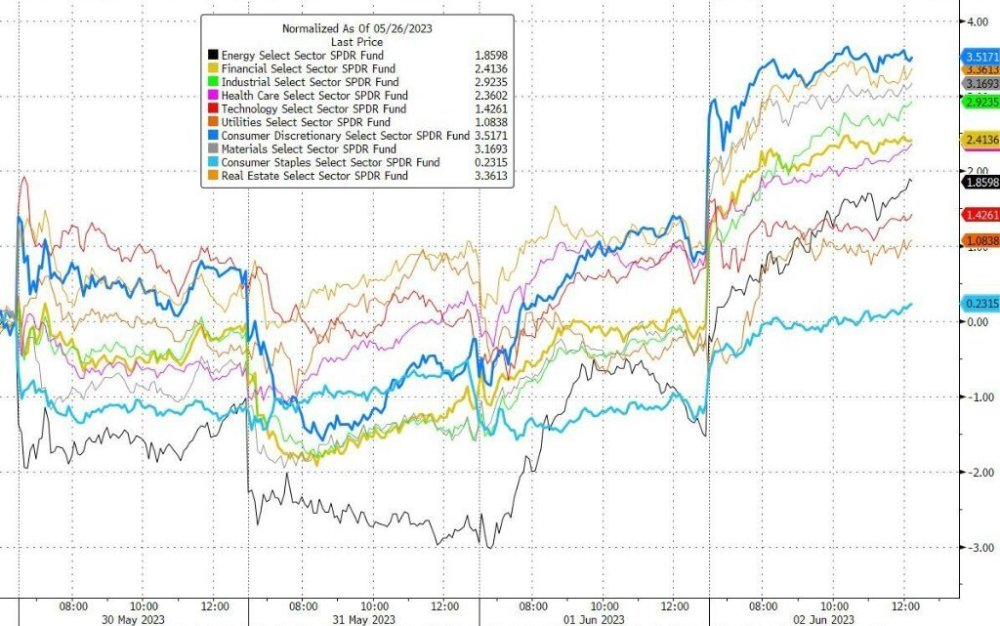
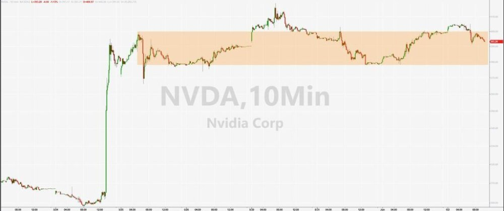
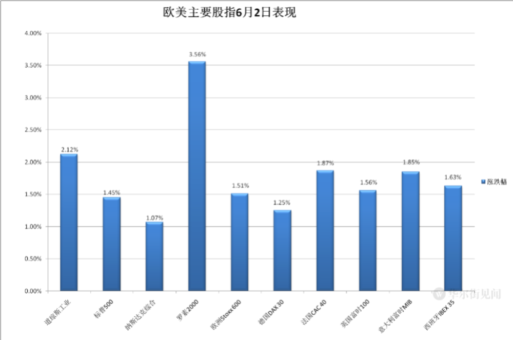
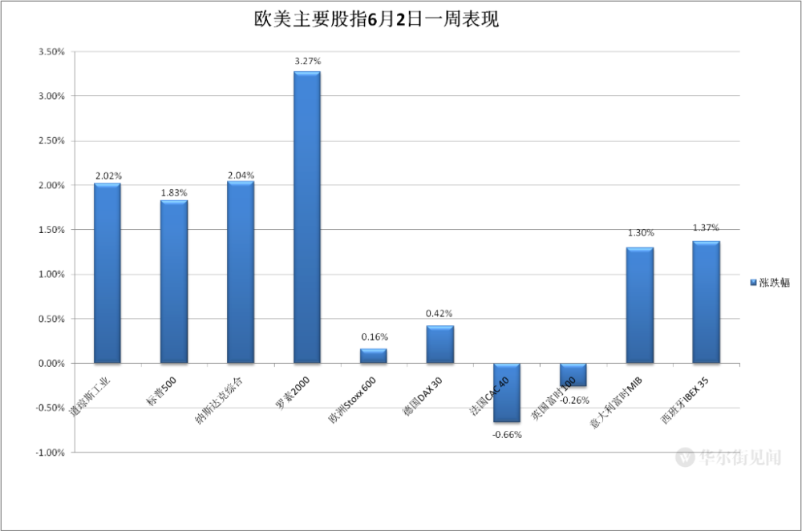
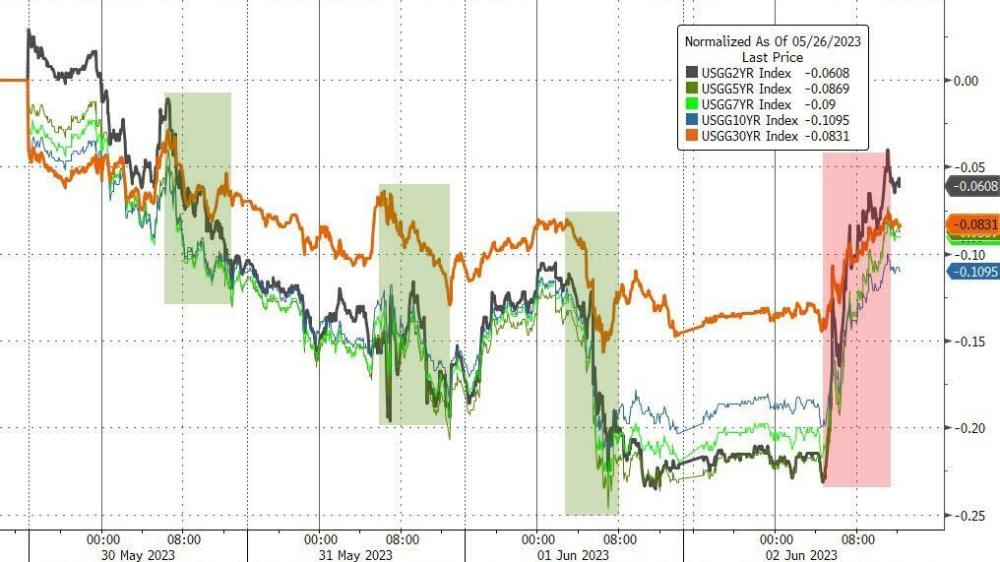
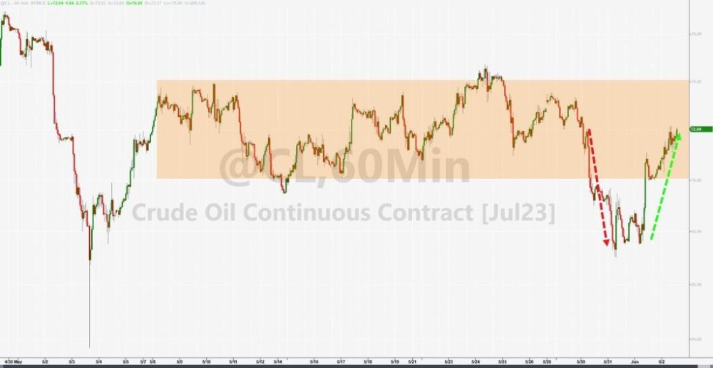
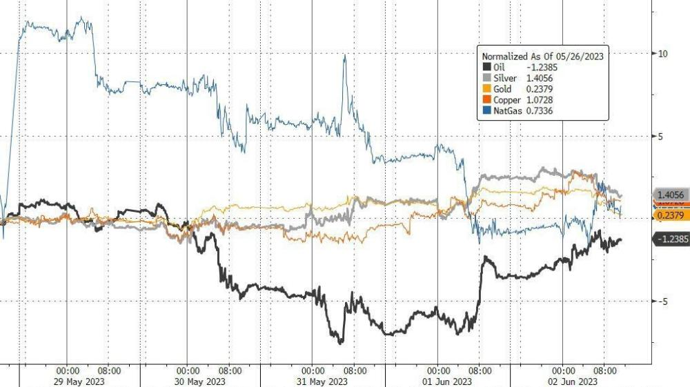

# 美股集体收涨，道指涨超2%纳指连涨六周，中概股大涨贝壳涨超6%

继有“小非农”之称的ADP私人就业人口超预期增长后，5月美国新增非农就业人口也远超预期，几乎是市场预期增加人数的两倍。但非农报告传递的信号并不一致：5月失业率意外不降反升，创七个月新高及三年来来最大月环比升幅，平均时薪增长放缓，同比增速略低于预期。

非农就业数据公布后，美国国债价格盘中跳水，收益率拉升，对利率前景更敏感的两年期美债收益率日内升幅扩大到10个基点以上；美元指数迅速转涨，摆脱两周低位。互换合约定价显示，投资者预期的美联储7月加息几率增加，预计未来两次会议期间将加息25个基点，6月加息的几率不到50%。不过，周五回升未能扭转美元和美债收益率全周的下行之势。

评论称，现在的关键是美联储会不会跳过6月，等到7月再行动。从就业大幅增长看，劳动力市场并未放缓，而且通胀还未接近2%，所以美联储可能还会加息，而从失业率回升和薪资增长放慢看，联储可以7月再加息。还有评论称，就业猛增无疑支持了美联储的鹰派，促使他们质疑是否应进一步紧缩，失业率回升则可能给联储足够的理由6月暂停加息。

美国参议院继众议院后也通过议案提高债务上限，债务违约风险解除，强劲的就业增长体现经济在货币紧缩打击下仍有韧性，得到双重支持的美股高开。在特斯拉等蓝筹科技股带领下，主要股指本周全线累涨。欧股本周上演戏剧性反转，泛欧股指连跌三日至两月低谷后持续反弹，周五更是在美国债务上限、中国政策前景和瑞典房产公司SBB利好的推动下，创两个半月最大涨幅，得以扭转全周跌势。

市场期待稳增长政策出台，多种中国资产普涨。中概股延续周四跑赢大盘之势，特斯拉在CEO马斯克访华的本周累计两位数大涨。内盘商品期货继续走高，日间领涨的玻璃夜盘继续领跑，涨近6%。离岸人民币兑美元盘中曾升破7.07，刷新一周来高位，此后在美元回升的压力下，盘中转跌。

周五的国常会指出，要分批次加快推出针对性强、含金量高的政策措施；要巩固和扩大新能源汽车发展优势，延续和优化新能源车的车辆购置税减免政策。上证报获悉，英伟达CEO黄仁勋或将下周二到访上海。他将是继马斯克之后又一访华的美国科技业大佬。

外盘部分商品也和主要消费国中国的资产联动。国际原油盘中涨近3%，美油继续脱离两个月低谷，但未能抹平全周跌幅，和布油均三周来首次累跌，市场焦点转向本周末的OPEC+会议，评论称，没人愿意在OPEC+会前做空原油，交易员永远不应低估沙特的力量。

工业金属中，连日下跌的伦锡和伦铅反弹，伦锌进一步走出近三年低谷，伦铜小幅回落，但接近周四追随中国资产大反弹所创的近两周高位。而黄金在美元和美债收益率反弹的打击下回落，美国就业报告公布后持续下行，创两周多来最差单日表现，有赖于前几日持续上涨，保住了全周涨势，一个月来首次单周累涨。

道指创半年最大涨幅 纳指创三年最长连涨周 特斯拉本周涨超10% 中概指数涨近3% C3.ai等AI概念股继续回落

三大美国股指集体高开，早盘均曾涨超1%，午盘刷新日高时，道琼斯工业平均指数涨超740点、涨超2.2%，标普500指数涨近1.7%，纳斯达克综合指数涨近1.2%。
最终，三大指数连续两日集体收涨。

道指收涨701.19点，涨幅2.12%，创去年11月30日鲍威尔讲话暗示12月放缓加息当天以来最大收盘涨幅
报33762.76点，创5月1日以来收盘新高。标普收涨1.45%，创5月5日苹果一季报公布次日以来最大涨幅，报4282.37点，纳指收涨1.07%，报13240.77点，和标普均创去年4月以来收盘新高。

价值股为主的小盘股指罗素2000收涨3.56%，跑赢大盘，连涨两日至3月8日以来高位。科技股为重的纳斯达克100指数收涨0.73%，连涨两日，连续两日、本周第四日刷新刷新截至周二连续三日所创的去年4月以来高位。

在只有四个交易日的本周，主要股指集体累计上涨：纳指累涨2.04%，纳斯达克100累涨1.74%，自2020年1月以来首度六周连涨；标普累涨1.83%，创今年3月31日以来最大周涨幅，自3月31日以来首次连涨三周；道指累涨2.02%，抹平上周回落的跌幅；上周微幅回落的罗素2000累涨3.27%。

_主要美股指本周走势_

标普500各大板块周五全线收涨，除了涨0.1%的通信服务外，其他板块至少涨超1%，材料涨3.4%领跑，工业涨近3%，房产、金融和特斯拉所在的非必需消费品都涨超2%。本周这些板块也都累涨，非必需消费品涨近3.3%领涨，房产涨近3.1%，材料涨近2.9%，工业、金融、医疗也都涨超2%。

_美股各板块ETF本周走势_

道指成份股中，截至周五收盘，工业股3M涨约8.8%领跑，卡特彼勒涨8.4%，陶氏化学涨5.3%，耐克涨4.4%，波音涨2.6%。

龙头科技股多数继续上涨。特斯拉午盘涨超4%，收涨3.1%，连涨六日，创去年11月以来收盘新高，在特斯拉CEO马斯克访华后第四日走高。FAANMG六大科技股中，多数连涨两日，亚马逊收涨1.2%，继续创去年9月以来新高；微软收涨近0.9%，刷新2021年12月以来高位；谷歌母公司Alphabet收涨近0.8%，继续靠近上周一所创的去年4月以来高位；苹果收涨近0.5%，刷新去年1月所创的收盘历史高位；而连涨四日至去年2月以来高位的奈飞收跌近0.7%，连涨六日的Facebook母公司Meta收平，企稳于去年1月以来高位。

本周这些科技股总体累涨，特斯拉累涨10.8%，奈飞涨5.7%，Meta涨4%，苹果和亚马逊都涨超3%，微软涨近0.8%，Alphabet涨不足0.1%

周四强劲反弹的热门中概股总体进一步走高，连续第二日跑赢大盘。纳斯达克金龙中国指数（HXC）收涨近2.9%，本周累涨3.4%。个股中，瑞能新能源和乐信涨超9%，再鼎医药涨超8%，华住和达达涨超7%，携程、贝壳找房和爱奇艺涨超6%，小鹏汽车涨超5%，腾讯粉单涨超3%，京东、金山云涨超2%，百度涨约2%，阿里巴巴涨超1%，理想汽车和网易涨约1%，蔚来汽车0.3%，而B站跌超3%。

周四强劲反弹的芯片股总体小幅回落，费城半导体指数和半导体行业ETF
SOXX分别收跌0.15和0.24%，本周均累跌逾1.2%。个股中，周四涨超5%反弹的英伟达盘初转跌，收跌1.1%，未能继续逼近周二连续第三日所创的历史高位，本周累涨近1%；而公布第二财季盈利和收入均高于预期、预计AI相关销售业绩今年将翻倍、且被美国银行因其AI业务被低估而重申买入评级并上调目标价后，博通收涨2.8%。

_上周公布财报后周四大涨24%的英伟达本周涨势明显缓和_

AI概念股多数继续回落。公布本财季和2024财年的指引不佳后周四收跌超13%的C3.ai（AI）周五收跌7.1%，本周跌超2%，Bullfrog
AI（BFRGW）收跌11.6%，BigBear.ai（BBAI）收跌3.4%， 有望为英伟达AI芯片H100提供电源管理解决方案的Monolithic
Power
Systems（MPWR）早盘曾跌超4%，收跌0.4%，SoundHound.ai（SOUN）收跌1.4%，午盘反弹涨超1%后又转跌的Palantir（PLTR）收跌逾0.1%，而Adobe（ADBE）收涨近2.3%，Guardforce
AI（GFAI）早盘跌近4%后午盘转涨，收涨3.4%。

媒体称亚马逊考虑给Prime会员提供含无线服务的超低价手机套餐后，尽管亚马逊称目前未计划增加无线服务，几大电信运管商盘中仍跌幅扩大。T-Mobile（TMUS）和
AT&T（T）收跌5.6%，Verizon（VZ）收跌3.2%。

公布财报的个股中，第一财季销售超预期猛增24%且上调全年指引的时尚运动服品牌Lululemon（LULU）收涨11.3%；第一财季盈利和收入强劲且上调全年指引的数据开发商MongoDB（MDB）收涨28%；一季度亏损低于预期且上调全年指引的云公司Samsara（IOT）收涨27.9%；第三财季业绩和指引均优于预期的Zscaler（ZS）收涨5.4%；上调全年营收和利润指引低端的折扣零售商Five
Below（FIVE）收涨7.8%；而一季度营收低于预期且下调全年指引、提及宏观经济压力导致销售增长放缓的网络安全公司SentinelOne（S）收跌35.1%；二季度营收指引低于预期的IT云公司PagerDuty（PD）收跌17.1%。

其他波动较大的个股中，预计将今年下半年完成收购淘米、成为国漫IPO元宇宙SPAC第一股的MultiMetaVerse（MMV）收涨113.6%；宣布与日本电动汽车公司Quantum
Solutions达成合作的电池公司U Power Ltd. （UCAR）收涨18.7%。

欧股方面，泛欧股指在连跌三日后连涨两日，周五加速上涨。欧洲斯托克600指数自3月14日以来首次一日涨约1.5%，创5月23日上周二以来收盘新高。主要欧洲国家股指均涨超1%，连续两日齐涨。各板块中，周五只有跌近2.8%的电信一个收跌。矿业股所在的基础资源涨超4.2%领涨，凸显商品走高的影响，房产涨近4%紧随其后。

个股中，宣布董事会寻求剥离资产或者给公司寻找买家、公司创始人兼CEO Ilija Batljan卸任、由业界资深人士Leiv
Synnes接任CEO后，瑞典房地产公司Samhallsbyggnadsbolaget i Norden
AB（SBB）飙涨53.3%，创史上最大日涨幅，领涨斯托克600成份股。受运动服品牌Lululemon上调全年指引提振，阿迪达斯和彪马分别涨5.8%和6.4%。

尽管周三曾创3月29日以来收盘新低，斯托克600指数仍借助周五大涨而全周累涨，在上周结束两周连涨后重回涨势。各国股指多数累涨，西班牙股指和上周跌近3%领跌的意大利股指均涨超1%，和德股都在上周回落后反弹，而英股和法股连跌两周。各板块中，因周五大涨，房产板块全周累计涨超4%，基础资源涨超3%，上周逆市独涨的科技涨1%。

就业报告后两年期美债收益率盘中升超10个基点 本周仍累计下降

欧洲国债价格反弹，欧元区国债收益率在连降四日后回升，美国就业报告公布后追随美债升幅扩大，短债的收益率升幅超过长债，紧缩预期有所升温。

英国10年期基准国债收益率收报4.15%，日内升4个基点，告别周四下破4.10%刷新的5月22日以来低位；2年期英债收益率收报4.33%，日内升7个基点，周四曾下测4.25%刷新5月23日以来低位；基准10年期德国国债收益率收报2.31%，日内升7个基点，脱离周四盘中降至2.230%刷新的5月12日以来低位；2年期德债收益率收报2.79%，日内升11个基点，远离周四下破2.70%刷新的5月17日以来低位。

本周欧债收益率普遍下降，体现德国等欧洲国家通胀放缓的影响。10年期英债收益率累计下降约18个基点；连升三周的10年期德债收益率累计降约22个基点，连升三周的2年期德债收益率也大幅回落，和英债收益率均降约13个基点。

美国10年期基准国债收益率在欧股盘中曾下测3.60%刷新日低，美国非农就业报告公布后很快上逼3.65%，美股午盘曾逼近3.70%，日内升幅略超过10个基点，远离周四下破3.57%刷新的5月17日以来低位，和上周五接近3.86%刷新的两个月高位仍有距离，到债市尾盘时约为3.69%，日内升近10个基点，在连降四日后回升，本周仍累计降约11个基点，最近五周首度下降。

对利率前景更敏感的2年期美债收益率在欧股盘中曾下测4.30%刷新日低，美国就业报告后迅速重上4.45%，美股午盘曾升破4.52%，日内升逾18个基点，远离周四下破4.32%刷新的5月24日上周三以来低位，还未能接近上周五逼近4.64%刷新的两个月高位，到债市尾盘时约为4.50%，日内升约16个基点，在连升三周后本周累计降约6个基点。

_各期限美债收益率本周走势_

就业报告美元指数迅速转涨 摆脱两周低位 但止步三周连涨 离岸人民币冲高回落

追踪美元兑欧元等六种主要货币一篮子汇价的ICE美元指数（DXY）在欧股盘中曾跌破103.40，连续两日刷新5月24日以来盘中低位，日内跌近0.2%，美国非农就业报告公布后迅速转涨，美股午盘重上104.00后一度接近104.10刷新日高，日内涨0.5%。

到周五美股收盘时，美元指数仍处104.00上方，日内涨超0.4%，本周累跌近0.2%；追踪美元兑其他十种货币汇率的彭博美元现货指数涨近0.3%，脱离5月22日以来低位，也在美股午盘转涨，本周累跌近0.4%，和美元指数均在周五反弹、但止步三周连涨。

_彭博美元现货指数上周五以来走势_

随着美元反弹，多数非美货币在美国就业报告公布后转跌。欧元兑美元在欧股盘前曾接近1.0780，刷新5月24日上上周三以来高位，美股午盘曾下测1.0705刷新日低，日内跌超0.5%。英镑兑美元在亚市盘中曾涨破1.2540，刷新5月16日以来高位，美股午盘曾接近1.2440刷新日低，日内跌近0.7%。

日元盘中跌落两周高位。美元兑日元在亚市盘中曾接近138.60，刷新5月24日以来低位，美股午盘曾涨破140.00，日内涨逾0.9%，和周二涨破140.90而连续四日刷新的去年11月以来高位仍有距离。

离岸人民币（CNH）兑美元在亚市早盘转跌后曾跌至7.1149刷新日低，后很快转涨，欧股早盘曾涨至7.0670刷新5月26日上周五以来高位，日内涨374点，美国就业报告公布后逐步回吐涨幅，美股午盘转跌，一度失守7.11。北京时间6月3日4点59分，离岸人民币兑美元报7.1096元，较周四纽约尾盘跌52点，在周四终结三连跌后回落，本周累跌357点，连跌四周，但跌幅将近上周的一半。

高风险的加密货币周五盘中反弹。比特币（BTC）亚市早盘曾跌破2.66万美元刷新5月26日以来低位，后持续回涨，美股午盘曾逼近2.73万美元刷新日高，较日低涨近800美元、涨近3%，美股收盘时处于2.72万美元上方，最近24小时涨超1%，最近七日涨近2%。

日间涨停的玻璃夜盘涨近6% 领涨内盘商品

内盘商品期货夜盘总体继续上涨。周五日间收涨停的玻璃夜盘继续领涨，收涨5.87%。

日间涨超3%的焦煤和燃油夜盘分别收涨3.10%和3.05%，棉花涨2.81%，日间涨超3%的焦炭涨2.38%，日间涨超2%的螺纹钢和铁矿石分别收涨2.22%和2.09%，低硫燃油涨2.08%。

夜盘棉纱涨1.83%，棕榈油、热卷、菜油、甲醇、苯乙烯、豆油、菜粕、乙二醇、沥青、豆二至多涨1.81%。夜盘橡胶涨0.96%，20号胶、豆粕、PTA、聚丙烯、玉米淀粉、PVC、塑料、纯碱、短纤、玉米、LPG、豆一、粳米至多涨0.89%。

而白糖、纸浆夜盘至多收跌0.43%。

工业金属中，国际铜夜盘收涨0.97%，沪铜收涨0.75%，沪铝收涨1.32%，沪锌收涨0.86%，沪镍收涨2.99%，沪锡收涨1.46%，而沪铅收跌0.53%。此外，不锈钢夜盘收涨1.24%。

美油继续走出两月低位 本周仍三周来首跌 欧洲天然气反弹但连跌九周

国际原油期货周五全天基本保持涨势，在连跌两日后连涨两日，美股早盘刷新日高时，美国WTI原油涨至72.17美元，布伦特原油涨至76.45美元，日内均涨近3%。

最终，WTI
7月原油期货收涨1.64美元，涨幅2.34%，报71.74美元/桶，继续走出周三所创的3月20日以来收盘低位。布伦特7月原油期货收涨1.85美元，涨幅2.49%，报76.13美元/桶，截至周三连续两日刷新5月4日报72.5美元以来收盘低位。

本周，美油累跌1.3%，布油累跌1.1%，均止步两周连涨，主要源于周二跌超4%，创5月2日以来最大日跌幅。尽管近两日反弹，原油过去一个月仍累计大跌。截至周三的5月，美油跌超11%，布油跌近9%，分别创2021年11月和去年11月以来最大月度跌幅。

_美国WTI原油期货4月末以来走势_

连续三日齐跌的美国汽油和天然气期货反弹。NYMEX
7月汽油期货收涨近2.7%，报2.5美元/加仑，脱离周四刷新的5月12日以来低位，在连涨三周后本周累跌3.5%；NYMEX
7月天然气期货收涨0.65%，报2.1720美元/百万英热单位，暂别连续两日刷新的4月26日以来低位，在上周大幅回落跌近16%后本周涨近0.1%。

欧洲天然气反弹，虽然本周只有周四一日收跌，但因周四重挫，最终仍连跌九周。英国天然气期货收涨1.25%，报54.95美元，脱离周四跌近14.6%所创的两年来低位，在周一休市的本周累跌0.7%；欧洲大陆TTF基准荷兰天然气期货收涨2.54%，报23.689欧元/兆瓦时，告别周四跌14%所创的两年低位，本周五日累跌5.35%。

媒体指出，欧洲唯一的大型液化天然气（LNG）工厂、挪威国家石油公司（Euinor）旗下LNG工厂最近爆出天然气泄漏，引发气价震荡，凸显了该地区能源交易者对意外的供应冲击仍心存疑虑。周三因泄漏而气价大反弹，周四Euinor称控制住泄露后气价又大跌。

黄金创两周最大跌幅 仍结束三周连跌 伦铜小幅回落 全周仍涨 伦锌两连阳仍连跌四周

纽约黄金期货在亚市盘中曾连续第二日短线重上2000美元，刷新日高时涨至2000.50美元，此后不止一次转跌，美国就业报告公布后锁定跌势持续回落，美股午盘跌至1966美元下方，日内跌超1.5%。

到收盘时，COMEX
8月黄金期货收跌1.30%，创5月16日以来最大日跌幅，报1969.60美元/盎司，跌落周四刷新的5月15日以来收盘高位。本周期金累涨1.3%。

_纽约黄金期货周五大幅回落_

连涨两日的纽约期银回落，COMEX
7月白银期货收跌1%，报23.75美元/盎司，跌落周四所创的5月19日以来高位，但本周累涨1.7%，和黄金均结束三周连跌之势。

伦敦基本金属期货周五涨跌不一。领涨的伦锌涨近1.8%，连涨两日至一周来高位，继续脱离周三所创的2020年7月末以来低谷。伦锡抹平连跌两日的跌幅，继周二之后又创三周新高。连跌三日的伦铅也反弹，涨1.4%抹平周四多数跌幅，告别连续两日刷新的去年11月初以来低位。

周四涨近2%的伦铜小幅回落，暂别周四反弹所创的近两周来高位，但守住8200美元关口，连续两日收于8200美元上方。周四大反弹、涨超3.5%的伦镍小幅跌落一周多来高位，和截至周三连跌三日所创的去年9月初以来低位仍有距离。连涨两日的伦铝跌落近两周来高位。

本周基本金属多数累计上涨。领涨的伦锡涨超3%，伦铜和伦铝都涨超1%，均在上周回落后反弹，连跌三周的伦镍涨约0.2%，而伦铅跌超2%，连跌两周，伦锌跌超1%，连跌四周。

纽约期铜在两连跌后连涨两日，COMEX
7月期铜收涨0.4%，报3.7275美元/磅，继续刷新5月19日报3.732美元以来高位，本周涨1.2%，抹平上周回落的多数跌幅。

从累计涨跌看，金银铜油和美国天然气四大商品中，本周原油表现最差，贵金属金银表现相对较好。

_金银铜油和美国天然气上周五以来走势_

