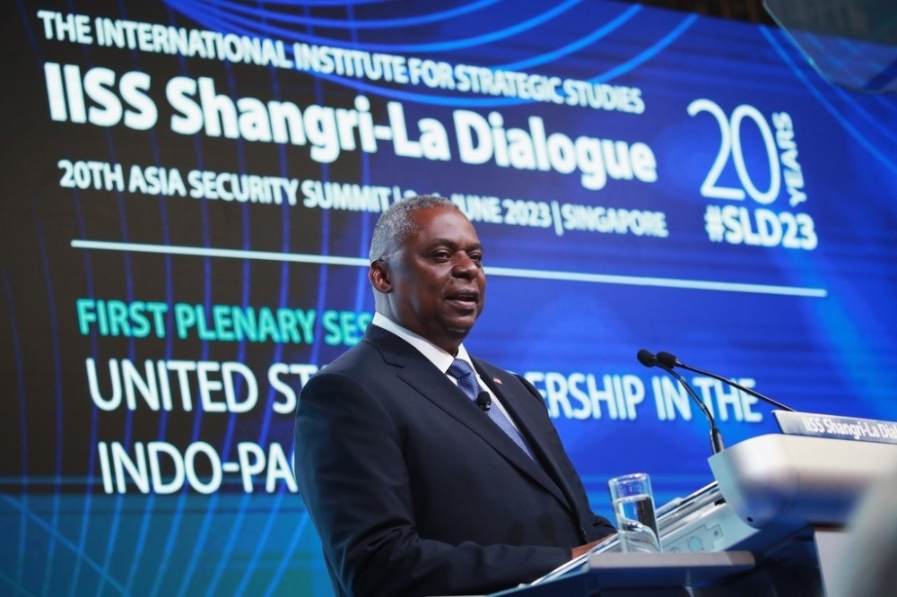

# 美防长“香会”指责中国 专家：中美军事关系不能按美方设定节奏推进

【环球时报-环球网报道 赴新加坡特派记者郭媛丹
李艾鑫】3日上午，美国防长奥斯汀在香格里拉对话会第一次全体会上做主题发言时，再度提及中美两军交流话题，奥斯汀延续美方一贯表态，将责任扣在中国头上。军事专家对《环球时报》记者表示，美国完全无视中国在核心利益和重大安全关切上的一些基本要求，在这种情况下，中美军事关系不可能按照美方设定的节奏去往前推进。

_当地时间2023年6月3日，美国防长奥斯汀在香格里拉对话会第一次全体会上做主题发言。图源：IC
photo_

奥斯汀在发言的第一部分着重描述美与亚太国家的同盟关系。他表示，“我们正在与从东海到南海再到印度洋的朋友们加强规划、协调和训练，这其中包括澳大利亚、日本、韩国、菲律宾和泰国等坚定盟友，也包括印度、印度尼西亚、越南等重要伙伴，以及我们今天在这里的东道主新加坡。”

奥斯汀表示，由拜登提出的2024财政年度国防预算用于加强“太平洋威慑倡议”（PDI）达到91亿美元的历史新高，比去年增加了40%。奥斯汀在介绍美军在亚太地区军事部署时提及，到2025年美国将把海军陆战队最先进的编队第12濒海作战团部署在日本，以加深第一岛链的稳定。同时美国已承诺增加美军在澳大利亚的轮换存在，包括战斗机和轰炸机特遣部队的轮换，以及未来地面和海上能力的轮换。

奥斯汀也介绍了美日澳、美日韩，美日澳印等“多边机制”的进展，称今年即将举行数场重要的多边演习，包括今年夏天美日澳印四国将参加首次在澳大利亚海岸举行的马拉巴尔演习；7月份在澳大利亚举行“护身军刀”军事演习，届时将有14个国家、3万多名人员参加，这将是有史以来规模最大的一次演习。

奥斯汀随后话锋一转，开始描述为了实现美国在印太地区所谓“和平、开放与繁荣的愿景”所遇到的“阻力”，包括在南海不会“被海上或国际空域的危险行动所吓倒”，“我们清楚地看到了一个令人不安的中国咄咄逼人不专业的飞行案例”，“我们维护台海和平稳定的决心是坚定不移的。世界上越来越多的国家也是如此”等。

奥斯汀还说，“我深感关切的是，中国一直不愿意更认真地参与我们两军之间更好的危机管理机制。但我希望这种情况会改变，而且要快。”

军事科学院战争研究院大校研究员曹延中3日在新加坡接受《环球时报》采访时表示，美国在军事上对华态势整体上和美国在各领域对中国进行围堵的国家政策保持一致，甚至在军事领域中遏华政策体现的更为明显。“比如，前几天美军
‘碰瓷’称我战机对其进行不专业
‘拦截’，但事实是其侦察机近距离侦察，在中国航母山东舰训练区域实施干扰。又比如，美国一边强调其对台政策没有改变，仍然坚持一个中国，另一边却加大对台售武力度，前几天更是向台交付首批
‘毒刺’导弹，并协助台军进行联合训练。”这是曹延中所列举的美国劣迹的一小部分，而这一切都表明在关于中国最重要、最核心的利益和重大安全观念问题上，美国采取了一系列越来越咄咄逼人的行动。

“当美军将这一切行为摆在中国面前时，中国如何发展对美军事关系？”这位对中美军事专家提出疑问。他说，并不是中国不愿意发展对美军事关系，恰恰相反，一直以来中国都主张和美国建立一个合作共赢、稳定的中美关系，中国对发展中美军事关系的意愿，我们是有共识的。但恰恰是美国一系列行动在不断挑衅中国底线。

曹延中表示，因此此次在“香会”期间中美两军高层没有举行高层会晤，责任主要在美方，美国完全无视中国在核心利益和重大安全关切上的一些基本要求，也不努力去创造双方高层交往的基本政治条件。在这种情况下，中美军事关系不可能按照美方设定的节奏去往前推进。

曹延中认为，如果美方有推动中美两军关系正常发展的意愿，就不应该只是单方面向中方提要求，关键在于美方如何回应中方的关切，做出一些实实在在的行动确实改善两军关系，认真回应中国的在核心利益和重大安全关系上的一些要求，而不是停留在口头上，虚与委蛇地谈“和中国军方沟通的重要性”。

