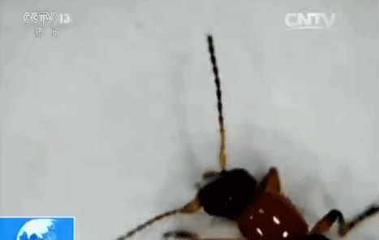

# “我的脸被隐翅虫毁容了”！这种虫子每年夏天都有，体液堪比盐酸

“我的脸被隐翅虫毁容了！”今天这个热搜，不少网友晒出同款伤疤……

_很多网友都说碰见过这种虫子。_

**领导我是小明：** 见到这种虫子，不要拍它，吹走或者弹走，然后立马洗肥皂水，多洗几遍。它体内有毒的，拍死了肉会起泡腐烂，严重的可能还会伴有发烧。

**长腿毛的月野兔:** 在卫生间见过一只，停在换下的衣服上，当时手边没可拍的东西就把它吹走了，就找不到了...找不到比看到它更害怕。

**铁线莲开满的山坡：** 我2010年被这个虫子搞得脸上现在的印子还在，还好不咋明显。

**Yinin尹怼怼:** 我五年前被咬过，脸上特别害怕，四个多月才全部消下去。

**别看准备退网了：** 还好沒被咬，打死3只。

**胡小JO丫:** 去年夏天就被这个虫子给毁容了，额头一块，手上也有两小块地方，留下来的疤直到现在都能看到……

**陈瑾妍有个漂亮的妈妈：** 先是红肿，然后起泡，最后泡泡破了，整个过程都很痛，万幸的是没有留疤。

**乐意哩__：** 每年夏天都会有隐翅虫的热搜上榜。

**雨霖霖apple:**
我大一刚入校的时候，就是被这个虫子在脸上咬了长长一条，火辣辣的痛。记得当初医生给我用的是炉石水擦，一个星期就好了，但是疤痕前后要一个月的时间才能完全消。

有网友问： **“这虫子是全国都有吗？还是仅在部分地区有啊？”**

**unbeso-unasonrisa:** 广东特别多，被咬了留疤两年都还在。

**秋秋要每天都开心:** 东北人没见过。

**我有猫你有吗_:** 东北人没见过，但很害怕。

**雾散终会再见:** 坐标大同，从来没有见过活物，到是在南方上学的时候经常见。我一同学大二打死一只落在脖子上的，强酸烧的皮肤痕迹大四毕业都清晰可见。

记住它的样子↓

**什么是隐翅虫？**

隐翅虫是甲虫的一种，属于昆虫纲、鞘翅目、隐翅虫科、毒隐翅虫属。又被称为“青腰虫”，长得有点像蚂蚁，体长一般不超过1厘米，鞘翅很短，腹部全裸，乍看像没有翅膀，故名“隐翅虫”。

**隐翅虫其实是不咬人的，只是因为它爬到人的皮肤上，常常被大家不自觉地打死或压死，这时，会造成毒液大量溅出，酸性值很大，对人的皮肤具有很大的腐蚀性。**

所以， **遇到这种虫子，别打死它，只要用嘴吹走即可。**

隐翅虫毒液的pH值为1—2。第四军医大学2007年的学报发表过陈士新医生的论文《隐翅虫皮炎590例临床分析》，其中提到：

隐翅虫皮炎是由隐翅虫引起的急性水肿性皮肤病， **在南方夏季炎热地区发病率很高**
，占皮肤科疾病的9.3%。隐翅虫体内含pH值1—2的酸性液体，在有杂草、潮湿的地方生存，天气越热，活动越频繁。

pH值为1—2，是个什么概念？这已经属于强酸的范围了，和普通浓度盐酸的PH值差不多（1摩尔/升盐酸的pH值是1）。平时生活中经常遇到的洁厕剂，pH值就是2左右。

隐翅虫皮炎的发生，同灯光、防蚊设施有关。日光灯多高于白炽灯，无纱门纱窗多高于有纱门纱窗。患者皮损的轻重，与皮肤组织差异、抵抗力强弱有关。

**花露水没用驱蚊剂有效**

隐翅虫在全世界的热带和亚热带地区很多。 **我国南方多见，重庆和川东一直是高发区。**

**在杭州一带，夏秋季节，隐翅虫是比较多的，雨后闷热天气更多。**
它们喜欢在潮湿、低洼的地方，以及水和草多的地方出没。杭州城市环境不错，而越是花花草草多的地方，隐翅虫就越多。

_《东京昆虫物语》第93页_

隐翅虫爬过人体时，会留下少量毒液在人身上，导致皮肤出现点状、片状或条索状红斑，但是不会太严重。只是当人们把它拍死、捻烂了，很多毒液沾上皮肤，才会引起急性皮肤炎症。

预防隐翅虫最有效的办法是， **关好房间的纱门纱窗，防止它进入室内。普通的花露水对隐翅虫是无效的，但是驱蚊剂对它起作用。**

你遇见这种虫子吗？记住，别打死它，只要用嘴吹走即可！

