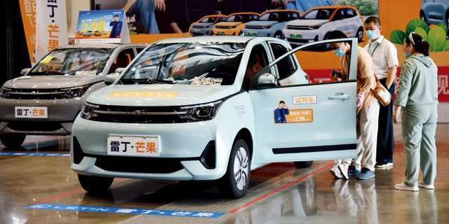
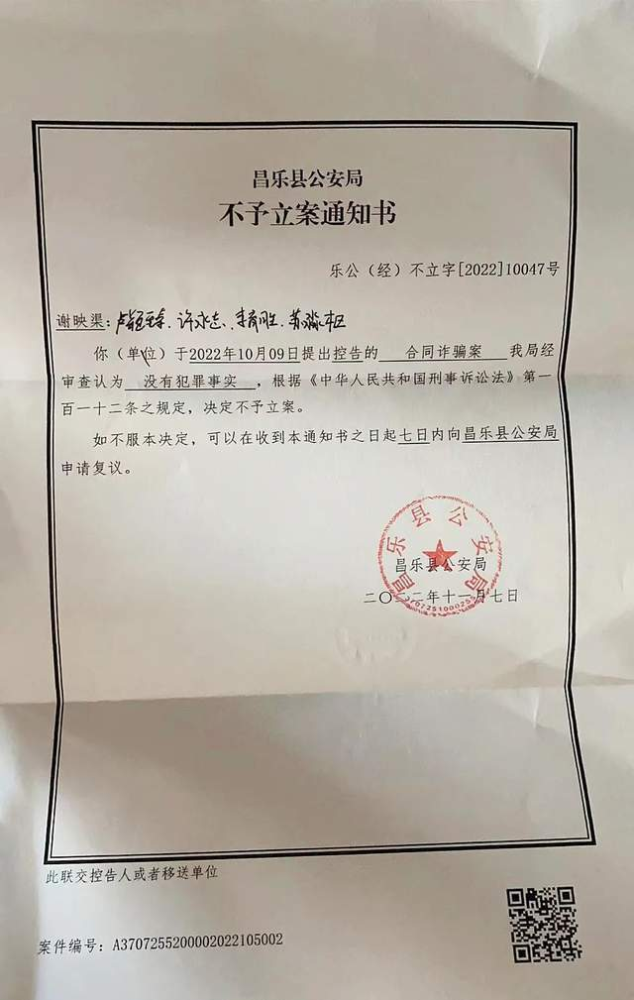

# “老头乐一哥”的失速迷局

创始人李国欣实名举报昌乐县县委书记111天后，5月5日，昌乐县人民法院公告显示，昔日的“老头乐”龙头雷丁汽车集团有限公司已向其申请破产。

2023年1月14日晚，雷丁汽车创始人李国欣通过集团官方账号，发布其本人出镜的举报视频。除了实名举报现任县委领导，李国欣还称，由于昌乐县政府不愿为雷丁提供续贷支持，影响投资者信心，进而导致雷丁融资无法如期到位、企业停工停产。举报发出当日，山东宣布成立省市联合调查组，进驻昌乐县调查核实情况，依法依规处理。

《中国新闻周刊》调查发现，在李国欣发出举报信前，从2021年4月第一台雷丁芒果下线起算，从生产低速电动车转型微型电动车的雷丁汽车，已累计向约500家经销商收取数亿元预付车款而无法交车，其中不乏由雷丁销售人员撮合并承诺由集团提供担保的银行贷款。目前，这些贷款已出现大量逾期。

记者实地探访发现，位于昌乐县比德文路的雷丁产业园和比德文产业园十分安静，据保安称，除各部门还有一两名值班员工外，园区已没有员工来上班，自己也已三个月未领到工资。此外，雷丁产业园门口还长期有一名昌乐县政府工作人员留守接待来访的经销商。

_5月24日，位于山东潍坊市昌乐县的雷丁产业园十分安静。昌乐县人民政府工作人员每天在产业园门口值班，接待前来追款的经销商。摄影/本刊记者
王宇_

昌乐县相关工作人员表示，县政府也在帮助企业接待经销商，统计经销商诉求，并积极接洽意向投资方，尝试推进雷丁汽车破产重整。“归根结底，雷丁是一家民营企业，它与经销商之间是市场行为，经销商不能因为自己投资亏损就找政府兜底。”

《中国新闻周刊》了解到，早在2022年春节过后，雷丁便已陷入经营困境。此后，雷丁先后尝试通过向银行出质股权、接洽A轮融资投资方、向经销商收取大笔预付款等方式填补“窟窿”。但“窟窿”如何形成，规模究竟几何，经销商数亿元预付车款的最终流向，仍是未解之谜。

**急于转型的雷丁，寻出路的经销商**

在县城卖了六年“老头乐”，从建筑工地走出来的刘俊涛终于攒下了几十万元积蓄，但仅是拥有这笔钱并不能使他感到放松——“老头乐”彻底退出市场的风声越来越紧，刘俊涛渴望变成“正规军”。

2021年，这位洛阳市宜阳县的雷丁低速电动车经销商突然看到了机会。这是一辆对标五菱宏光MINI
EV的五门四座A00级电动车，共有4款车型可选，糖果配色和其精巧的外观，与“雷丁芒果”的产品名称颇为相称，官方预售价格2.98万元起步，2021年4月19日开放预定。但当雷丁的业务员找上门来，邀请刘俊涛代理这款新车时，刘俊涛并未回应。

_2021年10月，车展上的雷丁芒果新能源汽车。图/视觉中国_

“其实2019年雷丁收购四川野马不久，就推出过一款高速车，用的是低速车的车壳，换上了大电机、大电池。我当时就订了6台车，但那款车做得很失败，造型、续航都还是低速车的标准，价格还高，市场并不认可。先发来的两台车很久都没卖掉。”刘俊涛要求对尚未发货的四辆车做退换货处理，雷丁没有同意。

因此，时隔两年听到雷丁再造高速电动车，刘俊涛立即警觉。

雷丁汽车成立于2008年，其前身是以电动自行车起家的潍坊比德文电动车有限公司。雷丁汽车所在的山东省，是中国低速电动车的发源地。公开资料显示，2016年至2018年，押中低速电动车风口的雷丁汽车销量分别为15万、21万和28.7万辆，三年蝉联低速电动车销冠，市场占有率一度超过30％，成为国内“老头乐一哥”。

但雷丁盛极而衰的分水岭也很快出现。俗称“老头乐”的低速电动车一直处于监管灰色地带，2018年，工信部等六部委发布《关于加强低速电动车管理的通知》，要求各地政府按照“升级一批、规范一批、淘汰一批”的总体思路，停止核准或备案低速电动车投资项目，停止新建低速电动车企业、扩建生产厂房等基建项目。

面对已经做大的市场蛋糕，李国欣显然不打算就这么放弃“造车梦”，他开始想尽办法“转型”。2018年4月，雷丁汽车在昌乐县支持下，收购陕西秦星汽车有限公司，获得了新能源商用车和特种车生产资质，对外宣布投资200亿元，在咸阳建立生产基地。2019年1月，雷丁汽车以14.5亿元收购四川野马汽车，获得新能源汽车、传统燃油乘用车、客车的生产资质，昌乐县为此提供13亿元担保贷款。

起初，包括刘俊涛在内的经销商都对转型后的雷丁电动车存疑。直到洛阳市周边的经销商提回现车，“我看了车，造型很时尚，吸引年轻人。”2021年6月，刘俊涛自行试乘试驾之后，才决定代理。“决定代理以后，要先打5万元的保证金，还有5万元的店面装修款，还有首批10台车的车款。”刘俊涛告诉《中国新闻周刊》。

江苏盐城，经营一家汽贸店20年的高浩炜知道，如今的消费者越来越认汽车品牌，而汽贸店模式决定了其销售的产品，定价从几千元到上百万元不等，难以形成品牌势能。事实上，他的店铺销售已经连续下滑10年，相比2012年的销售巅峰，收入跌去了一半。疫情加速了店铺的淘汰，高浩炜相信，要活下去，只能转向品牌专营。

然而，要走通这条路并不容易。“各个汽车品牌经销体系的进入门槛很高，资金门槛自不必说，除此之外，要考核你销售团队的能力，要判别你在当地政商界的人脉，还要考核你的店面选址。”高浩炜告诉《中国新闻周刊》。2021年10月，当雷丁的销售人员找到从未与雷丁合作过的高浩炜时，他惊讶地发现，雷丁的入网条件要宽松得多，除了预付一定数额的货款，没有其他硬性要求。

主营燃油车销售15年的广东江门汽贸店主许可同样需要转型。“当时市场上几万块的电动车是非常少的，2021年6月，雷丁的销售找到我，我看好它的市场空间，再加上我们自身转型需要，有兼做品牌的需求。”许可告诉《中国新闻周刊》。

新疆乌鲁木齐，杨建民从2011年开始，为四川野马用户提供品牌授权的售后服务。四川野马被雷丁收购后，杨建民在2021年转型成四川野马的经销商，当年11月，接到四川野马的停产通知，杨建民办理了退网。2022年5月，寻找出路的杨建民看到雷丁汽车微信公众号发布招商信息，主动联系了负责新疆区域的招商经理。

从车型上看，据多位经销商介绍，雷丁芒果发布时，虽宣称有130km、185km和300km三个续航版本，但事实上，定价2.98万元的最低配车型一直缺货，且由于车内没有空调，续航太短，基本没能在市场上流通。“后来又增加了续航200km的车型，我们基本上是卖这一款，带冷暖空调，售价4万多元。”刘俊涛说。

从数量上看，记者获得的一份雷丁经销商返利政策说明显示，雷丁向经销商的返利分为基础返利和台阶返利两种。其中，基础返利是根据车型不同，按每台1000元、1500元、2000元向经销商返利；台阶返利则是根据订单数量，分为“≤9台”“10-29台”“30台及以上”，每台分别向经销商返利2000元、3000元及3500元。

《中国新闻周刊》调查发现，不论是车型还是订购数量，经销商的选择空间并不大。这一方面是因为产能不足，雷丁销售通常会建议经销商在订购系统内选择单一车型，经销商无法选择心仪的车型、配置；另一方面，销售人员会明示或暗示经销商，产能不足的情况下，雷丁优先保供能力更强的大经销商。

“过去，我给其他的品牌厂家打款，都是先指定车型、颜色，但是在雷丁不行，指定不了，都是随便他们来指定分配车型。大区经理和销售人员也暗示我，说他们也在跟其他有合作意向的经销商谈，而我表现得比较好，招待周到，所以只要把货款打过去，入网的事情就定了。”高浩炜告诉记者。

面对曾经的低速车经销商，雷丁的销售系统在催款上表现得更为强势。记者获得的一份雷丁湖北区域销售人员聊天记录显示，在2021年4月21日，销售人员转发斥责经销商的大区通知：“各位雷丁低速的家人们⋯⋯想干就直接给高速打款，不能干就不要拖拖拉拉，明天打不了高速款的，22日开始一律重新排查开发其它商家，也别找我说情⋯⋯看看人家益阳、麻城等等已打款的客户，直接利索，你不做不打款，高速这边就不考虑了，低速业务也不会再给你打电话⋯⋯”

**经销商在填补造车“窟窿”？**

“从2022年7月19日打款637000元至今，我一辆车都没有收到。”杨建民告诉《中国新闻周刊》。

多位经销商告诉记者，在汽车销售行业，经销商向厂家预付车款是通行做法。但与雷丁不同的是，其他品牌通常都会在收款后一周内交车。

多名经销商反馈，雷丁芒果上市初期，市场反馈很好。汽车之家数据显示，2021年1月至6月，雷丁芒果下线不足两月，总销量为4095台，在微型车市场销售排行榜中位列第十名。“来一台卖一台，所以我们急着要车。”

2022年6月20日，负责新疆的雷丁区域销售罗超到乌鲁木齐与杨建民见面。此前，由于杨建民服务四川野马10年，相比其他新入网经销商，有更多了解雷丁的信息渠道。杨建民通过多位同行朋友了解到，雷丁在2021年已经向经销商欠货超1万辆。因此，当他看到雷丁在2022年5月发出的招商公告后，先向罗超确认公司是否恢复正常。“罗超告诉我，公司发展正常，没有任何问题，可以发车。”杨建民说。

向雷丁预付的63.7万元中，50万元是车款，10万元是一级销售商押金。杨建民原本计划只订6台车，在系统内完成车型选择后，销售告诉杨建民，由于新疆距离远，物流不方便，建议他将数量增加到10台，“凑够一板车”。杨建民同意后，销售进一步提出，每辆车还要收取2000多元的运费。“事后我问物流的朋友才知道，一板车的数量是8台，而不是10台。”杨建民告诉《中国新闻周刊》。

与几乎所有的雷丁高速车经销商处境相似，杨建民没有拿到纸质或电子版合同，雷丁也未对交货时间、交付车型做出任何书面承诺。谨慎起见，杨建民曾在7月13日与罗超微信确认，打款完成后，杨建民将成为新疆乌鲁木齐市和昌吉市的唯一经销商。杨建民与雷丁销售罗超的聊天记录显示，罗超承诺杨建民将在7月底收车。

7月22日，杨建民微信告知罗超称已换租地段更好的商铺，罗超对此未做回复。8月2日，迟迟不见雷丁发车的杨建民再次发微信，告知罗超新店已搬好，“就等芒果车了！现在什么情况？”罗超回复：“预计6号给新疆联系好物流发运。”此后，杨建民分别在8月5日、8日，多次催问发车进展，罗超均以“开完会打电话”“明天回电话”，未做正面回复。

8月19日，忍无可忍的杨建民打电话给罗超，催问进展。事后，罗超微信回复称：“在2022 前半年原材料疯狂上涨以及 2021~2022
属于集团公司大面积投资建生产基地阶段，资金周转情况在今年前半年十分艰巨，在 6
月份已和成都市政府签订完融资框架协议，而且在本月中旬已完成进（尽）调。希望您作为投资人，能再给我们几天时间，您的处境我真的非常理解。至于您担忧的公司倒闭问题，以及您的资金安全问题，目前没有任何风险，还是那句话，在职
4 年，雷丁公司目前没有坑过任何一个经销商车款保证金。”

8月20日，罗超发来《四川省关于扩大工业企业让电于民实施范围的紧急通知》，称因为这份通知，发车时间再次顺延5天。

此时，已经意识到问题的杨建民还不知晓，2021年全年，雷丁向经销商欠车的问题不仅没能解决，经过2022年上半年经销商网络持续铺设、销售持续开展，雷丁在经销商一侧的“窟窿”已经越来越大。

雷丁事发后，昌乐县人民政府曾向经销商下发过纸质和电子版的诉求统计表。记者获得的一份有200多名经销商诉求表的资料包、一份包括经销商打款收车明细及证据的统计表显示，雷丁经销商入网大体可分为2021年以前及2022年以后两个阶段，每家经销商累计向雷丁预付车款的数额少则超过50万元，多则数百万元。

其中，一部分经销商在2021年持续向雷丁打款、持续欠车十数台后，在2021年底到2022年初停止打款；还有一部分经销商2022年春节后才入网，打款一直持续到2022年下半年。2021年以前入网的经销商，收车数量整体上远大于2022年入网经销商。

2022年9月26日，杨建民前往昌乐县雷丁产业园，见到了雷丁营销公司副总经理刘伟，要求雷丁发货或退还预付车款。

“公司现在已经到了这种程度，进来这些钱以后，把这些钱全部退掉，把所有经销商都退完的话也没问题。现在把这一大半钱都退给经销商之后，剩下一点点钱，我去活命的时候，可能就活不了了。”刘伟在杨建民提供的谈话录音中解释。

“不瞒您说，9月我们生产了不到100台车，每个客户分个一台、两台，太远的市场根本就过不去⋯⋯现在这些车，出来以后马上就开给了经销商，账上一台车都没有了。”刘伟当场拒绝为杨建民发车，就杨建民提出的退款，刘伟表示，公司有统一的退款政策，即6个月内分批退款。杨建民提出缩短退款周期，亦被刘伟当场拒绝。

雷丁事发后，高管集体失联的情况下，刘伟成为昌乐县政府向经销商不定期通报进展时，唯一指定联系的企业留守高管。2023年5月24日，《中国新闻周刊》拨通了刘伟的电话，听到记者说明来意，刘伟否认自己曾负责销售事宜。再三追问下，刘伟表示自己只负责销售部门的费用事宜，便匆匆挂断电话。

雷丁市场部门一名已离职中层管理人员告诉《中国新闻周刊》，2022年春节以前，雷丁的生产秩序较为正常，当时产能主要受疫情扰动供应链、原材料涨价影响。但2022年春节后，公司经营秩序出现了明显问题，其作为市场部管理人员，也多次参与撰写融资材料、接待投资方。但这位离职员工表示，虽然公司资金链出现问题，但普通员工并未降薪，降薪主要针对高管，而他作为中层管理，受到轻微影响，“比如该发的奖金没有发。”

**合同诈骗能否成立？**

“现在这里已经有这么大的窟窿了，总归需要去填的，不管是供应商也好，经销商也好，这个窟窿是一直在的。如果公司不去正常生产、存活下来，把这个窟窿慢慢填起来，大家就直接兵败如山，‘哗’地全部倒下了。”在向杨建民解释为何不能一次性全额退还车款或缩短退款周期时，刘伟如是回应。

但他的解释显然无法服众。雷丁事发后，各地经销商交换信息后主张：早在2021年，雷丁的产能就不足以履行经销商的预付订单，此后又不断以公司正在融资、资金即将到位等理由诱骗经销商继续打款。杨建民则表示，在与刘伟的谈话中，后者明确表示经销商的预付车款被用于雷丁的资金周转，并非全然用于车辆生产。

按照《刑法》规定，合同诈骗罪是指，以非法占有为目的，在签订、履行合同过程中，骗取对方当事人财物。包括没有实际履行能力，以先履行小额合同或者部分履行合同的方法，诱骗对方当事人继续签订和履行合同的；收受对方当事人给付的货物、货款、预付款或者担保财产后逃匿等几种情形。

目前，已有多名经销商尝试向昌乐县公安局和店铺经营所在地公安局报案。江门经销商许可提供的一份由昌乐县公安局2022年11月7日出具的《不予立案通知书》显示，许可等4名经销商于2022年10月9日提出控告的合同诈骗案，“我局经审查认为没有犯罪事实⋯⋯决定不予立案”。

_昌乐县公安局出具的《不予立案通知书》。图/受访者提供_

刘俊涛向宜阳当地公安机关报案无果后，于今年4月4日向河南省公安厅信访处递送了举报材料，并于5月11日收到洛阳市公安局的回访电话，目前案件尚未有进一步进展。

“雷丁集团的行为是否构成合同诈骗，要根据具体的案情来判断。判断是否构成合同诈骗罪的要件有二：第一，要看其有没有虚构事实、隐瞒真相，也就是有没有所谓的欺诈行为；第二，要看其是否有非法占有他人财物的主观故意，这要根据其有无履行合同的意愿、行为和能力来综合判断。”北京市尚权律师事务所主任毛立新告诉《中国新闻周刊》。

毛立新介绍，司法实践中，对于“以非法占有为目的”这样主观故意的认定较为困难。“如果经营主体是真实存在的，那么具体的行为到底是经营活动中的欺诈，还是有非法占有目的的诈骗犯罪，往往有一定的争议空间。”

值得注意的是，由于雷丁已向法院申请破产，对于经销商而言，能否最终认定雷丁合同诈骗，会对追款结果产生显著影响。

“合同诈骗是否能成立，第一步要看公安机关是否立案，第二步要看立案后的侦查情况。如果认定了经销商是合同诈骗案件的受害者，那么公安机关可以追缴财产发还被害人，因为这部分财产本质上是属于被害人的财产，不能纳入到破产程序的财产处置范围内。”毛立新分析，此外，由于雷丁已经进入破产程序，经销商可以债权申报的方式来维权，但这种方式会受到雷丁资产状况的限制。“也就是说，最终是所有债权人在一口大锅里分雷丁的剩余资产。如果经销商是刑事案件的被害人，那么这种救济途径可能就很不公平。”

**巨额“窟窿”如何形成？**

企查查数据显示，5月29日，雷丁汽车持有的1.2亿元四川野马汽车股权，已被山东省潍坊市奎文区人民法院冻结一年。从2022年12月起，不到半年的时间，雷丁汽车持有的四川野马汽车股权，被冻结数额已超过5.96亿元。此外，雷丁汽车已在今年3月31日、4月30日发生三笔票据违约，逾期金额分别为2900万元、4900万元和600万元。

“跟四川野马深度合作之后，由于我们之前没有请尽调公司，是由自己公司财务查的账，公司跟四川野马交割完了，才发现供应商体系还有很多隐形债务，表面上是用不到13亿的现金收购的，实际上花了将近50个亿。”在向杨建民解释雷丁资金链何以紧张时，刘伟将收购四川野马带来的财务压力视为首要原因。

但刘伟的解释与事实不符。查阅2019年1月的公开报道不难发现，四川野马的股权转让是以匿名形式在北京产权交易所挂出，挂牌标的详细披露了包括2.7亿元长期负债和35.5亿元流动负债在内的38.3亿元总负债。1月6日，《北京商报》便查证确认此标的视为四川野马82.5％的股权。

而雷丁与野马汽车正式签订战略重组协议是在2019年1月18日。“签完合同，很多供应商开始来找我们要钱，公司接盘（四川野马）就闹了大半年，收购完成后，我们的收入在降低，公司也是二次创业。”刘伟说。

刘伟表示，从低速车转型高速车，所需的资金量远远超过雷丁的预料：“如果是低速车，我们拿出5个亿来在体系内转，是很OK的。低速车出厂价2000多块钱一台，一万台也才卖两个亿，内部循环费用5个亿，差不多就够了。但是突然切入（高速车），发现完全不是一个体量级，就是拿50个亿，也不是个大数。进去以后发现，要玩这个体系，不是20亿，是80亿、100亿。”

“老板是做民营企业出身的，对资本的认知比较弱。虽然公司很早也提出过要上市，但老板对于这件事靠不靠谱、好不好玩有疑虑，自己干到50岁了，最后说不定被（资本）掏空、套牢，空手而归。基于这些想法，对于融资，公司一直没有太重视。”刘伟表示。

值得注意的是，在刘伟接待杨建民的2022年9月26日，刘伟表示，雷丁已经向潍坊市政府融资数亿元，“前段时间政府进来了1.8个亿。”此外，刘伟表示雷丁正在与四川省政府洽谈，“尽调工作已经结束了，但不知道是不是成都疫情影响，原本8月底就给（钱）⋯⋯现在领导给我反馈的金额大概是5.7个亿。”

而网络流传的一张李国欣与王骁微信聊天记录截图显示，2022年9月26日正是李国欣开始频繁联系王骁寻求政府支持续贷的起点。《中国新闻周刊》记者提及这份聊天记录的内容时，昌乐县相关工作人员未否认其真实性。

根据雷丁汽车2022年11月21日披露的A轮融资消息，李国欣提到的32亿元融资，是由潍坊市潍城西部投资发展集团领投。

在这份聊天记录中，2022年12月30日，李国欣向王骁表示：“目前融资30多亿但只交割了2亿，资本了解到昌乐政府不再续贷支持我们，他们就不敢再给钱了，潍坊的各家银行机构得知昌乐政府不提供抵押物和不支持这个产业了，大家也开始压缩贷款。”

在此前的举报信中李国欣指控县委书记“对昌乐的企业漠不关心，几乎不去企业，对企业的事情从不过问”。

5月27日，《中国新闻周刊》联系和探访了李国欣举报信中提到的阳光纸业、英轩实业、佳成数码等企业。其中，阳光纸业与佳成数码听闻记者来意后，拒绝接受采访。而英轩实业集团办公室一名工作人员表示：“我们觉得王骁书记还是挺负责任的，没有对企业不闻不问，主要是（如果）他来得太频繁，企业也不一定受得了。”

而李国欣则把雷丁陷入停工困境的矛头指向县政府，认为政府态度的“变脸”是导致企业资金链断裂的根源。但事实上，雷丁可能早已存在严重的经营风险，当地政府也不可能不了解。

对于昌乐县委县政府是否在雷丁崩盘中扮演了什么角色，昌乐县委宣传部表示无法回应，一切应以省市联合调查组的通报为准。

“雷丁本身是一家民营企业，政府没有义务为它兜底。”前述昌乐县政府工作人员回应称，目前县一级政府所能做的，就是在等待调查结果的同时，积极帮助企业引入投资人，推进企业进入破产重整程序，统计经销商诉求。

“1月14日是小年夜，从李国欣发出举报信开始，我们就一直围着这个事情转。我们昌乐受到非常大的影响。我们最希望昌乐能早点恢复招商秩序，我们最急切地等待调查结果。”前述昌乐县政府工作人员表示。

（应采访对象要求，许可为化名）

发于2023.6.5第总第1094期《中国新闻周刊》杂志

杂志标题：“老头乐一哥”的失速迷局

记者：王宇

