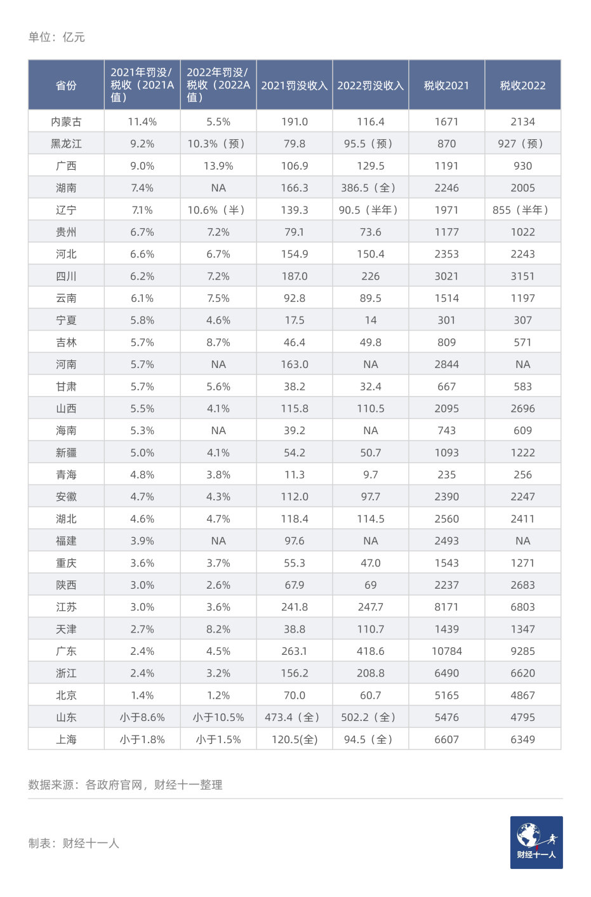
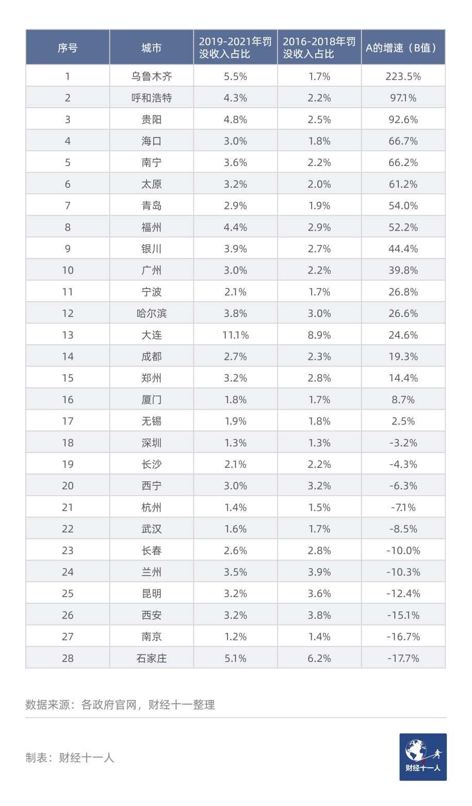
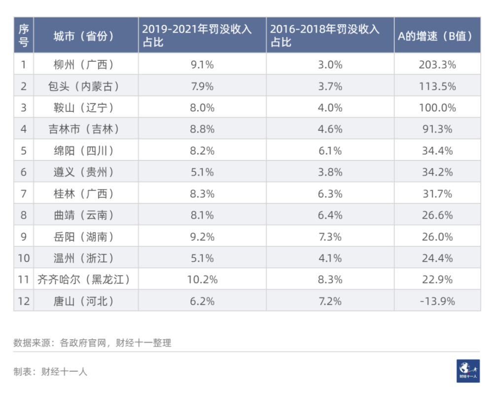
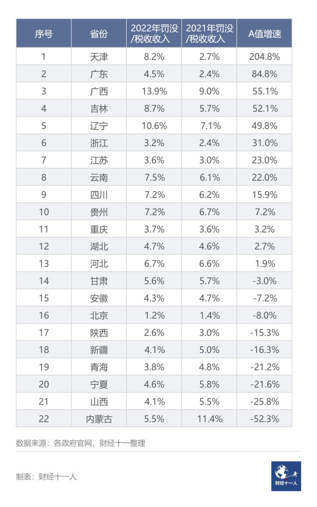

# 中国哪些省市罚没收入高？

**划重点：**

  * _1_ 某些省的“罚没收入占比”显著高于其他省份。数值最高的前十名，大多来自东北、西南、华北地区。
  * _2_ 在2018年以后，大部分省份的“罚没收入占比”上升了，其中有些省份的上涨比例很大。
  * _3_ 在一二线和省会城市中，除了大连、乌鲁木齐、石家庄，“罚没收入”占比都较低。
  * _4_ 我们选择的三四线城市中，除了温州、遵义，“罚没收入”占比都比较高。而且这些三四线城市的数值还在上升趋势中。

**文 | 陈汐**

按照政务公开的要求，各地政府每年需要披露财政收入的构成。在一般情况下，税收收入占比越高，财政收入的质量越高。从发展方向看，财政收入应以“税收收入”为主，“非税收入”和其他类型的收入，所占比例应当呈下降趋势。

**“罚没收入”是指** 执法、司法机关，对违法违章者罚款的款项、没收的赃款和赃物变价款。“罚没收入”属于“非税收入”。

一个地区“罚没收入”与税收收入的比值（下称“罚没收入占比”）除了可以反映当地财政收入的质量，还可以反映一些其他信息。

在不同地区，“罚没收入占比”差异巨大。在某些城市，这个比值接近于1%，比如南京、深圳。

而在另一些城市，这个比值超过了20%，比如辽宁省盘锦市。

“罚没收入占比”不应过高，而且不应增长过快。在很多城市中，这个比值是长期稳定的，甚至是下降的。

“罚没收入”虽然是各地财政收入报表中不起眼的一个项目，但经常引发关注。比如2021年底，国办督查室公开通报，河北省霸州市政府违规下达任务，组织运动式执法，乱罚款、乱摊派。再如，2022年7月，媒体报道山东省成武县交通局在货车未违法之前，向货车司机出售罚款“月票”。这些事件都曾引发广泛热议。

那么，中国哪些省市的“罚没收入占比”比较高？

**本文的观察指标是，“罚没收入占比”。为了行文的方便，我们将其定义为“A”，即**

**A =“罚没收入”/ 税收收入 = “罚没收入占比”。**

下面，我们先分析中国各省、自治区、直辖市（下称各省）的情况，然后分析一些重点城市的情况。

**各省的“罚没收入占比”**

本文的分析不考虑港澳台地区，同时因为未能找到江西和西藏的相关数据，也将这两者忽略。

表1按照各省2021年的“A值”排序。这里用2021年数据排序，是因为有些省份尚未披露2022年数据。

**表1: 各省2021年和2022年的“罚没收入”与税收收入**

_注1:NA表示数据不可得。
注2：山东、上海没有单独披露2021年和2022年的“罚没收入”，而是将其纳入了“非税收入”项目下的“其他收入”；湖南没有单独披露2022年的“罚没收入”。所以在相应数据之后标了（全），以示区分。
注3:黑龙江2022年“罚没收入”和“税收收入”为预算数据，并非真正的执行数据。所以在相应数据之后标了（预），以示区分。
注4:辽宁2022年“罚没收入”为上半年数据，所以在相应数据之后标了（半年），以示区分。_

从表1数据可算出，各省2021年“罚没收入占比”（即A）的中值是5.3%。表1中，内蒙古、黑龙江、广西的A值超过了9%；湖南、辽宁、贵州、河北、四川、云南6省的比值超过了6%。和中值相比，这些省份偏高。

2021年，A值低于4%的有9个，其中包括四个直辖市，以及广东、浙江、江苏、福建、陕西五省。

但需要注意，以上排序仅用了2021年的数据，这有可能导致排序失真。比如，如果某省2021的“罚没收入”远远高于或低于其他年份，那么表1的排序就有失公允。

解决以上问题的一个方法是，用多年数据的平均值。下面看看各省最近4年（2019年-2022年）“罚没收入占比”的平均值，这个结论更有意义。图1给出了计算结果。

**图1: 各省2019年-2022年A值的四年平均值**

_注1:忽略了山东和上海，因为未单独披露“罚没收入”。
注2：如果某省缺乏2022年数据，那么就计算2019年-2021年数据的平均值。 注3：此处的平均值是加权平均值。_

图1中26个数据的中值为5.1%，这与2021年的中值5.3%非常接近。图1的前十名和表1的前十名基本重合。只是，图1中多了天津、吉林，少了四川、宁夏。

因为用了四年的数据，图1比表1更能反映哪个省份的“罚没收入占比”偏高。

在图1中，辽宁、广西、黑龙江最高，其数值大于7%，东三省占了两席。

**数值最高的前十名，大多来自东北、西南、华北地区。其中包含东北三省：黑龙江、吉林、辽宁，包含西南地区的广西、贵州、云南，包含华北地区的天津、河北、内蒙古。**

需要注意，因为A =“罚没收入”/
税收收入，似乎税收收入越少的省份，A的数值就越容易偏高。但事实上，很多税收收入少的地方，A的数值并不高。比如，西北地区的陕西、甘肃、青海、宁夏的A值都不高。

一位财政研究专家对《财经十一人》说，从各省“罚没收入占比”的高低，可以看出一些信息，但不能反映问题的全貌。有些省份虽然数值偏高，但却具有合理性。所以，
**“罚没收入占比”并不是批评或表扬的基础，只是提供一些客观数据，提供一个思考和研究的方向。**

“罚没收入占比”既不应该过高，也不应该增长过快。如果经过短短几年时间，某省的A值从2%涨到了比较高的数值，也应该引起关注。

**各省的“罚没收入占比”增速**

一部分读者可能关心各省2022年相对于2021年的增速，尾注列出了这个数据。但是，仅靠两年数据得出的增速，是不客观的。所以，我们选了两个时间段：2019年-2022年、以及2014年-2017年，每个时间段都是四年。

通过比较两个时间段的“罚没收入占比”的变化，可以得到更可靠的结论。

我们发现，黑龙江、吉林、辽宁、天津、内蒙古、新疆、四川、广西、贵州，不仅“罚没收入占比”较高，而且增速较快。比如，天津的A从1.7%上升到6%，贵州从3.5%到6.5%，
广西从3.9%到7.5%。

天津2014年-2017年，总“罚没收入”为135亿元，而2019年-2022年，总“罚没收入”为364亿元。贵州前四年为170亿，后四年为291亿。

上述财政研究专家对《财经十一人》说，因为研究中所选的一个时间段为“2019年-2022年”，这里面包含了三年疫情。而在疫情之下，管理规则和管理行为与之前相比必然有所不同。所以，对于增速快的地区，需要更深入地分析具体原因，才能提出有利改进的建议。

下面是具体数据的计算过程。

我们定义两个时段的增长率为B，即

**B = （2019年-2022年“罚没收入占比” / 2014年-2017年的“罚没收入占比”） - 1。**

表2列出了计算结果。

**表2: 2019-2022四年与2014-2017四年相比A的增长率（B值）**

_注：如果某年的“罚没数据”缺失，则在计算时，忽略该年。_

表2前十名中，甘肃的增速虽然较高，但A值仅仅从0.7%增长到1.3%，还处于很低的水平。

在分析了各省之后，我们分析一些重点城市的情况。

**一些重点城市的“罚没收入占比”和其增速**

在这一部分，我们发现，绝大部分的一二线城市以及省会城市的“罚没收入占比”相对低，增速也相对合理。而三四线非省会城市的数值相对较高。

下面是分析过程。

由于很多城市没有公布2022年数据，我们分析各城市2019年-2021年的“罚没收入占比”（A值）。同时看看“罚没收入占比”的增速（B值）。

受数据所限，这里的B值定义如下：

**B=（2019年-2021年的“罚没收入占比” / 2016年-2018年的“罚没收入占比”）- 1 。**

这里比较的是两个时长为三年的时间段：2019年-2021年，以及2016年-2018年。

先看一二线城市和省会城市的情况，结果见表3。

**表3: 一二线城市和省会城市的A值与B值**

_注1：如果某一年数据缺失，则算另外两年的加权平均值。所选城市不存在两年数据缺失的情况。
注2：忽略了数据不全的城市。_

表3中2019年-2021年，除了大连、乌鲁木齐、石家庄，“罚没收入占比”都低于5%，也就是都比较健康。而且，石家庄虽然A值较高，但增速为负值，说明A在变小，这也是健康的标志。

再看三四线城市的情况，结果见表4。因为三四线城市太多，这里只选了一些有代表性的城市。温州，代表富裕城市；桂林代表旅游城市；其他城市都是“罚没收入占比”偏高省份中GDP排名第二或第三的城市。

**表4: 三四线城市的A值与B值**

_注1：如果某一年数据缺失，则算另外两年的加权平均值。所选城市不存在两年数据缺失的情况。_

表4中2019年-2021年，温州和遵义的“罚没收入占比”最低为5.1%，而表3的28个城市的同时期数据中仅大连、乌鲁木齐超过了5.1%。

上述财政研究专家说， **5%是本文研究各省数据时得出的中值，有一定参考意义。低于5%是健康的，但高于5%并不一定代表不健康。**
涉及到城市，还是应该具体案例具体分析。

除了温州、遵义，表4其他城市2019年-2021年的A值都比较高。而且，除了唐山，所有城市的B值都为正，这说明“罚没收入占比”还处于增长趋势。柳州、包头、鞍山增速超过了100%。

表4中的这些城市，在本省内都还算经济条件比较好的城市。

**结语**

通过本文的数据，我们发现某些省的“罚没收入占比”（A值）显著高于其他省份（图1）。数值最高的前十名，大多来自东北、西南、华北地区。在2018年以后，大部分省份的“罚没收入占比”上升了，其中有些省份的上涨比例很大（表2）。

在一二线和省会城市中，除了大连、乌鲁木齐、石家庄，“罚没收入”占比都较低。而在我们选择的三四线城市中，除了温州、遵义，“罚没收入”占比都比较高。而且这些三四线城市的数值还在上升趋势中。

罚款必须公正客观，不能成为地方创收的工具。为了规范罚款行为，规则要明确具体。

西南政法大学教授蔡斐曾撰文称，从理论上来说，罚款行为与“执法创收”没有关联。但是，有时立法有些宽泛，就为罚款沦为地方创收工具提供了可乘之机。

比如《安全生产法》规定，对因违法行为导致发生生产安全事故的主要负责人，处以2万元以上20万元以下的罚款。那么，在2万到20万之间就存在一个巨大的弹性空间。

所以，罚款数额的从轻、一般、从重档次情形应该明确具体，尽量压缩自由裁量的空间。

同时，各种规则也应该更加合理。比如，有些大货车司机说，按照规定车辆运行4小时必须休息20分钟，这20分钟内只要监测到车辆运动就算违规，扣3分以上，罚款200元。但有时他们却被迫违规，比如大车装货是排队前进的，虽然缓慢，但的确在运动。如果在这个过程中到了4小时，大车也必须继续行驶，因为不能挡住后面的车。

如果规则改为，4小时之后的20分钟内，移动距离不能超过一公里，也许就能解决这个问题。

**其实，不管在哪里，罚款都应该是一种促进行为向善的手段，而不应该成为一种目的。**

**尾注：各省2022年相对于2021年的A值增速**

**作者为《财经》产业研究中心研究员，编辑：刘建中**

