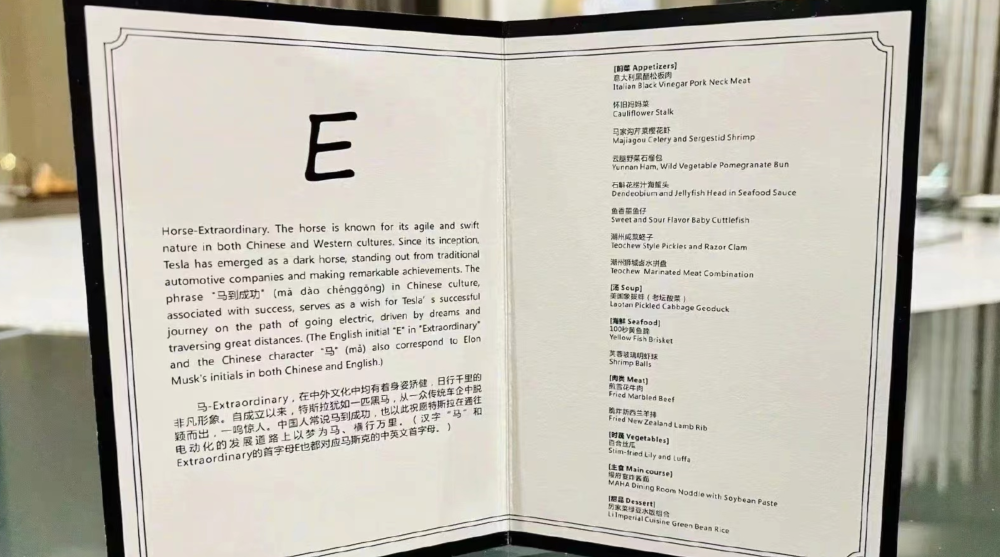
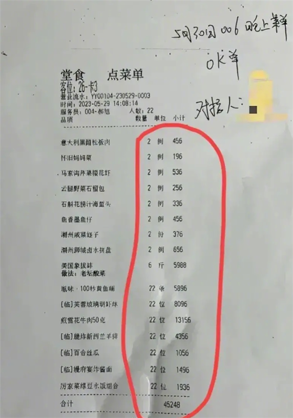

# 人均超2000！马斯克来华首日晚宴费用曝光：22人花费4.5万元

鞭牛士6月4日消息 本周，特斯拉CEO马斯克时隔三年访华，在国内的首次晚宴受到了广泛关注，菜单也很快曝光。

现在，这份晚宴菜单对应的小票曝光，“马斯克北京首日的晚宴究竟花了多少钱？”这一问题的答案，终于浮出水面。

根据这张小票照片来看，在晚宴全部16道菜品中，单品价格最贵的，也是在菜单曝光时受到讨论最多“美国象拔蚌”，达到了5988元。

而其他菜品的价格，也都保持在了一个相对较高的水准。

从合计等信息来看，这顿晚宴的参与人数共有22人，消费达到了4.5万元左右，平均每人消费2056元左右。

