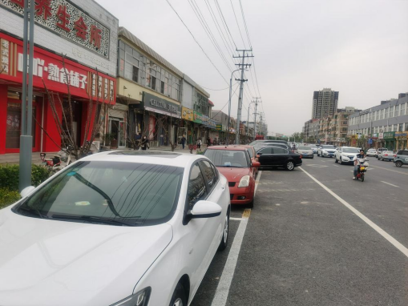
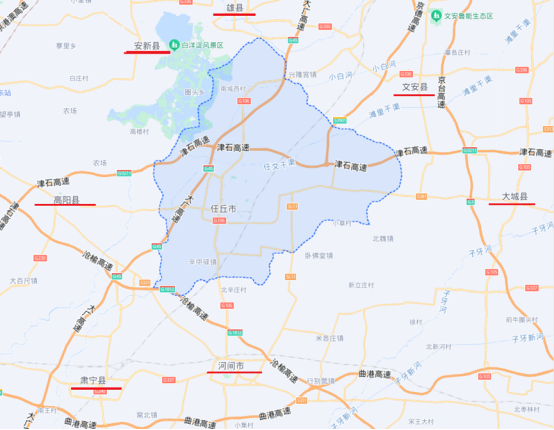
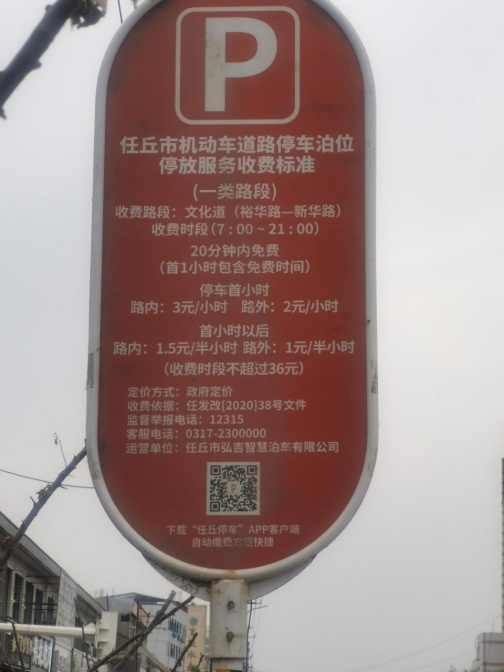
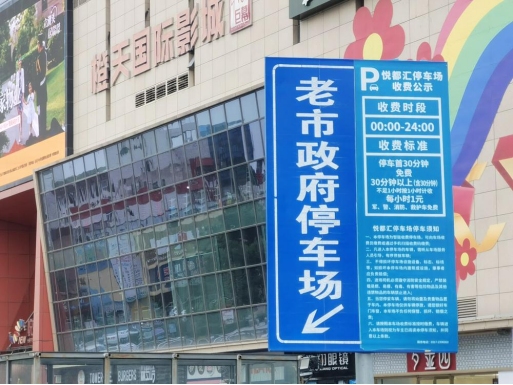
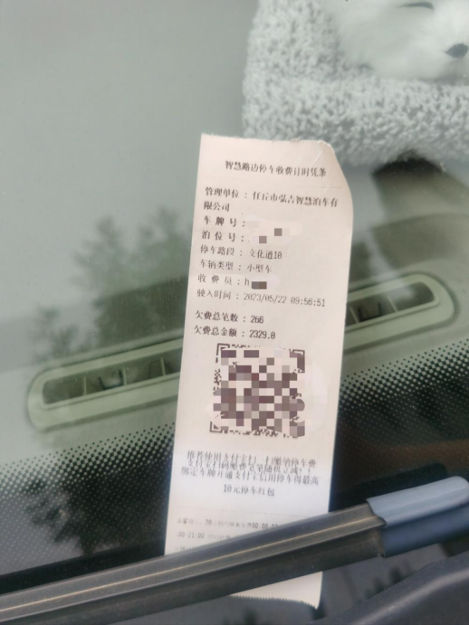

# 县城停车费跟省城一样贵，河北任丘“智慧泊车”车主拒缴费、员工欠薪

**财联社6月4日讯（记者 张良德 王平安 实习记者 马璐瑶）** 总投资超2亿元，规划有近1.9万个停车位的任丘智慧泊车项目，运行3年却陷入僵局。

这座自古有“燕赵名城”之称的县级市，2020年在周边县市中首开路边付费停车先河。此举虽帮助化解了当时的停车难、乱停车问题，但也有不少市民反映其“收费太高”，所划一类路段的路边停车费标准已与省城石家庄齐平。以致如今出现了“车主拒缴欠费-
项目运营困难-员工欠薪离职”的窘况。

如何解开这一僵局？财联社记者注意到，在该智慧泊车项目方案中，预期还包括有广告经营、配套商业设施运营等其他收入来源，以作停车费之外的补充。在疫情后的经济复苏中，若上述两类收入能够放量，则或可缓解当前矛盾。

_图片来源：财联社记者拍摄_

**矛盾：车主嫌“智慧泊车”既“贵”还“不智慧”**

2020年，为缓解城区停车难问题以及路边乱停车造成的交通拥堵，任丘启动智慧泊车收费。这也是其作为河北省综合实力“十强”县市的一次率先尝试。

近日，在对当地的走访调查中，有外地来任丘经商的受访人士告诉财联社记者：“附近几个县（路边）停车都不收费，就任丘收。而且，这个停车收费标准已经和省会石家庄的差不多了。”

_任丘及相邻县市方位图（来源：百度地图）_

就此情况，财联社记者走访、联络了任丘周边的廊坊市文安县、大城县，保定市高阳县，沧州市肃宁县、河间市等县市，以及雄安新区的安新县、雄县，证实上述各县城区的路边停车位均免费泊车。

安新县一当地人士称：“路边有规划的停车位，都不收费，我们这里只要不乱停，都不会贴罚单。”肃宁县一酒店工作人员也表示：“酒店对面就有免费停车场，路边也有免费的停车位。”

而在任丘，据智慧泊车运营方的工作人员介绍，市内一类路段首小时路沿下收费3元，路沿上收费2元；首小时后，路沿下收费1.5元/半小时，路沿上收费1元/半小时，全天封顶36元；二类路段收费标准为路内2元/小时，路外1元/小时，全天封顶28元。车辆自进入泊位开始计时，20分钟内免费停放。此外，三类路段收费则是按次，每次1元，时长以12小时为限。

_任丘一类路段路边停车收费标准牌（图片来源：财联社记者拍摄）_

记者发现，上述一类及二类路段的停车收费标准，比任丘当地主要商场和医院停车场的收费要高。据记者实地了解，任丘多家主要商场的停车收费标准为1小时1元。任丘市人民医院停车场的收费标准为1小时（含1小时）以内免费，1小时至4小时（含4小时）收2元/辆，4小时后，每满2小时加收1元/辆（不满2小时时段不收费）。

_任丘一家主要商场的停车收费标准
（图片来源：财联社记者拍摄）_

再对比省城，财联社记者致电石家庄市城投泊车客服获悉，其智慧泊车一类区域昼间按每小时3元/辆收费，10元即封顶，夜间为每辆次5元。以此计算，如白天停车时长超过4小时，则任丘的一类路段内停车费用还将超过石家庄。

但同时，任丘当地人均收入水平并不算高。有受访者称：“（任丘）本地平均工资大概在3000-4000元/月。”这亦与权威统计数据相符，根据任丘市政府工作报告，2022年该市城镇居民人均可支配收入完成43666元，农村居民人均可支配收入完成22382元。

采访当地车主，在家具公司上班的任丘市民李明向记者表示：“路边停车收费标准太高了，一个小时3块钱，按这个标准，如果我正常缴费，这一个月最多要交将近1000元的停车费，占我收入的1/3到1/4。”

被抱怨收费高的智慧泊车还遭部分车主吐槽不够“智慧”，计时早开始或晚结束的情况时有出现。李明告诉记者：“我遇到过在路边车位停车，车都开走了却还在计费的情况。有一次，我6点下班开车回家了，（但车位预埋的）这个地磁（感应）不管用，它直接扣了我停一天的费用。”

在停车区现场，另一位市民李先生也表示，遇到过同样的问题，“基本上我身边的每个人都遇到过这种（车走了费不停）问题。”

**博弈：“逃单”欠费与诉讼追欠**

“我就是去路边吃个早点，刚和你说了，最多20分钟，你怎么还是给我贴上了。”5月底的任丘街头，一位女车主从早餐店出来，摘下夹在车窗上的停车收费单，向着停车管理员李香花抱怨起来。只见女车主把单子揉成一团扔到地上，“我就是不给你缴！”

对此，李香花反而见怪不怪，始终表现得很平静，任由对方驾车驶离。“不用和他们争，这种情况见得多了。”李香花对一旁目击此事的记者说。

目前，停车收费高的问题已成为车主和运营公司的矛盾焦点，不少车主选择“逃单”。

李明向记者称：“收费不合理，我现在就不缴费。”这种欠费的情况并非个例。在记者采访的多位车主中，停车收费单多显示有数百元甚至上千元的欠费，更有一位车主欠费次数达200余次，欠款金额超过2300元。

_当地车主收费凭条上的停车欠费情况（图片来源：财联社记者拍摄）_

自2020年当地智慧泊车收费系统运营后，就有市民通过多个渠道反馈，对其运营管理模式表示不解。有受访者认为：“公共区域（停车）就应当给市民免费开放。而且就算收费，怎么能让一家私人企业来收呢。”

_弘吉公司办公场所
（图片来源：财联社记者拍摄）_

据公开信息，任丘城市智慧泊车运营管理方为任丘市弘吉智慧泊车有限公司（简称“弘吉公司”），该公司大股东为任丘市城通泊车服务有限公司，是一家民营公司，对弘吉公司的持股比例为90%，任丘市建设投资集团有限公司持有剩余10%股权。

据弘吉公司对外披露的信息，公司是任丘市智能停车场建设工程PPP项目的中标方，以此为依据，获取了任丘市智慧停车的特许经营权，弘吉公司自此取得了对全市约15000个路侧停车位的收费权。

对于收费标准及收费依据，弘吉公司人士告诉财联社记者：“我们的停车收费标准是经（市）发改局定价公示过的，停车收费政策也是经过任丘市政府立项通过的，是没有问题的。”

当地发改局工作人员向记者表示：“大概在2019年左右，我们对停车收费标准举行过座谈会。”

周边的县市一个没动，任丘为何要率先开展城市智慧停车收费，并由弘吉公司获得特许经营权？记者就此问题致电任丘县公安局停车办，但多次拨打电话始终无人接听。

对于车主欠费的问题，弘吉公司员工告诉财联社记者，原来公司对欠费千元以上的车主才进行诉讼追缴，现在有的欠500元以上就可能接到支付令或者诉讼了。

天眼查数据显示，弘吉公司因服务合同纠纷起诉他人及公司的开庭公告已超过350条。

而车主们则对此持两种态度，部分人表示，“什么时候你告我我再缴费。”还有的车主则声称：“就等着告我呢，非要好好理论理论。”

记者从当地一家律师事务所民诉律师处了解到：“现在因为拖欠停车费而收到支付令或者被起诉的案例很多，来咨询我们的人也很多。”该律师同时透露，被告车主基本都要补缴停车费用。

**求解：项目公司运营艰难 员工称已欠薪数月**

拿到停车专营的许可权后，泊车收费管理公司就都能赚得盆满钵满？现状截然相反，据记者了解，任丘智慧泊车项目仍需政府拨款补贴，目前运营艰难。

弘吉公司办公室的一位工作人员告诉记者：“我们虽不是国资企业，但公司收费系统中的资金并没有直接进入公司账户，而是进入了政府的指定账户，公司再从有关方面收到划拨资金来用于运营。”

李香花则向财联社记者反映：“公司已经4个月没发工资了，现在是第5个月，很多男员工都离职了。”

当地有知情人士称：如果出现补贴资金未能及时到位的情况，“停车公司老板虽然有其他的业务和资产，但肯定也不会拿自己的钱给员工发工资，都在拖着等补贴。”

在欠薪情况下，据了解，目前弘吉公司员工人数已大幅下降。一位停车管理员称：“公司最多的时候有500多人，现在可能只剩不到200人了。”且由于人员批量离职，城内部分停车区域目前无人管理。

对于欠薪问题，财联社记者又致电弘吉公司询问，公司客服称：该问题超出客服的回答范畴，公司相关人士稍后将联络记者进行回复。但截至发稿时，弘吉公司并未有人联系过记者。

再回溯项目方案，任丘市智能停车场建设工程PPP项目资料显示，该项目为BOT模式。弘吉公司从2020年开始运营，运营期为30年，项目总投资2.34亿元，企业自有资金约占总投资金额的30%，投入建设包括综合指挥中心和22个智能停车场在内的城市智能停车系统。其中，车位数包括路侧停车的15000个，以及场地、地下、机械停车位近4000个。

该项目的停车场年基准服务费≤7437万元，其中预期年停车收入约5514万元，任丘市政府每年需给予该项目的补贴金额约为1748万至2091万元，30年政府补贴总额最高或超过6.27亿元。

简单测算，以预期年停车收入5514万元平摊至上述近1.9万个车位，则每个车位的日均停车费收入达到8元。而按任丘市政府网站披露的数据，全市总人口81.6万人（包括农村），城市化率为67.32%，对应城市居民数约54万人（包括老幼）。

如果要实现超5500万元的年停车费收入存在困难，是否可想办法增加其他收入来源？

记者注意到，项目方案援引了有关政策：在不改变用地性质、不减少停车泊位的前提下，允许配建一定比例的附属商业面积，具体比例由属地城市政府确定，原则上不超过20%。

以此为依据，方案也将广告经营收入、配套商业设施运营收入作为预期收入的一部分，但因存在不确定性，未纳入财务测算范围。

如今，在疫情后经济复苏的大环境下，若上述两类收入能够实现一定体量弥补缺口，或可缓解当前矛盾。

注：文中李明、李香花均为化名。

（编辑 刘琰）

（财联社记者 张良德 王平安）

