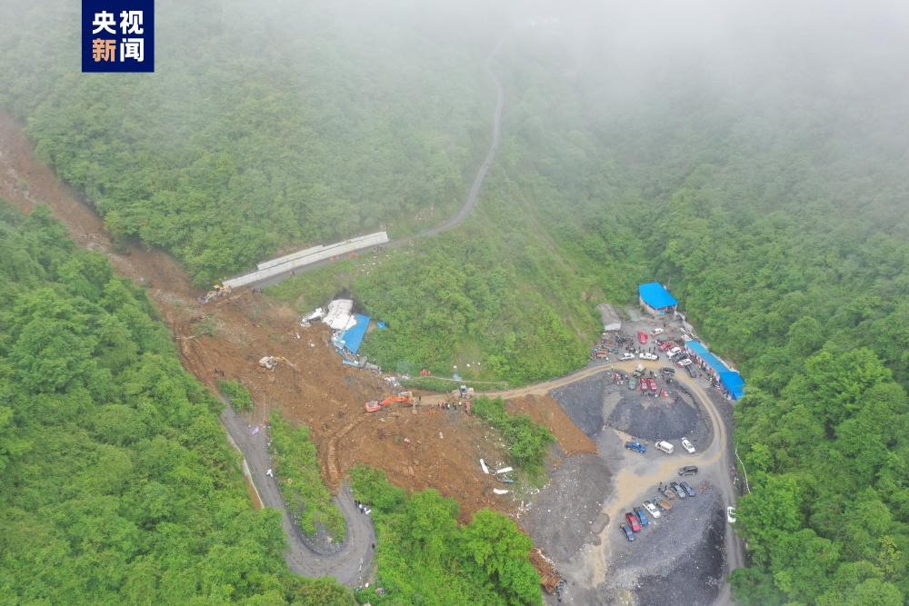
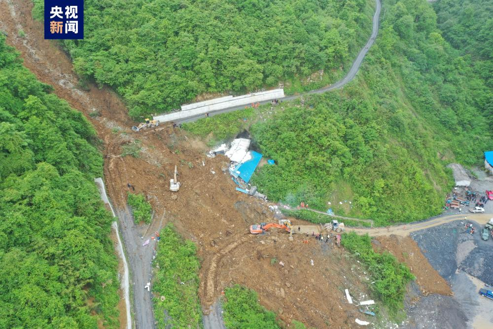
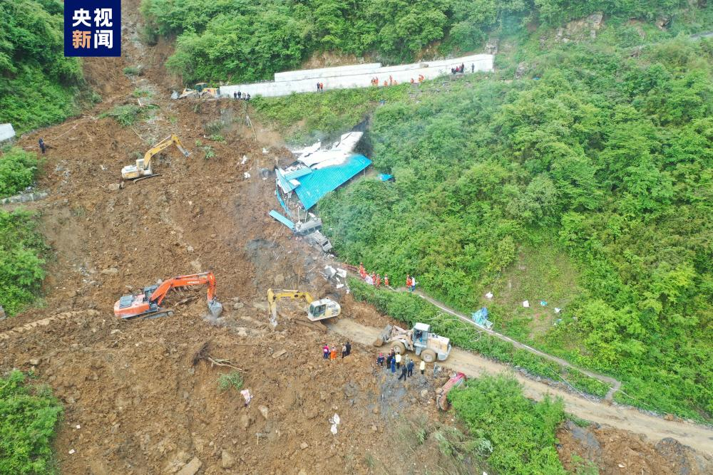

# 四川乐山金口河发生高位山体垮塌 19人遇难

6月4日6时许，四川省乐山市金口河区永胜乡鹿儿坪国有林场附近发生高位山体垮塌。垮塌体下方的半山腰上，是金口河区金开源矿业有限公司施工驻地，垮塌体砸中并掩埋了矿井平台上的部分生产生活设施。事发后当地迅速组织180余人和14台专业救援设备开展搜救。

截至4日20时，此次山体垮塌造成19人遇难，矿区的其他工人已被疏散至安全地点。目前，金口河区山体垮塌搜救工作已结束，高位山体垮塌的原因正在调查中。（总台记者
蒋林 殷瑞柯）

