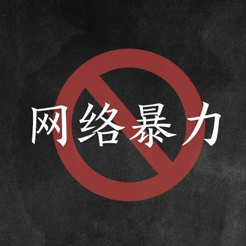

# 央视网评：对网暴者必须依法惩处

在制造了一个又一个悲剧后，网络暴力正引发众怒，舆论呼吁与道德谴责已无法对之进行有效制约，寄望于网络文化的自发向善更成为奢望。加之流量思维作祟与经济利益驱使，一些平台热衷于推送那些刺激性、情绪性、煽动性的内容，对催生网络暴力形成了推波助澜之势。

不能再任由这一“网络毒瘤”继续野蛮生长、肆意膨胀了，法律该亮出“牙齿”了。尽管我国尚无专门针对网络暴力的单行法律，但这并不意味着我们惩治网络暴力就无法可依。

对于依法惩治网络暴力，我们上有宪法为依据，下有具体细致的规范。《刑法》对有关网络暴力的内容有定性规定，集中于侮辱诽谤罪、寻衅滋事罪、故意传播虚假信息罪等条款，“网暴追究刑责”案例甚至写入2022年最高法报告；《民法典》对公民人格权方面的规定亦可作为治理网暴的法律依据；《治安管理处罚法》《个人信息保护法》等多部法律都有相关的规定，形成了遏制网暴的法律框架。

法律是治理和惩治网络暴力的最后屏障，也是最有力的武器。面对日益泛滥的网络暴力，我们不能止于“一封了之”，更要一查到底，对网暴者依法惩处，对这一群体形成有力的威慑。在此之前，德阳女医生遭“人肉”自杀案、杭州女子取快递被造谣案等多起恶性事件中被告人均受到了法律的审判，应成为处理此类案件的示范。

当然，我们也要看到，全社会要更有效治理网络暴力目前还存在一些短板、不足。譬如，防治责任主体不明确、法律条款分布松散、缺少专门性法律进行规制等等。进一步而言，在现有的法律法规中还缺乏对网络暴力概念内涵和外延的规定，也没有列举性的规范方式，这让司法实践中对网络暴力的认定存在诸多技术上的困难。除此之外，取证、诉讼等较高的法律成本也往往让受害者选择忍气吞声，助长了网暴者的嚣张气焰。

基于此，对于惩治网络暴力，短期而言，我们有必要结合我国立法实际和反网络暴力的需要，完善刑法、刑事诉讼法、行政法等有关“反网络暴力”相关法律条款，出台相关司法解释，形成预防惩治网络暴力的完整法律体系，擦亮“法治利剑”；长远来看，有必要认真考虑采取专门化、体系化的集中立法，从预防、惩处等全链条建立具体化、明确化的规定，让网络暴力无处滋生，让相关网络平台扛起责任，为打造风清气正的网络空间提供更有力的保障。（央视网评论员）

