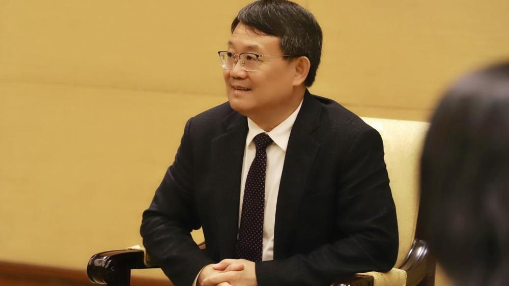

# 如何应对新冠重复感染？专家：需第一时间使用抗病毒药物

“现在接种疫苗，最好接种能够覆盖XBB的疫苗。已经感染过两次的人不需要接种，自然感染后产生的免疫是最强的。”

“无论你是青壮年、老年人还是肿瘤患者，只要确诊感染新冠病毒，都应该第一时间口服抗新冠病毒药物。从流行病学角度看，阻止病毒在体内复制，病毒就没有变异的机会，可以避免新的变异毒株的出现。”

_6月3日，卢洪洲在上海举行的国际医院感染控制论坛上接受媒体采访。澎湃新闻记者
胡逸璠 摄_

“大家经常这样讲，说5月这一波、6月这一波，我觉得这谈不上‘波’。2022年11月、12月的感染潮算是一波，对我们正常的生活工作有冲击，很多人在短期内感染，有不少重症和死亡病例。2023年5月到现在，新冠感染随着时间的推移，有的地方感染规模扩大一些，有的地方缩小一些，但没有影响正常的工作和生活。”6月3日，在上海举行的国际医院感染控制论坛上，深圳市第三人民医院院长卢洪洲教授对澎湃科技记者说。

近日，国内新冠似有反弹之势。

北京市卫健委公布的2023年第21周（5月22日至5月28日）疫情周报显示，第21周北京市共报告法定传染病16种30750例，新型冠状病毒感染报告病例数位居第一。

5月22日，中国工程院院士钟南山在2023大湾区科学论坛上表示，基于seirs模型的预测显示，全国2023年新冠第二波疫情（XBB）趋势预测显示，2023年新冠第二波疫情高峰发生在6月底，约6500万/周。

据卢洪洲介绍，从5月1日到6月2日，深圳市第三人民医院做了统计，三周前，深圳市第三人民医院收治的所有核酸阳性患者60%以上都是2022年底未曾感染的人，现在“二阳”的比例略有上升。“总体来说，‘二阳’患者数量较少，症状较轻，这说明2022年11月、12月的大流行后，已感染的人绝大部分还有免疫力，群体免疫发挥了非常重要的作用。”

2020年，卢洪洲团队对当时的新冠患者进行了7个月的随访，发现大部分人体内的中和性抗体水平明显下降，但细胞免疫功能很好，感染后依旧可以调动细胞免疫，阻止感染或出现症状。“所以大部分患者感染后的免疫保护期可能超过7个月，这也是为什么现在（2022年底的）感染潮已经过去6月，但感染新冠的人仍然以‘首阳’为主。”卢洪洲说。

重复感染是否会增加对人体的损伤？抗病毒药物如何选择和使用？是否有必要接种疫苗？新冠病毒未来将以何种趋势变化？卢洪洲进行了详细的解答。

**重复感染可能损伤免疫系统，增加长新冠风险**

“有病毒就有损伤，有病毒就有感染。”卢洪洲说，“对于大部分健康的人来说，第一次感染后，尽管其免疫功能不能完全阻止新的XBB毒株的再次感染，但是感染后症状通常比较轻。但对于老年人、肿瘤患者、免疫功能缺陷者来说，感染一次，就会对免疫功能造成一次打击，所以依然会出现重症，各种合并症、并发症。应尽量避免感染。”

重复感染还会增加长新冠风险。5月13日，中国科学院院士高福在国家感染性疾病临床医学研究中心2023年学术年会上说：“长新冠是一个基本事实，不要回避。感染次数越多，后遗症风险越高，这是有临床数据的。”

据世界卫生组织定义，长新冠（Long
COVID）指新冠感染者在感染3个月后还有症状，且症状至少持续2个月，且无法用其他情况解释。有研究表明，长新冠症状超过200种。

每周日下午是卢洪洲在深圳市第三人民医院的门诊时间，在他的门诊里，几乎每一次都会出现长新冠患者，其表现多种多样，包括顽固性睡眠障碍、心悸、脱发、脑雾等。一位老年女性让卢洪洲印象深刻，她表现出严重的抑郁和恐惧，“见不得人，见到人就说害怕”。

针对奥密克戎感染导致的长新冠，卢洪洲团队近期的一项回顾性研究发现，国内存在长新冠，但总体并不严重，发病率也没有国外那么高，多数长新冠症状持续5-6个月可以消失。其团队仍在继续进行长新冠的机制研究，包括长新冠与免疫系统、各器官系统之间的相关性等。

6月2日，在2023中国支气管扩张症及相关疾病高峰论坛上，广州呼吸健康研究院研究员关伟杰告诉澎湃科技，一些研究对长新冠患者进行了比较严格的、大样本的观察，发现呼吸困难、疲劳和睡眠障碍比较突出，部分患者在感染三个月后还咳嗽，门诊见到不少，不过关伟杰在门诊碰到的长新冠患者相对其他疾病来说数量很少。此外他表示，目前对于长新冠的诊断没有一个“金标准”，有一些症状可能是患者原本已经有的，或者感染后的一些主观感受。

基于重复感染的危害性，预防新冠感染仍然重要，是否有必要接种疫苗成为公众关心的话题。目前国内上市的新冠疫苗已有15种，技术路线包括灭活疫苗、重组蛋白疫苗、腺病毒载体新冠疫苗和mRNA疫苗。卢洪洲表示，已上市的疫苗都已经经过充分的有效性和安全性验证。“现在接种疫苗，最好接种能够覆盖XBB毒株的疫苗，四价疫苗和mRNA可以覆盖XBB。已经感染过两次的人则不需要接种，自然感染后产生的免疫是最强的。”

**建议感染后第一时间使用抗新冠病毒药物**

如果已经感染，则应考虑抗病毒药物治疗。“我们现在有了充足的抗新冠病毒药物可供选择，无论你是青壮年、老年人还是肿瘤患者，只要核酸阳性，确诊感染新冠病毒，都应该第一时间口服抗新冠病毒药物。这样就可以避免出现发烧、头痛等症状，也不会再传染他人。”
卢洪洲说。

如前所述，老年人、肿瘤患者、免疫功能缺陷者再次感染仍有重症风险，因此卢洪洲表示，这些人群更需要在第一时间使用抗新冠病毒药物，从而避免在第二周发展为重症。尽早服用抗病毒药物还可以避免长新冠的发生。而如果从流行病学角度看，阻止病毒在体内复制，病毒就没有变异的机会，可以避免新的变异毒株的出现。

“要让广大的医务人员和患者、家属认识到第一时间使用抗新冠病毒药物的重要性。”卢洪洲说，“基层医院、发热门诊、社区，包括乡镇医院、卫生所，要配备充足的抗新冠病毒药物，不要让患者扛。”之所以提出这一点，是因为卢洪洲遇到过基层医生不在第一时间开出抗病毒药物的情况：有患者在检测出阳性、发烧的第一天到发热门诊看病，医生不开抗病毒药物，到了第二周，病情加重了，此时已经失去了使用抗新冠病毒药物的时机。

目前国内已有6款抗新冠病毒药物上市，包括3CLpro蛋白酶和RNA聚合酶（RdRp）两个靶点抑制剂。感染后如何选择？卢洪洲指出，3CLpro在新冠病毒复制过程中发挥最主要的作用，抑制该位点效果最好，因此这类药物为首选。

近日，有网友在社交媒体表示，家里的老人在服用抗新冠病毒药物后出现了恶心、呕吐的情况。对此卢洪洲表示，不同的药物在患者身上可能出现不同的效果，有些患者在用药后会出现副作用，在有所选择的情况下，可以选择另外一种药物。另一方面，要对医务人员进行培训。

也有人在药物服用时间上遇到难题：抗病毒药物一个疗程是5天，用药3天后转阴了，是否还需要继续服用？卢洪洲表示，需要区分不同的情况。卢洪洲曾在临床上遇到过90岁高龄老人，服用抗病毒药物转阴后停药，过几天又复发的情况，因此他建议，青壮年在疗程未结束时转阴可以不再服用抗病毒药物，但老人、免疫缺陷者等人群应尽量完成整个疗程。

还有人分不清治疗流感和新冠的药物。卢洪洲提醒，新冠和流感是两种不同的病毒，抗病毒治疗的药物也完全不一样，不可以混用或换用。在流感发病率比较高时，自我诊断究竟是新冠还是流感也是不合理的，需要去医院做检测。

**未来的趋势是“梯次感染”**

当地时间5月21日，世界卫生组织（WHO）在瑞士日内瓦举行第76届世界卫生大会，世卫组织总干事谭德塞强调，尽管新冠疫情已不再构成突发公共卫生事件，但病毒仍在不断变异，应警惕下一次的全球大流行。

未来新冠将会呈什么趋势发展？卢洪洲判断，随着时间的推移，新冠的毒力总体会慢慢减弱。“经过三年多的时间，病毒不停在变异，致病性和传染性增强的空间已经很有限了。在事实层面，过去三年，几乎每隔几个月就会有一种新的变异病毒广泛传播，但XBB自去年年底出现后，没有再出现大的变异。”

“重复感染应该不会是常态，因为免疫屏障建立起来以后，病毒无法广泛传播。”卢洪洲说。他认为，新冠未来的趋势将是“梯次感染”，“免疫保护期具有个体差异，免疫保护期短的人会先感染，同时期其他的人则不会被感染。例如，100个人中，可能5%的人在感染3-4个月后再感染，10%的在感染5-6个月后再感染，此时之前的5%就不会再被感染了。所以不会形成聚集性病例，未来也不会形成一波又一波的疫情。”

但疫苗和药物的研发仍要继续。“所谓科技抗疫，就是要研发更加有效、长效的鼻喷疫苗，以及更加有效、长效的抗病毒药物，它们对于今后可能出现的变异病毒都可以发挥很好的作用。今后的研发方向是长效、通用的疫苗和药物，无论病毒怎么变，都可以发挥作用。”卢洪洲说。

