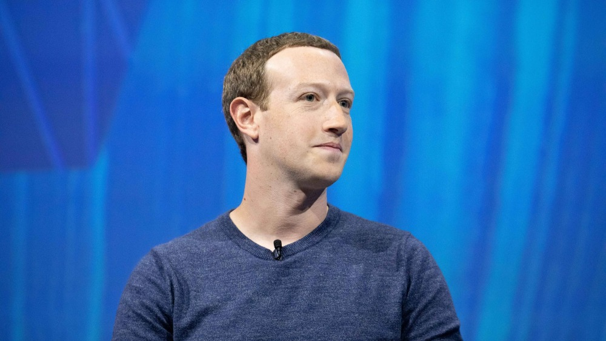

# 扎克伯格“截胡”苹果，但好像没什么用

_头图
| 视觉中国_

就在业界翘首企盼苹果的首款MR产品时，Meta却突然跳出来抢了风头。

北京时间6月1日晚间，扎克伯格在Ins上官宣了Meta首款消费级MR（混合现实）头显Quest 3，并通过一段1分17秒的视频展示了此次新品的重点升级功能。

值得一提的是，Quest 3有着明显的“期货”色彩。扎克伯格表示，更多关于Quest 3的内容，将在Meta
Connect大会上分享，而这款产品预计在今年秋季正式发布。

从这个角度来看，在距离苹果首款头显Reality Pro发布不足一周的时间节点上，扎克伯格毫无征兆地把Meta
Quest3推上台前，更像是一次“抢占身位”的动作。毕竟过去三年，Meta在“元宇宙”相关项目上的投入累计超过170亿美元，扎克伯格无论如何都无法接受“为他人做嫁衣”的命运。

不过，在XR终端设备出货量日渐萎缩、“元宇宙”概念遇冷的背景下，Meta的困境真的是来源于苹果等竞争对手吗？

抢跑苹果，Meta能拿出什么？

Meta最近一年在XR赛道的进展可谓相当坎坷。

去年10月，Meta踌躇满志地推出了专业级VR设备Quest Pro，立志在VR行业中打造出一款生产力工具，但事与愿违，Quest
Pro在上市后便遭遇了销量与口碑的双双败北，Meta不得已将这款产品的售价两度下调，从起初的1499美元调整至999美元。

而据科技媒体《The Verge》的爆料，由于该款产品的市场反响太差，Meta内部已经决定停止第二代Quest Pro的研发工作。

Quest Pro注定是一款生不逢时的产品，在全行业的目光都被苹果所吸引时，其高昂的定价很容易被人与Reality
Pro联系在一起，而Meta在消费电子硬件上的号召力远远不及后者。

在此背景下，能否及时地拿出一款价格低廉的、具有苹果头显“平替”性质的产品作为补充，就显得尤为关键，这或许也是此次扎克伯格急于公布Quest 3的原因。

从定价上来看，Quest
3的起售价为499美元，而按照目前行业内的主流观点，苹果首款头显产品的定价将在30000美元左右，因此二者并不存在直接竞争关系，但Quest
3却具备后者的主要卖点——混合现实。

实际上，直到今天业界对于混合现实（MR）仍没有一个完全公允的定义。通常来说，只要能在虚拟环境中引入现实场景信息的，都可以算是MR设备。举个例子，当你带着头显设备置身于卧室玩游戏时，如果能看到卧室环境与虚拟信息的叠加状态，就可以看作是一个混合现实的场景。

_Quest
3游戏场景演示，图片来源：Meta_

在目前主流的VR头显厂商中，大多都已完成了对MR技术的引入，但在这次的Quest 3上，MR技术有着显著的进步。从目前已公布的信息来看，Quest
3通过两枚外置的RGB彩色摄像头实现了双目全彩透视，并通过中间的深度传感器来还原用户所处环境的真实感。

因为需要同时渲染眼镜所看到的真实场景和虚拟画面，MR技术对于算力有着很高的要求，为此Meta的开发团队为Quest
3搭载了一枚全新的高通Snapdragon XR2芯片，这是一枚基于此前高通Snapdragon 8
Gen2的4nm制程芯片。比较值得期待的是，这枚芯片的功耗要大幅高于前代XR1，Meta或许在Quest 3上进行全新的散热设计。

而在其他方面，Quest 3上的升级就显得有些中规中矩了，眼动追踪和面部追踪等功能仍然缺失，Pancke光学方案的引入让Quest
3的体积更加轻薄，但在包括Pico 4等一种产品上，这一设计早已成为标配。

整体来看，Quest 3的升级用六个字总结就是“有惊喜，但不多”。相较于其他厂商而言，Quest 3主要的优势还是其相对丰富的内容生态以及相对低廉的售价。

与HTC和Sony等厂商相比，Meta在官方应用商城Quest Store和APP
Lab上的应用已经超过2000款，具备压倒性优势，且499美元的定价也要低于PSVR2、HTC VIVE Pro 2等竞品，更是只相当于苹果Reality
Pro的六分之一。

不过，Meta对于XR头显产品的定义有着明显的不同。苹果将首款MR设备看作是其硬件生态中的一环，Sony和HTC直接将头显设备当作“游戏机外设”来做，而Quest产品线，承载着的是扎克伯格那个关于“元宇宙”的设想。

在这个设想下，Quest产品需要作为入口，接入游戏、社交、NFT资产等诸多场景，但当下这些场景似乎愈发显得虚无缥缈。

2023年，元宇宙的故事还能讲下去吗？

“从今年开始，我们公司要求在外宣口径上，一律杜绝元宇宙的字眼”。年初，在与一位VR从业者交流时，对方向虎嗅表示，现在行业中都不愿再提元宇宙，尤其是见投资人的时候。

在今年生成式AI爆火的映衬下，元宇宙概念显得格外冷清。许多行业公司随之迅速调整重心。比如曾创办首个元宇宙产品“希壤”的百度，今年将工作重心全面转向大模型“文心一言”，其项目负责人马杰前不久也离职转进AIGC行业。

而在国外，这样的势头要更加明显。曾被视为“元宇宙第一股”的Roblox在3月先后发布了两款生成式AI工具Code Assist和Meterial
Generator，尽管该公司表示，此举是为了更好地提升“元宇宙世界的创作能力”，但也不由让人怀疑这家公司在考虑转型的问题。

虽然业界普遍不看好元宇宙，但扎克伯格似乎仍是这一概念的坚定支持者。

去年11月，在投资人的轮番攻击下，扎克伯格宣布削减成本并开启公司史上最大裁员行动，在随后四季度的财报会议上，他罕见地将会议重心从元宇宙切换到AI上。

正当投资人喜笑颜开地认为扎克伯格“终于开窍了”的时候，一份财报再次击碎了他们的幻想：今年1季度，Reality
Labs部门营业收入达到3.39亿美元，而亏损达到39.9亿美元，这甚至超过了去年Meta裁员前的水平。

也就是说，扎克伯格的降本增效完全没有作用在元宇宙项目上。

今年5月，Meta还委托德勤进行了一项研究，证明到2035年元宇宙产业对美国GDP的贡献约为2.4%，将达到7600亿美元。

无论未来设想有多么美好，眼下元宇宙相关的行业却在实打实地衰退。以终端产品的出货量为例，第三方研究机构IDC的统计数据显示，2022年全球VR/AR出货量为880万台，同比下降20.9%。

而在今年一季度，VR/AR产品出货量跌幅进一步下降至54.4%。一个显而易见的问题是，元宇宙相关的终端产品已经遇到了明显的增长见顶，或许苹果的进入将在短时间内形成又一个风口，但如果其产品定价真是传闻中的3000美元，那么它对于整个市场很难发挥出提振作用。

VR/AR市场销量见顶的原因有很多：缺少杀手级应用、内容生态匮乏、设备体验不佳等等，而对于Meta来说，在现有技术无法解决上述问题时，究竟要不要把元宇宙的宏大叙事继续讲下去，是个不得不考虑的问题。

作者 | 丸都山

编辑 | 陈伊凡

