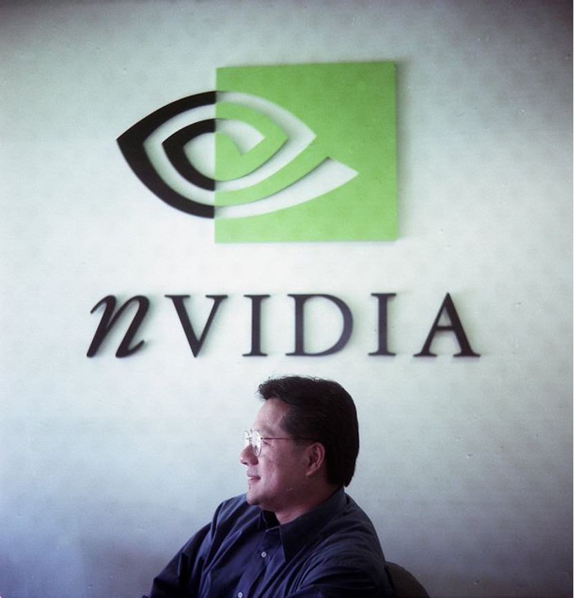
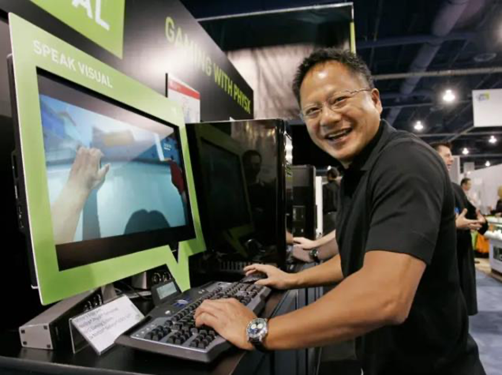
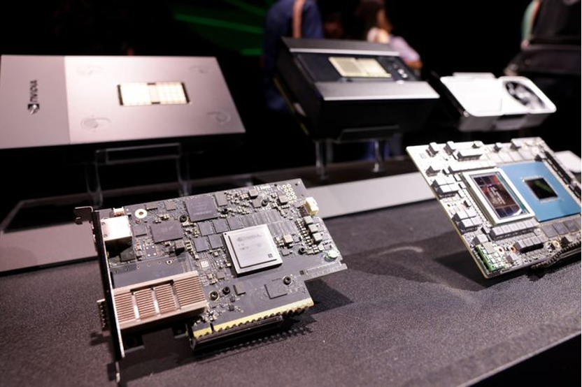
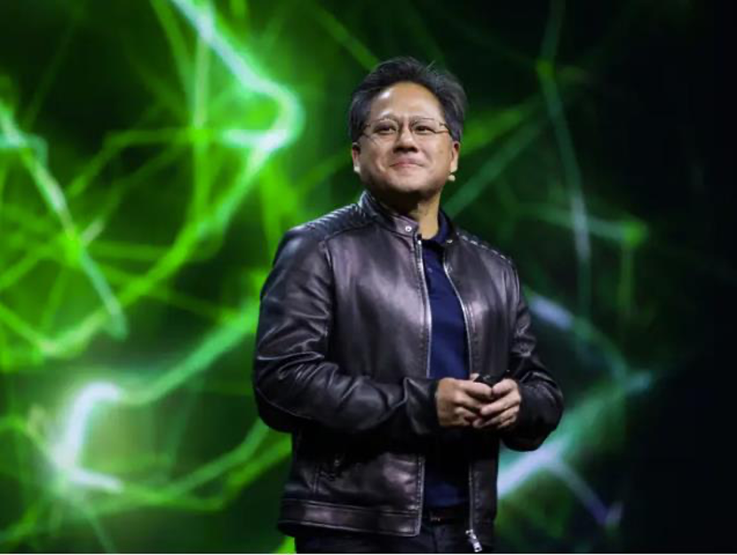

# 揭秘英伟达“爱穿皮衣的男人”黄仁勋：从打工仔变身芯片巨头掌门人

**划重点**

  * _1_ 借助人工智能热潮，芯片巨头英伟达市值一度跨越了万亿美元的门槛，这全要归功于其联合创始人黄仁勋。
  * _2_ 黄仁勋是华裔移民，初到美国时并不顺利，甚至曾经被误送入改造学校，并从事打扫厕所的工作。
  * _3_ 黄仁勋创办英伟达之前，曾在美国小餐厅做兼职，他称那段经历改变了他的人生轨迹，帮助他成为更外向的人。
  * _4_ 黄仁勋创业时遭到很多质疑，甚至就连母亲都希望他能找份“正经工作”。
  * _5_ 从视频游戏到自动驾驶汽车，再到云计算和人工智能，英伟达芯片始终是主流技术趋势的核心，黄仁勋的押注也获得了丰厚回报。

腾讯科技讯 6月4日消息，人工智能技术的快速发展可能会让某些工作岗位陷入危险，但它也极大地推动了其他行业的发展，比如那些生产人工智能芯片的行业，就像英伟达。

最近，这家芯片巨头市值一度突破一万亿美元大关，成为世界上第七家万亿美元市值公司。这要归因于英伟达的股价上涨，此前该公司发布了第一季度财报，得益于人工智能的蓬勃发展，英伟达业绩喜人。

这一切，都要归功于英伟达联合创始人、首席执行官黄仁勋。彭博亿万富翁指数显示，黄仁勋的净资产上周飙升了近70亿美元，其净资产接近350亿美元。

根据英伟达2023年年报，黄仁勋持有8690万股英伟达股票，约占该公司总股本的3.5%。今年到目前为止，黄仁勋的净资产增加了211亿美元，使他在全球富豪榜上的排名上升到第37位。

黄仁勋在中国台湾省出生，在美国长大，他的经历堪称是移民成功创业的典型。那么，黄仁勋是如何从小餐厅打工仔成为上万亿美元市值芯片巨头掌门人的？

01 成长经历

毋庸置疑，如今的黄仁勋在事业上取得了巨大成功，身家不菲。但实际上，他小时候的生活却并不顺利，甚至曾扫过厕所。

**儿时移居美国，曾在改造学校扫厕所**

黄仁勋1963年出生于中国台湾省台北市，儿时曾在中国台湾和泰国生活过一段时间。1973年，由于东南亚国家社会动荡，父母先将黄仁勋兄弟送到了美国的亲戚那里，最后自己也移民美国。

黄仁勋的姑姑和叔叔当时也刚刚移民到华盛顿州，他们错误地把黄仁勋兄弟送到了肯塔基州的奥奈达浸信会学院（Oneida Baptist
Institute）。黄2002年接受《连线》杂志采访时透露，这所学校更像是一所改造学校，而不是预科学校。

黄仁勋在2012年一次采访中回忆称：“那里的孩子们真的很坚强！他们都有小刀，当他们打架的时候，场面可不好看。孩子们可能会受伤。”

学校的学生也必须工作，黄仁勋的职责是扫厕所。“故事的结局是，我喜欢自己在那里度过的时光，”黄仁勋后来称。“我们工作真的很努力，学习也很努力，孩子们真的很坚强。”

据奥奈达浸信会学院网站介绍，2019年，黄仁勋携妻子向该校捐赠了200万美元，用于建造女性宿舍和教学楼。

**喜欢电脑游戏，大学攻读电子工程专业**

黄仁勋兄弟最终搬到了俄勒冈州，并在那里与家人团聚。根据2017年俄勒冈州立大学的一份简介，黄仁勋在比弗顿读高中期间，曾是全美知名青少年乒乓球比赛中夺得过名次。此外，黄仁勋还拥有斯坦福大学的电子工程硕士学位。

根据俄勒冈州立大学的资料，黄仁勋在大学一年级时遇到了洛莉·米尔斯（Lori
Mills）。他们是电子工程基础方面的实验室搭档，五年后成了夫妻，并育有两个孩子。

黄仁勋表示：“我从小就喜欢电脑，但俄勒冈州立大学让我看到了电脑背后的魔力！”

最近，黄仁勋在台湾大学毕业典礼的主题演讲中透露，他毕业于1984年，并称那一年是“最适合毕业的年份”。同年，第一台Mac电脑发布，开启了个人电脑的新时代。

从俄勒冈州立大学毕业后，黄仁勋曾先后在芯片公司LSI Logic和AMD工作过。

02 创业历程

在与两个朋友决定创业之前，黄仁勋曾在名为丹尼餐厅的地方做兼职，他称这段经历对他的人生轨迹产生了重大影响。

**在餐厅中做兼职，当服务员改掉了害羞的毛病**

到目前为止，只有七家美国公司的市值达到或曾经达到一万亿美元。在这些公司中，有些成立于车库，有些诞生于大学宿舍，而英伟达诞生于丹尼餐厅（Denny's）。

事实上，在成为英伟达的诞生地之前，丹尼餐厅对黄仁勋来说就有着非凡意义。黄仁勋曾经说过，如果不是因为有在丹尼餐厅当服务员的经历，他就不会成为今天的领导者。

这段经历对黄仁勋的人生轨迹产生了重大影响，他称在那里学会了如何让自己变得更外向。黄仁勋是个比较害羞的人，但接受煎饼订单教会了他如何与陌生人沟通，以及在自己无法控制的紧张情况下妥协。

黄仁勋回忆说：“我是个好学生，我总是很专注，保持动力。但我也很内向，非常害羞。唯一一次让我走出自我的经历是在丹尼餐厅当服务员。一想到要和人交谈，我就感到害怕。”

黄仁勋和两个朋友克里斯·马拉考斯基（Chris Malachowsky）和柯蒂斯·普里姆（Curtis
Priem）相识多年，他们能够将各自的特长互补起来，共同创业。

马拉考斯基和普里姆都是Sun Microsystems公司的工程师，而黄仁勋在LSI
Logic公司工作。在他们计划离职的时候，他们选择在“中间区域”商谈，那里就是丹尼餐厅所在，三人“想知道创办一家图形公司是否是个好主意”。

黄仁勋回忆道：“我们进行了头脑风暴，幻想着它将成为什么样的公司，以及我们可以怎样帮助世界。这很有趣！”

马拉考斯基也曾称：“我们不是好客户。我们打算在那里呆4个小时，但只喝10杯咖啡。”他们最终被赶出了所占据的桌子，并搬到了餐馆后面的一个房间里。

有两群人把丹尼餐厅的这个区域作为共同工作空间，分别是英伟达的创始人和加州圣何塞的警察。“所有的警察都在这里写报告，”马拉考斯基说。“我们拿着笔记本电脑坐在那里，试图弄清楚我们在做什么。”

**创业遭到质疑，母亲建议找份“正经工作”**

黄仁勋、马拉考斯基和普里姆在1992年和1993年见了几次面，讨论了能够给游戏带来更逼真3D图像的专用芯片。他们在丹尼餐厅创立了公司，但在正式更名为英伟达之前就搬走了。当他们注意到餐厅前面窗户上的弹孔时，他们意识到高速公路旁的小餐馆并不是理想的办公室。

搬到普里姆的联排别墅后，他们有了更多的隐私。但那里没有空调，公司也没有取名字，他们唯一已经确认的是，他们想进入芯片行业。当时，显卡是由两个字母组成的，而普里姆喜欢“NV”的发音。他们将自己的公司命名为Nvision。

但问题是，已经有几家公司有了类似的名字，包括一家生产环保卫生纸的公司。普里姆最后拿出拉丁语字典，找到了“嫉妒（Invidia）”这个词，英伟达由此诞生。

在早期，他们努力说服很多人相信英伟达的愿景，包括黄仁勋的母亲。他仍然记得，当他宣布要和朋友一起创建公司，生产人们用来玩游戏的芯片时，她给他的建议：“你为什么不去找份正经工作呢？”

他们想要创造一种更好的芯片，并围绕它建立一种新的业务。其中，马拉考斯基负责硬件设计，普里姆开发软件架构，而黄仁勋负责商业决策。黄仁勋当时在丹尼餐厅做了市场调查，研究竞争、芯片价格以及这家初创公司的潜在利润率。

普里姆回忆称：“黄仁勋当时拒绝加入公司，除非它能在一年内实现5000万美元的销售额。”事实证明，黄仁勋做出了正确的选择，英伟达去年的营收高达270亿美元。

03 押注成功

从视频游戏到自动驾驶汽车，再到云计算，再到现在的人工智能，英伟达芯片始终是主流技术趋势的核心。

**看准“淘金工具”，押注尚不存在的市场**

从英伟达成立之初，该公司就在当时几乎还不存在的市场押注，从PC游戏到人工智能计算。黄仁勋称它们为“1000亿美元的市场”，而每个1万亿美元的生意都是从1000亿美元市场开始的。世界上最富有的公司总是能够环顾四周，寻找别人看不到的未来，因为任何行业中最赚钱的机会都是那些看起来从未出现过的高价值机会。

这就是英伟达的历史。它不像苹果、微软、Alphabet、亚马逊、Meta或特斯拉那样家喻户晓，但它的半导体是隐形的、不可或缺的引擎，为最诱人的经济领域提供动力。人工智能所需的高级图形芯片GPU几乎全部由英伟达制造，它就像淘金热时期矿工依赖的淘金工具制造商。

英伟达在人工智能热潮中发挥的重要作用，是其市值在2023年增长近两倍的主因，该公司市值上周1天就增长了1840亿美元，相当于增加了整个奈飞。英伟达的市值超过了许多竞争对手的总和，股价暴涨让投资者和华尔街分析师都兴奋不已。

英伟达的首款热门产品是为电脑游戏提供高强度运动图形的专用芯片，称为图形处理单元。但他并不认为英伟达仅仅是芯片公司，他曾说过：
“计算机图形学是计算机科学中最复杂的部分之一，你必须了解一切。”

到2007年，黄伟大及其团队意识到，英伟达的芯片也可以用于更多的计算问题，并发布了名为CUDA的软件平台，允许各种软件开发人员对英伟达的芯片进行编程。这引发了一波新热潮，包括加密货币。

随后，黄仁勋认识到，大学实验室正在将英伟达芯片用于人工智能领域。人工智能是计算机科学领域的一个小众领域，有望为虚拟助理、自动驾驶汽车等事物提供动力。他们发布了一系列人工智能芯片，并从中获得了丰厚回报。

英伟达还通过将其芯片制造外包给给合作伙伴来实现差异化，这与英特尔制定的策略截然不同。如今，英特尔的市值只有1300亿美元左右，而英伟达的市值接近1万亿美元。

2021年，黄仁勋被《时代》杂志评为100位最具影响力人物，人工智能专家吴恩达曾评价他称：“黄仁勋帮助实现了一场革命，让手机可以大声回答问题，农场可以将农药喷洒到杂草而非作物身上，医生可以预测新药的特性，还有更多的奇迹即将到来。”

**“请记住，努力奔跑吧！”**

在接下来的30年里，黄仁勋几人畅想的午餐好几次都差点被人吃掉。1997年，英伟达在发布图形处理单元之前曾面临破产的风险。2007年，该公司推出了新的加速计算平台，但由于该系统走在了时代的前面，公司的利润受到了冲击。2008年金融危机期间，英伟达的市值甚至跌至50亿美元以下。

但从长远来看，英伟达的押注得到了回报。上周，黄仁勋的个人财富在一天之内增长了70亿美元，这是因为他在经济不景气的日子里依然坚持公司的战略。

在知道聊天机器人将在英伟达数千块昂贵的芯片上接受训练之前，他们就大胆地决定投资人工智能计算，这与黄仁勋、马拉考斯基和普里姆辞职创业时的情景有共同之处。

现在看来，他们的预判的确是对的，但当时并非如此。当被问起当时的GPU市场时，马拉考斯基称：“那时根本没有这样的市场，但这是黄仁勋预言的1000亿美元市场之一。”

在最近的演讲中，黄仁勋告诉大学毕业生在找工作、创业和寻找自己的1000亿美元市场时，要记住一件事：“你要么为了获取食物而奔跑，要么需要避免成为食物而奔跑！”

黄仁勋今年已经60岁了，比微软联合创始人比尔·盖茨（Bill Gates）和亚马逊创始人杰夫·贝索斯（Jeff
Bezos）宣布退休时的年龄都大，两人分别在52岁和57岁卸任了公司的日常运营工作。

但几乎没有迹象表明黄仁勋正在放慢脚步。他在2021年接受采访时称：“对我来说，没有什么比和所有朋友共同创建超棒公司更有趣的事情了！我无法想象，除了这个我还想做什么。”（金鹿）

