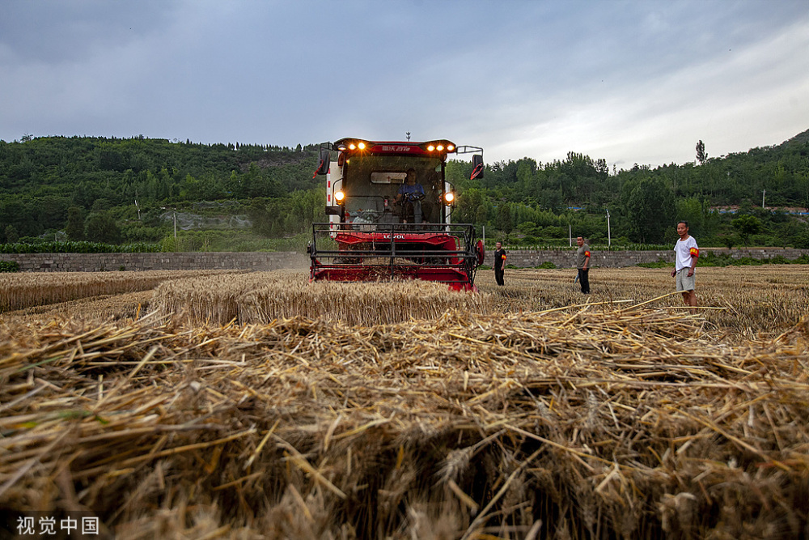

# 河南“夏收”重心转移至豫北地区，省委书记：已进入决战阶段

当前，备受关注的河南夏收工作重心已转移至豫北地区。

据河南日报客户端报道，6月4日，河南省委书记楼阳生主持召开全省“三夏”工作专题视频调度会，听取情况汇报，分析研判形势，安排部署下一步工作。省长王凯作具体部署。

_2023年5月31日傍晚，河南焦作，博爱县许良镇下伏头村，村民们在麦田里冒着小雨抢收小麦。 视觉中国 图_

楼阳生指出，当前全省夏收攻坚战已进入决战阶段。做好豫北地区夏收工作，事关河南省夏粮产量，事关种子安全。要立足于抢，全力组织好豫北地区麦收工作，最大限度降低损失，最大程度保护农民利益。一要精准预报天气。密切监测天气变化，科学预测、实时研判、及早预报，灵活机动调整优化收割方案，做好应急准备，打好主动仗，下好先手棋。二要精准调度农机。坚持全省一盘棋，强化省、市、县三级日调度机制，合理设置跨区作业服务站，及时向农机手发布信息，加强道路疏导，提前做好田间排水，引导联合收割机机动到位、有序作业，做到应收尽收、应收快收。三要精心具体组织。把打好夏收攻坚战作为检验能力作风的重要考场，主要领导靠前抓、亲自抓，分管领导具体抓、深入抓，把力量配足，把责任压实，全力以赴打赢夏收这场硬仗。把保护农民利益放在首要位置，增派工作人员、加大工作力度，坚持快速理赔、应赔尽赔，力争在最短时间内将财政补贴资金兑付到位，保护和调动农民种粮积极性。把保障种子安全作为重要任务，种子田优先调度抢收、优先烘干晾晒、优先腾仓收储，在抢收的同时抓紧抢种，统筹做好农资调运储备、保价稳供等工作，千方百计确保秋粮及时播种，为保障国家粮食安全贡献力量。

王凯强调，气象服务要再强化、再精准，进一步加强天气监测和会商研判，精准靶向推送气象信息，为科学组织抢收提供服务。农机调度要更科学、更精细，根据收获进度有序调集机械，强化农机安全转运，确保充分发挥收割机械作用。豫北抢收要早发力、早攻坚，按照抢收次序科学组织，抓住降雨间歇期集中突击收割，发挥驻村工作队和应急抢收服务队作用，千方百计做到能收快收。烘干晾晒要再挖潜、再加紧，用好用足烘干设备，加大湿粮收购力度，及时开展烘干、仓储。秋播种子要优先收、保障好，密切关注种子田情况，优先调度农机、优先组织抢收、优先烘干晾晒，分类分批检测、单收单仓储存，保障秋播小麦用种。夏粮收储要多渠道、兜好底，科学设置收购库点，强化分类收购、专储专销，帮助农民便捷顺畅售粮。保险理赔要早开展、快到位，快速摸排核查受灾情况，提高理赔效率，尽可能减少农户损失。

此次视频调度会上，安阳市、鹤壁市、新乡市、焦作市、濮阳市、商丘市汇报了当地“三夏”工作开展情况。其中，安阳、鹤壁、新乡、焦作、濮阳均属于豫北地区。

据河南官方通报的最新夏收进度，截至6月4日17时，河南省已收获小麦4964万亩（约占全省种植面积的58.2%）。

其中：信阳、南阳、驻马店麦收基本结束，周口906.4万亩（82.3%），平顶山264.1万亩（75.6%），洛阳174.3万亩（49.4%），商丘164.1万亩（17.5%），开封142.1万亩（32.3%），漯河141.9万亩（59.8%），郑州129.9万亩（58.8%），许昌107.9万亩（30.8%），新乡125.2万亩（20.1%），安阳43.1万亩（9.8%），焦作22.4万亩（8.9%），濮阳19.8万亩（5.6%），鹤壁13.3万亩（9.8%）。

天气方面，根据气象部门预报，6月6日晚，安阳、濮阳、商丘等地将有大雨。

河南省农业农村厅党组成员、副厅长王承启在6月4日的新闻通气会上介绍称，按照抢收工作安排，全省黄河以南地区抢收要在4日实现大头落地。5日至7日，抢收重心主要转移到黄河以北地区，黄河以北地区是抢收的主战场。

“目前，我们正加大农机精准调度力度，组织引导豫南农机有序向豫北转移。同时，搞好农机手作业保障服务，坚决打赢与天气抢跑的麦收抢收战。”王承启说。

