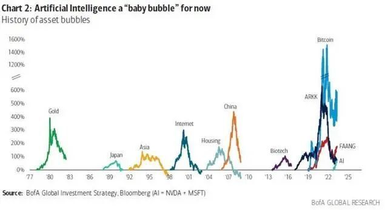

# 炸锅！罗斯柴尔德家族“减持”英伟达

AI过热后套现来了！

据媒体报道，资管机构Edmond de Rothschild的全球首席投资官（CIO）Benjamin Melman透露，
**公司自2020年年底以来一直超配英伟达，但是目前已经部分获利了结，现在所持头寸“要远远小得多”。**

“我们会加仓AI科技吗？鉴于AI估值太高，我们越来越不那么确定……”

如果大家对这家资管机构陌生的话，那么其背后的实际控制人却是大名鼎鼎。

_图片来源《教父》_

这家机构总部位于瑞士日内瓦的，为拥有200多年历史的欧洲老牌金融世家罗斯柴尔德（Rothschild）家族所有，目前管理资产规模790亿瑞郎（约合871亿美元），仅做长期投资。

值得一提的是， **最近与Edmond de
Rothschild一样选择高位套现的，还有被誉为“估值教父”的当代著名投资估值专家阿斯沃斯•达摩达兰(Aswath Damodaran)。**

达摩达兰5月30日表示：“直到今天早上英伟达还在我的投资组合里， **最后把它剔除出投资组合，因为我无法承受这样的上涨**
，一周内市值就增加了3000亿美元，这是在 **挑战可持续价值的绝对极限** 。”

得益于新一轮AI革命对算力的巨大需求，英伟达凭借高性能算力芯片成为热门股票，今年以来，其股价涨超170%，本周二市值一度突破1万亿美元。

最近，华尔街不少机构已经坦言AI估值太高，部分长线投资者选择“落袋为安”，万亿市值已是英伟达的尽头？

**“踩准”节奏增减仓**

Edmond de Rothschild的持仓显示，这家属于罗斯柴尔德家族的资管机构 **似乎每次都“踩准”节奏进行增持和减仓。**

这家资管机构在2015年英伟达业绩第一爆发之际，就增持了英伟达，当时的持仓股数一度高达160多万股，当时英伟达股价才4美元/股左右。

然而英伟达虽然业绩大爆发，股价却一直不怎么涨。这家资管机构也不得不修正自己的错误，在英伟达股价的缓慢上涨中减持，终于在2018年一季度减持到不足1万股。

不过这个时候，英伟达股价也从4美元附近涨到了60美元附近， **估计翻了15倍。**

2018年至2021年底，虚拟货币的大起大落，让英伟达的股价也犹如坐过山车一般，在这期间，Edmond de
Rothschild增减仓的节奏把握的十分精准。

Edmond de Rothschild第二次大手笔增持是在2022年第二季度，虽然英伟达股价此后仍然经历了三波下挫，但是Edmond de
Rothschild也是“越跌越买”，一路增持，在2022年年底，增持超过20万股。

从2022年四季度至今，英伟达股价累计涨幅已经超230%，如今该机构在“人声鼎沸”之时再度减持， **又押对了。**

**大行警告：快跑！AI概念正在泡沫化**

AI热潮汹涌之际，自去年以来华尔街预测最准确的分析师、美国银行策略分析师Michael Hartnett在近期的报告中表示，
**科技股和人工智能概念正形成泡沫，建议投资者可以抛售美股了。**

Hartnett称， **目前AI概念处于“婴儿期的泡沫”** ，而美联储的加息周期或许还未结束。过去的泡沫形成通常是因“宽松货币政策”而起，以加息结束。

Hartnett以上世纪90年代的互联网泡沫为例，当时互联网股的上涨和强劲的经济数据促使美联储开启了紧缩的周期，而9个月后科技股泡沫破裂。

他认为需要在标普500位于4200点时开始抛售。

知名经济学家，投研机构Rosenberg Research总裁David Rosenberg也警告称，
**投资者盲目涌入AI概念的股票可能会付出高昂的代价，AI概念存在泡沫。**

**历史教训：过于集中不是好事**

华尔街见闻在此前的多篇文章中提到， **美股今年的涨幅也靠“AI”，做多大型科技股是美股最拥挤的交易，科技股已接近超买，难以继续领跑市场：**

年初至今，六家LLM创新公司微软、谷歌、亚马逊、Meta、英伟达、Salesforce贡献了标普500涨幅超过50％、纳斯达克100的54％和成长型股票的近70％。

一季度美股反弹的广度“以某些指标衡量是有史以来最弱的”，领涨股票的数量是自1990年代以来最少的。

从历史上看， **过于集中并不是好事，每每当美股由单一行业或者少数巨头主导后，往往会伴随一轮调整** ：

1980年代能源板块占标普500指数的比重最高时达到26%，但伴随着油价的下跌，能源股独领风骚的时代也过去了。

随后登场的是科技股，2000年科网泡沫破裂前，科技板块占标普500指数的比重飙升至 30%以上。

《巴伦周刊》编辑Randall Forsyth曾说： **“这次可能不一样——是投资里最危险的一句话。”**

本文不构成个人投资建议，不代表平台观点，市场有风险，投资需谨慎，请独立判断和决策。

AI泡沫化？

