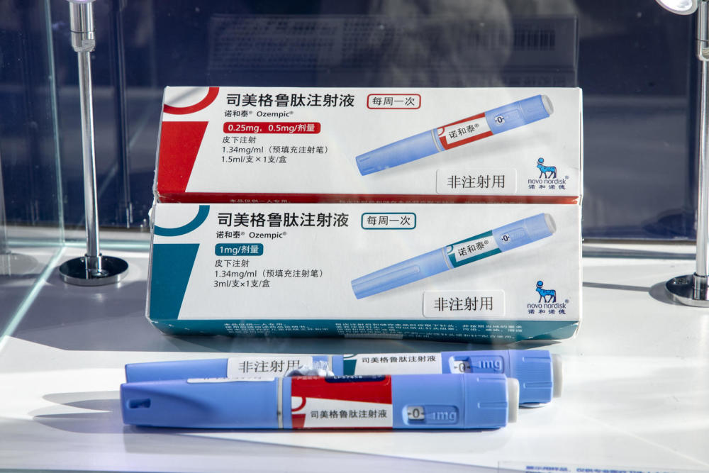

# 诺和诺德“减肥神药”国内申报获受理，马斯克曾说自己减肥靠它

红星资本局今日注意到，国家药监局药品审评中心官网显示，诺和诺德（NVO.US）司美格鲁肽注射液上市申请获受理，受理号达5条。

诺和诺德司美格鲁肽注射液早已于2021年4月在中国获批降糖适用症，商品名为“诺和泰”，此次上市申请意在扩充适应症。

_↑资料配图
图据IC Photo_

**新适应症或与减重相关**

外界推测，新适应症或与减重相关。

国家药监局药品审评中心官网信息显示，根据临床试验默示许可，诺和诺德司美格鲁肽注射液展开新适应症临床试验，即作为低热量饮食和增加体力活动的辅助治疗，用于初始体重指数（BMI）≥24.0且

_截图自国家药监局药品审评中心官网_

值得一提的是，国内尚未有减重相关适应症GLP-1产品获批。

作为降糖药物，司美格鲁肽的减重效果出色。《新英格兰医学杂志》2021年3月的一项研究显示，每周注射一次2.4毫克司美格鲁肽，68周后，司美格鲁肽注射组体重平均减轻14.9%，体重数平均减轻15.3公斤，服用安慰剂的人体重平均减轻2.4%。

用于降糖和用于减肥的司美格鲁肽，剂量完全不同。北京天坛医院内分泌科副主任医师方红娟在此前接受人民日报健康客户端采访时指出，对于糖尿病患者，降糖药首次剂量是0.25毫克/周，逐渐增加至0.5毫克/周或1毫克/周。而减重剂量则是每周2.4毫克，比控制血糖的剂量大得多。

不过，司美格鲁肽的副作用同样值得关注。根据诺和泰说明书，该药品不良反应为胃肠系统疾病，包括恶心（十分常见）、腹泻（十分常见）和呕吐（常见），通常这些反应的严重程度为轻度或中度，且持续时间较短。

另据中国新闻周刊报道，在司美格鲁肽减肥打卡群里，有人表示打完针出现低血糖、胃反酸、胃胀等不良反应，也有本身患有甲状腺炎的女生打完针后去体检，发现甲状腺炎情况变严重。

凭借出色的减重效果，司美格鲁肽还被名流“带货”。2022年10月，特斯拉首席执行官马斯克在社交媒体发文，自己一个月内减重18斤，方法是节食和Wegovy，后者正是司美格鲁肽注射液的商品名。

这一产品直接撑起了诺和诺德的业绩面。根据财报，诺和诺德2023年一季度营收533.67亿丹麦克朗（约77亿美元），同比增长27%，净利润198.14亿丹麦克朗（约29.3亿美元），同比增长39%。其中，糖尿病和肥胖业务收入488亿丹麦克朗（约72.12亿美元），同比增长33%，司美格鲁肽三个剂型合计贡献了285.59亿丹麦克朗（约42.23亿美元），占总营收的53%。

基于此，诺和诺德上调了2023年业绩预期，预计经营利润增长28%至34%。诺和诺德全球总裁兼首席执行官周赋德表示，“公司对2023年前三个月的增长感到非常满意，主要由用于糖尿病和肥胖症治疗的创新GLP-1类药物所驱动。良好的销售势头和持续提高的供应能力，使我们得以上调全年业绩预期。”

诺和诺德还在给药方式上下功夫。5月22日，诺和诺德公布口服版司美格鲁肽用于减重的Ⅲ期临床数据，用药68周后，肥胖症和超重患者口服司美格鲁肽50mg，实现15.1%减重。

**市场火爆**

**诺和诺德遭多方竞争**

减重市场前景广阔，巴克莱银行估计，减肥药行业在未来十年内的价值可能高达2000亿美元。诺和诺德则遭多方围猎。

首先是竞品。2022年5月，礼来（LLY.US）开发的注射降糖药物替尔泊肽注射液在美国获批，以帮助改善2型糖尿病患者的血糖控制。2022年，该产品实现销售额4.83亿美元。

2022年9月，国家药监局药品审评中心官网显示，替尔泊肽注射液在国内申报上市，用于在饮食控制和运动基础上改善成人2型糖尿病患者的血糖控制。

而在诺和诺德公布口服版司美格鲁肽临床数据同日，礼来宣布，口服GLP-1R激动剂Orforglipron治疗伴有体重相关合并症的成人肥胖或超重患者，进入Ⅲ期临床试验。

另一方面，中国企业进军GLP-1市场已久。2021年6月，华东医药（000963.SZ）向国家知识产权局提出诺和诺德司美格鲁肽无效宣告请求。2022年9月，国家知识产权局裁定相关核心专利全部无效。

但诺和诺德司美格鲁肽在中国的专利保护期本将于2026年结束，诺和诺德在2022年财报中透露，已上诉至北京知识产权法院。

2022年7月，华东医药再度申报利拉鲁肽注射液上市申请，将适用症扩容至肥胖或超重。但2023年3月，国家药品监督管理局药品审评中心官网显示，华东医药利拉鲁肽注射液审评状态为“暂停”。
**彼时，华东医药方面回应红星资本局称，“因需要补充单项资料而暂停，为审评正常流程。预计不会对该适应症的最终获批产生较大影响。”**

GLP-1赛道正日趋拥挤。Insight数据库显示，截至2月23日，全球目前以GLP-1R为靶点的药物（从临床前到批准上市）共有289
个，其中国内有149个药物，占比达到52%。除华东医药外，通化东宝（600867.SH）、翰宇药业（300199.SZ）、恒瑞医药（600276.SH）、信达生物（01801.HK）等国内药企正在布局GLP-1药物。

药物火爆之下，乱象也浮出水面。据诸暨警方公众号4月17日消息，诸暨市公安局食药环知森大队成功侦破全国首例非法研发、生产、销售治疗2型糖尿病核心成分“司美格鲁肽”案件。目前初步查明，此类三无假药产品通过各级代理流入到全国二十多个省份，销售金额超过亿元。

红星新闻实习记者 胡安墉 记者 俞瑶

编辑 杨程

