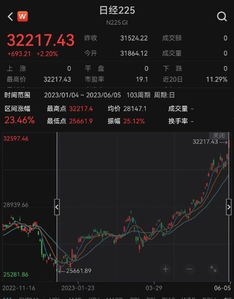
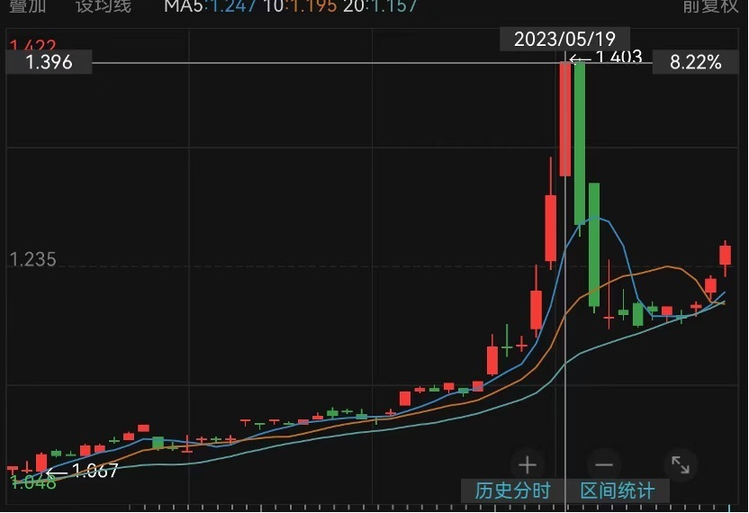

# A股股民开始操心日本股市泡沫！大涨创下33年新高，基金年内涨近20％

**财联社6月5日讯（记者 闫军）**
“日本股市的泡沫越来越大了！”5月6日，日经225指数收盘涨2.2%，报32217.43点，再创1990年以来新高。33年难得一见，不少股民开始调侃，“全都是泡沫！”

今年以来，日本股市一路走牛，截至目前日经指数年内涨幅近24%。这一波涨幅也让投资了日经指数基金的投资者获益。Wind数据显示，截至6月2日，华夏、易方达、工银瑞信和华安三只跟踪日经指数的ETF涨幅均超过17%。上涨改变信仰，投资者火速“用脚投票”，4只基金份额水涨船高，二季度以来规模平均翻了2-3倍。

对于日本股市的上涨，华安基金分析，日本市场则受益于宽松的货币政策和日本政府积极引导企业提升中长期价值，日本企业的ROE和估值有望持续提升和改善，也值得投资者重视。此前股神巴菲特抄底了日本五大商社，对低估值、高股息上市企业的价值再发现，国内投资火热的“中特估”也被引申到日本股市中调侃这一波“日特估”概念。

对于，日股是否要担心“泡沫”的问题，华安基金也指出，未来海外市场需要密切关注的风险包括美国下半年的经济衰退加剧、美国银行业的流动性危机扩散、核心通胀的回落大幅不及预期等等或有的不利因素所带来的冲击和扰动。

**“日特估”又火了，4只基金净值与规模双赚**

曾经一度被大家贴上“通缩经济代表”标签的日本，今年频频成为资本的新宠。代表日本股市的日经指数年内涨幅达到了24%，更是创下自1990年以来33年新高。在这一涨幅之下，此前国内略显小众的日经指数ETF基金也进入投资者的视野。

Wind数据显示，当前国内共有工银大和日经225ETF、易方达日兴资管日经225ETF、华夏野村日经225ETF和华安三菱日联日经225ETF等4只跟踪日经指数的公募基金，截至6月2日，上述4只基金今年以来总回报均接近20%，分别为17.54%、18.61%、18.1%和17.73%。粗略计算，4只基金涨幅已经超过全市场九成以上的ETF表现。

涨得好，投资者自然买单。从基金规模来看，日经指数相关ETF在二季度获得投资者的追捧。截至目前，工银大和日经225ETF、易方达日兴资管日经225ETF、华夏野村日经225ETF和华安三菱日联日经225ETF规模分别为2.2亿元、1.8亿元、2.4亿元和1.4亿元，对比今年一季度末这4只基金平均在6000万到8000万之间，两个月期间4只基金规模已经翻了2-3倍。

对于日股的投资机会，工银瑞信方面表示，日本股市与A股具有较好的互补性。MSCI中国A股(人民币)与MSCI日本的相关性为0.2456，因此，对于A股投资者而言，在资产池中纳入日本股市是一个比较好的分散风险、资产组合多元化的选择。

其次，作为市值排名全球第三的发达经济体市场，日本股市具有高流动性、科技和公司治理领先、投资保护和监管制度优越等特点，叠加高素质劳动力、对技术创新和研发的投入，以及相对于其他发达经济体更为宽松的货币政策等，具有长期投资价值。

**此前基金公司曾发溢价风险提示**

受日本股市的大涨，国内跟踪日经255指数的两只ETF还曾因行情波动发布了交易价格溢价风险提示。

5月19日，华夏基金公告称，旗下华夏野村日经225ETF的二级市场交易价格出现了较大幅度溢价。2023年5月19日，该基金在二级市场的收盘价为1.396元，相对于当日的基金份额参考净值溢价幅度达到17.31%。特此提示投资者关注二级市场交易价格溢价风险，投资者如果盲目投资，可能遭受重大损失。此外，易方达基金也发出交易价格溢价的风险提示。

对此，有分析人士指出，ETF在二级市场交易价格大幅超过基金份额参考净值就产生溢价，如果投资者在二级市场以较高价格买入则非常容易发生亏损。

以其中一只基金来看，如果投资者在5月19日追高，该基金接下来两个交易日中分别几近跌停，截至目前，即便是在日经指数走高，追高的投资者依然被套亏损。原因在于投资者可以像买股票一样在二级市场买卖ETF，但是ETF的价格并不是独立的，最终要通过基金净值确认，这就会引发交易价格的溢价，从净值显示上也呈现出过山车行情。

在这种情况下，基金公司会发布风险提示，而对于投资者来讲，还可以通过联接基金等场外参与投资，避免追高损失。

**巴菲特也抄底，国际资本流向日本**

日股进入投资者的视野，品牌效应来自巴菲特。

今年4月12日，巴菲特在东京接受CNBC采访，对日本五大商社赞赏有加，称其为优秀企业，同时表示将继续投资日本，并寻找更多优质资产。

公开资料显示，伯克希尔哈撒韦公司自2020年起就开始买入日本五大商社股票（伊藤忠、丸红、三菱、三井物产和住友），截至今年5月股东大会前，巴菲特持有五大商社股票分别超过了6%股份。

在今年5月，巴菲特在股东大会上更是进一步阐释了对日本股市“低融资成本+低估值+稳定高现金回报=获取丰厚套利空间”的投资逻辑。

日本股市也吸引了不少外资的流入，东京证券交易所公布了的5月第4周各投资板块交易动向显示，海外投资者当周的现货净买入额进一步达到了3816亿日元。统计显示，这是海外投资者6年来首次出现连续九周净买入日股。

里昂证券等机构也预计，由于盈利增长、股票回购和依然较低的估值继续吸引买家，日本股市今年还能再涨10%乃至更多。

（财联社记者 闫军）

