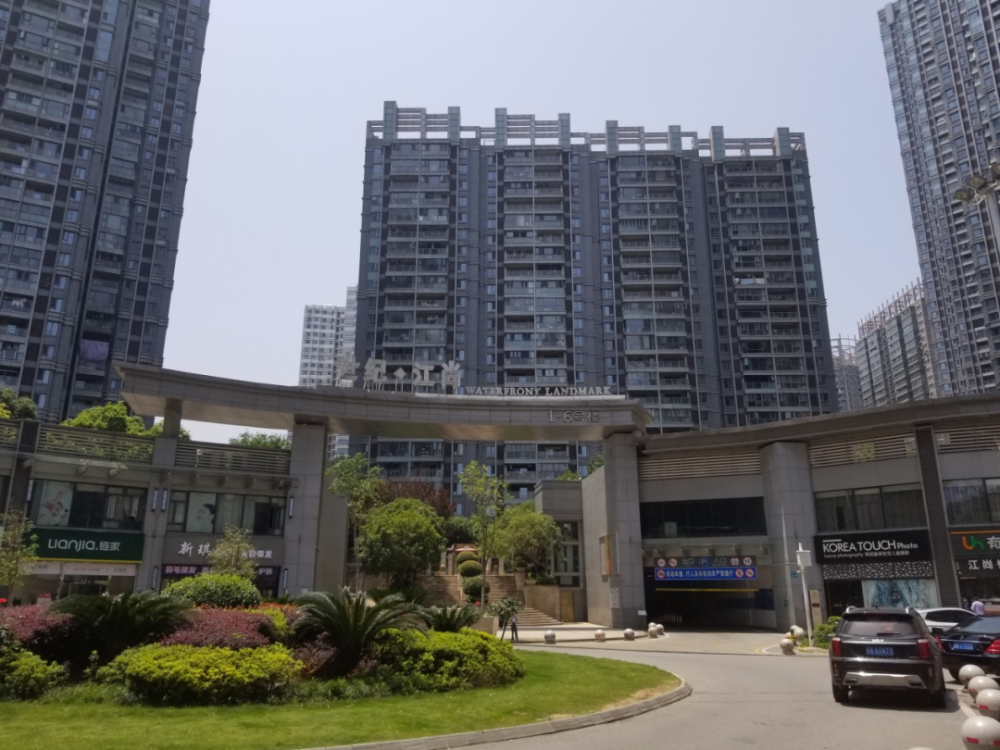
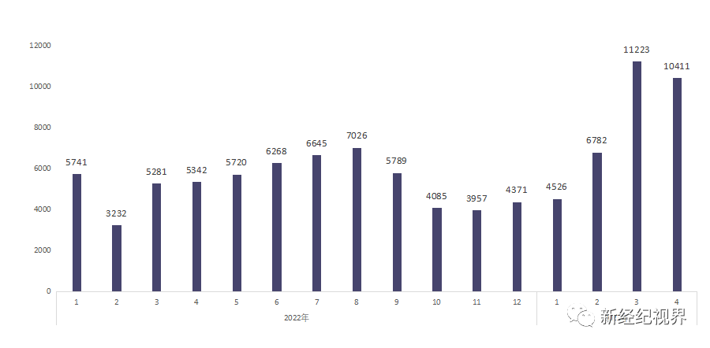

# “越卖越多”，武汉二手房抛售承压

_武汉世纪江尚小区。摄影/唐军_

“只有经济真正向好，企业特别是民营企业经营向好，房地产市场才能走出阴霾。”

**唐军/发自武汉**

武汉的初夏已有炎热感，在江汉路武汉关世纪江尚小区旁，扎堆开着诺家、德佑、白居易几家二手房中介门店，却少有客户光顾。

“5月份，这个小区（世纪江尚）挂牌有200多套二手房，但一套都未成交！”诺家世纪江尚店刘经理无奈地说，目前，二手房业务成交量不佳，只能靠租赁与销售新房支撑业绩。

贝壳二手房平台数据显示，6月1日，武汉世纪江尚挂牌房源有230套，近90天仅成交了9套。

白居易店的一位负责人说：“很多房源挂牌太久仍然卖不掉，有些房东回收资金心切，不得不下调挂牌价；有的大户型房源的挂牌价下调幅度较大，如果算上资金信贷、装修成本，房东是不赚钱，甚至会亏本卖。”

市场迹象表明，武汉及全国很多一二线城市二手房挂牌量在不断增加，一场抛售潮正在悄然蔓延。

**━━━━**

**“感觉二手房越卖越多”**

今年2月、3月，武汉市二手房市场爆发了一波行情，看房量与市场成交量突然反弹、跳涨。

武汉贝壳平台汪经理说：“2月至3月份，贝壳平台武汉二手房每日成交量在200套以上，最高的单日成交量超300套。”

据武汉房地产经纪行业协会二手住房市场报告，武汉市3月、4月二手住房交易分别为11223套、10411套，均为近年成交量的高位。

而从二手住房市场供应情况看，今年3月，武汉市二手住房新增挂牌房源15271套，环比增加15.67%，同比增幅20.71%；4月，武汉市二手住房新增挂牌房源12329套，同比增幅27.66%。

汪经理说，我们感觉二手房越卖越多！目前，在贝壳平台内部展现的挂牌量超20万套，比年初新增了约3万套。

市场抛盘量缘何猛增？

武汉白居易董事长谢娟接受采访时说：“目前，武汉市二手房挂牌量确实突破了20万套。很多房东看不到短期价格有起来希望，没有好转的信号与预期，就赶紧出手了。”

谢娟还列举了身边客户的几种真实情形：前几年购房投资，加用了杠杆，主动或者迫于资金压力被动去杠杆，现在急于出售，以降低风险；卖了武汉房子去上海、深圳购房；优化改善资产，新购置品质好的物业后，不想手上留太多房子，会出售一些老房子；也有出国、移民，处置国内资产。其中，降低投资杠杆与优化改善资产的比例较多，这都推高了二手房市场房源的挂牌量。

记者梳理数据发现，不只是武汉，上海，北京、杭州、南京、成都的二手房都呈现出越卖越多的情况。

截至5月底，南京的二手房挂牌量已突破17万套大关。成都的二手房虽然近几月一直保持较高的成交量，但据贝壳平台显示，挂牌房源仍维持在约20万套的高位。北京的二手房挂牌量在去年11月就已经超过了10万套，今年3月初链家对外展示的二手房挂牌量为10.2万套。截至5月底，最新挂牌数已达约12万套。有市场人士向记者透露，目前杭州市二手房挂牌量也已超20万套。

克而瑞分析认为，全国二手房挂牌量的持续攀升，主要原因有两个：一是对未来市场不乐观，投资客抛售资产，落袋为安；二是改善置换需求增长，改善人群将非核心劣质资产置换为优质区位改善房产，也推动了二手房挂牌出售房源的增加。

**━━━━**

**成交量价齐跌**

在挂牌量攀升的同时，二手房的成交量却在冲高后，迅速回落。

记者通过贝壳平台跟踪梳理武汉每天二手房交易情况发现，今年2至3月份，贝壳平台武汉二手房每日成交量约200套，最高单日成交量超300套。5月份，武汉贝壳平台新增挂牌量约24000套，而全月成交量仅为3183套，平均每天成交仅约100套，市场明显已经呈现乏力走弱态势。

汪经理说，由于去年疫情的防控很严，有不少日子处于静默状态，压抑了市场交易需求。我们去年底内部调研时预判认为，今年初，二手房市场会有一波行情，但没想到这波行情4月就开始衰减了。

4月之后，由于市场业务量的下滑，贝壳在武汉逐渐关闭或合并了一些实体门店，目前武汉的线下实体门店已从3月份的超3000家，下降至1700家。

成交价格也是如此。

记者调查发现，武汉市主要区域代表楼盘朗诗里程、保利时代北区、复地东湖国际等楼盘二手房价格均有不同幅度的回落下调。

4月，武汉二手住宅销售价格同比涨幅为-3.5%；同比上年1~4月平均涨幅为-4.8%。这已是武汉二手房价格同比14连降。

_武汉二手住房市场交易月度走势。数据来源：武汉房地产经纪行业协会_

据武汉房地产经纪行业协会统计，2023年4月，武汉二手住宅总体挂牌价格为17136.88元/平方米，较2023年3月下跌1.93%，较去年同期跌9.47%。其中新增房源挂牌价格18254.91元/平方米，较2023年3月份下跌0.68%，较去年同期跌4.88%。

_武汉二手住房市场月度挂牌价格走势。数据来源：武汉房地产经纪行业协会_

二手房市场量价齐跌，引发了各方的焦虑与困惑。

谢娟说，我们的感受是，的确是因经济环境不好，购房需求整体在下降，去年至今，很多人都在主动降杠杆，提前还款的客户增多，没有能力提前还款，也在把商业贷款转为公积金，或者想办法转贷降利率。

更多的担忧是，不佳的市场预期难以扭转，手中多余的房产越拖延越不好卖。

汪经理说，目前，武汉二手房挂牌后，成交周期正逐渐拉长，3月份平均成交周期约90天，5月拉长至120天以上；同时，议价下探幅度加大，大量的抛盘，让购买者可以“挑肥拣瘦”中大幅砍价。

然而，面对二手房的大量抛压，刚需接手者却显得不足。

克而瑞分析认为，人口高峰已过，城镇化速度放缓，加上长租公寓的替代作用逐渐显现等，刚需下行已成定局。同时，高端住宅的购房需求也已开始有回落态势。资产价格的回落已是未来大趋势，仅核心城市的核心资产尚能增值保值，居民的买房热情也将随之下降。

显然，要想重塑楼市信心，已经不是一件容易事。

那么，二手房抛盘潮会持续多久呢？谢娟颇为悲观地说：“这个很不好预测，但二手房市场不好，也会影响新房成交。叠加大经济环境仍未改善，裁员降薪、降本增效，就业失业，这些传导出来的不利信息，会让市场预期更不乐观。”

截至发稿前，有很多专家呼吁出台救市政策，坊间也传出有新政出台的消息。

谢娟认为：“去年以来，已经出台了很多政策了，而且政策的边际效用也在减弱。只有经济真正向好，企业特别是民营企业经营向好，房地产市场才能走出阴霾。”

**值班编委：马琳**

**责任编辑：温红妹 刘亚**

**审读：戴士潮**

**中国房地产报版权所有**

**未经授权不得转载以及任何形式使用**

