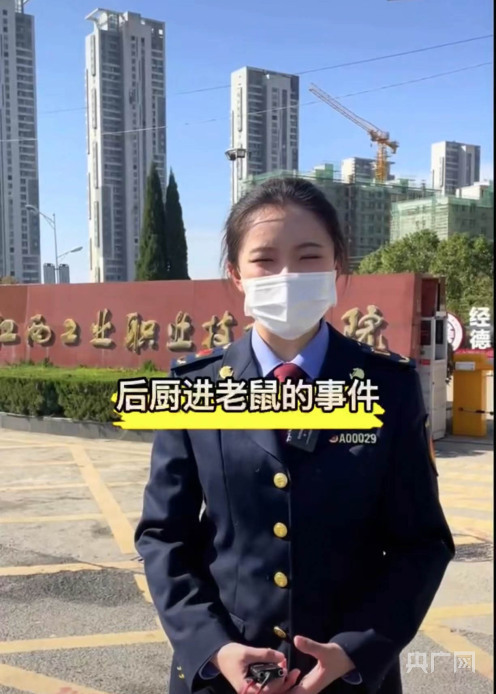

# 一高校食堂疑吃出老鼠头学校回应是鸭脖，校方曾因老鼠问题被联合执法

央广网南昌6月4日消息（记者胡斐见习记者刘培俊）2023年6月1日下午，一则“江西一高校饭菜中疑吃出老鼠头”的视频在网络传播，视频画面的饭菜中，疑似有异物出现。

_“江西一高校饭菜中疑吃出老鼠头”视频（网络截图）_

6月3日晚，江西工业职业技术学院官方微博发布情况通报，回应了此前引发争议的“学校食堂饭菜中吃出老鼠头”一事，称饭菜中的“异物”经当事人确认为鸭脖。

_江西工业职业技术学院官方微博发布情况通报（网络截图）_

情况通报还提到，南昌市高新区市场监督管理局接到情况报告后，第一时间派出执法人员到江西工业职业技术学院开展调查，问询学校工作人员、食堂负责人、当事学生及相关知情人，对食品留样进行采样检测。

_视频显示南昌市高新区市场监督管理局现场调查（网络截图）_

_视频显示南昌市高新区市场监督管理局初步判断异物为鸭脖（网络截图）_

6月4日，记者通过走访了解到，事发现场，高新区市场监管局相关人员通过查看当事人拍摄的图片进行比对，初步判定系鸭脖。同时，并对该校菜品的留样进行检测，将于3—5天专业比对后并公布结果。

目前，南昌市场监管局已经介入。

记者多次致电高新区市场监管局及江西工业职业技术学院宣传部相关负责人，截止到发稿前均未接通。

此外，记者查询资料发现， **这已经不是该校第一次出现“老鼠事件”，早在2021年，南昌市场监督管理局就曝光过一次此类事件。**

_2021年，南昌市场监督管理局就曝光该校有老鼠问题的情况说明（视频截图）_

_对涉事学校进行现场执法视频画面（视频截图）_

_对涉事学校进行现场执法视频画面（视频截图）_

江西工业职业技术学院是1999年经教育部批准成立的江西省首批独立设置的公办全日制综合性高等职业院校，是江西省示范性高等职业院校。学校创办于1954年，先后经历了调整、升格、合并、更名等发展阶段，至今已有近70年的办学历史。

（来源：央广网）

