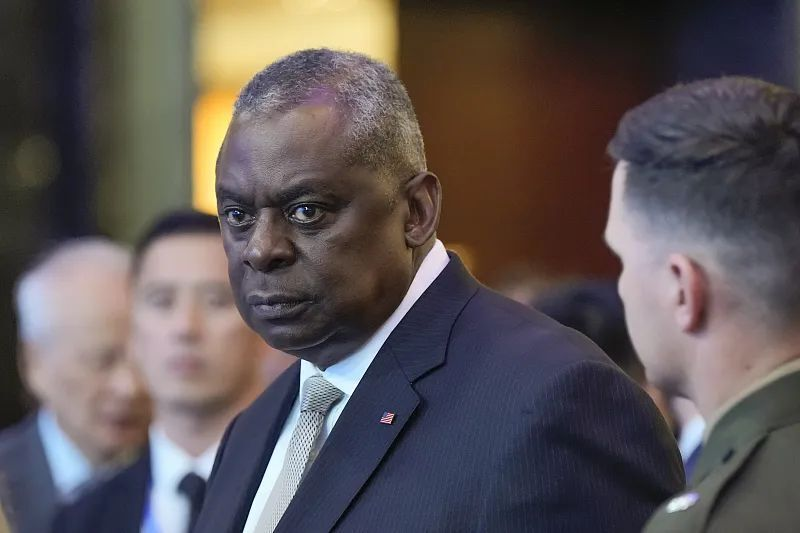
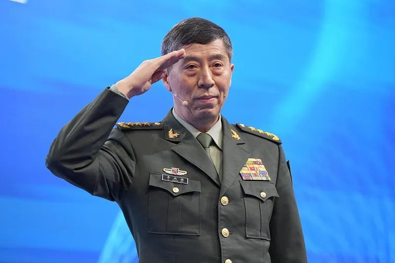

# 中方拒与美防长会面 媒体：美国带来了装腔作势和挑衅，唯独没有诚意

为期三天的第20届香格里拉对话会已于4日下午落幕，来自40个国家的600多名军方领导人、政策制定者和分析人士齐聚新加坡，举行了一百多场正式的闭门会议。

香格里拉对话会由英国国际战略研究所(IISS)于2002年发起，因每年在新加坡香格里拉大酒店举行而得名，是目前亚太地区安全对话机制中规模最大、规格最高的会议之一。

长安街知事（微信ID：Capitalnews）注意到，尽管今年加入了俄乌冲突话题，但中美关系仍是“香会”最受关注的焦点，吸引着全球的目光。

中美两国防长在会议开幕之夜握手，而后虽然不止一次同处一室，但并未举行任何正式会晤，几乎没有解冻的迹象。进退维谷的美国，还在硬撑。

**美国带来了装腔作势和挑衅，唯独没有诚意**

新加坡《联合早报》称，新加坡防长黄永宏3日表示，中美防长分别与其谈话时，都表示希望能恢复原有的军事对话机制。此前也有消息称，奥斯汀亲自要求在会上与李尚福会面，但遭到拒绝。

据美国国防部官员说，以前类似的会谈往往在最后一刻才敲定，但这次中方的拒绝发出了“不同寻常的直率信息”。

然而，美方非但没有认真反省并立刻撤销五年前对时任中央军委装备发展部部长李尚福悍然发起的“制裁”，奥斯汀还在“香会”发表讲话时企图将当前双边关系遭遇困难的责任推给中方，抱怨中方拒绝会晤，声称这是“遗憾且不幸的”。

奥斯汀听起来不像是一个希望通过对话来缓和紧张局势并解决潜在冲突的人。相反，这是美国的老把戏：要么强行把中国塑造成拒绝合作的形象，要么迫使中国默许自己被围堵。

_2日，美国防长奥斯汀抵达“香会”开幕晚宴。图源：视觉中国_

更加不可理喻的是，美国还在会议召开之际，伙同加拿大试图过航台湾海峡。结果，中国军舰靠近并警告美国军舰，随后采取近距横切，迫使美军舰艇减速改变航向。美国印太司令部却恶人先告状，攻击中方做法“不安全”。

对此，国务委员兼国防部长李尚福4日在“香会”上发出掷地有声的质问：“刚才大家提到的这些问题，为什么都是发生在中国领空和领海附近，而不是发生在其他国家的领空和领海附近？”

“那就是，我们中国的军机和军舰从来都不会到其他国家的领空和领海附近，去做所谓的‘航行霸权’！”他直言：“管好你自己的人，管好你自己的军舰，管好你自己的飞机！”

中国前驻美大使崔天凯当日在“香会”间隙接受采访时也表示，“他们为什么要漂洋过海来？到我们家门口？”如果要恢复中美高层防务谈判，美国应秉持“善意和诚意”，减少在中国附近部署军力。

一方面无意主动撤销制裁，自己架高了台阶下不来，还试图通过“找事”来给“香会”“喂料”，另一方面又一再放风，希望中国顶着莫须有的罪名主动递台阶。行动上行挑衅之事，嘴上却喊着危机管控，矛盾的操作难掩无计可施的本质。显然，美国更喜欢装腔作势和挑衅，而不是对话。

**双方的两个大方向毫无重叠之处**

在台湾问题上，奥斯汀在3日发表演讲表示，美国将反对任何一方单方面改变现状，美国有决心维护台海和平稳定，会持续维持强大的威慑力，并呼吁北京与美国进行军事对话。

对于美国此等傲慢之言，李尚福在4日演讲中回应称，台湾是中国的台湾，怎么解决台湾问题是中国人自己的事，不容任何外部势力插手干涉。民进党当局“挟洋谋独”、外部势力“以台制华”，是改变台海现状的最大麻烦制造者。

他强调，如果有人胆敢把台湾从中国分裂出去，中国军队不会有丝毫迟疑，不畏惧任何对手，不管付出多大代价，都将坚决维护国家主权和领土完整。

_4日，中国国务委员兼国防部长李尚福在香格里拉对话会上发表演讲。图源：视觉中国_

在南海问题上，美国同样也休想让中国跟着美国的节奏走。

奥斯汀宣称，美国正在与盟友密切合作，以提升在该地区的力量态势。

他说：“我们致力于确保每个国家都能在国际法允许的范围内飞行、航行和运营。每个国家，无论大小，都必须自由地进行合法的海上活动。我们还坚定地致力于确保我们的盟友和合作伙伴拥有阻止侵略和增加稳定所需的能力。”

对此，李尚福表示，在地区国家共同努力下，南海局势总体稳定，交流合作日益深入。现在，每年数万艘各国船只在南海通行，经此运往全球的货物总价值高达3.5万亿美元，没听说哪艘船通行受阻碍、安全受威胁。反倒是一些域外国家在南海以航行自由之名行航行霸权之实，想把南海搅乱以从中谋利，需要我们高度警惕、坚决抵制。

李尚福还在会上点名“有的国家”，对法治和规则，合则用不合则弃。拿“家法帮规”强加于人，甚至用自己都没有参加的公约去约束别人。其所谓的“基于规则的国际秩序”从来不讲清楚是什么规则，谁制定的规则。

虽然李尚福并没有点名奉行例外主义的“有的国家”是谁，但大家心里都有数。美国至今没有加入《联合国海洋法公约》，却以“海洋法卫道士”自居，非常喜欢拿公约说事，这难免让人质疑美国到底有什么资格拿公约说三道四。

**中国是来交朋友的**

据国防部官网消息，李尚福在“香会”上就“中国的新安全倡议”议题作大会发言。他着重阐述了“对话而不对抗、结伴而不结盟、共赢而非零和”的新型安全之路，倡导用相互尊重取代霸凌霸道，用公平正义超越丛林法则，用互信协商消弭对抗冲突，用开放包容防范阵营对抗。

他指出，历史已经证明，集团政治、分裂对抗不会带来真正的安全，只会加剧局势紧张、破坏地区稳定。今天的亚太，需要的是开放包容的“大合作”，而不是拉帮结派的“小圈子”。

他强调，中方愿与各国携手同行现代化之路，为世界稳定繁荣提供新的机遇。

_4日，中国国务委员兼国防部长李尚福在“香会”发表演讲。图源：视觉中国_

中方的表态既表明了坚定的立场和原则，也展示了相互尊重、开放包容的真诚态度，希望和各方进行更深入的交流。

东帝汶总统若泽·拉莫斯·奥尔塔4日在题为“亚太安全的新伙伴关系”的会议上呼吁，欧美勿用狭隘的眼光看待中国，他不相信中国会做出损人不利己的事。

奥尔塔批评一些国家以“井底之蛙”的视角看待中国崛起，认为中国是区域和全球威胁，但这样的观点根本毫无说服力。他强调，“中国的影响力遍及全球，它现在是一个世界大国，它的利益、财富、人民福祉和安全，与全球所有国家交织在一起。我认为，中国不会杀鸡取卵。”

