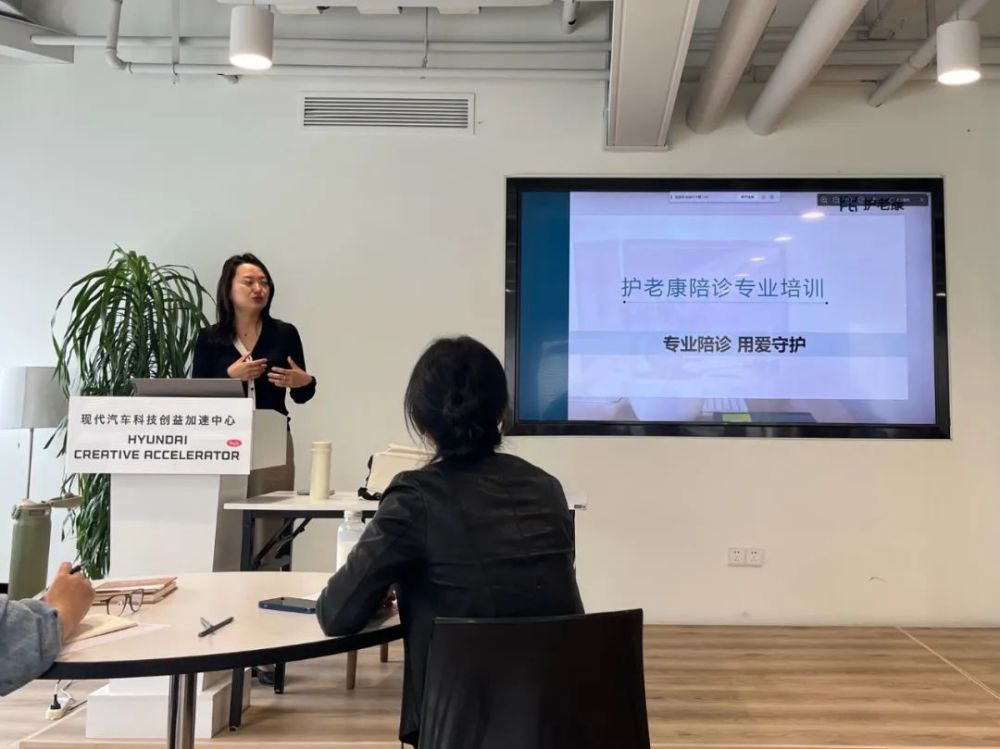
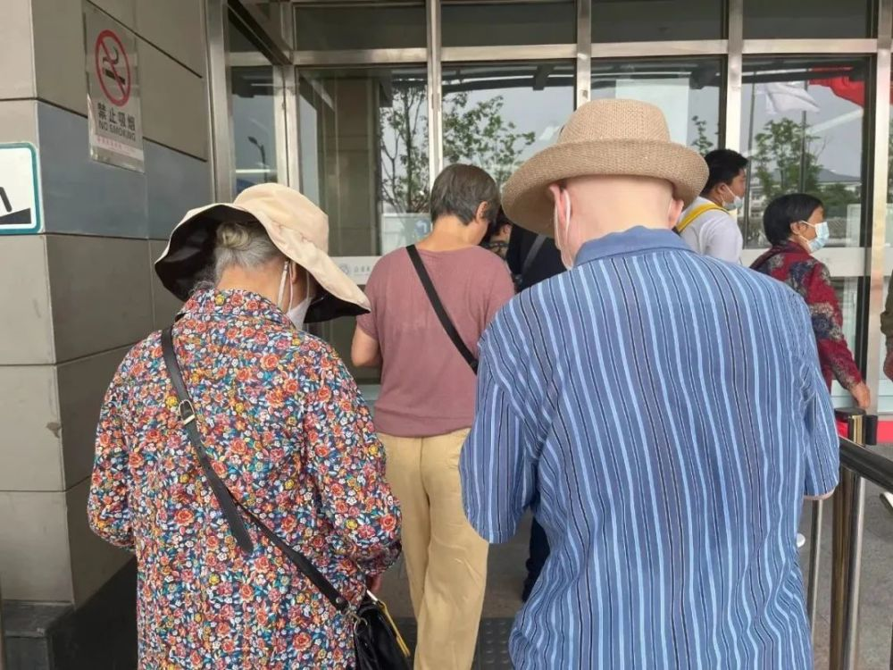
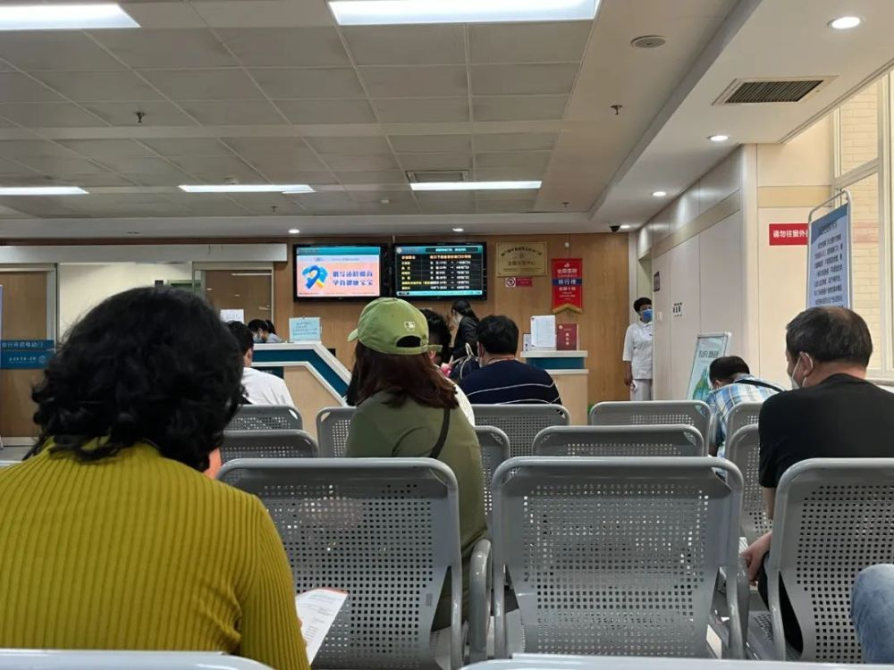

# 她创业失败转行做陪诊师 解救困在医院的老人

38岁这一年，待业妈妈小丹选择了一个全新的职业——陪诊师，专门陪人看病。

在三甲医院云集的北京，医疗相关的需求总是格外旺盛。北京卫健委的数据显示，2019年，北京医疗机构的就诊人次数超过2.6亿，外地来京患者约占三分之一，接近7800万人次。小丹服务的对象正是这一群体，其中65岁以上的老年人占绝大多数。

陪诊，是一个观察老龄化的窗口。透过它，你能清晰地看到，当一个人步入暮年，如何与疾病相处、走向人生终点。而医院那些模糊的标识、繁琐的流程和智能化的设备，又怎样困住了日渐衰退的老年人。

有一对河南的老夫妻，早上7点坐大巴赶到北京，拎着两大包行李去办住院，因为不识字、不认路，生生在医院转悠了三个小时。另一对年长的夫妇，不会用手机挂号，只能在医院门口的告示栏，手抄医生出诊的信息。

做陪诊也能让你感受到亲情的浓厚。一位90多岁的东北爷爷来北京看病，全家出动了9口人。还有一位石家庄的女客户，她的公公癌症，住ICU已经花了几十万，母亲又确诊了脑膜癌，扩散到全身，医生回天乏术，她还是不断花钱请陪诊，去不同医院试。

_导医台前，咨询问题的大多是老年人。_

入行近两年，小丹对新工作很满意。她自带一副东北人的热心肠，细心、勤快、机灵，受老年人喜欢。陪伴老年患者就医的过程中，她积攒了充沛丰盈的感受，也重新定义了自己的价值。

以下是小丹的陪诊故事：

刚做陪诊没多久，我接了一个棘手的单子：患者是一个吉林公主岭的老爷子，78岁，急性心衰，心脏做过搭桥，在长春的医院接受保守治疗，没有缓解。老爷子的儿子、保姆陪着他，坐了10个小时的救护车来北京，想转到阜外医院。

那时疫情管控很严格，吉林正好是疫区。救护车刚开到进京检查站，就被拦了下来。好在我提早赶到医院，取好了急诊的号，打印下所有需要的就医凭证，给检查站的人看了才放行。到了医院，麻烦又来了，随行家属的健康宝都弹窗了，不让进。

当时我挺纠结的。在那种情况下，只有我能陪老人进医院。可万一进去之后我被弹窗了，回不了家，孩子怎么办？其实这个单子只需要在门口接上他们就完了，老板考虑到我的安全，也说可以到此为止。我看了老人一眼，那会儿他已经神志不清了，处于随时濒危的状态，咬咬牙，决定陪他进去。

推着救护车的担架床，我带他进了急诊。医生愿意接收，但没床位。长春医院的医护也等急了，隔着玻璃大声催我还床。他们进京的条子都有时限，晚了就回不去了。我跑去找护士，护士在候诊区的凳子对面找了块空地儿，拿来一个不到一米宽的板儿推，把老爷子挪了上去。

安顿好老爷子、跑完手续后，我回到医院门口，想看能不能求工作人员放一位老人的家属进来，毕竟我还有孩子，不能一直耗在这儿。难得的是，门口的大姐很通情达理，没说什么，挥挥手，让保姆进去了。我才真正松了一口气。

后来老爷子在阜外顺利住院、做手术，身体渐渐好转。他儿子是当兵的，个头不大，不善言辞，见了我一直搓手，不停地说，谢谢，谢谢。

现在想起来，这一单让我觉得特别欣慰。在那样特殊的情况下，我能顺利帮上那位生命垂危的老人，医生、护士、包括门口的大姐，都愿意为了拯救一个陌生的生命去冒险。这种人与人之间的温情，特别打动我。

踏入陪诊行业前，我从来没想过帮助别人会变成自己的工作。以前我做生意，最好的时候，我和合伙人在北京开了六家连锁饰品店，卖一些blingbling的耳环、戒指等，分散在海淀、昌平等高校聚集的地方，主要客户是年轻女大学生。

2020年，受疫情的影响，业务基本崩盘了。逐渐失去客源和收入，钱却像流水一样往外花。十五六个员工的工资，六家门店的房租，一个月损失几十万。最后实在撑不住，把门店都关了，堆积如山的存货都搬回了家。

心理压力大，我开始在食物上找安慰。我变得越来越嗜甜，只有甜味才能使我分泌多巴胺，甜点、糖果、奶茶，不停往嘴里塞，好像只有吃得饱饱的、胀胀的，才能短暂获得内心的充实与安稳，不至于一无所有。

朋友建议我可以把饰品的库存都放网上卖，做直播，减少损失，但我干不来。我的生活变得单调，做饭、接送孩子、搞卫生，在家里窝着，不能创造价值。

我不能容忍这样的状态，不想被困在琐碎的家务劳动里。所以当我去年无意中刷到陪诊的资讯之后，很快投入了进来，加入了专门做陪诊的公司。

_小丹所在的机构，正在举办专业培训。_

我在的这家公司，90%都是女性，接近一半的人在做陪诊前，都是像我一样的待业妈妈。新行业的诞生，给了我们新的就业机会。招聘时，老板会注重考核我们的人品、情商和性格，对综合素质的要求很高。在医院遇到的情况千变万化，不是随便就能应付的。

有陪诊师接受采访说自己「月入过万」，我的经验是这份工作挣不了这么多。但我想，这份工作的价值是不能用金钱去衡量的，每一句谢谢都弥足珍贵，它们替代那些甜食，成为了我的快乐因子。

做陪诊一年多以来，我接诊的患者90%以上都是外地来北京就医的老人。他们大致可以分为三种情况：

第一种，在老家做了检查，但对结果或医院的水平不满意，正好有条件可以来北京，索性到最权威的地方治疗；第二种，在老家确诊了某种疾病，情况不好，想到上一级的医院求医问诊；第三种，就是大家都不愿意看到的，生命已经进入终末期，来北京最后一搏。

_北京一家医院门口，排队的老年人。_

为他们找陪诊的一般都是儿女或孙辈，几乎没有老人会愿意自己花钱购买这项服务。找陪诊也并不都是因为没人陪，更是希望能有专业的人帮忙，节约时间，提高效率。说白了，就是解决「信息不对等」的问题。因为他们就诊都是知名的三甲医院，各家医院的科室分布、流程设置都不同，像一座座陌生的巨型迷宫，普通人都犯迷糊。

去年10月，杭州女孩小优和妈妈、姑姑一起来北京陪父亲看病，老先生60岁出头，2015年做了开颅手术，并发症影响到视觉神经，同时有白内障和青光眼，想到同仁医院做手术。考虑到患者有开颅手术史，眼科医生建议先会诊，评估脑部情况，找了我陪他们去宣武医院看神经内科。

为了方便老先生，我提前租了个轮椅。小优不太同意，她的父亲是一名知识分子，自尊心强，不希望被当作「病人」看待，尽管裸眼视力只有0.1，却特别抵触别人的搀扶，更不用说轮椅。

但那天我们到了医院一看，她的父亲很快就接受了轮椅。宣武医院分新院和老院，我们去的老院门诊楼，建筑陈旧，诊室过道窄，座位少，没有专门的候诊区。就医的动线也复杂，抽血在室外的平房，做CT之类的检查也得到四五百米之外一个犄角旮旯的楼。

从这个例子，一方面，你能看出陪诊行业的必要性，因为我踩过点，对医院的情况足够了解，才能依据患者的情况，提前做好准备。另一方面，你也能看到老人就医到底有多么不方便，医院确实在更新、迭代，但有些历史遗留问题，短时间内解决不了。

有时，在患者和家属身上，我能学到一些东西。今年1月，一位客户的母亲确诊了直肠癌。跟他对接时，他发来一个文档，上面详细记载着他母亲就诊的全过程，什么时间去了什么医院、化验的结果是什么、医生给了什么建议、各个阶段母亲的状态如何，他都分门别类、条分缕析地写了出来，连格式都做得一丝不苟。

我看得很震撼，接待了这么多客户，这是准备最充分的一个。他总结的信息都在点子上，我反复点开学习了很多次。当亲人患病时，咱们都会紧张和难过，但只有负面的情绪无济于事，还是得去思考，怎样做才能最大限度地帮到家人。他就是一个最好的范例。

早在成为职业陪诊师前，我已经当了很久家庭内部的陪诊师。

我的第一个「客户」是我爸。他有冠心病和高血压，血压高的时候能到两百二三，如果吃降压药，降到一百二三，他反而会晕乎，因为已经适应了高负荷的压力。老家的一个医生给他看了，觉得这可能是原发性的高血压，从肾上来的，建议他来北京好好查查。

那时我刚毕业不久，在北京一家物流公司上班。我提前查了下资料，准备带他去协和和安贞看心脏，去北大一（北京大学第一医院）看肾。当年还没有那么智能化，挂号特费劲儿，基本都得早起，去人工窗口排队。号源也紧张，一个专家一天大概也就只看10个左右的号。

当时大概是三月份，我和我老公凌晨三点起床，打出租到了协和。刚到门口就傻眼了，打地铺的，坐马扎的，一溜儿长队，都是通宵在等的。过了四个钟头开始挂号，果不其然，没轮上我们。我有些抓狂，干脆在门口买了一个黄牛号，1500块。

后来我们又紧接着跑了安贞、北大一，都找的是最厉害的医生，把该做的检查都做了，幸好最后没有什么大问题。我爸这才放心，住了三天就回家了。

从那以后，我就成了我们家庭内部的陪诊师。因为我是吉林人，东北地区习惯吃腌制类的食物，亚硝酸盐和盐分重，对心脑血管不好，不少亲戚有心脏类的疾病。带着家里的七大姑八大姨，我反复跑过许多次阜外和安贞，跑成了「专家」。

其实我并不是我们家唯一一个在北京的后辈，只是我时间自由，比较热心肠，他们来我都愿意张罗。我觉得人都不喜欢生病，生病是一个人最脆弱的时候，如果可以尽量陪着，减少他们的周折，我会更心安。

陪家人看病的过程中，我养成了一些习惯。比如每到一家医院，我都会去关注医院附近有哪些比较实惠的旅店、饭馆，看到护工之类的信息，也会随手拍下来存着，或者留个名片之类的。时间一长，积累下了不少资源。

另外，在北京看病，有一些小窍门是可以总结和分享的。就说做检查这事儿，北京的医院一般都只认自己医院的结果，因为不同层级医院的设备、影像医师的水平都不同。而且本院的信息存储系统都更完善，方便随时调取。比如你在阜外或安贞，他们会保存近10年的记录，能更直观看到病情的进展。

有一个江苏的患者，她的脑部长了肿瘤，当地的医院说肿瘤离中枢神经只有2厘米，如果做手术，大概率会影响听力。她说自己宁可一辈子坐轮椅，也不愿意听不见。她找我陪着去天坛医院重新拍了片子，肿瘤的位置和老家的结论相差几毫米。而恰恰就是这不起眼的、几毫米的距离，让她保住了听觉。

陪诊这行做久了，我有一套自己的方法论。

见到年纪大的患者，我一般会先安抚他们的情绪，把接下来的流程都告知给对方，让他们能心中有底。再就是得让他们明白，我是花钱雇来的，所以无论有什么就医方面的需求，都不要有心理负担，放心提出来。

但陪同患者的过程中，我不会跟他们聊太多。尤其是和疾病相关的话题，患者看病是为了求真，得到一个确定的结果，那我不应该用不专业的医疗知识去影响判断，或是增添焦虑。想要表达关心，可以通过一些具体的行动。

我接的第一单是老板朋友的母亲，需要陪阿姨去医院西直门附近的人民医院抽血化验，但没有透露她具体是什么疾病。那天我提前一个半小时过去了，带了折叠坐垫、水和纸巾。和阿姨碰面时，我看她一直捂着肚子，就找了一个有阳光的地方，打开座垫，让她坐着等，暖和暖和。后来听老板说，阿姨的反馈特别好，还专门提到了这个晒太阳的小动作。

很多人会把陪诊师形容为患者的「临时家人」，我不完全认可这种说法。「临时家人」更多提供的是情感支撑，我认为这部分最多只占30%，更重要的是能「陪明白」，把患者的病情梳理清楚，提升他们就医的效率。

一个从盘锦来东肿（中国医学科学院肿瘤医院）看病的阿姨让我印象特别深。阿姨姓张，67岁，胖胖的，头发烫着小卷儿，嗓门挺大，典型的东北阿姨形象。她和朋友吴阿姨先后确诊了肺癌，治疗后情况都不错，俩人约着来北京，想做全面的复查。

吴阿姨的儿子提前给她挂了一个专家号，张阿姨的儿媳则通过平台找到我，我们约了普通号，一个年轻的住院医师。这么一对比，张阿姨挺失落的，这普通号能不能给我看好啊？水平行不行？会不会三言两语把我给打发了？

_候诊室门口，等待就医的老人。_

我陪张阿姨坐在诊室门口等。她排40号，从30号进诊室开始，她就开始掐时间算每个人在里面待了多久，这个15分钟，那个5分钟，下一个进去半小时都没出来。我们本来约的10:30看诊，等到12点都还没进去。张阿姨特生气，脸涨得通红，她觉着医生快下班了，肯定没心情给我看。

轮到我们了。坐上诊椅，张阿姨只顾着跟医生诉苦，说自己大老远来，等了很久之类的话。我赶紧打断她，把在门口捋好顺序的检查单和片子递给医生，开始陈述病情，提出阿姨做全面复查的诉求。医生听完，把肺、肝、胆、脾的检查都给开好了，加起来得有10项。

我突然想到，候诊时听到两个本地的叔叔阿姨讨论，「让大夫给咱们约个复诊号」。灵机一动，试探性地问了问医生，能不能再帮忙约一个复诊的专家号？医生很爽快，约了一个10天后的胸外科权威的专家。张阿姨顿时特别开心。

事情的反差出现了。那天吴阿姨约的专家可能状态不好，只给她开了一个胸部的CT、一个血液的全项，5分钟就出来了，也没有给约复诊的号。

我说这个例子，并不是为了吹嘘做得多么好，只是在求医问诊这件事上，存在许多信息壁垒。现在网络很发达，大家可以在各种软件上获取就医的攻略，可是看病这件事确实需要脚踏实地，一个一个地跑，才能总结出经验。虽然我不是医疗出身，但我有信息整理、收集反馈的能力，这是「陪明白」的关键。

不得不承认的是，对大众来说，陪诊仍旧是一个新兴的职业，不是所有人都愿意买单、认可它的价值。

有一次我在医院门口，拎着公司发的袋子，上面印有陪诊的广告，一个路人看到了，直接指着骂：都是因为你们这帮搞陪诊的，搞得我们的号这么难挂。心里感觉挺憋屈的，但也不好说什么。

行业里确实有一些陪诊师，并不是纯粹地在做「陪诊」的工作。比如，有的机构说是招募陪诊师，实际上是让那些人去卖药给患者挣钱。还有一些短视频平台上的陪诊师，喜欢制造噱头，放大焦虑，把通用的看病常识包装成自己的独门秘籍，给人一种「非他不可」的感觉。这些都不是健康的状态。

医生面前，我也会隐藏陪诊师的身份，以患者家属或朋友的名义去问诊。因为怕对方认为我只是外人，不愿意跟我过多的沟通，尤其是在患者本人没来、由我代问诊的时候。这样大家的状态都会比较舒服，也能更充分地获取信息。

有的患者家属，也会主动要求我伪装他们的同学或朋友。一个安徽的小女孩，她母亲喜欢打羽毛球，运动时膝盖受损，老家医院建议换膝盖，想来北京看看有没有别的方案。

小女孩特意给我打电话，说我妈这人舍不得花钱，又特爱聊天，你到时候就说咱俩是高中同学。但我一个东北人，口音重，一说话就会露馅儿。所以我和她特意编了一个桥段，说我和爸妈去安徽做生意，借读了一段时间，又回了东北高考。和她母亲见面时，还真用上了。

这行做的时间长了，也会遇到一些无能为力的事。

我们公司接诊过一位年轻的男客户，90后，骨癌晚期，孩子才一岁多。他来北京看病，挂不到号，和妻子在医院瘫坐在地，号啕大哭，说「天要绝我」。后来我们帮忙找了一个人，抱着最后的希望，给他挂了广安门医院的号，看看中医。这单我们没收一分钱。

他后来怎么样了，我们都不清楚，也不敢问。我的观念是，我只提供陪诊的那个时间段的服务，结束以后，我们不要再联系。听上去有点冷漠，但其实是因为我害怕和人产生过多的情感连接，人与人之间一旦有了牵绊，就无法切割开了。

我也经常会遇到一些叔叔阿姨，很热情地看着我说，你比我亲孙女还亲。听到这种话，心里会温暖，但更多的是忐忑，或许他们只是客套，对我来说就会变成心理负担。我会不断去想，那我是不是应该付出更多，才能配得上这句称赞？陷入自我消耗之中。

最好的状态应该是，你获得了我的帮助，我得到了内心的丰盈。到此为止，就可以了。

撰文 | 小琪

运营 | 何城

摄影 | 小琪

监制 | 传举

