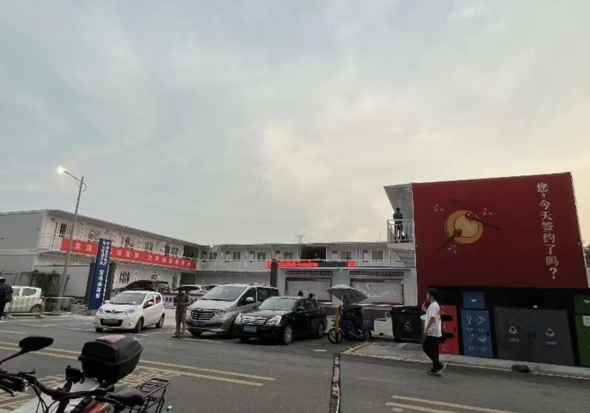

# 实地探访深圳白芒村：城中村“统租”签约遇阻，业主签约率仅12.5％

近日，深圳市白芒村的“统租事件”引发大量关注，而“搬家”已经成为当前白芒村内租户之间不得不聊的话题。

“统租”，顾名思义，即统一租赁，而从官方的通知来看，更愿意将白芒村租户此次的“搬迁”称之为“综合整治项目”实施之前的准备工作。也就是说，为了提升白芒村的居住品质，同时也为了筹集深圳市保障性租赁住房，南山区国资委直属的深圳市深汇通投资控股有限公司（下称“深汇通”）号召白芒村业主将房屋统一租给深汇通，深汇通将房屋改造之后再对外出租，而其中一部分改造完成的房源会纳入深圳市保障性租赁住房范围内。

然而，居住在白芒村的常住人口上万，统一租赁之后，原本庞大的租户群体将去往何处?周边村落房租上涨、村内学生的上学问题、租户的搬迁成本、业主与统租公司的签约拉锯战、改造后白芒村的租金是否上涨......这一系列涉及白芒村现有住户的问题，急切等待一个答案。

值得注意的是，在“白芒村统租事件”的背后，其实是深圳市保障性租赁住房的筹集问题，十四五期间，深圳计划建设筹集60万套保障性租赁住房，而城中村改造成为保障性租赁住房筹集的重要方式，未来几年，“统租”将涉及深圳更多的城中村，白芒村就像是第一个吃螃蟹的人，为后续的城中村改造“打样”，而这也是“白芒村统租事件”备受关注的重要原因。

**关于搬家的另一种声音**

白芒村位于深圳市南山区西丽街道，背靠阳台山，是西丽片区较为偏僻的城中村。明末清初时期，张姓先祖带领族人从广东梅州南迁至此，村落周围长满白芒草，“白芒村”因此得名。随着城市的发展变迁，现在的白芒村居住的大多是外来人口，村内房屋密集，多为5~10层左右的小高层，因为离繁忙的区域较远，目前还没通地铁的白芒村房租较为便宜，单间租金在1000元/月左右，然而，最近关于“统租”的消息打破了这个城中村原本的平静。

6月2日（周五）傍晚，记者走访了白芒村。一进村，映入眼帘的即是几张醒目的红色横幅，大多与“综合整治”、“统租”有关。下班时分，白芒村依旧像往常一样热闹，水果店、生鲜店、吃食店路边的吃食小摊都在正常经营。从人群中走过，能大致听清人们交谈的话题大多都与“搬家”有关，就连食客也会忍不住问老板“什么时候搬家”。村口右边即是白芒村综合整治项目现场指挥部，门前的宣传栏里张贴了关于综合整治的相关文件，时常有人前来驻足。

在一部分人还在议论“搬家”话题的时候，记者看到，已经有租户在搬家，“早搬晚搬都得搬，索性现在搬了。”搬家的匆忙间隙中，在白芒村生活了20多年的张阿姨对记者说到。

“今年年初的时候就有听说可能要搬家，所以我都不敢囤太多货。”在白芒村开了20年百货商店的王英对记者表示，房东前两天打电话说最迟7月底搬完，最后一个月不收房租。王英表示，自己经营的店铺租金还算便宜，如果搬去其他地方，入场费不会少，自己目前也还没确定新的店铺位置。

当然，并不是百芒村的所有人都接到了搬家的通知。来深圳三个月，在白芒村刚开启小吃生意的王峰对记者表示，自己在白芒村租了一个一室一厅空房，每个月房租1100元，他也还没接到搬家的通知，不过指挥部的工作人员上门来询问了他的意见，他表示生意刚开始有起色，不愿意搬家。

“我们不用搬，房东不想签约，可能是租金补偿还没谈拢。”在白芒村卖牛肉粉的张鸣对记者表示，不用搬家当然好，就怕到时候村里的租户都搬走了，自己的生意也会受影响。

“住的好好的，突然要搬，我觉得这里的房子挺好的，没必要改造啊。”在白芒村生活多年的陈梅对记者表示，搬家很麻烦，自己并不愿意搬家，“等改造完之后，白芒村的租金肯定比现在贵，到时候想要回来都回不来了。”陈梅有些无奈的说道。

白芒村统租，租户需要搬离，也影响到了白芒村村内的在读学生。6月2日（周五）傍晚，白芒小学的教室灯火通明，学生们都已放学回家，家长们则从白芒村的各个角落赶来，教室内大多在讨论搬家，以及小孩读书的事情。

对于上学问题，南山区教育局发布的文件显示，小一申请白芒小学，初一申请丽湖学校（或平山学校）的居民，凭有效证件及指挥部开具的相关证明，均可正常报名申请，参与所报学校积分排序入学；搬迁至南山区内其他学校学区居住，并就近按所在学区申请小一初一的，凭有效证件及指挥部开具的相关证明，均可正常报名申请，参与所报学校积分排序入学。因搬迁导致新的居住不满一年的，按满一年计；搬迁至外区居住，因在当地居住不满一年，导致不能正常报名申请当地学校小一初一的，以及希望能够转学的，待指挥部汇总信息后，与市教育局协调争取；已经在读的学生，搬迁后可在原校继续正常就读;如搬迁至南山区内其他学校学区居住，希望能够转学的，届时凭有效证件及指挥部开具的相关证明，视相关学校及共周边学位情况予以统筹。

白芒村要搬家的消息也让周边的租房中介看到了商机。6月2日，记者在白芒村看到，村口已有不少人在发传单拉客，中介表示，白芒村北边的企航人才公寓，可拎包入住，单间的租金为1300元/月，与白芒村目前的整体租金差距不大。不过，也有白芒村的租户告诉记者，最近白芒村租户找房的比较多，周边城中村有涨价的情况。

**统租签约的阻力**

对于签约和搬迁事宜，记者以白芒村业主的身份咨询了白芒村综合整治项目指挥部(下称“指挥部”），其工作人员对第一财经表示，业主与深圳市深汇通投资控股有限公司（下称“深汇通”）签约。企查查显示，深汇通成立于1997年，注册资本32.4亿元，是南山区国有资产监督管理局直接全资控股的公司，据悉，深圳市南山区西丽街道平山村的统租工作也是由深汇通公司负责。

上述工作人员表示，业主签约年限按照“15+5”的模式，也就是15年内，每三年租金上涨10%，15年之后，因为无法预判市场行情，业主评估市场价与深汇通给出的价格后，如果还有统租签约意愿的，可以和深汇通签约。租赁期满后，深汇通以届时的房屋现状归还给业主。统租的租金标准方面，根据房屋统租片区的不同，深汇通给业主的租金按照66元/平方米/月，或者68元/平方米/月两类进行计算。

若以一套面积15平方米的住房计算，签约之后，房东每月能收到的租金则为990元/月，或者1020元/月，与白芒村当前的租金价格不相上下。宝安区石岩片区的城中村业主向记者透露，他所在的村也听到了统租的消息，统租公司给予的租金大概在42~45元/平方米/月，跟其直接对租户出租时的价格差别不大。如此看来，网络上关于“房东两倍签约价格”的传言真实性存疑。

记者了解到，除了租金，深汇通还会给予业主两项补偿费用——搬迁费和“停工停业”补偿费。住宅的搬迁补偿费为40元/平方米/月，一楼商业部分为60元/平方米/月；“停工停业”补偿费方面，住宅部分补偿三个月，标准为66元/平方米/月，或者68元/平方米/月，商业部分补偿六个月，按照片区不同，补偿范围为80元~100元平方米/月。工作人员表示，这两项费用，业主自主决定给予租户一定补贴。然而值得注意的是，记者在在白芒村街头看到，指挥部工作人员回复租户称，相关部门会将搬迁补偿费直接给租户，这与此前记者以业主身份咨询时得到的回复并不一致。

此外，记者在白芒村公示栏看到南山区西丽街道发布的通告称，2023年6月30日（含当日)以前签约的业主，以及2023年9月10日（含当日）前腾空交付的业主可获得相关奖励，不过，该通告并未说明具体奖励包括什么。

对统租对象进行奖励，或许与当前签约业主并不积极有关。指挥部的工作人员向记者透露，目前白芒村签约的楼栋共80多栋，而根据2019年南山区西丽街道公布的白芒村综合治理的情况来看，白芒村整治总楼栋数为641栋，若以此计算，白芒村此次统租已签约的楼栋数量占比仅12.5%，签约率并不算高。

**城中村为什么要改造？**

数据显示，2010年，深圳市常住人口为1037万人，2020年，深圳市常住人口增长至1763万人，十年间常住人口涨幅达到70%，迅速的人口增长，再加上深圳面积较小，导致深圳住房供给非常紧张，城中村则在这个过程中，承接了很大的居住需求。

“城中村助手”小程序显示，目前深圳有1743个村，占比面积13362公顷，常住人口1343万人，截至2022年，深圳市常住人口为1766万人，也就是说，深圳的常住人口中，有约76%的人都居住在城中村。

近年来，为了保障居民住房需求，深圳市增加了保障性住房供应计划。根据《深圳市住房发展“十四五”规划》，“十四五”期间，深圳市计划建设筹集住房89万套（间），其中，建设商品住房35万套，建设筹集保障性住房54万套（间）。保障性住房包括公租房6万套（间）、保障性租赁住房（下称“保租房”）40万套（间）、共有产权住房8万套。今年2月，深圳调整供应目标，将保障性住房筹集数量从原先的54万套（间）调整为不少于74万套（间），增加的20万套（间）均为保租房。

从规模来看，保租房的建设和筹集压力较大，特别是在深圳住房用地供应比较紧张，且大部分人居住在城中村的情况下，通过改造城中村以筹集保租房就成为了一个重要方式。

根据《深圳市保障性租赁住房管理办法（征求意见稿）》，保障性租赁住房是指政府给予政策支持，发挥市场作用，坚持小户型、低租金，面向符合条件的新市民、青年人、各类人才租赁的住房。作为保障性住房，保租房的价格普遍比市场价格低，租户若想享受保障性租赁住房的价格，需要和相关部门申请。保障性租赁住房的，申请条件包括，申请人未在本市拥有自有住房，且在三年内未在深圳市转让或分割过自有住房；申请人未在本市享受住房保障优惠政策；申请人正常缴纳社保；申请人具备深圳市政府规定的人才引进迁户核准条件。

广东省城规院住房政策研究中心首席研究员李宇嘉表示，城中村统租是深圳多渠道公共住房供应的重大创新，贯彻了国家提出的超大特大城市稳步推进城中村改造，也是存量盘活的重要渠道，而且也符合高质量发展，供给侧改革和积极探索新模式。但是目前看，城中村统租工作推进的有些疾风暴雨，急于在短期内实现大体量任务增长。太快了，就会导致工作方式上存在很多瑕疵，比如对现有租户的大规模清退，必须以更高的租金统租，导致房源供应短期内快速减少，而搬离的租客需要寻找新的居所，需求短期内释放，不利于稳定租金。

李宇嘉认为，计划统租一个项目时之前，需要评估现有租客在周边是否有适宜的同类房源选择，以降低搬家的成本，如果周边房源供应紧张，最好保持租赁供需现状，不要安排统租，以避免对现有的租赁生态造成冲击，导致短期内供需失衡和租金上涨，或者，安排少量统租以丰富片区内多元业态，构建高中低档租赁供应，提高可选择性。

6月4日，深圳市住房建设局相关负责人对媒体表示，今年，全市计划通过城中村规模化品质化改造提升，筹集保障性住房5.2万套（间），约占全市城中村租赁住房总量的1%。不会在深圳所有的城中村开展规模化品质化改造提升筹集保障性住房，进行改造提升的城中村，占全市城中村中的较小部分。

该负责人还表示，城中村保障性住房规模化品质化改造提升，将在充分尊重原业主意愿、维护城中村原有的居住生态、尽量降低对居住者生活的影响的前提下有序推进，原则上不要求对整村进行改造提升，确实需要整村进行保障性住房规模化品质化改造提升的城中村，要进行充分协商和严格论证。改造后的租金以不涨为原则，单套租金原则上与改造前基本持平，即便个别房源因改造成本高、投入较大、建筑结构复杂，也必须严格控制成本、严格控制价格、严格加强价格监督。

（文中张阿姨、王英、王峰、张鸣、陈梅皆为化名。文中图片为张慧敏摄）

