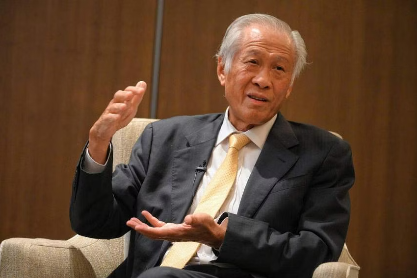

# 新加坡防长称“更担心东北亚而非南海”，特别提了日本

（观察者网讯）第20届香格里拉对话会（简称“香会”）最后一天，当地时间6月4日，新加坡国防部长黄永宏谈到了中美关系、亚洲局势等问题。

黄永宏呼吁中美两国保持军事沟通，因为中美关系对地区稳定至关重要。他认为，未来十年，各国首要任务是防止亚洲爆发军事冲突，而“相比南海，更令人担心的是东北亚局势”。他此处特别提及了不断增加军费的日本，并直言，“改善与中国关系，就是日本能为亚洲做的最重要的事”。

_新加坡媒体报道截图_

综合新加坡《海峡时报》、《联合早报》和CNA通讯社报道，为期三天的香会于4日落幕，新加坡国防部长黄永宏当天出席香会总结采访，对媒体发表讲话。

“乌克兰发生的事情一定不能发生在亚洲……如果欧洲和亚洲同时发生冲突，将给整整一代人带来灾难性后果”，黄永宏向在场记者表示，“不幸的是，地缘政治的现实和轨迹存在分歧”，未来十年，各国的首要任务应是防止亚洲爆发武力冲突。

黄永宏随后提到了中美紧张关系和中美防长在香会上的交锋。

近一段时间，美方多次放话称正寻求中美防长见面，后又单方面表示该请求“已被中方拒绝”。此后，以美国防长奥斯汀为首的美国官员开始大肆炒作“中方拒绝两国防长见面”。同时，五角大楼开始渲染南海问题，并大搞剑指中国的军事演习和多边防长会议。

黄永宏表示，中美两个大国需要有开放的沟通渠道。中美关系对亚洲和更广泛的印“印太地区”的稳定至关重要，正式和非正式的沟通渠道对于缓和局势和避免冲突都是必要的。

他说：“美国和中国都表示，他们不希望我们这些东盟国家选边站。但东盟成员国对过去的大国竞争及其破坏性后果有着清晰的记忆，我们非常担心，中美两个大国之间日益恶化的关系，将不可避免地迫使我们各自的国家做出艰难的选择。”

“我们（东盟国家）只是旁观者，但我们并不是没有私心的旁观者。确保美中沟通渠道畅通，符合我们的既得利益。”黄永宏如此强调。

_新加坡国防部长黄永宏，图自《海峡时报》_

当被问及如何看待日本不断增加军事开支一事时，黄永宏表示，日本应该做的事情是，继续让包括中国在内的邻国感到放心，让邻国们放心日本的国防政策。

“相比南海，我更担心东北亚。”他随后解释说，日本二战后“可能是一个非常和平的国家”，但仍然与各邻国之间有“未解决的敌意”；而近期日本军费预算不断增加，“我们之前从来没有遇到过日本（在军费上）花这么多钱的情况”。

黄永宏指出，“改善与中国关系，就是日本能为亚洲做的最重要的事”。他说，日本应持续向邻国做出保证，让邻国放心其国防政策，这种保证可以通过香会等多边机制来实现。

_黄永宏同中方代表会面，推文截图_

对于中美军事沟通一事，我国防部发言人谭克非此前就回应称，对话不能没有原则，沟通不能没有底线。当前两军交流面临的困难，责任完全在美方。

6月4日，国务委员兼国防部长李尚福在第20届香格里拉对话会上就“中国的新安全倡议”议题作大会发言，在台湾、南海等问题上的表态掷地有声。

李尚福重申，历史一再证明，中美合则两利、斗则俱伤。中方一直寻求与美建立新型大国关系，但这需要美方拿出诚意、言行一致，以实际行动与中方相向而行，推动两国两军关系止跌企稳。应不惧困难，找到相处之道。这几年中美关系徘徊在建交后的低谷，造成这种困难局面的缘由大家都很清楚。

当有记者询问对于李尚福的讲话有何感想时，黄永宏回答称，他问了其他领袖的意见，很多人都对李尚福印象深刻，表示李尚福的演讲信息明确，而且说话坚定。“我个人的印象是，李将军是可以合作的对象。他是优秀和强而有力的国防部领袖。对我来说，这为建立关系设下好的基础。”

**本文系观察者网独家稿件，未经授权，不得转载。**

