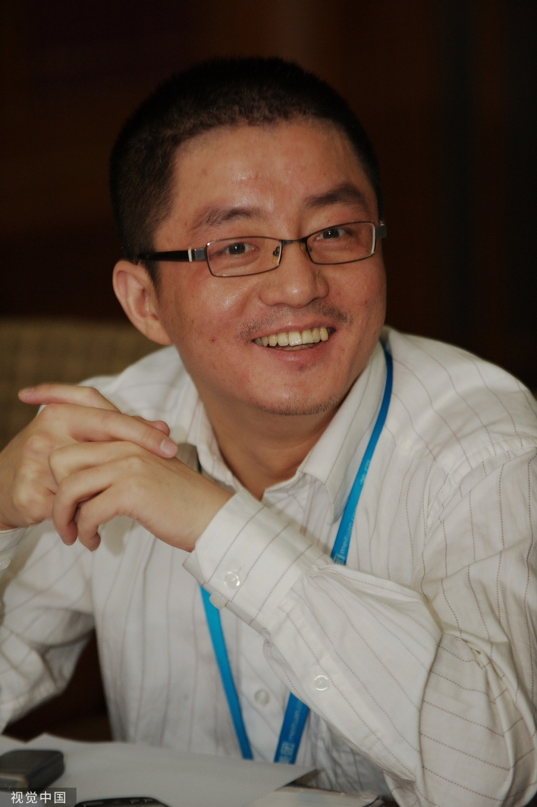
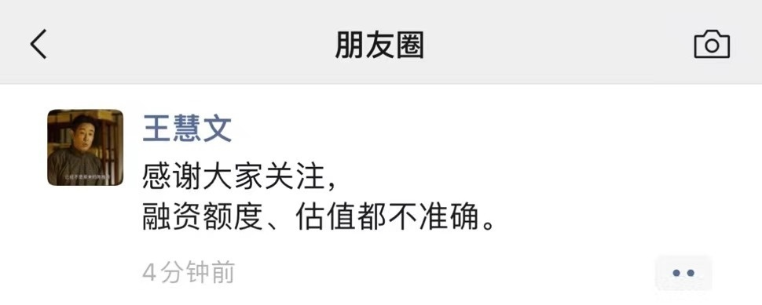

# 深网｜传光年之外获2.3亿美元融资 王慧文否认：额度、估值都不准确

作者｜叶蓁

编辑｜康晓

出品｜深网.小满工作室

6月5日消息，据量子位报道，美团联合创始人王慧文的AI创业公司光年之外，已在近期完成了新一轮2.3亿美元（折合人民币16.3亿）融资，投前估值10亿美元。对此传闻，王慧文在朋友圈公开回应称：融资额度、估值都不准确。

据此前报道，光年之外的A轮融资由源码资本领投，押注8000万美元，此外腾讯、五源资本和快手创始人宿华均参与其中，五源砸入4000万美元，宿华以个人身份投资4000万美元。

3个多月前，2月13日，美团联合创始人王慧文在社交APP即刻发布“AI英雄榜”，为自己新成立的AI公司，北京光年之外科技有限公司广招“顶尖研发人才”，打造“中国OpenAI”。王慧文称他已筹到近3亿美元（约合20亿人民币），其中包括自己出资的5000万美元，以及顶级VC即将在下轮融资认购的2.3亿美元。

