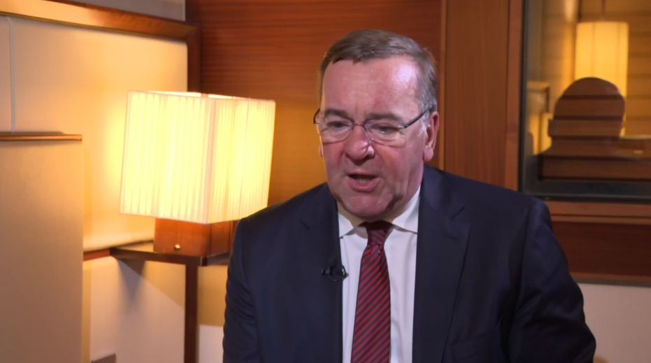
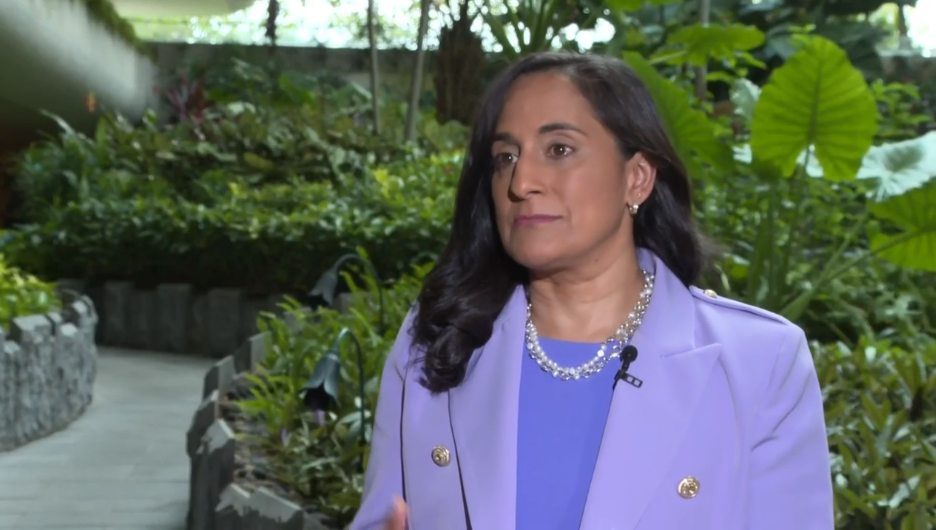

# 美媒炒德澳加三国防长“对华担忧但对话须继续”，中方均已做出回应

【环球网报道 记者
张晓雅】“中国日益增长的主导地位和实力可能会引起世界多国的担忧，但有一件事是肯定的：对话必须继续。”美国消费者新闻与商业频道（CNBC）5日的报道总结称，这是澳大利亚、加拿大和德国国防部长上周末在新加坡举行的香格里拉对话会期间接受CNBC采访时作出的表态。这家美媒搬出德澳加三国防长的对华立场炒作，而在刚刚过去的“香会”上，多国在涉华议题上做出了积极表态。

报道说，德国国防部长皮斯托留斯在“香会”期间告诉CNBC，与中国“脱钩”不是一种选择，但找到降低风险和减少依赖的途径很重要。

“这不是脱钩的解决方案。造新墙和制造新路障不是解决方案。我们必须找到一种共存方式，这意味着不要过于依赖任何人。要走不拒绝对话与合作之路，”皮斯托留斯说，“在事关未来经济和生态的问题上，我们也必须更加具有弹性。这是我们目前面临的挑战，也是未来几年的挑战，是我们必须共同解决的挑战。”

_德国防长皮斯托留斯上周末参加“香会”期间接受CNBC采访视频截图_

CNBC提到，德国统计局数据显示，在过去十年里，中国一直是德国最重要的贸易伙伴。而对于德国防长这种“去风险但不脱钩”的类似论调，中国外长秦刚5月9日在柏林同德国外长贝尔伯克共同会见记者时表示，谈论“去风险”，首先要思考什么是风险，风险在哪里。中国不输出自己的制度，坚持走和平发展道路，坚持奉行互利共赢的对外开放战略，坚守和维护以国际法为基础的国际秩序，反对霸权霸道霸凌行径，绝不会干类似破坏“北溪”二号管道的事。中国愿同各国携手应对挑战，构建人类命运共同体。中国对外输出的是机遇不是危机，是合作不是对抗，是稳定不是动荡，是保险不是风险。

“同样，中国也是澳大利亚最大的贸易伙伴”。CNBC继续说，但澳大利亚防长马尔斯在接受该媒体采访时提到中国在地区内的所谓“军事存在”，声称“我们对中国有很多担忧。”

根据CNBC的说法，马尔斯表示，与中国进行正式防务对话以防止误解很重要，但他又对中国的所谓“扩军行为”表示“焦虑”，并表示需要与华对话。

_澳大利亚防长马尔斯接受CNBC采访视频截图_

据香港《南华早报》此前一天的报道，马尔斯3日在参加“香会”时还试图将美英澳“奥库斯”三边安全协议粉饰成一项“透明的”协议，并指责中国在扩军涉核武问题上“不透明”。报道中同时提到，同样参加会议的中国军事科学院研究员赵小卓驳斥了指责中方的说辞，他称“我们不积极关注核武器，我们没有向其他国家提供(核建设)援助。这是中方的明确态度，”赵小卓还抨击了企图在亚太地区“制造麻烦”的人，“谁是真的想制造麻烦？我们希望维持该地区的和平。”

CNBC这篇报道还渲染加拿大防长阿南德的对华表态，称其在受访时指责中国对该地区和平而言是一个“越来越具有破坏性的力量”，这位加拿大防长还搬出此前飞入加拿大领空的“气球”事件进行炒作。不过对于此类说法，中国外交部发言人汪文斌2月13日在回答记者相关提问时已作出回应。对于美国记者提问说，美国近日在美国和加拿大上空击落了四个飞行物，其中一个气球属于中国，中国能否说明其他的三个飞行物是否属于中国？汪文斌表示，我们已经多次表明，中国民用无人飞艇误入美国领空，完全是不可抗力导致的意外、偶发事件。至于你提到的其他所谓“不明飞行物”的情况，我并不了解，但是我们在这里想要告诉大家的是，美方频频发射先进导弹来击落“不明的飞行物”，这是用力过猛的过度反应。

_加拿大防长阿南德接受CNBC采访视频截图_

在刚刚过去的周末举行的香格里拉对话会期间，涉华议题成为多国关注的焦点。印尼、新加坡等多国高层表示，不愿看到“新冷战”，不希望被迫在中美之间选边站队。中国外交部发言人汪文斌今日（5日）在记者会上表示，有关表态充分说明，个别国家意图在亚洲发动“新冷战”，逼迫选边站，引起了地区国家的普遍警惕和坚决反对。坚持战略自主，维护地区稳定与发展是地区国家的共同心声。有的国家嘴上标榜自由开放，声称维护地区和平繁荣，实际上却不断拼凑形形色色的军事集团，还试图推动北约东进亚太，对此大部分地区国家的态度十分明确：反对在地区拼凑各种军事集团，不欢迎北约把触角伸向亚洲，不接受把阵营对抗复制到亚洲，不允许任何冷战、热战在亚洲重演。

汪文斌说，亚洲是全球最具增长活力和发展潜力的地区，亚洲应该成为合作共赢的“新冷战”，不应被割裂为一个个封闭排他的“小圈子”。亚洲各国欢迎一起来“成事”的努力，不欢迎专门来“搞事”的企图。中方坚定维护东盟中心地位和包容性区域合作架构，愿同包括东盟国家在内的地区伙伴一道，秉持开放合作、互利共赢的理念，反对在亚洲煽动阵营对抗的言行，携手把亚洲打造成和平的支柱、发展的高地、合作的热土。

