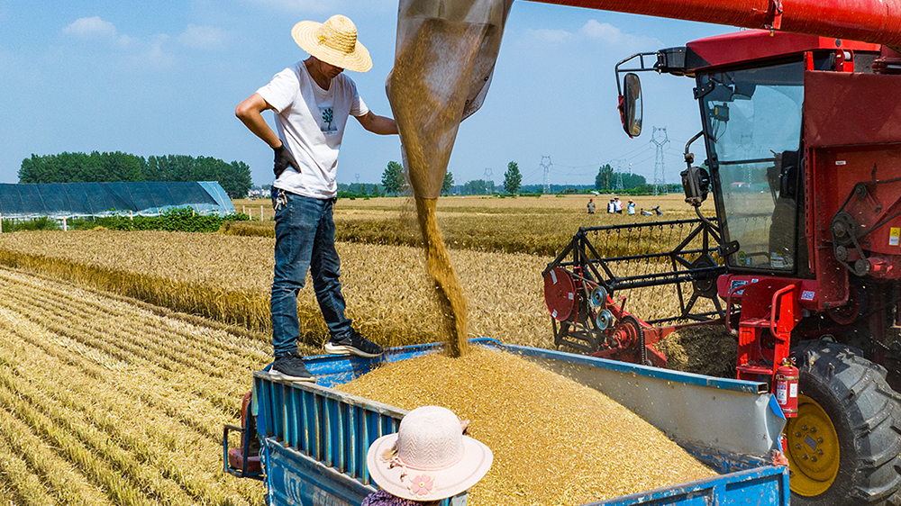

# 连续阴雨冲击麦收，河南多地公布受损小麦收购方案

_2023年6月1日，河南省驻马店市，西平县专探乡专探村，一辆收割机正在卸载刚刚收割的小麦。人民视觉
图_

“烂场雨”造成小麦受损，河南对于特殊时期的小麦收购工作有哪些安排？

6月4日，河南漯河市召陵区农业农村局、农业机械技术中心联合发布了2023年小麦烘干补助和受损小麦收购公告。

公告称，河南省漯河市军粮供应站、漯河乐粮粮食有限责任公司为我区（含市经济技术开发区）小麦收购企业，在区各镇（街道）合理设立多个定点收购点，10家有烘干能力的企业首选为定点收购点，收购我区的受损小麦。建议收购指导价格为：超标小麦（水分在13%以内，杂质按国家标准进行扣量）收购指导价格为0.8元/斤；不超标芽麦（水分在13%以内，杂质按国家标准进行扣量）收购指导价格为1元/斤。

据微信公众号“漯河发布”6月3日消息，漯河市制定出台了做好受损小麦收购的具体措施，决定在全市范围内开展定点敞开收购农民手中的受损小麦，切实保护种粮农民的利益不受损失。消息称，对符合食用标准的小麦，农民可以自行市场化销售，卖个高价钱；对只能用作饲料和工业用粮的超标小麦，定点粮食收购企业实行敞开收购。

漯河方面介绍，按国家规定收购标准，定点收购企业只能收购水分在13%以内的受损小麦，如果水分超出国家标准，可以就近联系我市127家烘干点，对湿粮进行烘干。同时建议售粮农户采取晾晒、风干等方式，在水分达标之后，再卖给定点收购企业，防止直接堆积造成发热霉变。受损小麦收购价格由县区人民政府综合考虑农民种粮成本、市场行情走势、新收获小麦品质等因素确定。漯河市提出了受损小麦建议指导价，不超标芽麦为1.0元/斤，超标小麦为0.8元/斤。最终的收购价格由县区政府自行确定。

另外，周口市沈丘县粮食和物资储备中心发出通知称，鉴于我县小麦收获情况，报经县委县政府同意，由沈丘县粮食和物资储备中心敞开收购雨后麦（干芽麦），水分13%以内，气味正常，过筛、去杂净粮入库，每市斤0.9-1.0元。

平顶山市鲁山县也已启动调控粮食收购。

据鲁山县融媒体中心消息，
6月3日，鲁山县粮食和物资储备服务中心发布公告，敞开收购雨后麦（干芽麦），每斤（1斤=0.5公斤）0.8~0.9元，标准为水份13%以内，气味正常，过筛、去杂净粮入库。

国家公布的2023年小麦最低收购价格为1.17元/斤（三等质量标准）。《河南日报》6月2日报道提到，针对受阴雨天气影响受损的小麦，省粮食和物资储备局会同省财政厅、省农业农村厅、省市场监督管理局、中国农业发展银行河南省分行印发《关于进一步做好夏粮收购工作的通知》，明确受损小麦的认定和处置原则，要求各地认真落实《河南省超标粮食处置管理办法》，按照政府主导、属地管理、定点收购、专仓储存、定向销售、分类处置、全程监管的原则，妥善做好收购工作。对于符合食用标准的小麦，积极组织产销对接，引导实行市场化收购；对于只能用作饲料和工业用粮的超标小麦，由当地政府分类做好收购，严防不合格粮食流入口粮市场，最大限度维护种粮农民利益。

