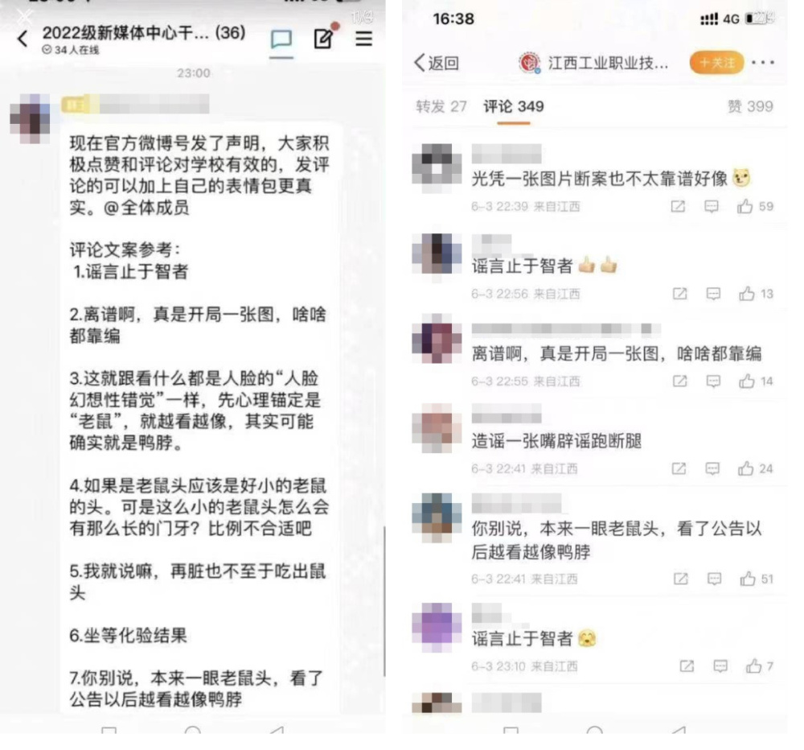

# 高校饭菜中疑吃出老鼠头，市监局称“是鸭脖”，网友为什么不相信

近日，一则“江西一高校饭菜中疑吃出老鼠头”的视频在网络传播。6月3日晚，涉事的江西工业职业技术学院发布情况通报称，饭菜中的“异物”经当事人确认为鸭脖。6月4日，南昌市高新区市场监管局相关人员称，初步判定系鸭脖。

在新闻曝光之初，这还只是一个食品安全事件，可在得到“是鸭脖”的回应后，此事反而迅速发酵，大量网友坚持认为异物是老鼠头，并将“鸭脖说”演绎成了一系列段子、漫画图。至此，这件事已经从一个食品安全事件，演化为舆论传播事件。那么，问题出在哪？网友为什么不相信“是鸭脖”？

一个重要原因或许是，关键信息未披露，关键疑问未解释。比如，图片中被质疑是老鼠牙齿的白色条状物，到底是什么？还有被网友猜测为“胡须”的长线状物，究竟是啥？判定是鸭脖的依据，又是什么？解释这些并不难。在关键之处出现了信息缺席，只会更加让人疑惑。

反过来讲，在关键信息缺席的状态下，网友们根据自己的“眼见为实”和生活经验去判断一样事物，进而发表个人的看法，也是自然而然的事情。

更“扎眼”的是，有网友爆料，涉事学校的新媒体中心对学生下发通知，要求学生按照已经拟好的话语模板去新闻评论区留言，并放出了相关群聊内容截图。截图内容显示，话语模板和某平台新闻报道下的留言高度相似。这再一次激起舆论风浪。

是不是鸭脖还没有完全搞清楚，如果所谓的留言区也是刻意“制造”的，哪怕本来是鸭脖，也只会让网友产生不信任感。此时舆论锋镝所指，已跳出了“是不是老鼠头”的争论，而是指向校方在这件事中所表现出的操作手法、处事思维与公信力。

一步走得不够用心，后面的每一步都会被动。而如果步步走错，所引发的不信任感就会“积重难返”，带来的负面影响就难以消除。

在大众生活深度融入互联网的社交媒体时代，知情权的满足有了更加丰富和具体的场景。对公众围观的热点事件，显然不能只靠一句简单的“结果是什么”来回应，更要呈现调查的过程、细节和证据。它应是一个动态接收、频繁互动的过程。

近年来的很多热点事件，不少地方在回应和处理过程中，缺乏必要的媒介素养和互动意识，只是按照传统的、固定的、程式化的步骤去应对，根本没有观察和分析网友们在关心什么、质疑什么，应该如何和他们互动，如何把一件事情的来龙去脉讲清楚。

值得一提的是，据媒体报道，这已经不是该校第一次出现“老鼠事件”，早在2021年，南昌市监局就曝光过该校后厨进老鼠的问题。这就更加深了网友下意识地联想和不信任。这一次，南昌市监局也已经介入，我们期待真相大白，也期待最后权威的调查能够让人信服。

