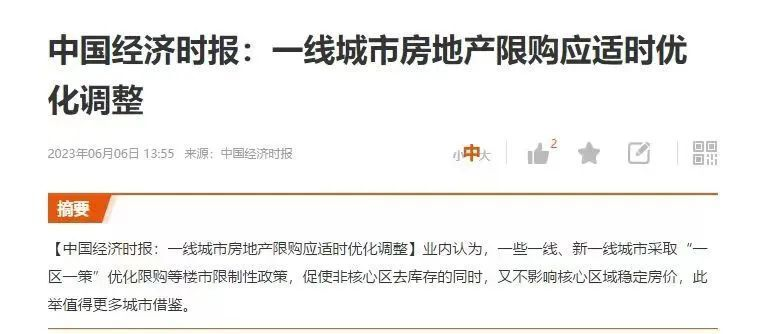

# A股上午冲高午后急剧跳水下杀，这剧本谁能想到？两市4527只个股下跌

中国基金报 泰勒

兄弟姐妹们啊。今天的A股，又跌破3200点了！上午冲高，午后急剧跳水下杀，这剧本谁能想到啊？什么时候是个头啊……

一起看看发生了什么事情。

截止收盘。沪指跌超1%再度失守3200点，三大指数均跌超1%，创业板指领跌续创年内新低。收盘沪指跌1.15%，深成指跌1.58%，创业板指跌1.7%。

两市共581只个股上涨，4527只个股下跌，北向资金净卖出近11亿元。

接下来分析一下原因。

**第一、地产小作文搅动市场。**

上午一堆地产小作文，把地产板块拉升，其中包括市场传将采取新加坡模式取消限购、上海房产政策调整等小作文。

另外，官媒一篇评论也引发市场注意，中国经济时报发布《一线城市房地产限购应适时优化调整》文章称，业内认为，一些一线、新一线城市采取“一区一策”优化限购等楼市限制性政策，促使非核心区去库存的同时，又不影响核心区域稳定房价，此举值得更多城市借鉴。未来，一线城市或将根据房地产交易市场的变化来逐渐调整限购等政策，对于一些住宅市场比较冷、购买力较弱的区域，可能会先放开限购等政策，而对于一些住宅市场购买力较旺的地方，可能会继续执行限购等政策，以保持具有风向标意义的一线城市房地产市场平稳、健康发展。

而中国经济时报是国务院发展研究中心主管主办。

但是午后，又出现了新的“辟谣”小作文，说此次定力较足，不会轻易放松。

此外，也有分析师出来辟谣称，今天的小作文，其实是今年一月份的猜想。结果今天成了传闻的一部分。。。

可以说现在的多空大战是微信群编小作文了。。。

于是下午，地产板块冲高回落。

**第二、苹果产业链也不争气，大幅走低，混合现实方向领跌，清越科技、双象股份、三利谱、兆威机电跌停，华兴源创、长盈精密、杰普特、智立方、荣旗科技等多股跌超10%。**

苹果的发布会，泰勒熬夜也撑到了one more thing的环节，感觉这款产品还是挺牛逼的，但是资本市场不买账。

当苹果公布Vision
Pro高达3499美元（约合人民币2.5万元）起的定价，以及到2024年初才会在美国发售的消息后，当天开盘一路高歌猛进的苹果股价，迅速跳水，尾盘一度跌超1%，最终收跌0.76%。

外界普遍认为，Vision Pro的定价过高，且量产时间低于市场预期。

市场就说到这吧，ε=(´ο｀*)))唉

