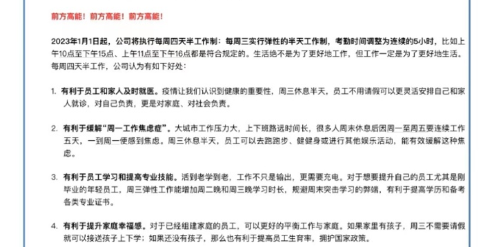
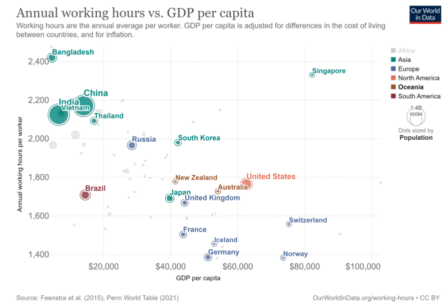
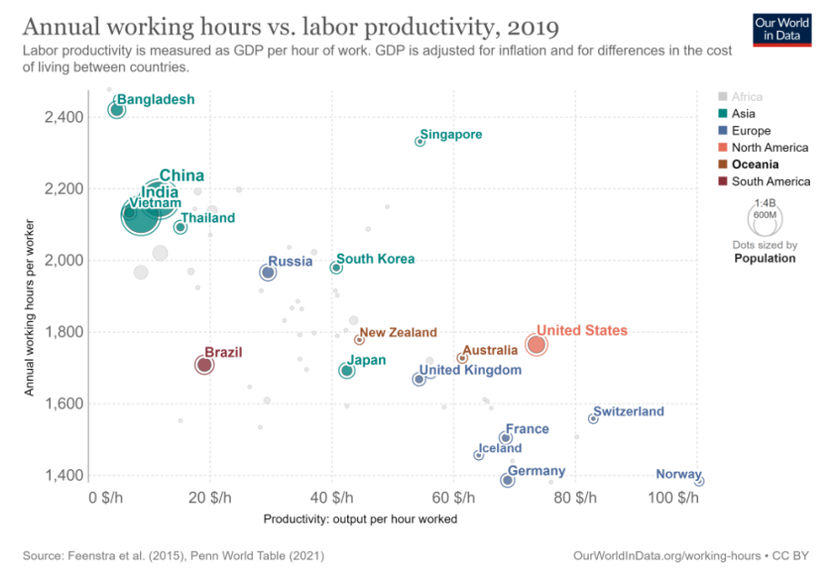

# 中国人离4天工作制还有多远？专家：当前经济形势下，企业肯定要炸锅

就业形势严峻的当下， 讨论“做四休三”现实吗？

_图/视觉中国_

**文｜《财经》记者 陈敏**

**编辑｜余乐**

5月31日，网红考研名师张雪峰宣布，其公司“峰学蔚来”将从8月1日起实行四天工作制，工资不变。

“上二休一，上二休二，周三休息。周三这一天当然有工作给大家的话还要来，但是不强制打卡。”在“峰学蔚来冯老师”上传的一则视频中，张雪峰向员工说明了这项新制度。现场员工一片欢呼雀跃。网友则一边在评论区呐喊“羡慕这个词我已经说倦了”，一边在现实中担忧失去自己单休的工作。

**张雪峰的公司并不是个例。**
最近一段时间，从携程允许员工周三、周五远程办公，到乐视执行每周四天半工作制，再到长沙、温州的两家初创公司先后宣布“做四休三”，“四天工作制”的话题频繁登上热搜。

然而，对于大多数打工人来说，四天工作制仍像是个遥不可及的梦想。五天工作制实施已近30年，但许多公司的双休还未落实到位。工作时间更长的“996”（早九点至晚九点，每周六天）则被有些人称为“福报”。
**国家统计局最新数据显示，全国企业就业人员周平均工作时间为46.4小时，按八小时工作制计算，每周平均要上5.8天班。**

与此同时， **2023年4月全国城镇调查失业率为5.2%，青年失业率突破20%。**
在就业形势如此严峻的情况下，有观点认为，实行四天工作制可以让每个人都少工作一天，让更多的人有一份工作，同时还可以在旅游、零售等服务类行业创造更多的就业机会；但是另一方则认为，四天工作制将加重企业的负担，最终导致就业机会减少。

“现在提出缩短工时，民众第一反应会理解为经济是真不行了，所以让大家别上班。”
曾任国家科委研究中心社会发展研究室副主任的武欣告诉我们。他是1986年“缩短工时课题组”的重要成员，参与了中国由六天工作制改为五天工作制的决策过程。他表示，在现在的经济形势下，如果要减少20%法定劳动时间，让企业承担额外用人成本，“等于抢劫私人资本，肯定要炸锅。”

**可以肯定的一点是，工作时长的缩短与劳动生产率的提高有关。随着生产率的提高，主动选择实行四天工作制的企业会逐渐增多。**

劳动是与土地、资金、技术并列的几大经济要素之一，劳动投入不足或者过度，都会影响劳动价格，也对经济运行的质量和效率不利。“中国不是穷国了。”武欣说，劳动力不应仅是属于生产经营性劳动的人力，也应是用于社会组织、公共事业的人力。这是贫困与发达之间的分野。

**与其五天摸鱼，不如四天好好干**

2023年4月，长沙一家公司实行四天工作制的新闻引起了网友的热议。这家公司的名字就叫“周三也休”文化传媒有限公司。创始人朱天赐从成立公司的第一天起，就宣布全体员工除双休日外，每周三亦可带薪休假。

朱天赐告诉我们，促使他做出这一决定的，是他第一次创业的失败经历。

那家公司是一家MCN（多频道网络）机构，主要为影视、综艺、动漫做渠道推广业务。本该最需要创意灵感的工作，每次开会却都死气沉沉。员工状态疲惫，团队缺乏沟通，久而久之积累起各种小矛盾，公司最终没能坚持下去。

偶然有一天，朱天赐刷到了国外实行四天工作制的新闻报道，好处看起来数不胜数：提高生产率、增加员工幸福感、降低离职率、减少失业、改善工作与生活的平衡……

他决定也试一试。新公司成立后，他鼓励大家在周三这一天休假，或上网冲浪，或外出游玩，只需将自己看到的、觉得有意思的内容填写到在线文档中即可。

通知引发了意料之外的关注。短短一天时间，就有上千人咨询招聘信息，朱天赐的手机不断有电话打入。当然，也有不少网友质疑他拿“做四休三”炒作，还有人怀疑这是一家诈骗公司，提醒应聘者警惕上当。

这些顾虑都在情理之中。毕竟， **目前全中国也找不出几家真正实行四天工作制的公司，而实际工作时长超出五天的公司则比比皆是。**
做四休三，听起来更像是存在于未来的美好想象。

传统上人们普遍认为：少干一天活，就少一天的产出，对于公司来说也就少一天的收入。在这种情况下，想让雇主自主选择减少工时是不现实的。
**如果一家企业主动将五天工作制改为四天工作制，说明雇主认为减少工作时间并不会降低产出。也就是说，员工在工作时间内的生存效率必须要提高。**

**国内外的研究和实践表明，工作时长的缩短有助于提高劳动生产率。**

早在1986年，国家科学技术委员会“缩短工时课题组”就发现，当时大部分单位每周工作48小时，有效时长却不到30小时，迟到早退、上班看报、织毛衣的现象很常见。

“缩短工时其实是减少冗余的工时投入。”武欣指出，如今私企的“内卷”与当年国企的“磨洋工”现象，从劳动经济学角度来说，都是“有效劳动”与“名义劳动”时间投入的比例问题。

**非营利组织“全球四天工作制”(4 Day Week
Global)2022年在英国、美国、澳大利亚等国的试点显示，做四休三、工时缩短后，公司的业绩反而略有提升。**

以英国为例，参加试点的61家公司约2900名员工每周四天平均工作34个小时，同时保持原有的工资和福利。为期六个月的试验结束后，公司营收平均增长1.4%，员工离职率则下降了57%。试验结束后，92%的公司决定继续采用四天工作制。

上述机构的全球活动干事海泽尔·加维根（Hazel
Gavigan）表示，四天工作制给了企业和员工一个重新审视工作流程的机会，让企业减少无效的工作安排，比如无休无止、效率低下的会议。

在英国工作了五年的黎湉去年入职了当地的一家市场营销公司。据她介绍，这家公司三年前就开始工时制度改革，最初是一周工作四天半，后来开始为期一年的四天工作制试验，最终在2022年7月确立永久性四天工作制。员工可以选择周三或周五休息，以此保证工作日公司的运营需求。

五天的工作量压缩到四天，黎湉起初有些不太适应，每天从早上九点上班起一直忙到下午五点半下班，有时还需要加班一两个小时。大概半年后，她渐渐习惯了新节奏。“之前工作五天，有时候其实在摸鱼。现在虽然忙一点，但效率提高了，时间也更加灵活了。”

除了减少冗余工时所带来的直接效率提升， **前述试点研究也发现，做四休三的员工普遍感到更加幸福，倦怠情绪和精神压力均有所缓解。**
人们有更多的闲暇时间用于睡眠、运动和自我提高，这可以间接提高劳动效率，形成正向循环。

2023年1月3日，很久没有出现在公众视野中的乐视宣布公司将实施每周四天半工作制。即每周三实行弹性工作制，员工只要连续工作五小时即可。这一天也被乐视员工称为“快乐星期三”。

_图/乐视在致员工的公开信中宣布实行四天半工作制。图/乐视官方微博_

“假如有事要忙我也可以加班，没事可以多休息，而不是在公司坐牢。”乐视员工辛悦告诉我们。来乐视之前，她在杭州一家互联网公司过着996的日子。现在，她每周三最晚可以下午一点半到公司，有时早起习惯性手忙脚乱，突然发现是星期三，停下来的一瞬间顿时感到很幸福。

长期以来，勤奋、奋斗、服从的工作伦理观似乎已融入东亚打工人的血液。朱天赐过去也认为员工必须非常努力、经历磨练才能得到成长，获得公司的信任与提拔。复盘去年创业的失败经验，他觉得自己走入了误区：只想着做业务挣钱，没有站在员工——尤其是年轻员工的角度思考问题。

“时代已经变了，”朱天赐公司98%的员工都是00后，“社会本来就应该给他们更开放、更包容的环境，为什么要无缘无故去磨练他们，让他们加毫无意义的班呢？”

**缩短工时能增加就业吗？**

不过，处于不同发展阶段的经济体，缩短工时对产出效率的影响确实存在差异。中国人民大学休闲经济研究中心主任王琪延2016年的一项研究表明，当时中国居民对闲暇的利用，无论是在对劳动效率的恢复、人力资本的积累还是家庭性生产等方面的作用都较弱，无法弥补闲暇所占用的生产时间的产出。

武欣也强调，1995年后国内的有效工时从40%逐步提升到60%—70%，不完全是推行五天工作制的成果，更多是因为奖金制度政策的协调配合。

**与当年五天工作制改革相比，如今推动工时改制所面临的情况更为复杂。需要在保证就业增长、提升劳动收入水平的前提下，处理劳动工时制度的问题。**

武欣认为，在可见的未来国际形势下，发展经济主要得靠发展内需，而增加闲暇是提升内需的重要手段。事实上，通过缩短工时来释放消费需求、推动第三产业发展，也正是1987年《关于在我国逐步实行五天工作制的政策建议》中，用以说服决策者的亮点。

当时，人们每周唯一的休息日都被洗衣打扫、看望老人、购买必需品等家务填满，由此有了“战斗的星期天，疲劳的星期一”这一说法。

实施五天工作制意味着休息日一下翻倍，这对服务业尤其是餐饮业的刺激效果非常明显。“五天工作制是第一次从需求端来调控中国宏观经济，也是消费经济学的开端，这是一个极好的开始。”武欣说。

**假如现在做四休三，释放出的闲暇时间能转化为消费吗？**

**旅游产业或是主要方向。**
“五一”“十一”小长假虽然集中带动了短期旅游消费，但统计数据显示，2013年—2022年间5月和10月的社会消费品零售总额占全年比重保持在17.6%左右，仅略高于全年消费总额的1/6（16.7%）。以“十一黄金周”为例，过去十年间10月份消费品零售总额的平均同比增长率为7.6%，与全年7.5%的平均增长水平基本一致。

这说明从长期角度来看，黄金周并未明显起到增加消费、拉动内需的作用，而且会导致小长假期间交通拥堵、旅游服务质量下降、公共管理费用增加等问题。做四休三后，人们的出游需求摊平至每个周末小长假，对旅游业的拉动效果不容小觑。而在业内一直有“一人旅游，三人就业”的说法。

**“总需求增长了会拉动就业和投资，投资又会连带着提升劳动力价格，形成正向的循环。”**
武欣表示，1995年中国从平均每周工作44小时进一步缩短至40小时，也是考虑到缓解部分工人下岗就业难的问题。

无论是1993年美国大萧条、90年代中国下岗潮，还是2000年前后法国推行35小时工作制，缩短工时在历史上已多次被不同国家用来缓解就业压力。
**这背后的逻辑也很简单易懂：既然短时间内无法创造足够多的就业岗位，那就缩短法定工作时长。每个人少工作一会，更多人就能拥有工作机会。但是，实际情况往往比理论更为复杂。**

参考法国2000年的情况，工作时间从每周39小时减少至35小时后，失业率由高于欧盟整体的10.2%下降至最低7.1%，但2008年后又持续上升到2016年的10.1%。35小时工作制的反对者因此认为，工时过短使得法国劳动力在国际投资者眼中缺乏竞争力，导致外商投资减少，是法国经济增长放缓、失业率居高不下的罪魁祸首。

此外，多国经验表明， **缩短工时带来的就业岗位更多是兼职而非全职，而兼职者的收入往往与工作时长的关系很大。**

人社部数据显示，目前全国灵活就业人员规模已达到2亿人，占总人口数量近七分之一。但
**对于本就缺乏劳动保障的蓝领工人和灵活就业者来说，他们也往往最难从四天工作制中获益。缩短工时或将加剧就业不平等的情况。**

即使四天（32小时）工作制成为法律，也只是法定劳动保护的部分变化了，如果企业所需劳动投入不变，实际工时依然可以是五天（40小时）甚至996，区别在于是否为超出的工时支付加班费。

令人遗憾的是，1995年实行40小时工作制至今，依然有不少人被排除在这项政策之外。“上班996，生病ICU”说法的出圈也让更多人意识到，过去十年间中国互联网企业的飞速成长与劳动保障制度的缺失密不可分，而这显然是不可持续的。

黎湉记得，有一次她想在周三休息日处理工作，刚上线五分钟就收到了经理发来的消息，询问她为何还在线。黎湉解释说，这当然并非完全出于对员工的关怀，而是主管担心员工会申诉超时工作，或者被内部查处，给公司带来合规问题。

_图/黎湉的主管多次询问她加班理由
来源/受访者供图_

**“所以2030年之前能不能真正实现四天工作制，主要不取决于政策性调整或工时改制，而是取决于相关的配套措施能不能跟得上。”武欣总结道。**

**目标2030**

现在国内推行四天工作制的还只是个别企业。全国实行四天工作制的条件何时才能成熟？

根据王琪延基于劳动生产率发展的预测，全国实行四天工作制的时刻将在2030年来临。由于各行业劳动生产率存在很大差异，王琪延表示，可以简化认为，当一个国家人均GDP突破2万美元时，即满足推行四天工作制的基本条件。

_图/各国年工作时长（小时）与人均GDP（美元）关系图
(2019) 来源/Our World in Data_

_图/各国年工作时长（小时）与劳动生产效率（美元/小时）关系图
(2019) 来源/Our World in Data_

中国社科院发布于2018年的《休闲绿皮书：2017—2018年中国休闲发展报告》中同样建议，
**从2030年起，在全国范围内实行每天工作9小时，每周工作4天的36小时工作制。**

不过， **目前成规模试点四天工作制的国家，** 例如冰岛、挪威、丹麦、英国、德国、澳大利亚等，
**国民人均GDP都超过4万美元，劳动生产率在40美元/时以上。**

而且，尽管工作时长通常会随劳动生产率的提高而下降，但也受到不同国家国民意识和制度影响。比如从上图可以发现，美国和新加坡的年工作时长都比同等劳动生产率的国家要高出一截。

另外，在全国范围内推行工时制度的改革也是一件很困难的事情。武欣说，30年前推行五天工作制时，中国私营企业和民营企业比重还很小，虽然工时改制也存在不少阻力，“但夸张地讲，一声令下，第二天事情就能办成。”但是现在，对于私企而言，做四休三在短期内肯定是一件负收益的事。

另一方面，不同企业之间也会互相影响。“同样一条供应链，你上游我下游，老板肯定也有社会压力。”九十年代也是尝试了五天半、隔周五天、四班三运转各种方式，在保证企业运营的前提下让大家看到效果，才全面推开了五天工作制。

武欣分析道，想要加强企业动力，一方面需要进行政策性引导，例如将单位劳动产出列入考察指标，对效率提升、产业升级的企业给予经济补贴和政策优惠。这意味着需要大规模的财政支持。

“先有讨论，才能形成方向，再需要人调研、试点、追踪。”武欣说，当年缩短工时课题组设计了一百多个调研问题，报告修改了十几版，全国总工会、劳动部的门槛几乎都要被踏破，前后花费十年时间，才有了一个结果。
**现在最大的难度在于要给足各方动力：员工收入要有保障、企业老板要有收益、政府管理要有政绩、国家产业要有正向提升。**
“虽然难，如果真要想做，还是可以精细设计的。”

全国实行四天工作制改革的时机尚未成熟，目前少数“做四休三”的公司更像是一种自发的“试点”。那么，中国的哪些企业、哪些地区有可能加入先行者的行列？

王琪延认为，从区域来看，经济发达、技术装备水平更高的东部地区最有可能先实行四天工作制。从企业规模来讲，由国有企业和大中型企业开始比较合适。小公司劳动效率本来就低，在疫情后普遍利润下滑的情况下，如果做四休三，恐怕生存都难以为继。

不过，反观参与“全球四天工作制”试点的公司，企业规模普遍不大。英国参与试验的61家公司中，66%员工人数不超过 25
人，拥有50名以上员工的只有22%。美国方面参与的33家公司情况类似，仅有3家员工人数在50人以上。

仍在招聘中的“周三也休”预计规模在30人—50人之间。原本朱天赐也只是想试试做四休三能否提高员工积极性。现在意外得到外界关注，他反而产生了更大的决心和使命感，希望“周三也休”能成为一个示范。

公司成立一个多月以来，他一直在探索工时制度新的可能性。例如将员工分为愿意加班和愿意休息的两个小组，并给予前者加班补贴或次日调休；规定迎新晚会、团建、年会等活动都按基本工资150%的标准支付加班费。朱天赐还告诉我们，他打算取消不久后端午假期的调休补班，改为休假。

“有人说我们是一家小企业，不具有代表性，我觉得这是不对的。”朱天赐说，他理解每家企业都有自己的生存法则，“但如果我们变成一家大企业，代表我们有更多机会和能力去尝试。”

*应受访者要求，黎湉、辛悦为化名。

