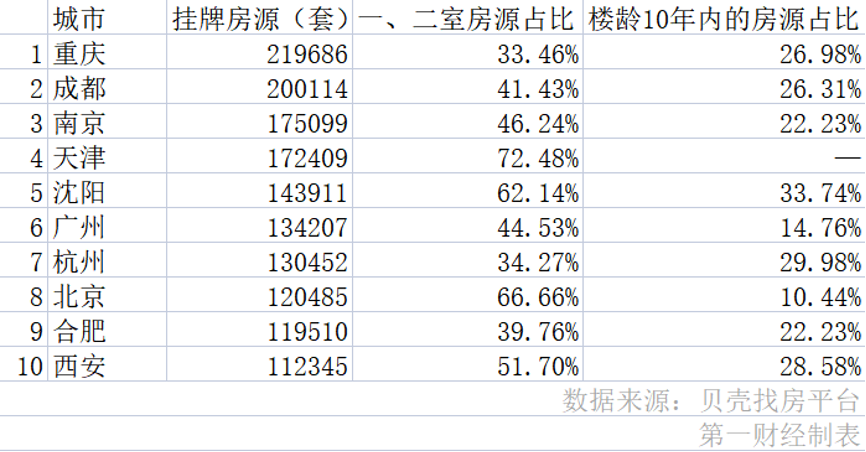

# 二手房挂牌量攀升真相：房东抛售离场是假，“老破小”不受待见是真

“二手房挂牌量究竟有多少？”在全国多个重点城市，这都成为了挑动人们神经的敏感话题。尽管机构数据在一定程度上可堪佐证，但即便专业的研究人士，也很难把这个问题回答清晰。另一方面，在直观感受上，今年三月以来，“卖不动”，似乎成为不少业主和中介的切身体会。

那么，二手房真的变成了“不动产”？房主们真的在集体逃离楼市？对于这一追问，机构的答案却是否定的。

据贝壳研究院调研，目前二手房挂牌房源价格调降比例占整体挂牌量3-4成，处于正常水平；更值得关注的是，挂牌量增加背后一个关键原因是换房需求的增加，也是促使二手房新增挂牌量在短时间内提高的原因，这部分人卖掉二手房之后所得资金仍然会回到市场。遗憾的是，二手房交易不畅，导致许多改善性购房者“卖一买一”的计划难以实现，新房市场亦备受拖累。

所以，当下各地挂牌量高涨的真相，似乎并不全是外界所渲染的“资金在逃离楼市”，而是卡在交易环节的置换需求。

对此，受访业内人士均建议，搞活二手房市场，提高房子的流通性，可以有效激活楼市活力，因为二手房市场，早已不是一个孤立的市场。

而重新打通“买一卖一”的换房链条，则需要在流通环节减少堵点，降低交易税费，减少交易成本，并在核心城市改变“认房认贷”、降低入市门槛等，以提振市场情绪，加快购房需求入市节奏。

**难卖的二手房**

近段时间，楼市喧嚣发生在二手房市场，各地挂牌数据不断攀升、“抛售潮”的声音四起……那些正在卖房的二手房业主，是最先感知到市场变化的人。

炎炎夏日的北京，张女士正在为手中一套房伤神。今年年初，为了变现回笼资金，她将朝阳区一套大户型房子挂出去，内心预期价格千万有余。但几个月以来，来看房的人出价都不及预期，与其心理预期差距超百万，一直难以成交。“能卖出去就卖，价格不合适的话，还不如继续出租。”张女士很无奈。

负责维护这套房源的中介表示，最近二手房市场整体情况一般，门店成交量下降了不少，市场整体挂牌和库存都比较大，房源总量多、客户心态谨慎，整体市场成交节奏变慢了。“一般小户型房源成交还可以，毕竟有刚需群体存在，但大户型成交周期要更长一些。”

身在广州的李女士面临类似处境。今年年初，为了置换品质更好的新房，她将一套房龄20年的四居室挂牌出去，小区虽老但地段较优配套完善。当时，正值广州甚至全国楼市温度上升，二手房市场一片火热，李女士打算趁这次市场行情卖房置换，且已看中理想的新房项目。

但接下来的卖房之旅，却不如想象中顺利。虽然有意看房的人很多，但广州庞大的二手房市场存量，让购房者选择面宽、决策也极为谨慎。几个月下来，李女士的房子带看不少，但至今未成交。没出手的二手房，成了李女士置换路上的“小难题”。

二手房真的越来越难卖了吗？除了业主微观层面的感受，5月的二手房成交确实有所下滑。据诸葛数据研究中心统计，5月，10个重点城市二手住宅成交73187套，环比下降13.83%，较上月跌幅收窄7.29个百分点。

分城市来看，5月重点10城成交量全数回落。其中，厦门跌幅领跑，本月二手住宅成交1803套，环比下降24.66%；南京、苏州紧随其后，环比跌幅分别为19.46%、18.37%；深圳、成都跌幅也均在10%以上。

市场需求一直较为稳定的北京，近期二手房市场也有降温迹象。今年3月，北京二手房成交量达到2.2万套的高峰，创下近5年新高；随后4月份下滑到约1.39万套。截至5月末，据北京住建委官网数据统计，北京二手房网签12117套，环比下滑13
%。

诸葛数据研究中心认为，随着一季度积压需求释放殆尽，4月份成交热度开始回落，进入5月份，购房市场活跃度继续下滑，加上五一小长假的干扰，二手房成交延续下跌态势。同时，近期住建部和市场监管总局联合发文规范房地产中介服务，一定程度也会加重购房者观望情绪而选择延缓入市。

**挂牌量为何激增？**

二手房业主卖房难，背后不可忽视的影响因素是：多地二手房挂牌量正在攀升。存量市场犹如流动的“蓄水池”，不断扩大的市场容量，加大了二手房交易的难度。从一线城市到多个核心二线城市，越来越多的人正在出售手中房产。

据诸葛数据研究中心监测数据显示，2023年5月10个重点城市二手住宅挂牌量为213.37万套，环比上涨3.62%。从同比看，近一年来，苏州二手房挂牌量同比涨幅超500%，南京涨幅超200%，深圳、杭州涨幅也均在100%以上。在公开中介平台上，目前北京市二手房挂牌数已超12万套，南京的挂牌量则突破17万套大关，武汉的逼近20万套……

不断增加的二手房源，令楼市前景再添了一层迷雾：“投资客”抛售离场？业主降价抛售？天量二手房带来了种种关于市场的猜测。争议背后，二手房挂牌量增加到底原因如何？需要为此担忧吗？

58安居客研究院院长张波表示，二手房在架量不断增多，主要原因还是市场销售节奏变慢，二手房源在架时间增长所致。从安居客线上房源在架时长来看，5月已呈现上涨趋势，从4月的71.3天上升至5月的75.1天，北、上等一线城市，二手房市场成交量和用户线上找房热度都有所下降。

贝壳研究院调研则显示，目前二手房在售房源量的确在增加，但并不代表“抛售”，挂牌增加的真正原因是换房。一季度新增挂牌量明显快速上升的城市，如广州、成都等，恰恰是二手房交易较活跃的城市。上海、北京等城市改善换房需求占比超过7成，多数二线城市换房需求占比超过5成，多数消费者选择“先卖再买”，导致二手房新增挂牌量短时间内增加。

此外，虽然有业主降价行为，但目前并未出现大幅的“降价潮”。贝壳研究院表示，我国大部分城市房价具有稳定性，5月重点50城的二手房挂牌房源价格调降比例，占整体挂牌量的30%-40%，处于正常水平。只有极个别市场本身下行压力较大的城市，挂牌量增加、同时均价明显下跌。

民生宏观·周君芝团队发表研报表示，当前二手房挂牌看似放量，实际上新增并未大幅增加，局部板块异增主要是因为多处挂牌、应对成交周期拉长而提前挂牌等。此外，二手房挂牌动机趋于多元化，背后都有置换并追求改善型住房的影子，当下实际有效挂牌量未如预期严峻。

一位房企内部的市场研究人士则认为，对二手房挂牌量的问题，要分城市看待。首先，一线城市本身就是二手房主导的市场，基本面较好，降价房源比例占比较低。同时，综合考虑去化周期和需求基数，挂牌房源量并不高。而对部分曾经历快速市场上行、一二手倒挂严重的二线城市而言，过去市场上升期曾有大量投资客入场；2023年以来，这些低成本投资房源投入市场，且存在一定降价出售空间，这些城市消化市场存量会更具挑战。

总体而言，房价预期平稳上涨是改善需求释放的条件，在政策预期不稳、房价预期不稳的市场中，改善需求往往会被抑制。不过，二手房挂牌量与新房库存并不等同，有买房就会有卖房，在二手房交易越来越成为主流的市场中，只看二手在售房源量，并不能得出市场供给过多的结论。

**被抛弃的“老破小”**

若细察各大城市的挂牌房源结构，或可从中探寻到二手房挂牌量较高的另外一个重要原因，即“老破小”正占比不小，且越来越不受买家青睐。

第一财经选取了当前二手房挂牌量较高的10个城市，对其挂牌房源进行分类筛查发现，在挂牌的房源中，一、二室小户型房源挂牌量占比较大。具体来看，10个城市中，天津一、二室小户型房源挂牌量占比最高，占挂牌房源总量的比例超过了72%，其次是北京66.66%、沈阳62.14%、西安51.7%。

同时，楼龄在10年以内的次新房挂牌量较少。10个城市挂牌二手房房源中，楼龄在10年以内的次新房房源占挂牌房源总量的比例大多在20%左右。其中，沈阳的次新房房源占比最高，为33.74%；北京占比最低，为10.44%。次新房较少，反之，楼龄超过10年的房源占据了供应的大头。

事实上，楼龄大、面积小的二手房确实受欢迎程度较低，其中更多的是，当下购房者对房屋安全性的担忧、对舒适生活环境的追求。这从当前的“购房主力军”——青年群体的选择中可见一斑。

据58安居客研究院发布的2023年青年（1985-2005年出生）置业报告显示，接近5成的青年为改善目前的居住环境而购房；而选择房源时最注重的因素是小区的安全防范情况。在户型方面，超7成的青年更愿意选择三居室及以上的房源，选择一居室的占比仅1.3%。此外，青年们多倾向于新房，占比达74.7%，倾向购买二手房的占比仅9.4%。

从资产的角度来看，楼龄较大的住宅资产保值能力也不如次新房。例如，2021年6月房贷额度紧张时，相比楼龄较小的商品住宅，成都不少银行就收紧了2000年以前建成的二手房按揭贷款审批。

当然，并非所有的“老房子”都不受待见，具有较好学区属性的“老房子”依旧是二手房市场中的香饽饽。例如，深圳市福田区八卦岭片区的园岭新村，建成于上世纪80年代，至今已有40年的楼龄，但因位于深圳名校红岭中学的学区内，成交依旧活跃，是今年前4个月深圳成交top50的热点小区之一，且成交均价较2022年四季度上涨了9%。

这样的房子一旦失去学区加持，市场价值会随之下跌，流动性也快速变弱。例如，北京市的著名学区德胜片区，也是“老破小”聚集地。2021年，该幼升小失去进入名校的机会，一年间，片区内二手房成交量腰斩，有房源降价200万元甩卖。

实际上，目前我国有较大比例的家庭居住在楼龄较长的住宅中，保利发展发布的房地产行业白皮书显示，至2021年，我国有48%的家庭居住在2000年底前建成的房屋中；而原公有住房、经适房及2000年底前建成的大量老旧住房，存在面积小、质量低、配套差、物业管理不足等问题。

对于这些居住安全性、舒适性较差的老旧小区，可以采取哪些措施提升其住房的质量和市场的流动性？城市更新或许是一种可行的办法。2020年10月，“实施城市更新行动”首次写进我国五年计划，此后相关政策也逐年增加。

与此同时，各地也积极响。从各地公开的城市更新投资计划来看，整个“十四五”期间辽宁、广东、成都、浙江等地城市更新相关项目总投资均超过万亿。对于城市更新的落地，已有企业与政府达成战略合作，包括大悦城、首开集团、万科、富力、华润置地、远洋集团等。

中指研究院市场研究总监陈文静表示，“老破小”因为楼龄、基础设施配套不全等原因，小区本身存在缺陷，但当前部分“老破小”小区仍具备一定资源优势，如优质的教育资源、相对完备的周边配套等，随着城市更新、老旧小区改造的进一步加快推进，“老破小”的居住品质也有一定提升的空间，因此，部分区位较好的老旧小区依然会受到购房者青睐。

**如何重启换房链条**

二手房市场不是孤立存在的。历经过我国房地产业历经三十多年的发展，过往建成成交的大量新房渐次进入二手房市场，后者在不少城市中已占据了颇为重要的地位。

在房地产发展相对成熟的一线城市，早在2015年时，二手房成交量就远超新房，其中上海二手房成交面积是新房的1倍以上，北京、深圳的这一比例则分别接近2倍、1.6倍。近年来，不少市场发达的二线城市也呈现出该趋势，据中信证券研报，2021年，南京、合肥、重庆、东莞等二线城市，二手房占一二手成交的比例达4成以上。

尽管目前我国的住房供需总体基本平衡，但有房并不是终点。和10年前不同，当下的住房需求中，绝大多数是“卖小买大”、“卖旧买新”的改善需求。

在房屋总价处于高位的现阶段，改善置业的资金门槛颇高，卖掉旧房就成为置换的关键环节。建诚智库负责人苑承建表示，在一二线城市，房地产市场已经融为一体，形成了“卖一买一”的置换市场链条，二手房市场的卖家往往会成为新房市场的购房者，而且也会通过出售二手房获得购房资金。

据贝壳研究院调研，一线城市中，北京和上海卖旧买新对当地新房市场的贡献均高于55%；二线城市中，南京、天津、合肥、成都卖旧买新对新房市场的贡献均超30%。

在这样高关联度的市场中，当二手房活跃度趋弱，置换链条上各个环节的流通速度也就不可避免地放缓，进入新房市场的潜在需求减弱，新房的购买力萎缩，从而影响整体预期和情绪，促使整个房地产市场持续低迷。

于是，搞活二手房市场，解决其流通性降低的问题，也就成为重启置换链条、增加市场活力的关键举措。事实上，2022年以来，监管层已出台了不少政策，包括带押过户、存量房连单并行办理、个人所得税减免等，以提高存量住房流通率，鼓励卖小买大、卖旧买新。

在当下的时点，业内给出了进一步的政策建议。针对交易环节，贝壳研究院指出，交易成本是换房的核心障碍。该机构认为，换房行为涉及到两个交易，中间的衔接对于顺利完成连环单尤为重要，而目前大部分城市还没有实现较为顺畅的“带押过户”，同时若贷款无法准时到位，就会造成连环单违约。

上述机构还指出，高能级城市仍执行的“认房认贷”政策，导致置换时的高首付比例、高贷款利率；同时部分城市存在“卖一买一”征收两次税等情况，也对需求释放形成了制约。

苑承建认为，目前整体市场的症结在信心不足、预期不稳，应尽快优化改善型需求的购房政策，回归合理，实质降低改善型需求购房者的压力，打通市场堵点，重新让交易活跃，从而稳定市场预期。

在具体政策上，陈文静建议，核心城市优化“普宅”的认定标准，降低非普宅的首付比例和税费，降低购房成本和门槛；按照一区一策原则，继续优化限购条件、取消“认房认贷”等，同时可结合生育政策，对多孩家庭的限购套数、首付比例等给予支持。若政策能及时跟进优化调整，市场情绪将得到有效提振，购房需求入市节奏有望加快，有利于促进行业良性循环。

值得一提是，对于流通性受阻的一线城市，上述房企内部的市场研究人士表示，当地市场仍有充分的购买力，目前多是受限于严格的政策而较难推进，“稍微放开一点，问题就能解决”。

但在部分较低能级的城市，上述房企人士认为，市场的继续下行，促使低成本的投资房源大量入市，不少房东为成交开始大量降价，对新房客户形成分流。对于这部分市场，同策研究院研究总监宋红卫认为，可加快城镇化节奏，加大产业的导入和人才引进，增加产业和人口的支撑；从短期来看，亦可推行适度的棚改政策。

