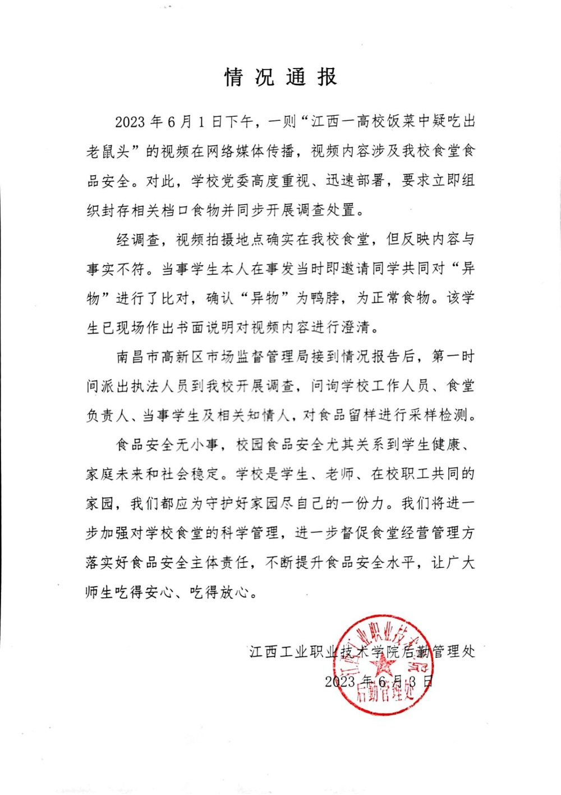

# 媒体：鸭脖还是鼠头，需要更信服的解释

中新网6月6日电(记者
李金磊)近日，“江西一高校饭菜中疑吃出老鼠头”事件持续发酵。江西工业职业技术学院通报称，当事学生比对后确认“异物”为鸭脖。南昌市高新区市场监管局相关人员也表示，初步判定系鸭脖。

_相关学校情况通报_

多方澄清“鼠头”是鸭脖，但是事件并未就此平息，反而引发了更多的讨论和质疑。众多网友坚持自己的“眼见为实”，认为“异物”是鼠头而不是鸭脖，甚至还演绎出了“指鼠为鸭”等新词。

鼠头还是鸭脖，本来一个简单的判断题，却成了一个罗生门。网友们为什么不相信这是鸭脖？究其原因，就在于对关键的疑问并未拿出令人信服的解释，公众心中的问号并未真正得到拉直。

网友关心的是，视频中很像老鼠“牙齿”的“白刺”是什么？胡须状的东西究竟是何物？判定是鸭脖的依据又是什么？好端端的鸭脖为何会被认为是“鼠头”？这些关键问题还没有明确的解答，在这种情况下，一句干巴巴的“这是鸭脖”，只会让人更加不解和疑惑，众多网友就会宁愿相信直观的视频画面，从而作出自己的判断。

再加上此前该校就出现过“老鼠事件”，根据媒体报道，2021年，南昌市场监督管理局就曝光过该校后厨进老鼠的问题，这就更加加剧了网友们的疑虑和不信任感。

当然，我们不能仅凭视频或图片就作出最终结论，因为有时“眼见不一定为实”，但是要让大家对鸭脖的判定心服口服，解开这个“鸭鼠谜团”，就必须要权威部门和机构提供更加具体和详尽的证据，例如公开食品检测报告、相关图片和视频等。只有展示了完整的调查过程，提供了充分的证据，给出了令人信服的解释，做到公开公正透明，才能消除公众的疑虑。

民生无小事，食品安全重于天，“鸭鼠谜团”事件凸显了民众对于食品安全的高度重视，同时也给相关主体提了一个醒，在视频时代，回应不仅要及时，更要有说服力，经得起推敲，让人信服，否则就会陷入“澄而未清”的尴尬和被动。(完)

