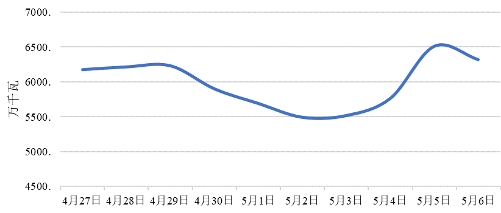
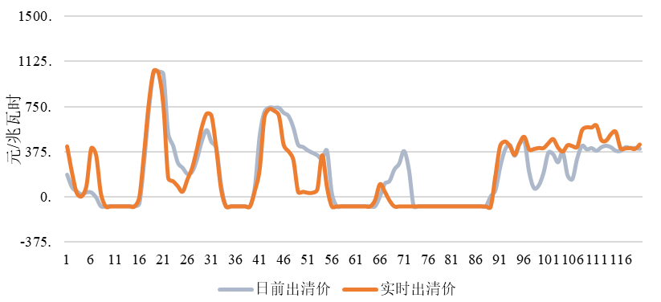

# 山东连续负电价，全球罕见，中国的电力市场发生了什么？

**撰文｜张浩楠**

**责编｜冯灏**

2023年“五一”假期期间，我国山东省连续长时间的“负电价”刷新了国内电力现货市场的纪录，引发热议。

4月29日-5月3日，山东用电负荷下降（见图1）、日间时段新能源大发，严重的供大于求使得电力现货实时交易累计出现46次的负电价（见图2），其中，从5月1日20时至5月2日17时，连续实时现货出清负电价时段长达22个小时。最低价格出现在5月2日17时，为-85元/兆瓦时，相当于发电商要以一度电8.5分钱的价格付费发电。

_图1 “五一”前后山东实际日调度最高用电负荷 注：此处为山东实际日调度最高用电负荷，并非全网用电负荷。_

_图2 “五一”假期期间山东现货市场日前与实时出清价
数据来源：山东省电力交易中心。所有数据均为快报数据，非最终正式结算数据，所有价格数据均不包含容量补偿电价99.1元/兆瓦时。_

其实，“负电价”对于很多电力行业圈内人而言并不陌生，国内外电力市场都或多或少出现过电价为负的情况，令人惊讶的是能够出现连续22小时的负电价。

连续22小时负电价，全球罕见

人们对于经济关系的理解通常是认为商品的价格为正，即买方要付钱给卖方来换取商品。这确实是最为普遍的经济现象，但是，市场偶尔会出现“价格为负”的特殊情况，尤其是在大宗商品领域。

某种商品价格为负，直观解释是市场上该种商品供大于求，如果不能在一定时期内卖完商品就需要付出相应的处置成本（包括运输、仓储、维护、设备启停等费用），为避免高昂的处置成本，就会改由卖方向买家付费来刺激需求。

电力作为大宗商品之一，其特殊性在于大规模储存成本较高，在电力系统运行过程中，发电商出于自身利益的考虑（例如减少运维、储能、启停损失），在某些时段必须要生产一定量的电能，就会以“价格战”的方式抢占发电空间，即采取低价、零价甚至负价的市场报价策略在系统出清时获得发电权利。

在现货交易（也就是开展日前、日内、实时的电能量交易）时电力就可能会出现负价，德国、丹麦、瑞士、捷克、斯洛伐克、比利时、法国、新西兰、澳大利亚等都是负电价多发的国家。

实际上，我国电力市场处于探索期，有限制的负电价远低于国外成熟电力市场，这样可以保护市场、避免价格失衡的混乱。例如，根据欧洲电力交易所数据，2023年4月19日下午1点到2点，共计1600万千瓦的绿电涌入荷兰电网，电力严重供大于求，使得荷兰电力价格触及-739.96欧元/兆瓦时（相当于-5.6元/千瓦时），是山东负电价的近70倍。

自2007年开始德国、奥地利、法国、瑞士等欧洲国家相继引入负电价，随着可再生能源比重的不断增加，出现时段性电力供大于求的情况会变得频繁，使得电力市场中出现负电价逐渐成为常态。以德国为例，2020年德国全年负电价时长达到了298小时的高峰，通过提升能源系统灵活性、推动供需双侧能源转型、创新市场机制等方式，将负电价小时数降至了2022年的69小时[1]。此外，美国的得州和加州、澳大利亚、日本、韩国等都出现过负电价。

_图3 德国全年负电价的出现时长，数据来源：德国统计局_

我国多数省份为电力市场设置了“地板价”，也就是设定了电价的波动范围来保持电价的稳定，类似于股票交易的涨停和跌停，所以山西、广东、甘肃等设定的零电价在一定意义上相当于是负电价，只是规则限定了电价降至零后不能再继续下降。

山东作为我国首批八个电力现货试点省份之一，早在2019年12月11日的连续结算试运行时就出现过-40元/兆瓦时的出清价格，这也是国内首次出现负电价，当时并未引起很大关注；2023年3月13日，山东发改委印发《关于山东电力现货市场价格上下限规制有关事项的通知（征求意见稿）》，对现货市场电能量出清设置价格上限（1.5元/千瓦）和下限（-0.1元/千瓦时），负电价成为规则允许的市场现象。与“五一”假期“负电价”极其相近的是，4月27日8时至16时出现了9小时的负电价、最低出清价也是-85元/兆瓦时。

负电价一般会持续数小时，但持续时间接近全天的负电价现象不仅在我国电力市场化改革进程中是首次出现，在全球都是罕见的（2019年10月德国负电价曾持续近31个小时[2]），吸引了圈内外的注意。

电力市场的失灵还是进步？

先来看下山东“负电价”出现的原因。

直观来看，部分时段电力供应能力远远大于用电需求，为了获取发电空间，发电商争相报低价。深层次的逻辑是发电商“弃车保帅”，争取利润最大化。其中新能源机组有着补贴、绿电等场外收益，可以承受负的边际报价（最低值为补贴或绿电收益的负值），只要出清价高于报价最低值，发电上网就会有收益，不发电就没有收益，以负电价来优先出清获得发电空间是在市场规则允许下的合理的竞价策略，图2中日前出清结果就已出现多次的负电价；传统电源则是通过报低价保持机组低出力水平的开机状态，避免频繁启停带来的巨大成本损失[3]。

所以从发电商自身视角来看，当电力系统和电力市场发展到一定程度，出清报价为负属于非常规的合理行为，即使明知是“囚徒困境”，依然会选择负价来确保自身损失的最小化。

“负电价”是高比例新能源电力系统运行特性决定的市场现象。零边际成本的新能源大规模接入电网，其波动性会使得某些时段的发电能力大幅上涨，如“五一”期间山东的晴朗大风天气使得风电和光伏大发，改变了电力的供应结构。2022年山东全省发电总装机为18957.8万千瓦，火电、太阳能和风电分别占比62%、22.5%和12.1%[4]，粗略估算，午间用电高峰时段风电和光伏占据发电负荷的绝大比重，而传统电源的发电比重大幅下降。

最为出名的电网净负荷“鸭子曲线”就是指日间光伏发电能力大增，使得净负荷（用电负荷减去光伏发电出力的剩余负荷）呈现出两头高、中间低的形似鸭子的曲线，而随着光伏发电规模进一步提升，净负荷曲线将演变成中间极低的“峡谷曲线”（见图4）。

_图4 高比例新能源电力系统净负荷曲线特征_

在新能源大发的时段会出现电力供大于求的状况，此时市场电价会很便宜，极端时候会出现零电价、负电价的“地板价”，而新能源出力减少时，市场电价会上涨，这符合经济学中完全竞争市场的供求价格关系。因此，存在“负电价”的市场价格是能更加有效反映高比例新能源电力系统的供应结构特性的。

“负电价”是我国电力市场改革进入深水区的信号。无论是按照保障性优先消纳的政策原则还是边际价格出清的市场规则，新能源都可以优先发电上网。

如果市场允许负电价的出现，新能源可以通过付费的方式来换取其他电源的发电份额，例如一台30万千瓦煤电机组的日前出清电量是300万千瓦时，新能源可以在实时市场以8分/千瓦时的付费价格从煤电机组手中换取50万千瓦时的发电份额，这样新能源可以获得场外收益、煤电可以弥补降出力的成本，实现了市场引导资源消纳新能源的目的。随着新能源参与电力市场的程度加深，“负电价”平衡市场主体利益、调动调节性资源的作用会更加明显。

电力市场的发展要适应电力系统的物理特性，“负电价”恰好反映了电力系统中新能源发展到一定程度对市场竞价机制的影响，无论是从市场竞价逻辑还是国外市场经验，“负电价”将是我国未来电力市场完善过程中的普遍现象。

“负电价”是利大于弊还是弊大于利？

首先需要明确的是，在电力市场规则下，负电价并不代表发电商负收入、工商业用户能赚钱。

在山东电力市场，参与电力现货市场的发电机组可以按照0.0991元/千瓦时的标准获得容量补偿费用（作为电力市场化改革过程中补偿发电机组固定成本的过渡手段），不算新能源的场外收益，只要出清价不低于-0.0991元/千瓦时，那发电商就能在现货市场结算时有收入；无论是新能源还是火电机组，电量交易集中在月度、年度中长期交易，提前锁定了大部分的收益，参与现货市场电能量交易仅占自身小部分电量（未找到山东的公开数据，此处以广东为例，2022年广东现货市场的交易电量占发电侧电量的比重为2%、现货交易电费占发电侧总电费的比重为4%[5]）。

数十小时的负电价对发电商全年的收益影响很小，更不会出现整体意义上的“付费发电”，所以此次“负电价”事件对山东发电商而言是“雷声大、雨点小”。

同样的，对于签订中长期合约的用户而言，负电价的现货交易电量占比很小，在月度电费账单中不明显；而对于居民用户而言，保证全年电力的廉价和稳定更能保障利益，因此我国居民用户暂不参与电力市场交易，而是实行峰谷阶梯电价制度，电价是比较稳定的（参见此前《多地市民电费单“爆表”，我们会迎来高电价时代吗？》一文）。

既然对各主体的收益没有明显影响，那“负电价”的利与弊体现在哪呢？“负电价”的利主要是可以更好地反映出电力供需的时段性不平衡，强化价格信号对调节资源的引导作用[6]。

“负电价”的出现代表着电网负荷时段性供过于求状况的加剧，为了进一步释放系统消纳新能源的能力，发电商需要付费换取发电空间，可以激励用户在这个时段多用电、提升电网负荷，引导常规电源少发电、寻求利益最大化（如让出日前和中长期发电份额赚取价差收益，甚至采取临时启停方案额外获取启停补偿收益），也吸引更多储能、需求响应等调节性资源进入市场，提高新能源消纳和系统结构性转型的效率。所以，“负电价”的好处不仅在于提升短时的系统调节能力[7]、平衡市场主体利益，还能为中长期的资源合理规划部署提供明确信号。

“负电价”的弊也非常明显，一是负电价的持续时间过长、频繁出现会严重影响调节性资源的市场收益，最为直观的就是煤电机组长时间低出力运行或频繁启停会损坏机组设备、增加运行成本、增大安全风险，长时间为负、缺乏弹性的市场电价也表明电力系统的资源结构不合理、灵活调节能力严重不足，并存在高电价持续时间延长的风险[8]。

二是负电价水平超出合理的区间限定会引起市场价格的动荡，过低的负电价会过度激励、过高的负电价会无效激励，不能引导资源有序协同进入市场，还会扰乱市场的正常竞价秩序、影响电力投资信心。

三是负电价并不能成为新能源高比例消纳的“良药”，无论是出于系统运行安全设定最小开机约束，还是从市场主体的市场竞争决策角度，负电价都不能无限制调动电力系统的调节潜力，尤其是在当前环境下，负电价很大程度上是在保障性消纳方针的基础上来换取调节空间，就如电力市场专家谷峰测算的结果，以80万元的煤电停机成本代价来换取14.4万元的光伏消纳，损害社会福利[9]。

“负电价”的利与弊是共存的，不能看价格高低来评判优劣，权衡利弊的关键是要把握住“市场服务系统、价格引导资源”的主线，让市场反映出电力系统的发展需求，并通过价格手段来调动资源的服务积极性，公平合理地为电力供需状况进行定价估值与利益分配，才能为各类主体营造健康的市场环境，转而成为增加社会整体福利的新手段[10]。

“负电价”带给利益相关方哪些启示？

“负电价”将成为我国构建新型电力系统过程中的正常市场现象，是系统灵活调节资源紧缺的市场信号，也意味着新的市场机遇的出现。

储能资源从技术特性而言是解决部分时段新能源出力过剩问题的优先选项，通过电能的充放来实现新能源的错峰利用，在市场负电价出现时可以进一步扩大充放电的价差收益。但储能的投资决策不能被短时间的高额收益所迷惑，仍要根据长周期的收益率和市场机制的导向来决定是否新建储能、以何种方式部署。

新能源拥有零边际成本和政策扶持两大优势，在市场竞价中已经占据优势地位，随着自身逐渐深入参与电力市场交易，不能因为有负报价的优势而轻视市场竞争，让自身陷入“恶性”博弈的局面，应该考虑好未来市场电价的走势，做好中长期交易与发电出力预测工作，通过适当停机和储能设施减少负电价的持续时间和发生频次，达到保障收益、对冲风险的目的。

煤电受“负电价”的影响极大，需要改变经营策略来适应新型电力系统转型与市场竞价规则，提升灵活调节的技术属性和安全运行能力，实现低出力状态下的安全经济运行，在现货市场中利用零电价、负电价来让出发电空间、赚取合同价差收益，同时参与到辅助服务市场，提供调频、爬坡、备用等服务，提升机组价值收益。

用户（此处主要指参与电力市场的一般工商业用户）可以根据市场电价状况调整用电行为、改善工艺技术，在低电价、负电价时段多用电来降低电费支出，加大自身参与需求响应的规模，并通过建设分布式电源、储能、虚拟电厂等方式，进一步加强参与市场竞争的能力。

电力市场建设进入了深水期，“负电价”的出现既是市场不断完善的积极信号，也预示着在规则下现货市场调动灵活性资源的能力发挥到了最大值，对山东电力市场而言，需要从跨区-
区域-
省级多层级电力市场和辅助服务市场来进一步挖掘各类电力资源的调节潜力，并结合中长期交易和政府授权合约等手段稳定市场价格预期，疏导电力服务成本、引导资源的协同部署。此外，市场要采取经济消纳新能源的方式，引导新能源的科学布局与规划。

**参考文献：**

[1] 郭欣. 德国解决负电价问题的思路和对策[EB/OL]. 中外能源经济观察, 2023.

[2] 武佳薇.大宗商品负价格现象的经济含义[J].中国金融,2022(22):84-86.

[3] 廖宇.德国电力市场设计的得失与启示[J].中国电力企业管理, 2022(13):54-58.

[4] 北京清能互联科技有限公司.山东电力市场年度分析报告[R].2023.02

[5] 广东电力交易中心.广东电力市场2022年年度报告[R].2023.02

[6] 莫志宏,史海霞.破解中国弃风现象的路径选择——兼析引入德国发电侧负电价机制的可能性研究[J].价格理论与实践, 2018(03):51-54.

[7] 朱成章.从零电价和负电价看能源替代[J].中国电力企业管理, 2015(07):32-35.

[8] 何时有,刘嘉晨,袁伟鑫.澳大利亚国家电力市场负电价现象及启示[J].中外能源, 2021, 26(06): 1-8.

[9] 谷峰. 电力实时市场负价为何被热议？[EB/OL]. 中国电力企业管理, 2023.

[10] Nicolosi M. Wind power integration and power system flexibility – An
empirical analysis of extreme events in Germany under the new negative price
regime [J]. Energy Policy, 2010, 38(11): 7257-7268.

