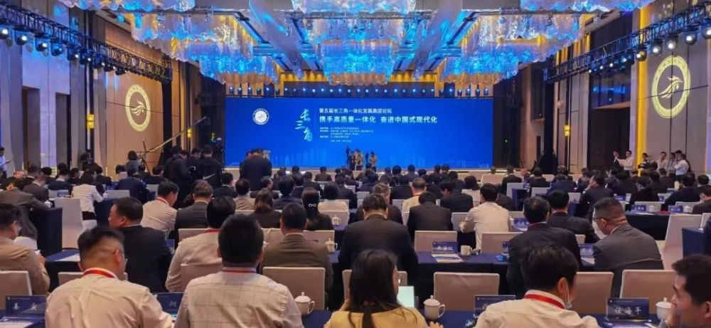
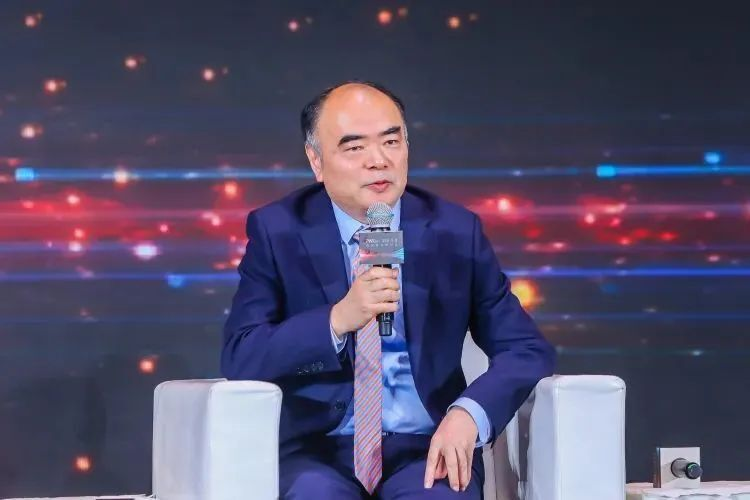
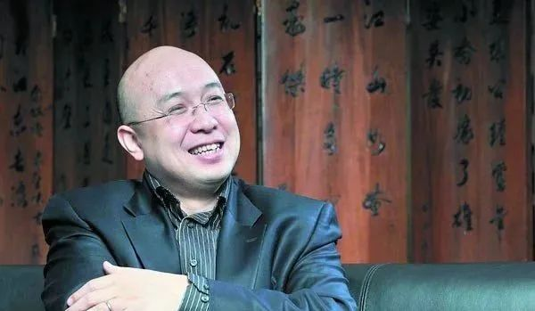

# 浙江媒体盘点：上海首富、安徽首富、江苏第二富，都是浙江人

地瓜经济在长三角各处迸发着旺盛的生命力，藤蔓越织越密，芽叶也在长回浙江。

南京总被调侃为安徽的省会，苏通杭嘉甬都抢着做上海的后花园……地缘相近、人缘相亲的长三角三省一市间，总流传着无数轶闻趣事。
**6月6日上午，在安徽合肥召开的第五届长三角一体化高层发展论坛备受瞩目，一年一度，沪苏浙皖主要领导轮流坐庄“走亲戚”又成了一段新佳话。**

在全国区域经济合作中，长三角地区是启动时间最早、合作体制最完善、运作机制最成熟的区域。今年，是长三角一体化发展上升为国家战略五周年，诸多盘点，硕果累累。早在2003年，长三角区域合作正式启动，这一年也被称为“长三角元年”，至今恰已20年。

然而，倘若要回顾长三角区域经济互动的故事，恐怕能追溯到更早年间。

**上海首富、安徽首富、江苏第二富，都是浙江人！**

改革开放以来，因为偶得一张火车票，因为一颗向往闯荡的心，800余万浙商纵横全国、遍及世界，比邻的沪苏皖两省一市，也是尤其多浙商的选择。

以江苏省浙江商会统计数据为例，
**截至2021年底，在江苏的浙江籍市场主体（包括企业、个体工商户）有146.38万户，其中，浙商在江苏省内兴办企业21.97万户；有着“省外最强浙江商会”之称的上海浙江商会更是凝聚了60万在沪浙商**
，相关数据显示，上海市百强民企中浙商企业占近4成；而在皖浙商同样是一个庞大的群体，涉及包括新能源、新材料、高端装备制造、生命健康、房地产、医疗、商贸等在内的各行各业。

这是一个太庞大的群体。

当我们将他们的数据归拢，在“2023浙商全国500强”——这张汇集了浙商优等生的名单上，
**上榜的在沪苏皖一市两省的浙商占上榜省外浙商比例也尤其高，达到36.48%，**
其中，上榜在沪浙商共有16家，在苏浙商3家，在皖浙商2家。21家企业中，共有3家去年营收超千亿，占全榜单千亿军团比例为11.5%，占省外浙商千亿军团比例则高达60%。

聚焦这些浙商，结合相关财富榜单，《浙商》记者意外发现——上海首富是拼多多创始人黄峥，他的总财富为2603.6亿元；安徽首富是阳光电源创始人曹仁贤，总财富为510.4亿元；江苏第二富是药明康德创始人李革，其总财富为583.6亿元……
**而他们共同的特点，都是浙江人。**

**横跨长三角，地瓜藤如何越织越密？**

黄峥是地地道道的杭州人，从杭州外国语学校毕业，在浙江大学竺可桢学院修学计算机专业，本科毕业后赴美留学，并在2006年回国参与谷歌中国办公室的创立。2007年，他辞去谷歌的工作，开始创业，期间也曾在电商网站、游戏等多个领域试水，最终集中精力投身拼多多。2013年，黄峥在上海成立了一家公司，起名“寻梦”，曾主营游戏业务，如今，这家上海寻梦信息技术有限公司也是拼多多的主体。

_拼多多创始人
黄峥_

与80后黄峥一路疾驰的巅峰之路不同，曹仁贤的故事更像是“十年磨一剑”。出生于杭州农村的曹仁贤，本科考上合肥工业大学的工业电气自动化专业，一直读到研究生，毕业后留校任教4年，主要研究方向是可再生能源发电。1997年，为了让自己的科研成果实现产业落地，29岁的他放弃了那个年代人人羡慕的“铁饭碗”，凭着自己多年攒下的8万元积蓄与从亲戚朋友借来的钱，在一间不足20平米的出租屋内创办了阳光电源。那时，新能源产业尚处于萌芽阶段，市场需求量很小，没有风险投资，曹仁贤也“不会说故事”，只能搁置下新能源梦想，先填饱肚子：“前面几年确实很困难，我也做了一些自己不愿意做的产品，把公司维持住。”

_阳光电源股份有限公司董事长兼总裁
曹仁贤_

2003年，阳光电源自主研发出首款国产光伏逆变器，力排众议砍掉周边业务，全力进军光伏发电与风力发电领域，并在日复一日间走向行业标杆。

李革祖籍温州平阳，他的创业故事，很像黄峥与曹仁贤的结合体。早年间，李革在赴美深造前，曾在一张照片背后写下豪言壮语——“我相信我一定能征服美国”。他有野心，也有实力，从留学、科研到商业，李革的美国之旅顺风顺水，28岁，他在美国参与创立的公司也成功登陆纳斯达克。

_药明康德创始人 李革_

机缘巧合，因发现国内原研药市场长年被外企占据，“为什么不自己做”的想法让他回到国内。2000年，李革横跨苏沪创立药明康德，在几番探索间走上本土CRO（即医药研发外包）之路。23年沉淀发展，时至今日，药明康德已经成为有着生物医药界的华为、阿里巴巴与富士康之称的巨型航母。

据《2023新财富500强富人榜》数据，今年江苏首富是天华新能董事长裴振华，64岁的他总财富达605.8亿元，紧随其后，第二名就是56岁的李革。

地瓜经济在长三角各处迸发着旺盛的生命力，藤蔓越织越密，芽叶也在长回浙江。

在2021年5月7日，药明康德子公司药明生物单日官宣完成三项收购，包括收购辉瑞中国位于杭州的原液和制剂生产基地，该生产基地面积达5万平方米，为药明生物新增了原液二十厂、制剂九厂和制剂十厂。

更早以前，阳光电源也曾在浙江龙游投资光伏小康55MW农光互补项目，并于2017年底成功并网发电，这一项目也是当时浙江省实现并网发电规模最大的光伏小康项目。2021年，阳光电源也助力浙江首例分布式光伏整县推进试点项目并网投运。

汲取阳光，让扎在浙江的根茎愈加壮硕，他们只是缩影。

江苏省浙江商会曾与《浙商》分享一个数据，据不完全统计，仅商会会员单位就已实现超2000亿元的返浙投资。

