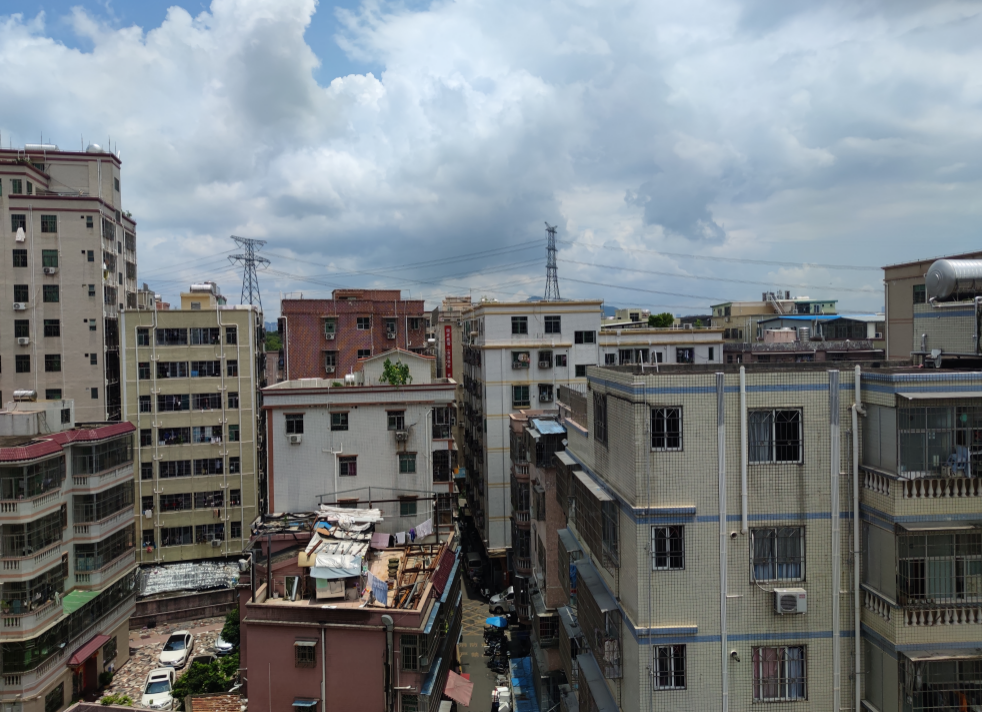
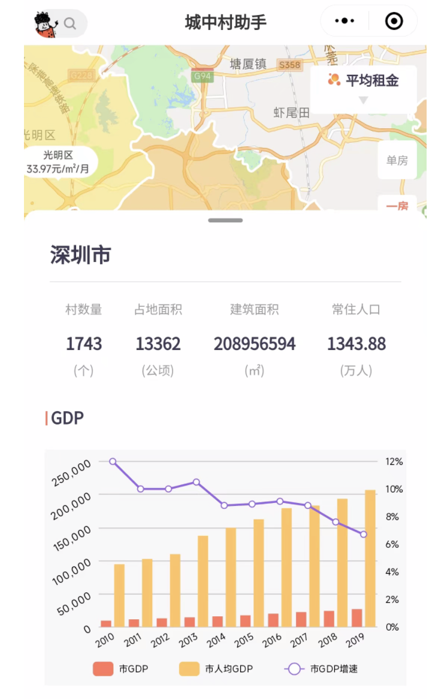
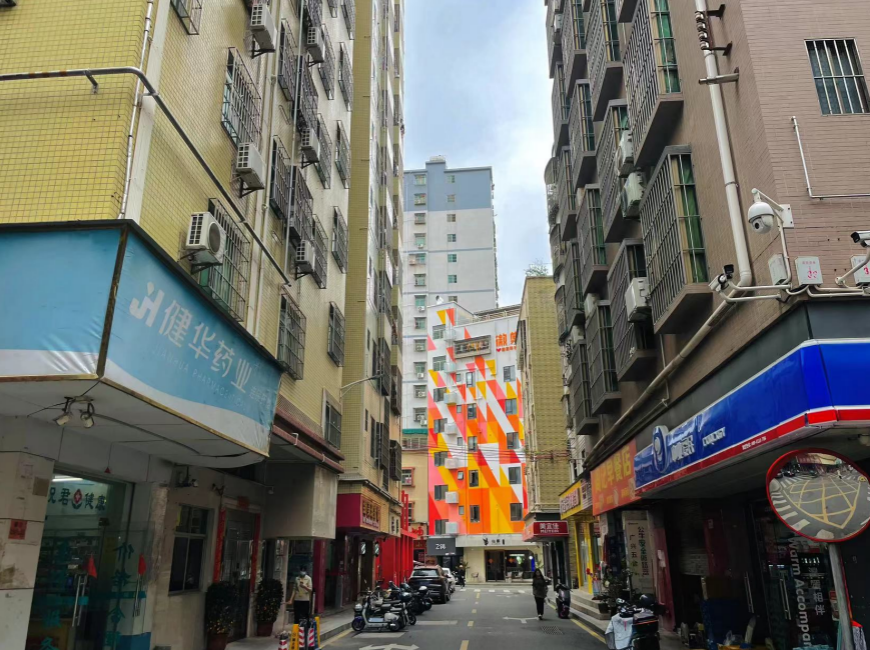
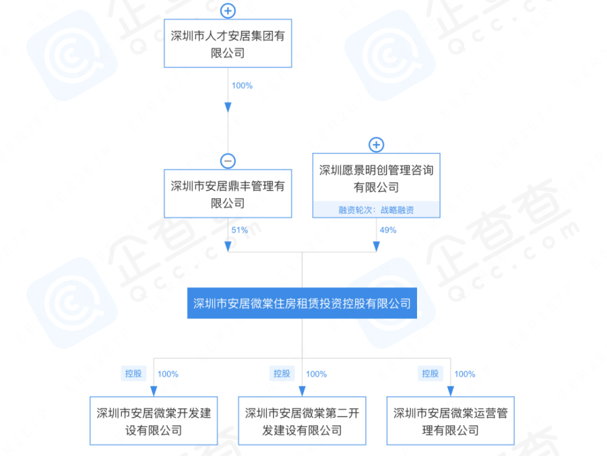

# 深圳城中村统租：有租客拿到补助火速搬离，有房东不愿给补贴

“我们是公司统一安排居住在城中村的，现在因为统租不得不搬离，跟房东协商后，退了押金并补偿了一个月房租，我们现在打算搬回公司宿舍住。”6月4日下午，正在搬家的租户谢萍向记者介绍道。

统租，顾名思义即由相关单位对城中村房源进行统一改造，然后对相关设施进行配套升级，再对外出租。

但是，计划的好事因为深圳城中村租客的种种疑虑引发了舆论关注。

在此之前，深圳已对多个城中村进行整治和改造，之所以此次引起广泛关注，主要有两点，一是统租范围偏大，二是引起了部分租户较大反弹。

6月5日，据深圳发布官微，深圳市住建局相关负责人公开回应称，全市城中村整治提升划分为综合提升类、产业配套类、特色发展类、控制引导类和基本保障类等5类。其中，仅部分综合提升类、产业配套类城中村涉及城中村保障性住房规模化品质化改造提升。其余类别均不涉及城中村保障性住房筹集。

“城中村保障性住房规模化品质化改造提升由政府主导筹集，改造后的租金以不涨为原则，单套租金原则上与改造前基本持平，即便个别房源因改造成本高、投入较大、建筑结构复杂，也必须严格控制成本、严格控制价格、严格加强价格监督。”

对于这一权威回复，城中村的租客是否知晓，是否理解，是否按有关部门的要求进行了落实，《每日经济新闻》记者实地探访了深圳的城中村进行调查。

并非全村统租、与第三方公司签约

6月4日下午，深圳南山区西丽街道城中村，顶着33摄氏度高温，不少租户选择了搬家离开。

今年5月底，这里不少租客收到来自房东的通知，称因村内进行统租，要求6月30日前搬离。

该则通知引发村内不少租户担忧，他们的担心主要集中在孩子上学、短期难以找到合适房源、租金上涨等问题。

6月3日，村街道办发布《致居民朋友的一封信》，其中提到，“不限期搬离；能给予拆迁补助；能保障学位。”

_街道办在村里各楼宇张贴的回复_

6月4日下午，记者来到这一城中村时，各种红底白字的标语映入眼帘，“统租改造，受惠于民，造福于民”“政企携手，业主共建”等等。

_随处可见的统租标语_

不过，这次并非全村统租。在村里拥有两栋大楼的房东李华向记者介绍道，“这次统租采取自愿模式，房东与第三方公司沟通，自愿签订合同，不过我这两栋楼都没有签。”

对于为何没参与统租，李华也向记者说出了自己的顾虑。

“第三方公司给到的租金比现在稍微高一点，但并不是政府出面跟我们签合同，而是与第三方公司签，如果中间我们突然收不到房租又该去找谁？此外，我们把楼授权给第三方公司后，第三方公司是否会拿我们的资料和房子去贷款，这又是一个风险。另一个就是基础配套，马上要通地铁了，周边配套也在逐渐完善，未来只会越来越好租。”

而李华口中的第三方公司，非网传的深圳安居微棠住房租赁投资控股有限公司（市属国企人才安居集团旗下的城中村租赁公司，下称微棠），而是“深圳市深汇通投资控股有限公司”。据企查查，该公司为南山区国资局所属全资国有企业。

_正在搬家的人_

记者在调查过程中还了解到，并非所有统租楼栋的租客都如愿拿到了补偿金，能否如愿拿到这笔钱，很大程度上取决于房东意愿。

在村里从事个体生意多年的一位租客向记者表示，“要是碰到比较抠的房东，他就不愿意补贴。我们那边几栋楼有3个房东，另外两个房东都给搬迁的租户补贴了，但我们房东就是不愿意补，我们也没办法。”

从房租情况来看，虽说已经有不少房源被统租，但仍有不少房东在招租。目前单间的价格普遍在800-1000元不等，一房一厅价格在1000-1300元不等，两房一厅的价格在2400-2600元不等，在南山区价格偏低。不过，该城中村附近暂无地铁，距离较近的茶光地铁站，还得坐7站公交。

统租背后的大生意

6月5日，深圳市住建局相关负责人回复媒体称，“城中村是很多来深建设者包括低收入群体的落脚点，城中村保障性住房规模化品质化改造提升是我市保障性住房建设筹集渠道之一。实施城中村保障性住房规模化品质化改造提升的目的，就是要更好解决来深建设者住房问题，让他们住上更高品质、更加安全的房子。”

2021-2027年，全市将累计新增建设筹集保障性住房100万套（间），覆盖约350万-400万人。预计到2035年，全市保障性住房覆盖人群将达到约500万人，约占全市常住人口的26%。

_俯视城中村_

在深圳的房地产市场，城中村一直都是“浓墨重彩的一笔”。

综合珊瑚数据“城中村助手”以及公开资料，深圳拥有约360平方公里城中村建筑，约占20%土地⾯积，居住着超过1000万人口。也正因此，城中村是统租的重要对象。

在广东省城规院住房政策研究中心首席研究员李宇嘉看来，统租城中村是深圳多渠道公共住房供应的重大创新，贯彻了国家提出的超大特大城市稳步推进城中村改造，也是存量盘活的重要渠道，而且也符合高质量发展，供给侧改革和积极探索新模式。

但在推进该项工作时，也容易碰到各种“疾风暴雨”。

“太快了，就会导致工作方式上存在瑕疵，比如对现有租户的大规模清退，必须以更高的租金统租，导致房源供应短期内急剧减少，而搬离的租客需要寻找新居所，需求短期内释放，不利于稳定租金。”李宇嘉说。

李宇嘉建议，通过统租这种模式，要合理评估其综合影响，然后合理确定规模。即便还要统租，也要控制节奏、控制规模，特别要做好相关配套保障政策的安排，杜绝对租金的拉动。此外，与其大规模补贴，不如把钱用在城中村所需的短板上，即少统租改室内和楼栋，多改造周边公共设施。

_龙华区元芬村改造项目_

目前深圳已推出了不少通过改租城中村楼宇方式的“保租房”。微棠小程序显示，目前微棠已在龙华、宝安等多个区域推出了微棠社区，其中龙华是推进速度较快的区域，在南源新城、横岭村、元芬村等多个城中村均有部署。

据企查查，微棠背后股东有两家，一家是深圳市安居鼎丰管理有限公司，占比51%，其股东是深圳市人才安居集团；另一家是深圳愿景明创管理咨询有限公司，持股49%，2021年贝壳曾对该公司投资7亿元。

据《每日经济新闻》记者此前探访微棠社区了解到，将城中村的房子改造成“保租房”，一般对安全、功能、性能等维度都有一定要求，通常都是安排好水电、空调等设施，基本属于拎包入住，从外观上看，也会与其他楼宇有显著区别。

而从改造后的租金水平来看，基本与同片区同类型精装房源相当，价差约10%。以元芬村微棠公寓为例，该楼栋20-25平方米租金为1299元/月，25-35平方米一室一厅为1869元/月，40-60平方米两室一厅为2799元/月。

对于翻新后是否会造成成本大幅提升，若以后不靠财政补贴，该模式是否能够持续等问题，6月5日下午，一位房地产业内人士向记者介绍，“套间的租金确实可以做到不涨，但是房子面积会相应变小，比如25平方米的房子变成20平方米，通过室内设计提高空间使用率，这样房源数变多了，承载租客变多了，总体上还能保持财务平衡，是可以让租户做到同等体验的。”

记者注意到，去年1月时，深圳市住建局曾联合多单位举办保障性租赁住房小户型设计大赛，设计理念就是在“方寸之间”发挥创造力。

（应受访者要求，文中谢萍、李华为化名）

**记者|** 陈荣浩

**编辑|** 段炼 陈梦妤 盖源源

**校对|** 程鹏

文内图片：每经记者 陈荣浩 摄

每日经济新闻 未经许可禁止转载、摘编、复制及镜像等使用

