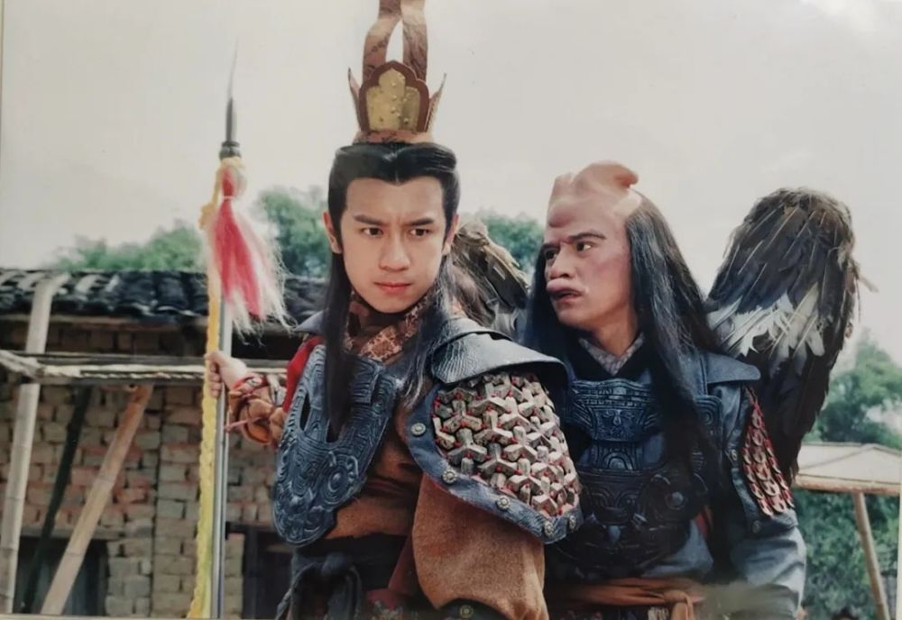
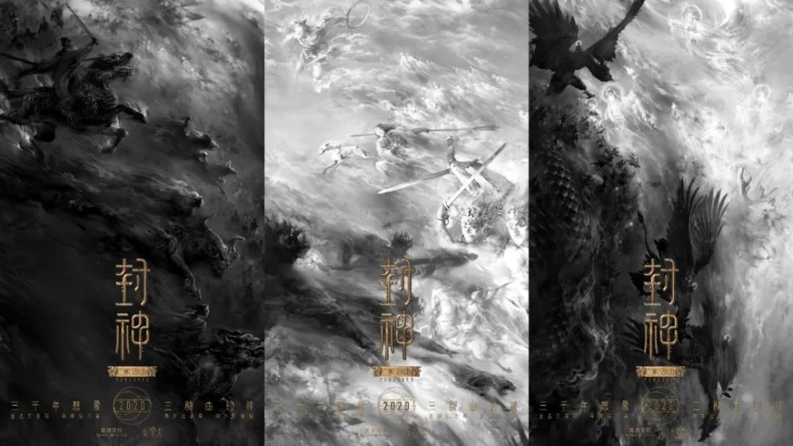
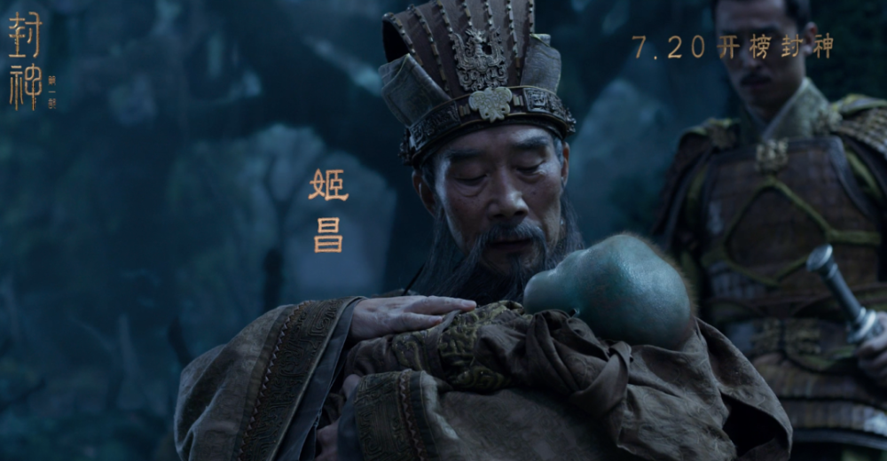
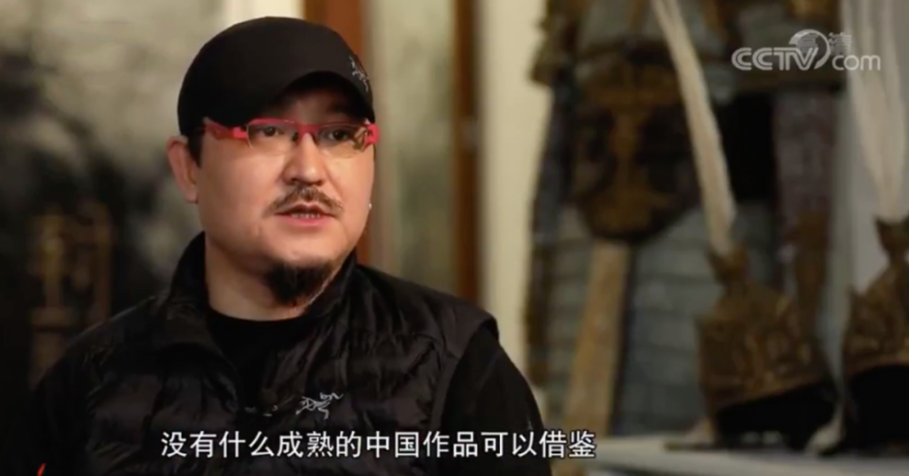
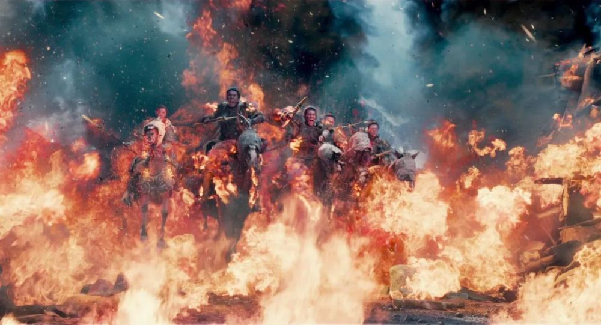
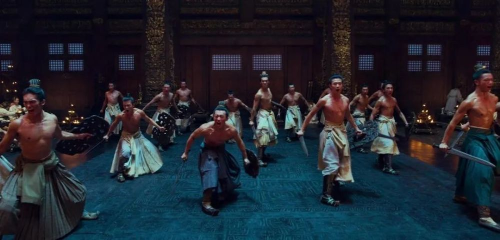
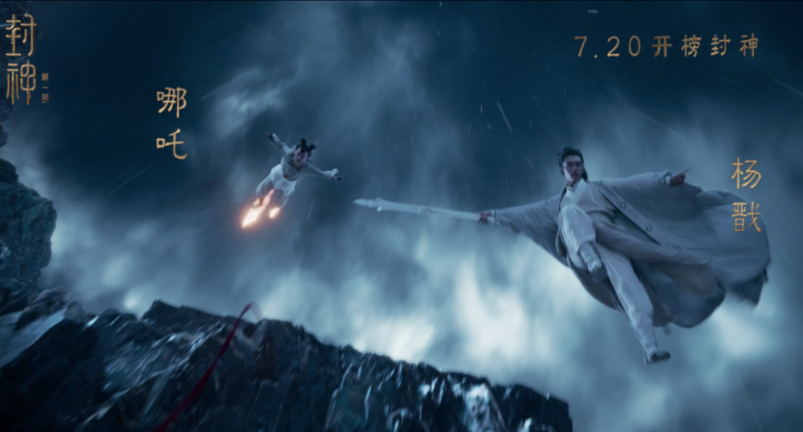

# 等待6年、投资巨大，《封神第一部》终于定档

**本文作者是小万家族的@诺斯**

**在电影里寻找每个人的精神角落**

昨天，电影《封神第一部》的官微发出一条让人兴奋的预告消息——“寒耕暑耘，明日相见”。‍‍

随后，导演乌尔善转发并附文“麦已熟，明天见！”，这意味着等待三年之久的《封神三部曲》的第一部即将定档。‍‍‍‍‍

今天上午，消息如期而至，《封神第一部》发布定档预告和海报，正式官宣7月20日上映。

新预告中，姜子牙、殷寿（纣王）、姬发、姬昌、申公豹、姜王后、比干、雷震子、苏妲己、哪吒、杨戬等人物纷纷登场，更多大战场面也首次曝光。‍‍‍‍‍

这个国产魔幻史诗系列的首部曲正式登陆暑期档，着实给业界和影迷一剂强心剂。‍‍‍‍‍‍‍‍‍‍

作为中国目前成本最高的电影项目之一（投资约30亿人民币），《封神三部曲》从2019年末释放首支先导预告起就引起无数影迷期待。

影片改编自中国古典小说名著《封神演义》，以历史上暴君纣王和周武王姬发之间的战争为基础，融入神话、鬼怪等奇幻元素，谱写出了一部波澜壮阔又怪力乱神的史诗巨制。

封神演义的故事在民间广为流传，相关的电视剧也屡次翻拍，比如内地的1990年版、2001年TVB版《封神榜》。

_陈浩民主演的TVB版《封神榜》_

电影版的《封神三部曲》自启动之初即备受瞩目，除了小说和其衍生作品在国内拥有极高的群众基础之外，另一大原因则是它的庞大野心和高规格的制作团队。

影片由曾执导过《画皮2》《寻龙诀》两部卖座魔幻大片的乌尔善导演掌舵，黄渤、费翔、李雪健、夏雨、陈坤、袁泉等一众明星加盟出演。

_《封神》此前发布的海报_

只可惜从起初公布2020年档期后，《封神三部曲》经历了多次的改档、延期，官方微博更一度被调侃为“节气博主”，漫长等待6年后才终于迎来今天的正式定档。

《封神》系列第一部走过的曲折路和它的幕后故事，也值得来复盘和梳理一下。

2008年，导演陈嘉上用一部《画皮》拉开了中国魔幻大片的序幕。

在之后的几年时间里，《画皮2》、《捉妖记》等国产魔幻大片层出不穷，在创造票房纪录的同时，也让我们看到了魔幻题材的市场潜力。

_2015年的《捉妖记》创下24亿票房纪录_

然而在票房热潮背后，却是每况愈下的口碑危机。豆瓣评分在6分以下的国产魔幻电影比比皆是，观众们的耐心也很快就被消磨殆尽。

比如郑保瑞导演的《西游记》系列原本计划投资35亿人民币，在15年内拍摄8部西游题材大片。

可是拍到第三集《西游记之女儿国》时，观众已不再买账，不仅票房大幅下滑，豆瓣评分更是来到了4.4分，创系列最差。

魔幻大片之所以受到观众的追捧，主要原因就在于它构建了一个真实又与众不同的异世界，让观众体会在现实生活中无法触及的新奇与震撼。

然而不少的低劣魔幻大片只注重特效与打斗，反而忽视了对于底层世界观的构建，结果导致所呈现出的世界完全不可信，故事也乱七八糟无法共情。

再次进行大手笔投资的《封神三部曲》，显然不想重蹈覆辙。

为了打造这个拥有庞大世界观的中国“英雄神话史诗”，《封神三部曲》汇聚了当下华语电影的顶级主创团队。

除了乌尔善担任导演，影片监制请到了曾打造出《捉妖记》的安乐影业老板江志强先生，编剧顾问中有写出《卧虎藏龙》的詹姆士·沙姆斯，制作顾问中则请到了影史魔幻经典《指环王》三部曲的制片人巴里·M·奥斯本。

_乌尔善有意打造中国版《指环王》三部曲_

对于一部魔幻大片而言，除了导演编剧和制片人，美术指导同样十分重要。

为了给《封神三部曲》的美术奠定基调，影片请到了凭借《卧虎藏龙》拿下奥斯卡最佳艺术指导的叶锦添，他也设计出了“黑白”、“阴阳”为主的风格。

比如之前发布的“阴阳大战”海报中，用黑白两色构建出一个立体的、充满流动与变化的“封神宇宙”，为影片营造出了深沉恢宏的史诗感。

此外，叶锦添还和导演乌尔善还共同走访了河南、陕西、山西等地的众多博物馆和遗址古迹，搜集到众多有关殷商时期的资料做参考。

再以水墨画为基础，融合青铜器、阴阳五行、古典神话等元素，创作出了《封神三部曲》独有的美学体系，更加厚重、真实。

可以说《封神三部曲》既要拍出商周变革时期历史的真实感，又要呈现出小说《封神演义》中瑰丽的国风魔幻，其难度可想而知。

因此电影从立项以来，就面临了一波三折的难题。

首先是特效上的难题。

《封神三部曲》的美术团队将中国古代幻想中的饕餮，墨麒麟、雷震子等神话生物都进行了细致的数字化设计。

不过想要把这些天马行空的设计真正落地，则需要漫长的CG制作周期和超大的运算量，难度超乎想象。

_雷震子、苏妲己部分特效_

其次，是表演和拍摄的难题。

《封神三部曲》启用了一大批新人来饰演重要角色。比如哪吒、姬发等角色都是通过全国海选选出。

在被剧组选中之后，年轻的男孩子们要进行长达数月的体能与武术训练后才能进入拍摄环节，以求呈现原始野性的阳刚之美。

作为中国首个三部曲背靠背方式拍摄的系列大片，《封神三部曲》于2012年公布计划、2014年筹备，2018年正式开机，最初定档2020年暑期档。

但由于特效制作、疫情问题等种种原因，这个庞大的系列在进度上一直被耽搁。

2023年开年来，关于《封神第一部》定档今年暑期的消息便传出，如今终于实锤定音，只等7月20日，暑期相见。

至此，影迷们在官微下的“花式催更”终告一段落，一个历时十年的野心大作即将显露真容。‍

希望接下来，“封神三部曲”的后续两部续集也能尽快完成制作和定档，给中国观众一个完整的、恢弘的国产魔幻史诗三部曲。

